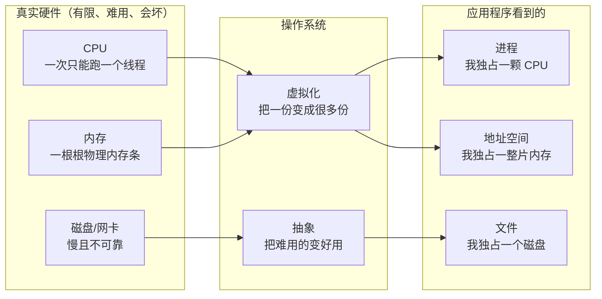
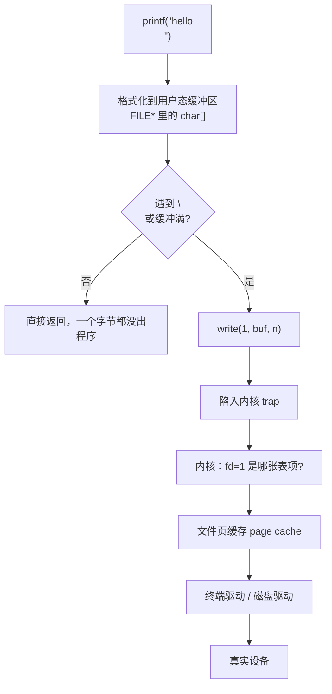

上一篇把 CSAPP 收在了一个自己写的 shell 上，那东西能跑，但它跑在什么东西上面？

跑在一个从没停过的、你从来没见过的东西上面。你现在这台机器上，同时开着浏览器、编辑器、音乐播放器、几十个后台进程，它们抢同一块 CPU、同一片内存、同一个磁盘，谁都没死，谁都没把别人写坏。**没有人在旁边喊口号，也没人排队举手**——秩序是自己长出来的。

这一篇开 CS162，就从「这个秩序是怎么立起来的」讲起。核心是两个词：**抽象**和**机制/策略分离**。全文的实验在 WSL（Ubuntu 22.04，gcc 11.4，24 核）上真编译真运行，数据原样贴。

## 一、钩子：一个程序凭什么觉得自己独占整台机器

写个最简单的 C 程序，让它报一下自己的地址：

```c
/* self.c —— 每个进程看到的「我的地盘」 */
#include <stdio.h>
#include <stdlib.h>

int g_var = 42;                       /* 全局区 */

int main(void) {
    int stack_var = 7;                /* 栈 */
    int *heap = malloc(sizeof(int));  /* 堆 */
    *heap = 99;

    printf("全局变量  &g_var    = %p\n", (void *)&g_var);
    printf("栈上变量  &stack_var= %p\n", (void *)&stack_var);
    printf("堆上变量   heap     = %p\n", (void *)heap);
    printf("main 函数 &main     = %p\n", (void *)&main);
    return 0;
}
```

跑出来是这样：

```text
全局变量  &g_var    = 0x64c3ed9f9010
栈上变量  &stack_var= 0x7fff5cacbe0c
堆上变量   heap     = 0x64c3f37532a0
main 函数 &main     = 0x64c3ed9f6189
```

有意思的地方在这：**你连着跑两次，栈的地址会变，堆的地址也会变，但每一次，程序都拿到一个从 0 开始的、干干净净的地址空间**。更妙的是，隔壁那个进程也在同一批地址上放东西——它也可能有个变量在 `0x55f4...` 附近。

两个进程以为自己独占的内存，其实是同一块物理内存的不同切片。**谁在骗它们？** 这是操作系统的第一个大谎言，也是它的第一个大抽象。

## 二、操作系统到底在管什么

剥掉所有名词，操作系统干的事只有一件：**管好三类硬件资源，然后把它们包装成好用得多的假象。**



这张图就是整门课的地图。三个抽象：

| 抽象 | 虚拟化了什么 | 藏掉了什么麻烦 |
| --- | --- | --- |
| **进程** | CPU | 中断、上下文切换、寄存器保存 |
| **地址空间** | 内存 | 物理碎片、重定位、越界保护 |
| **文件** | 磁盘 / 设备 | 扇区、块号、缓存、设备差异 |

三个抽象各配一套机制：进程配**上下文切换 + 调度**，地址空间配**页表 + TLB**，文件配**inode + 页缓存**。这三套东西后面会各占好几篇。

## 三、抽象：不是「简化」，是「撒谎撒得一致」

很多人把抽象理解成「把复杂的东西简化」。这个理解不到位。**抽象真正干的事，是提供一个始终成立的假象。**

「进程独占 CPU」这个假象，怎么才算成立？不是说你真的独占——你只占了几毫秒——而是说：**不管系统里有多少个进程、不管它们怎么抢，你自己永远观察不到那个「被抢走」的瞬间**。你的程序从第一条指令走到最后一条，中间被切走几百次，但你的寄存器、栈指针、PC，每次回来都分毫不差。假象的一致性是靠一堆机制撑起来的，不是靠它「差不多」。

所以抽象和机制是一对：**抽象是对外承诺的接口，机制是内部兑现承诺的手段。** 接口可以很简单（进程就 `fork`/`exec`/`wait` 那么几个调用），内部可以极其复杂（三级页表、多级反馈队列、写时复制、页缓存）。

有意思的是，同一套机制可以支撑完全不同的抽象。比如 Linux 里「一切皆文件」，键盘、屏幕、socket、管道全用 `read`/`write` 这套接口——**机制是「字节流 + 文件描述符」，抽象被拉到了极限的统一。**

## 四、机制与策略分离：OS 设计的中心思想

这是 CS162 从头讲到尾的一条线，也是这一篇真正想讲清楚的东西。

**机制**回答「能做什么」，**策略**回答「该做哪个」。

举个最直白的例子：`fork` 是机制——它给了你「能创建一个新进程」的能力。但**新进程和父进程谁先跑**，这不是 `fork` 决定的，是**调度器**决定的。换成「先做长的」「先做短的」「轮着来」，`fork` 一行代码都不用改。

这个分离不是洁癖，有实打实的好处：

1. **可以独立演进。** 从单核到 24 核，调度策略改了无数版，`fork` 接口二十年没动过。
2. **可以按场景换。** 服务器要吞吐、桌面要响应、手机要省电——机制一样，策略换掉就行。
3. **可以分别做对。** 机制只要保证正确性，策略只要保证效果。两件事的测试方法、出错代价完全不同。

下面这个实验把这条线做成可观测的。

## 五、实验：同一套机制，只拧一个策略旋钮

我写了个极小的任务：

```c
/* payload.c —— 出生时就往日志里记一笔 */
#include <stdio.h>
#include <sys/time.h>

int main(void) {
    struct timeval tv;
    gettimeofday(&tv, NULL);
    FILE *f = fopen("/tmp/_c162_log.txt", "a");
    if (f) {
        fprintf(f, "payload %ld.%06ld\n", (long)tv.tv_sec, (long)tv.tv_usec);
        fclose(f);
    }
    return 0;
}
```

现在**机制完全不变**（shell 的 `&` + `wait`，还是 fork 出 8 个进程），只拧「给多少 CPU」这一个策略旋钮——用 `taskset` 限定可用核心数：

```bash
for allow in 1 3 8; do          # 策略旋钮：可用 CPU 数
  best=999
  for round in 1 2 3 4 5; do
    start=$(date +%s.%N)
    for i in $(seq 1 8); do
      if   [ "$allow" = "8" ]; then "$D/payload" &
      elif [ "$allow" = "1" ]; then taskset -c 0 "$D/payload" &
      else                          taskset -c 0,1,2 "$D/payload" &
      fi
    done
    wait
    end=$(date +%s.%N)
    t=$(echo "$end - $start" | bc)
    [ "$(echo "$t < $best" | bc)" = "1" ] && best=$t
  done
  printf "  CPU 配额 = %-2s 核  ->  墙钟最快 %.4f s\n" "$allow" "$best"
done
```

实测（5 轮取最快，避免被系统噪声干扰）：

```text
  CPU 配额 = 1  核  ->  墙钟最快 0.0052 s
  CPU 配额 = 3  核  ->  墙钟最快 0.0043 s
  CPU 配额 = 8  核  ->  墙钟最快 0.0032 s
```

**8 个任务、同一份代码、同一个 fork 机制，仅仅因为可用 CPU 从 1 变到 8，墙钟快了约 1.6 倍。** 那 8 个进程本身的代码一个字节没改。这就是机制/策略分离的样子——它不在教科书里，它在 `taskset` 这个命令和调度器之间那条线上。

顺带说一句，为什么不是 8 倍？因为任务太短了（跑一次几毫秒），**进程创建和调度的开销占比压不下去**。任务越长、越吃 CPU，这个比例的涨幅才越接近线性。这条「开销占比」的账，后面讲调度算法时还要算。

## 六、系统调用：从用户态到内核态那道门

上面所有抽象，最后都要靠一个动作落到硬件上：**陷入内核（trap）**。

用户程序不能直接碰硬件——碰了就没有隔离可言了。想读写磁盘、想开进程、想申请内存，都必须走系统调用：**程序主动触发一个特殊指令，CPU 切到内核态，跳进内核的处理函数，干完再切回来。**

「切到内核态」不是切换进程，是切换 **特权级**。CPU 有个特权位，用户态下访问特权寄存器、执行特权指令会直接触发异常。系统调用是一条被允许的、唯一的、受控的门。

这道门有多贵？我量了一下——同一个循环体，一个纯用户态累加，一个每次迭代都调 `getpid()`（纯内核往返，不做别的活）：

```c
/* cost.c —— 用户态 vs 跨特权级 */
#include <stdio.h>
#include <unistd.h>
#include <sys/time.h>
#include <sys/syscall.h>

static double sec_now(void) {
    struct timeval tv;
    gettimeofday(&tv, NULL);
    return tv.tv_sec + tv.tv_usec / 1000000.0;
}

int main(void) {
    const long N = 2000000;
    double t0, t1;

    volatile long s = 0;
    t0 = sec_now();
    for (long i = 0; i < N; i++) s += i;      /* 纯用户态 */
    t1 = sec_now();
    printf("纯用户态  %ld 次累加 : %.4f s  (每次 %.1f ns)\n",
           N, t1 - t0, (t1 - t0) / N * 1e9);

    t0 = sec_now();
    for (long i = 0; i < N; i++) syscall(SYS_getpid);   /* 每次都进内核 */
    t1 = sec_now();
    printf("每次 getpid 系统调用 : %.4f s  (每次 %.1f ns)\n",
           t1 - t0, (t1 - t0) / N * 1e9);
    return 0;
}
```

三轮实测：

```text
纯用户态  2000000 次累加 : 0.0004 s  (每次 0.2 ns)
每次 getpid 系统调用 : 0.1193 s  (每次 59.7 ns)
  ...
纯用户态  2000000 次累加 : 0.0004 s  (每次 0.2 ns)
每次 getpid 系统调用 : 0.1234 s  (每次 61.7 ns)
  ...
纯用户态  2000000 次累加 : 0.0004 s  (每次 0.2 ns)
每次 getpid 系统调用 : 0.1228 s  (每次 61.4 ns)
  ...
```

**一次系统调用大约 59~62 纳秒，是用户态一次累加的 300 倍量级。** 注意这里是 `getpid`，最便宜的系统调用之一——真去读个磁盘，是微秒到几十微秒的量级。

这个数字解释了一大批工程实践：为什么 `stdio` 要搞用户态缓冲（把一千次 `printf` 攒成一次 `write`）、为什么 `epoll` 要一次问一批 fd、为什么零拷贝技术值得那么复杂的实现。**系统调用是 OS 世界里最贵的一步，所有性能优化都在想办法少跨这道门。**

## 七、抽象不是免费午餐：它藏了多少事

拿 `printf("hello\n")` 说事。一行代码，往下挖是这样：



`printf` 是抽象，`write` 是机制的一部分，页缓存是另一层。而 `printf` 那层缓冲还埋着一个经典坑：**它在用户态，不在内核里，所以它会被 `fork` 复制。** 这个坑在上一篇的 shell 里出现过，这里再点一次——抽象的每一层都有自己的状态，忘掉任何一层的状态都会咬人。

用 `strace` 看一眼就明白了。写个只调用 `printf` 的程序：

```c
#include <stdio.h>
int main(void) { printf("[printf  ] 分层\n"); return 0; }
```

追踪它所有的 `write` 系统调用：

```bash
strace -e trace=write /tmp/_c162/pf_only
```

```text
write(1, "[printf  ] \345\210\206\345\261\202\n", 18) = 18
```

（`\345\210\206\345\261\202` 是「分层」两个字的 UTF-8 字节，`strace` 图省事没解码。）

有意思的在这：**这个程序只调了一次 `printf`，`strace` 也只看到一次 `write`。** 看起来「一次调用一次系统调用」，很合理？其实不然——是 `printf` 内部的缓冲区**恰好遇到换行就被冲刷**了。把 `\n` 拿掉，或者往缓冲里多塞几百字节，`write` 的次数就会变。**你在 C 里写的 `printf` 行数，和真正进内核的次数，根本不是一个对应关系。**

而如果把整个程序（包括启动、动态链接）的账全算上，一个「hello world」级别的程序，从 `execve` 到退出要进内核 **41 次**（strace `-c` 的 total 那一列），真正的 `write` 只占其中 2 次。剩下的全是动态链接器在读 `.so`、`mmap` 内存、设置线程本地存储。**程序还没开始干正事，已经跨了四十道门。**

## 八、返回值与 errno：系统调用的两个出口

系统调用设计上有个细节容易被忽略：**错误不是通过返回值传的。**

```c
/* syscall.c —— 成功看返回值，失败看 errno */
#include <stdio.h>
#include <unistd.h>
#include <fcntl.h>
#include <string.h>
#include <errno.h>

int main(void) {
    const char *msg = "hello\n";
    errno = 0;
    ssize_t n = write(1, msg, strlen(msg));
    printf("[write] 返回值 = %ld, errno = %d\n", (long)n, errno);

    errno = 0;
    pid_t p = getpid();
    printf("[getpid] 返回值 = %d, errno = %d\n", (int)p, errno);

    errno = 0;
    int fd = open("/definitely/not/here", O_RDONLY);
    printf("[open 失败]返回 = %d, errno = %d (%s)\n", fd, errno, strerror(errno));
    return 0;
}
```

实测：

```text
hello
[write] 返回值 = 6, errno = 0
[getpid] 返回值 = 565, errno = 0
[open 失败]返回 = -1, errno = 2 (No such file or directory)
```

规矩是：**成功时返回值是非负的字节数/PID/fd，失败时返回 -1，具体原因塞在 `errno` 这个全局变量里。** 为什么这么设计？因为返回值只有一个整数，而错误原因有几百种，塞不下。`errno` 本质上是个「出参」——**你不检查它，它就一直残留着上一次的旧值**，所以代码里才要写 `errno = 0` 再调用。

这也是为什么 `open` 失败时返回 -1 而不是 0：**0 是个合法 fd**（stdin），不能拿来当错误标志。同理 `read` 返回 0 表示 EOF，是真的读完了，不是出错。

记住这套约定的实际意义：**任何系统调用的返回值都必须检查。** 不检查 `write` 的返回值，硬盘写满时你的程序会一脸平静地丢数据；不检查 `open`，后面那串操作全在操作一个 -1。

## 九、机制与策略，第二次实证：`fork` 到底给了什么

再回到 `fork`。它给的是机制——**造出一个和你几乎一样的新进程**。它没告诉你：

- 新进程什么时候被调度（策略：调度器）
- 新进程的地址空间怎么分配（策略：内存分配器 + 页表）
- 新进程和父进程的 fd 怎么共享（策略：打开文件表设计）

写个程序确认一下 `fork` 之后到底「谁先跑」：

```c
/* policy.c —— fork 之后谁先跑？ */
#include <stdio.h>
#include <unistd.h>
#include <sys/wait.h>
#include <sys/time.h>

static double sec_now(void) {
    struct timeval tv; gettimeofday(&tv, NULL);
    return tv.tv_sec + tv.tv_usec / 1000000.0;
}

int main(void) {
    double t0 = sec_now();
    pid_t pid = fork();
    if (pid == 0) {
        printf("[子 %d] 出生在 +%.4f s\n", (int)getpid(), sec_now() - t0);
        fflush(stdout);
        _exit(0);
    }
    int status = 0;
    pid_t done = waitpid(pid, &status, 0);
    printf("[父 %d] 回收子进程 %d 于 +%.4f s\n",
           (int)getpid(), (int)done, sec_now() - t0);
    return 0;
}
```

三轮实测：

```text
[子 568] 出生在 +0.0001 s
[父 567] 回收子进程 568 于 +0.0002 s
[子 570] 出生在 +0.0001 s
[父 569] 回收子进程 570 于 +0.0002 s
[子 572] 出生在 +0.0001 s
[父 571] 回收子进程 572 于 +0.0002 s
```

（PID 每次不同。）

两个观察：

1. **`fork` 返回后，子进程先跑。** 这不是 `fork` 保证的，是 Linux 调度器当前的策略（让子进程先跑，可以提升 cache 局部性、也顺应绝大多数「fork 完立刻 exec」的模式）。换个 OS、换个调度器，顺序可能反过来。**依赖这个顺序的代码，是错的代码。**
2. **整个来回 0.1 毫秒。** 这里没验证「fork 有多贵」——上一篇已经量过（建进程 ~100 微秒，exec 再加 ~250 微秒）。这里要看的是那个时间戳本身：**子进程「出生」的时刻，是它第一次拿到 CPU 开始执行 `printf` 的时刻，不是 `fork` 返回的时刻。** 中间隔着调度器的决策。机制和策略的分界线，就在这个时间差里。

## 十、对照：C++ 里能不能绕开这道门

C++ 程序员常有个错觉，觉得「C++ 更底层、更没有开销」。在系统调用这件事上，**一点关系都没有**。

```cpp
// layers.cpp —— 抽象层级对比
#include <cstdio>
#include <cstring>
#include <unistd.h>
#include <sys/syscall.h>

int main() {
    const char *a = "[printf  ] 分层\n";
    const char *b = "[write   ] 分层\n";
    const char *c = "[syscall ] 分层\n";

    std::printf("%s", a);                       // ① C++ 标准库（有缓冲）
    ::write(1, b, std::strlen(b));              // ② POSIX 包装
    ::syscall(SYS_write, 1, c, std::strlen(c)); // ③ 裸 syscall

    return 0;
}
```

C 版本跑出来是这样（三轮稳定同序）：

```text
[write   ] 分层
[syscall ] 分层
[printf  ] 分层
```

注意 `printf` 最后才出现——**因为它走了用户态缓冲，前两个直接进内核**。同样三行「打印」，`printf` 和 `syscall` 之间隔着一层缓冲区、一层 libc 包装、一次特权级切换。`std::cout` 在这个维度上跟 `printf` 是一伙的，它也是用户态缓冲。

这个「最后才出现」不是巧合，加一行 `fflush(stdout)` 就能把顺序掰回来：

```cpp
std::printf("[printf  ] 分层\n");
std::fflush(stdout);                              // 手动冲刷用户态缓冲
::write(1, "[write   ] 分层\n", 18);
::syscall(SYS_write, 1, "[syscall ] 分层\n", 18);
```

```text
[printf  ] 分层
[write   ] 分层
[syscall ] 分层
```

**顺序变了，代码的执行顺序一个字没改。** 变的只是那串字节什么时候离开用户态缓冲。这就是「抽象层有自己的状态」最直接的证据——你以为你在按顺序说话，其实有两套缓冲各自排队。

C++ 真正能帮上忙的地方不在这——是它的**编译期能力**（`constexpr`、模板、内联）能帮你少写运行时代码，是它的**RAII** 能帮你自动关 fd、不出错。但**只要你想跟硬件说句话，就必须跨那道 60 纳秒的门，谁都一样。**

## 十一、这一门课往后会讲什么

把地图铺开，CS162 十三条线：

| 主题 | 核心问题 | 属于 |
| --- | --- | --- |
| 进程与线程 | 状态存在哪、切换切什么 | 机制 |
| 调度算法 | 谁先跑、跑多久 | 策略 |
| 地址空间 / 虚拟内存 | 每个进程如何看到独立内存 | 机制 |
| 分页与 TLB | 地址翻译怎么不拖垮性能 | 机制 |
| 文件系统接口与实现 | 「文件」这个抽象怎么落地 | 抽象 + 机制 |
| I/O 与设备 | 怎么和慢速设备打交道不卡住 | 机制 |
| 并发与锁 | 多个执行流怎么安全共享 | 机制 |
| 条件变量与生产者-消费者 | 怎么等一个条件而不空转 | 机制 + 策略 |
| 死锁 | 等成环了怎么办 | 故障 |
| 分布式与 RPC | 一台机器不够了怎么扩 | 抽象升级 |
| 容错与日志 | 东西坏了怎么不倒 | 机制 |

一条主线穿到底：**先立抽象，再给机制，最后调策略。** 每一篇你都可以拿这个框架去套。

## 🐾 小结

| 概念 | 一句话 | 实测证据 |
| --- | --- | --- |
| 抽象 | 对外承诺的接口，必须始终成立 | 每个进程都看到「从 0 开始的地址空间」 |
| 机制 | 内部兑现承诺的手段 | `fork` / `exec` / `wait` / 页表 |
| 策略 | 在多个可选项中做选择 | 调度器、`taskset`、LRU |
| 两者分离 | 机制稳定，策略可替换 | 同一 `fork`，CPU 配额 1→8 核，快了 1.6 倍 |
| 特权级 | 用户态碰不到硬件，必须陷内核 | `trap` 进内核态 |
| 系统调用成本 | 最便宜的也要 ~60 ns | 200 万次 `getpid` 0.12 s，是用户态的 300 倍 |
| 启动开销 | 还没干活就先跨 40 道门 | `strace -c` 显示 41 次系统调用 |
| 返回值约定 | 成功给数据，失败给 -1 + errno | `open` 失败：-1 / errno=2 |
| `errno` 是出参 | 不清零就残留旧值 | 必须 `errno = 0` 再调用 |
| 0 是合法 fd | 所以不能用 0 当错误标志 | stdin 就是 fd 0 |

三条能带走的：

1. **操作系统的全部工作，是「把有限硬件包装成无限假象+好用接口」。** 进程、地址空间、文件，三个抽象撑起了整门课。看任何 OS 特性，先问它在虚拟化什么、又藏掉了什么麻烦。
2. **机制和策略必须分开，这不是洁癖。** 分开了才能各自演进、各自测试、按场景替换。`fork` 二十年没变而调度器换了十几版，就是这个分离的红利。
3. **性能优化的大头，是少跨那道门。** 一次系统调用 60 纳秒起，磁盘 I/O 是微秒级。缓冲、批量、零拷贝、`epoll`——所有看起来复杂的机制，本质上都在回答同一个问题：**怎么把跨门次数降下来。**

**操作系统导论的本质一句话：操作系统是一层「撒谎撒得严丝合缝」的软件——它用页表、调度器、文件系统这些机制，向每个程序单独承诺「整台机器都是你的」，并且保证这个承诺在任何并发、任何故障下都成立；而机制负责兑现，策略负责选择。**

下一篇进入《进程与线程》，看看「进程」这个抽象在代码里到底长什么样、它有哪些状态、以及为什么现代 OS 还要在它内部再切一刀叫「线程」。
