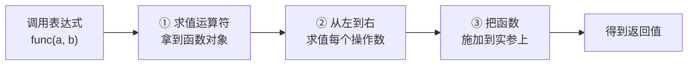

## 一、`2 + 3` 里藏着什么

- 这一篇对应官方 Lecture 1（Welcome）与 Lecture 2（Functions），把「表达式怎么求值」和「函数怎么被定义」两件事拆到底。

写 `2 + 3`，几乎立刻就能得到 `5`。但这个「立刻」值得推敲——它是一条**规则**在起作用，而不是天赋。

换个问法就更清楚了：`square(3 + 4)` 是先算 `3 + 4` 再进函数，还是先进函数再算参数？答案是前者，而这个「前者」不是常识，是 Python 明文规定的求值顺序。

**是什么**：解释器读到一个表达式，会把它逐步**化简成值**。整个 CS61A 前半程，都在回答「这一次化简，到底先动哪一步」。

```python
# 表达式的值 vs 表达式的显示
x = print("hello")     # 先把 hello 打到屏幕上
print(x)               # 再打印 print 的返回值
```

输出：

```text
hello
None
```

`print` 干了两件事：往外打一串字符，然后返回 `None`。屏幕上那个 `hello` 是**副作用**，`None` 才是它的**值**。这两者从第一行代码起就必须分开看。

## 二、表达式的两种形态与求值三步

表达式分两类，别再拆第三条路：

| 类型 | 含义 | 例子 |
| --- | --- | --- |
| **原子表达式**（atomic） | 一步求值到自身 | `3`、`2.5`、`"hi"`、`True` |
| **复合表达式**（compound） | 由子表达式拼出来 | `2 + 3`、`max(3, 4)` |

**调用表达式**（call expression）是复合表达式里最常见的一种，形如 `运算符(操作数, 操作数, ...)`。它的求值有严格三步：

1. **求值运算符**——拿到函数对象；
2. **从左到右求值每个操作数**——这一步不可跳过、不可重排；
3. **把函数施加到已经求好值的操作数上**。



把这条规则用在一个有副作用的函数上，顺序就变得肉眼可见：

```python
def noisy(x):
    print("求值参数 ->", x)
    return x

print("结果:", noisy(1 + 1) + noisy(2 * 3))
```

输出：

```text
求值参数 -> 2
求值参数 -> 6
结果: 8
```

**常见误解**：很多人以为「函数会先被执行」。解释器在跳进任何函数体之前，会**先把所有参数算完**。上面两行 `求值参数` 出现在 `结果` 之前，就是这个规则的直接证据。

嵌套调用不是特例，只是把同一条规则从最内层往外套。`max(min(1, -2), -3)` 先算 `min(1, -2) = -2`，再算 `max(-2, -3) = -2`。

## 三、`def` 做了什么：只创建，不执行

`def` 是个**语句**，不是「运行函数」的开关。它只做两件事：造一个函数对象、把名字绑上去。函数体里的代码，**一行都不跑**。

```python
def greet():
    print("函数体执行了")

print("先执行这一行")
g = greet          # 只是把函数对象绑给名字 g
print("再到这一行")
g()                # 括号才是「执行」
```

输出：

```text
先执行这一行
再到这一行
函数体执行了
```

**本质一句话**：`greet` 是值，`greet()` 是动作。前者可以赋值、可以传递、可以返回——这正是高阶函数能够成立的前提。

形参（parameter）与实参（argument）的分工也要在这一步分清：`def square(x)` 里的 `x` 是形参，是个**占位名字**；`square(4)` 里的 `4` 是实参，是**真实的**值。

```python
def square(x):
    """返回 x 的平方。"""
    return x * x

print(square(4))
print(callable(square))
```

输出：

```text
16
True
```

`callable` 返回 `True`，说明 `square` 确实是个可以被调用的对象，而不只是一块语法。

## 四、纯函数与非纯函数：`print` 和 `return` 是两回事

这是 CS61A 出现频率最高的报错源头，值得单独一节。

**纯函数**：除了返回值，不改动外部世界的任何东西。`square` 是纯的。
**非纯函数**：会留下副作用（side effect），比如打印、改文件、修改可变对象。`print` 是非纯的。

```python
def bad_square(x):
    print(x * x)          # 只是显示，函数实际返回 None

result = bad_square(4)
print(result)
print(result + 1)
```

输出：

```text
16
None
Traceback (most recent call last):
  ...
TypeError: unsupported operand type(s) for +: 'NoneType' and 'int'
```

最后那行报错是初学 Python 时最典型的一类错误：`NoneType + int`。根因永远是**在该写 `return` 的地方写了 `print`**。

对照一下正确的写法，差别只在一个关键字：

```python
def good_square(x):
    return x * x          # 把值交出去，而不是显示出来

print(good_square(4) + 1)
```

输出：

```text
17
```

## 五、副作用的发生顺序

副作用一旦混进表达式，**顺序**就成了结果的一部分。看这个经典题：

```python
print(print(1), print(2))
```

输出：

```text
1
2
None None
```

拆开推：外层 `print` 有两个操作数，按左到右求值。第一个操作数 `print(1)` 先跑——打印 `1`，返回 `None`；第二个 `print(2)` 再跑——打印 `2`，返回 `None`。最后外层 `print(None, None)` 打印 `None None`。

**只需把握一条规则**：操作数从左到右，副作用按这个顺序发生。

## 六、小结

| 概念 | 一句话 | 证据 |
| --- | --- | --- |
| 原子表达式 | 一步求值到自身 | `3`、`"hi"` |
| 调用表达式 | 求值运算符 → 从左到右求值操作数 → 施加 | `noisy(1+1) + noisy(2*3)` 先打两行参数 |
| `def` | 只创建函数对象，不执行函数体 | 绑给 `g` 时不打印任何东西 |
| `print` vs `return` | 前者是副作用、返回 `None`；后者把值交出去 | `bad_square(4) + 1` 报 `NoneType` |
| 副作用顺序 | 按操作数从左到右 | `print(print(1), print(2))` → `1 / 2 / None None` |

三条能带走的：

1. **表达式有值，语句没有。** `x = 3` 是语句，`x = 3` 这个整体求不出东西来；`3 + 4` 是表达式，值就是 `7`。
2. **函数调用前，参数一定已经算完。** 这条规则解释了所有「为什么先打印这个」的题。
3. **`print` 不是 `return`。** 前者给人看，后者给程序用；混淆两者，后续每一步都会出错。
