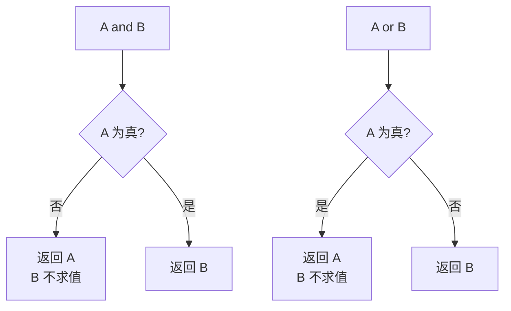
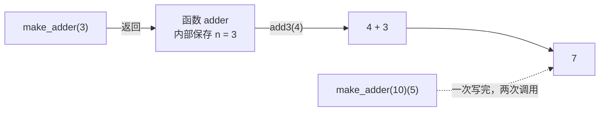

## 一、布尔运算返回的不是布尔值

- 这一篇对应官方 Lecture 3（Control）与 Lecture 4（Higher-Order Functions），要解决两个反直觉的问题：

先做一个预测：下面这三行分别会打印什么？

```python
print(3 and 4)
print(0 or "hi")
print(1 or 2)
```

输出是：

```text
4
hi
1
```

三行没有一行打印 `True` 或 `False`。**`and` 和 `or` 返回的是操作数本身**，而不是布尔值。

规则相当简洁：

| 运算符 | 行为 |
| --- | --- |
| `A and B` | 求值 `A`；若 `A` 为假，**返回 `A`**；否则返回 `B` |
| `A or B` | 求值 `A`；若 `A` 为真，**返回 `A`**；否则返回 `B` |

**是什么**：这叫**短路求值**（short-circuiting）。它有两层含义——返回值是操作数，以及**没被走到的那一半根本不求值**。

## 二、短路求值的两副面孔

第一副面孔是「返回值是操作数」，上面已经看到。第二副面孔更要命：**没被求值的那部分，副作用也不会发生**。

```python
def noisy(tag, value):
    print("求值", tag)
    return value

print(noisy("A", False) and noisy("B", True))
print("---")
print(noisy("C", True) or noisy("D", False))
```

输出：

```text
求值 A
False
---
求值 C
True
```

`B` 和 `D` 一次都没出现。因为左边已经决定了结果，右边连求值的机会都没有——`noisy("B", True)` 里那个 `print` 自然也没执行。



**常见的问法是**：「这行代码执行后，`print` 一共被调用了几次？」——按短路顺序逐步判断即可。

另外还有一个实用副产品：短路可以用来做保护。

```python
x = 0
print(x != 0 and 10 / x > 1)     # 左边为假，右边不求值，除零没发生
```

输出：

```text
False
```

## 三、`while` 与数字拆解

条件结构本身没什么花头，`if / elif / else` 按顺序判断、命中即跳过。真正要养成习惯的是**循环变量的推进**和**多重赋值**。

```python
def sum_digits(n):
    total = 0
    while n > 0:
        total, n = total + n % 10, n // 10   # 右侧先整体求值，再同时绑定
    return total

print(sum_digits(2026))
print(sum_digits(0))
```

输出：

```text
10
0
```

`total, n = ..., ...` 这一行值得停一下：等号右边**先把两个表达式都算出来**，再分别绑定。所以不会出现「`n` 已经被改成新值，而 `total` 还在用旧 `n`」的顺序问题。写成两行反而更容易错。

条件表达式是 `if-else` 的单行版，返回的是一个**值**：

```python
def abs_value(x):
    return x if x >= 0 else -x

print(abs_value(-7), abs_value(7))
```

输出：

```text
7 7
```

## 四、函数是一等公民

现在进入正题。在 Python 里，函数和数字、字符串一样是**值**：能放进变量、能当参数、能当返回值。这叫**一等公民**（first-class functions）。

```python
def apply_twice(f, x):
    return f(f(x))

def square(x):
    return x * x

print(apply_twice(square, 3))
```

输出：

```text
81
```

注意传进去的是 `square`，**不带括号**。带上括号就变成「把 `square(3)` 的返回值传进去」，语义完全不同——这是最典型的一处混淆。

函数当返回值，威力更大：

```python
def make_adder(n):
    def adder(k):
        return k + n
    return adder

add3 = make_adder(3)
print(add3(4))
print(make_adder(10)(5))
print(callable(add3))
```

输出：

```text
7
15
True
```

`make_adder(3)` 返回的是**函数**，不是数字。所以 `add3(4)` 需要两次调用：第一次造函数，第二次才算数。



「保存 `n`」这件事如何发生，属于环境图的主题；这里只需建立直觉：**返回的函数携带它定义时的环境**。

## 五、`lambda` 与柯里化

`lambda` 是「临时函数」的简写，**体内只能是单个表达式**，不能写 `return`、不能写语句。

```python
square = lambda x: x * x
print(square(5))
print((lambda x, y: x + y)(2, 3))
```

输出：

```text
25
5
```

它最大的价值在「需要一个一次性的小函数」时，比如组合：

```python
square = lambda x: x * x

def compose(f, g):
    return lambda x: f(g(x))

def make_adder(n):
    return lambda k: k + n

print(compose(square, make_adder(3))(2))     # square(2 + 3) = 25
```

输出：

```text
25
```

推演顺序是**从里往外**：先 `make_adder(3)(2) = 5`，再 `square(5) = 25`。`compose(f, g)` 里 `g` 先跑，`f` 后跑。

把「多参数函数」拆成「一串单参数函数」，叫**柯里化**（currying），它的环境图可以按环境图的三要素完整推出。

## 六、小结

| 概念 | 一句话 | 证据 |
| --- | --- | --- |
| `and` / `or` | 返回操作数本身，不是布尔值 | `3 and 4` → `4` |
| 短路求值 | 没被走到的一半不求值，副作用也不发生 | `noisy("B", ...)` 从未打印 |
| 真值性 | `0`、`""`、`[]`、`None`、`False` 为假 | `0 or "hi"` → `"hi"` |
| 一等公民 | 函数能当参数、当返回值 | `apply_twice(square, 3)` → `81` |
| `f` vs `f(x)` | 前者是函数对象，后者是它的返回值 | `callable(add3)` → `True` |
| `lambda` | 匿名单表达式函数 | `compose(...)(2)` → `25` |

三条能带走的：

1. **`and` / `or` 是「返回操作数」的运算符**，不是「返回真假」的逻辑门。这一条在实际代码中出现频率极高。
2. **短路决定副作用发不发生。** 看到「打印了几次」的题，先在草稿纸上按顺序标出每一步走到哪。
3. **函数是值。** `f` 和 `f(x)` 是两个不同层次的东西；这一步跨过去，后面所有高阶函数题都不再是新的。
