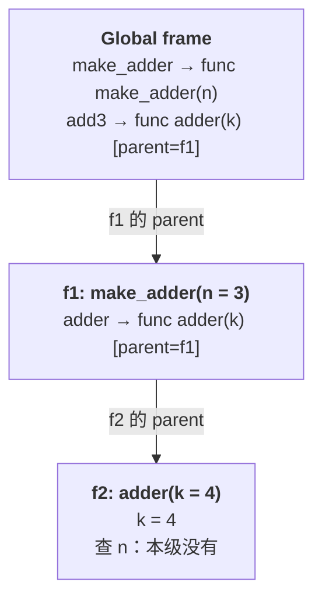
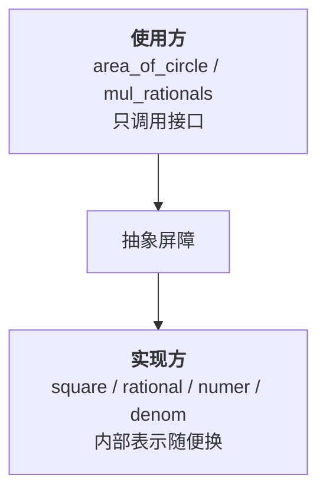

## 一、函数的「记忆」存储在哪里

- 这一篇对应官方 Lecture 5（Environments）与 Lecture 6（Abstraction），交付 CS61A 最核心的分析工具——**环境图**，以及一个更抽象的概念：**抽象屏障**。

```python
def make_adder(n):
    def adder(k):
        return k + n
    return adder

add3 = make_adder(3)
print(add3(4))
add5 = make_adder(5)
print(add5(4))
print(add3(4))
```

输出：

```text
7
9
7
```

`make_adder(3)` 早就返回了，它的局部变量 `n` 按理说应该跟着消失。可 `add3` 后来还能算出 `4 + 3`，而且和 `add5` 互不干扰。

**是什么**：`n` 没消失，是因为 `adder` 这个函数对象**携带了一个指针指向它出生时的帧**。这个指针叫 **parent**，整张图叫**环境图**。

## 二、环境图的三要素

环境图只有三个零件，但每一个都容易画错：

| 零件 | 含义 | 图上怎么写 |
| --- | --- | --- |
| **帧**（frame） | 名字 → 值的对应表 | 全局标 `Global`，调用产生的依次标 `f1`、`f2` |
| **函数对象** | `def` 造出来的值，自带 parent | `func adder(k) [parent=f1]` |
| **返回值** | 从调用表达式画出去，**不写进帧** | 箭头从调用处指向值来源 |

**第一条铁律**：局部帧的 parent 指向**函数对象定义时所在的帧**，跟谁调用它、在哪调用它**毫无关系**。这就是**词法作用域**（lexical scoping），也叫静态作用域——「看代码即可确定」。

**第二条铁律**：`def` 每执行一次，就造一个**新的**函数对象。所以 `make_adder(1)` 调两次，拿到两个互不相干的函数。

```python
def make_adder(n):
    def adder(k):
        return k + n
    return adder

f = make_adder(1)
g = make_adder(1)
print(f is g)
print(f(10), g(10))
```

输出：

```text
False
11 11
```

`f is g` 是 `False`——两次调用造了两个函数对象，parent 指向两个不同的 `f1`。行为看起来一样，身份完全不同。

## 三、完整推演一次

拿 `add3 = make_adder(3)` 与 `add3(4)` 走一遍：



步骤：

1. 执行 `def make_adder`，`Global` 里出现函数对象 `func make_adder(n) [parent=Global]`。
2. 调用 `make_adder(3)` → 新建 `f1`，parent 指向 `Global`；`f1` 里绑 `n = 3`。执行到 `def adder`，`f1` 里出现 `func adder(k) [parent=f1]`——**注意 parent 是 `f1`**。
3. `make_adder` 返回，`f1` 理论上「已经结束」；但 `adder` 这个对象还指着 `f1`，所以 `f1` 不能回收。`add3` 绑到这个对象上。
4. 调用 `add3(4)` → 新建 `f2`，parent 指向 `adder` 的 parent，也就是 `f1`；`f2` 里绑 `k = 4`。
5. 求值 `k + n`：`k` 在 `f2` 找到；`n` 在 `f2` 没有 → 沿 parent 到 `f1` → 找到 `3`。返回 `7`。

**查名字规则**只有一句：**当前帧找不到，就沿 parent 一层层往上找，到 `Global` 还没有就是 `NameError`。**

**常见误解**：把 `f2` 的 parent 画成「调用者所在的帧」。父链在**定义时**就已确定，与调用现场无关。这是画环境图时最集中的一处错误。

## 四、从函数抽象到抽象屏障

环境图管「值怎么流动」，接下来管「代码怎么组织」。

抽象的准确含义是：**给它起个名字，然后在使用时不必知道它内部是怎么实现的**。

```python
def square(x):
    return x * x

def area_of_circle(r):
    pi = 3.14159
    return pi * square(r)

print(round(area_of_circle(1), 5))
```

输出：

```text
3.14159
```

`area_of_circle` 不需要知道 `square` 里写的是 `x * x` 还是 `x ** 2`。这条「不需要知道」的界线，叫**抽象屏障**（abstraction barrier）。



屏障两侧可以**独立演进**：实现改了，只要承诺不变，使用方一行都不用动。下面这个例子把这件事做成可执行的证据。

## 五、数据抽象：让屏障真的挡得住

数据抽象的做法是配一对函数：**构造函数**负责造数据，**选择函数**负责取数据。使用方永远不碰内部表示。

```python
# 数据的内部表示：一个列表
def rational(n, d):
    return [n, d]

def numer(x):
    return x[0]

def denom(x):
    return x[1]

def mul_rationals(x, y):
    return rational(numer(x) * numer(y), denom(x) * denom(y))

print(mul_rationals(rational(1, 2), rational(2, 3)))
```

输出：

```text
[2, 6]
```

现在把内部表示从列表换成元组——**只改构造与选择这两个函数**：

```python
def rational(n, d):
    return (n, d)          # 唯一改动的地方

def numer(x):
    return x[0]

def denom(x):
    return x[1]

def mul_rationals(x, y):
    return rational(numer(x) * numer(y), denom(x) * denom(y))

print(mul_rationals(rational(1, 2), rational(2, 3)))
```

输出：

```text
(2, 6)
```

`mul_rationals` 一个字没改，行为依然正确——因为它从来没越过屏障去碰 `x[0]`。

**违反屏障长什么样**：在高层逻辑里直接写 `x[0]`。

```python
# ✗ 越过屏障：高层逻辑自己拆列表
def mul_rationals_bad(x, y):
    return [x[0] * y[0], x[1] * y[1]]
```

这段代码在「表示是列表」时能跑，一换成元组就语义全变（甚至静默算错）。判据很简单：**只要出现了裸下标，屏障大概率已经被拆了。**

## 六、小结

| 概念 | 一句话 | 证据 |
| --- | --- | --- |
| 帧 | 名字 → 值的表 | `Global` / `f1` / `f2` |
| parent 铁律 | 指向**定义时**所在帧，与调用位置无关 | `adder` 的 parent 是 `f1` |
| 每次调用新对象 | `def` 每执行一次造一个函数对象 | `make_adder(1) is make_adder(1)` → `False` |
| 查名字 | 本级找不到就沿父链向上 | `n` 在 `f2` 没有，到 `f1` 找到 |
| 返回值 | 从调用表达式画箭头，不写进帧 | 61A 固定作图约定 |
| 抽象屏障 | 使用方不碰内部表示 | 列表换元组，`mul_rationals` 不改 |
| 构造/选择函数 | 成对出现，缺一屏障就漏 | `rational` / `numer` / `denom` |

三条能带走的：

1. **画环境图先问一句：「这个函数的 parent 是谁？」** 答对了，剩下都是填空题。
2. **每次调用都造新帧、造新函数对象。** 两个 `make_adder(1)` 的结果长得一样，但身份不同。
3. **抽象屏障的判据是「能不能不碰内部表示」。** 一旦在高层代码里写下标，屏障就漏了——这比「代码是不是短」重要得多。
