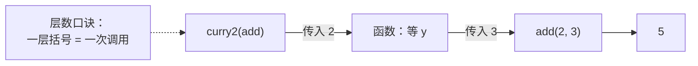
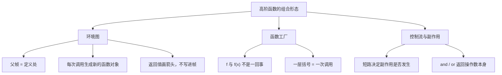

> 高阶函数的基础构件包括：求值规则、短路语义、函数作为一等公民、环境图、抽象屏障。
> 这一篇对应官方 Lecture 7（Function Examples），把这些构件组合成三种可复用的高阶函数模式。

## 一、钩子：三种常见的「函数工厂」

高阶函数的题翻来覆去就三种形态：

| 形态 | 长什么样 | 典型名字 |
| --- | --- | --- |
| 重复执行 | 把同一个函数套 n 次 | `make_repeater` |
| 参数拆层 | 多参数拆成一串单参数 | `curry` / `uncurry` |
| 附加行为 | 包一层，前后加点东西 | `trace` / 包装器 |

认准形态，写起来就是填空。

## 二、函数工厂：`make_repeater`

```python
def make_repeater(f, n):
    """返回一个把 f 重复执行 n 次的函数。"""
    def repeat(x):
        for _ in range(n):
            x = f(x)
        return x
    return repeat

add1 = lambda x: x + 1
print(make_repeater(add1, 3)(10))
print(make_repeater(lambda x: x * 2, 4)(1))
```

输出：

```text
13
16
```

`make_repeater(add1, 3)` 返回函数，再传 `10` 才执行。推演：`10 → 11 → 12 → 13`，以及 `1 → 2 → 4 → 8 → 16`。

注意 `n` 和 `f` 都被 `repeat` 捕获了——和 `make_adder` 是同一套机制，parent 指向那次 `make_repeater` 调用的帧。

## 三、柯里化与反柯里化

柯里化（currying）把「两个参数的函数」变成「一个只接一个参数、返回下一个函数的函数」。

```python
from operator import add

def curry2(f):
    """把双参数函数变成单参数函数链。"""
    return lambda x: lambda y: f(x, y)

def uncurry2(g):
    """反过来：把函数链还原成双参数函数。"""
    return lambda x, y: g(x)(y)

print(curry2(add)(2)(3))
print(uncurry2(curry2(add))(2, 3))
```

输出：

```text
5
5
```

第二行值得留意：`uncurry2(curry2(add))` 先把它柯里化、再反柯里化，回到双参数形态，行为等价。**这对函数互为逆运算**，是检验层数理解的好例子。



**层数就是帧数**：`curry2(add)(2)(3)` 一共三次调用，环境图上就是三个局部帧叠上去。

## 四、函数包装：装饰器的原型

第三种形态是「包一层」：不改变原函数，在它外面加行为。

```python
def trace(f):
    def wrapped(x):
        print("调用", f.__name__, "参数", x)
        return f(x)
    return wrapped

def square(x):
    return x * x

traced = trace(square)
print(traced(3))
print(traced(4))
```

输出：

```text
调用 square 参数 3
9
调用 square 参数 4
16
```

`trace` 不知道 `square` 内部干什么，也不改它的代码，只是在外面套了一层日志。`f.__name__` 能取到 `"square"`，正说明 `f` 是**函数对象本身**，而不是它的返回值——又一次呼应了 `f` 与 `f(x)` 的区别。

这个模式就是 Python 装饰器的底层形状（`@trace` 只是语法糖）。在实际代码中，它常以「写一个包装函数」的形式出现。

## 五、一处必须注意的陷阱：循环中创建函数

```python
funcs = []
for i in range(3):
    funcs.append(lambda x: x + i)

print([f(0) for f in funcs])
```

输出：

```text
[2, 2, 2]
```

不是 `[0, 1, 2]`。原因：三个 `lambda` 引用的是**同一个名字 `i`**，而不是「创建时 `i` 的值」。循环结束 `i` 停在 `2`，三个函数后来去查这个名字，查到的都是 `2`。

**判据**：内层函数捕获的是**帧里的名字**。名字的值后来变了，函数的行为就跟着变。遇到这类情况，应画环境图，不要依赖直觉。

## 六、三种模式的共同底层

三种模式可以合成一张结构图，便于在阅读代码时快速归类：



三处最常见的理解偏差：

1. **把 parent 画成调用者所在的帧。** 父链在**定义时**就已确定，与调用现场无关。
2. **把 `f` 与 `f(x)` 混为一谈。** 传 `f` 传的是函数对象本身，传 `f(x)` 传的是它的返回值。
3. **数错括号层数。** 一层括号对应一次调用，也就对应一层帧。

三个可以随时自检的问题：

- 这个函数的 parent 指向**定义处**的帧吗？
- 括号层数与调用次数对应吗？
- 该 `return` 的地方是否误写成了 `print`？

## 七、小结

| 模式 | 骨架 | 输出验证 |
| --- | --- | --- |
| 重复执行 | `make_repeater(f, n)` → `repeat(x)` | `make_repeater(add1, 3)(10)` → `13` |
| 柯里化 | `curry2(f)` → `lambda x: lambda y: f(x, y)` | `curry2(add)(2)(3)` → `5` |
| 反柯里化 | `uncurry2(g)` → `lambda x, y: g(x)(y)` | `uncurry2(curry2(add))(2, 3)` → `5` |
| 包装 | `trace(f)` → `wrapped(x)` | 先打印日志，再返回原结果 |
| 闭包陷阱 | 循环里建函数 | `[2, 2, 2]`，不是 `[0, 1, 2]` |

三条能带走的：

1. **从括号层数入手。** 几层括号就是几次调用，也就是几层帧。
2. **包装器不修改原函数。** 它只是在外层附加行为——这是「抽象屏障」在函数层面的应用。
3. **闭包捕获的是名字，不是值。** 在循环中创建函数时尤其要注意，识别方法是画环境图。
