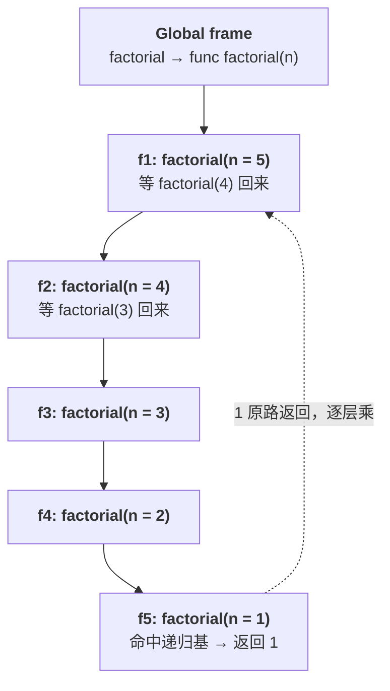
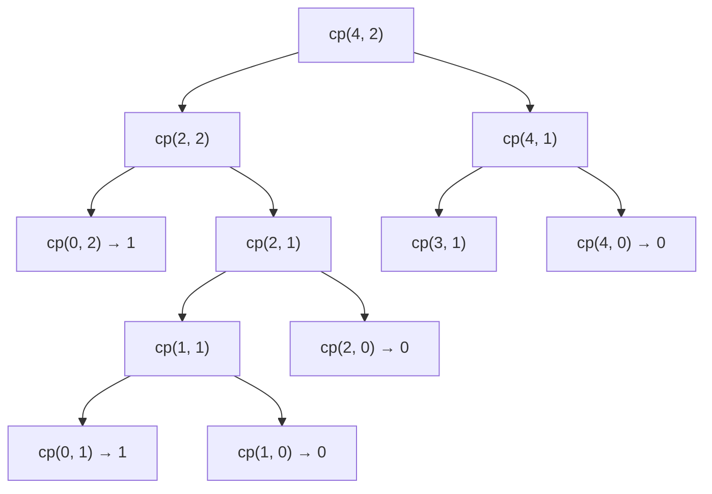

## 一、递归只有一个问题要想

- 这一篇对应官方 Lecture 9（Recursion）与 Lecture 10（Tree Recursion），给这些零件装上**自我调用**的引擎。

初学者写递归，遇到的障碍几乎总是同一处：

> 「`factorial(n - 1)` 我还没写出来呢，怎么能用它？」

答案是：**你已经写出来了**。你现在写的这个 `factorial` 就是它。这就是 61A 反复强调的**信心跃迁**（leap of faith）——写递归时唯一要想的事，是「**假定子问题已经解决**，我怎么把它的结果拼成原问题的答案」。

至于子问题为什么正确，交给数学归纳法去保证，而不要求在写代码时同时展开。

## 二、递归的三件套

任何一个递归函数都由三块组成：

| 部件 | 作用 | 缺了会怎样 |
| --- | --- | --- |
| 递归基（base case） | 最小可解子问题，直接给答案 | 无限递归 → `RecursionError` |
| 递归步骤（recursive step） | 缩小规模 + 自我调用 | 永远到不了底 |
| 信心跃迁 | 假定子问题正确，只管拼接 | 写着写着开始手动展开 |

```python
def factorial(n):
    if n == 0 or n == 1:      # 递归基
        return 1
    return n * factorial(n - 1)   # 递归步骤 + 信心跃迁

print(factorial(5))
print(factorial(1))
print(factorial(0))
```

输出：

```text
120
1
1
```

递归基写成 `n == 0 or n == 1` 是刻意的：

- `n == 0` 是**数学上**的定义（`0! = 1`）；
- `n == 1` 是**省一层调用**的优化，一并写上也无妨。

如果只写 `n == 0`，代码同样正确。但要注意——**不要把边界判断放进 `else` 分支**。把边界判断放在函数最前面，是确保它不被遗漏的最直接做法。

## 三、调用栈：每层递归占一个帧

`factorial(5)` 展开时，Python 真的把五个帧叠了起来：



**栈深 = 递归深度**。深度太大就会撞上限：

```python
import sys

def boom(n):
    return boom(n + 1)      # 永远到不了底

try:
    boom(0)
except RecursionError:
    print("撞到了递归上限")

print("Python 默认递归上限 =", sys.getrecursionlimit())
```

输出：

```text
撞到了递归上限
Python 默认递归上限 = 1000
```

Python 默认只给 1000 层。工程上遇到深层递归（例如解析嵌套很深的 JSON），要么改写成迭代，要么调 `sys.setrecursionlimit` 并同步调大线程栈——**若只调大递归上限而不相应调大线程栈，会真的耗尽 C 栈并触发段错误，比普通报错更难排查**。

## 四、树递归：一条路径里多次自我调用

判别方法很简单：**`return` 那一行出现了两次以上自我调用**，就是树递归。

最经典的例子是数数字和：

```python
def sum_digits(n):
    """返回 n 的各位数字之和，要求 n >= 0。"""
    if n < 10:
        return n
    return n % 10 + sum_digits(n // 10)

print(sum_digits(2024))
print(sum_digits(7))
```

输出：

```text
8
7
```

`2024 → 4 + sum_digits(202) → 4 + 2 + sum_digits(20) → …`，每条路径只有一次自我调用，**这是「线性递归」，不是树递归**。它是树递归的退化形态——只有一根枝。

真正的树递归，是下面这种分岔的。

## 五、`count_partitions`：多重边界条件

问题：用不超过 `m` 的正整数，把 `n` 拆成若干部分相加，共有几种拆法。

思路只有两条路，且**恰好覆盖全部情形、互不重叠**：

- **至少用掉一个 `m`**：剩下 `n - m`，可选部分仍然是 `≤ m`；
- **完全不用 `m`**：剩下 `n`，可选部分降到 `≤ m - 1`。

```python
def count_partitions(n, m):
    """把 n 拆成不超过 m 的正整数之和，返回拆法数。"""
    if n == 0:
        return 1
    elif n < 0 or m == 0:
        return 0
    else:
        return count_partitions(n - m, m) + count_partitions(n, m - 1)

print(count_partitions(5, 3))
print(count_partitions(5, 5))
```

输出：

```text
5
7
```

`count_partitions(5, 3) = 5`，五种拆法是 `3+2`、`3+1+1`、`2+2+1`、`2+1+1+1`、`1+1+1+1+1`。

**两个边界条件各挡一种死路**，缺一不可：

| 条件 | 什么时候触发 | 含义 |
| --- | --- | --- |
| `n == 0` | 刚好拆完 | 找到一种有效拆法 → 记 1 |
| `n < 0` | 用了太大的部分，超了 | 这条路走死 → 记 0 |
| `m == 0` | 可用的最大部分没了，但 `n` 还没拆完 | 这条路走死 → 记 0 |

最常见的错误，是只写了 `n < 0` 而漏了 `m == 0`（或者反过来）。

调用树长这样：



**节点数 = 调用总次数**。这棵树的分支是「用 m」和「不用 m」两条，深度由 `n` 和 `m` 共同决定——比线性递归复杂得多，也是树递归代价高的根源。

## 六、重复计算的代价：`fib` 与记忆化

树递归的另一个标志性问题是**重叠子问题**：

```python
def fib(n):
    if n <= 1:
        return n
    return fib(n - 1) + fib(n - 2)

print(fib(10))
```

输出：

```text
55
```

`fib(10)` 里，`fib(8)` 被算了两次，`fib(7)` 被算了三次……越往下重复越多。数一数：

```python
calls = 0

def fib_counted(n):
    global calls
    calls += 1
    if n <= 1:
        return n
    return fib_counted(n - 1) + fib_counted(n - 2)

print(fib_counted(10))
print("调用次数 =", calls)
```

输出：

```text
55
调用次数 = 177
```

为了算 `fib(10) = 55`，函数被调用了 **177 次**。增长速率约等于黄金比 `φⁿ ≈ 1.618ⁿ`——`n` 只加 10，次数就翻一百多倍。

修法是把算过的结果存起来，这就是**记忆化**（memoization）：

```python
memo = {}

def fib_memo(n):
    if n in memo:
        return memo[n]
    if n <= 1:
        result = n
    else:
        result = fib_memo(n - 1) + fib_memo(n - 2)
    memo[n] = result
    return result

print(fib_memo(100))
```

输出：

```text
354224848179261915075
```

从 `fib(10)` 要 177 次调用，到 `fib(100)` 只需约 200 次——**重叠子问题一旦只算一次，指数级就塌成线性**。

## 七、小结

| 概念 | 一句话 | 证据 |
| --- | --- | --- |
| 信心跃迁 | 假定子问题已对，只管拼接 | `n * factorial(n - 1)` |
| 递归基 | 摆在函数最前，不进 `else` | 缺了 → `RecursionError` |
| 栈深 | 每层递归一个帧 | 默认上限 1000 |
| 树递归判据 | `return` 里两次自我调用 | `cp(n-m, m) + cp(n, m-1)` |
| 多重边界 | `n < 0` 与 `m == 0` 都要 | 漏一个即错 |
| 重叠子问题 | 树递归的隐藏代价 | `fib(10)` 调用 177 次 |
| 记忆化 | 算过就存，指数塌成线性 | `fib_memo(100)` 立即返回 |

三条能带走的：

1. **写递归只做一件事：假定子问题对了，把答案拼回去。** 不要在脑子里展开整棵树，那是计算机的活。
2. **递归基和边界条件一起查，缺一不可。** `count_partitions` 的 `n < 0` 与 `m == 0` 是标准范本。
3. **看到 `return` 行里两次自我调用，先问一句「有重复子问题吗」。** 有，就上记忆化。
