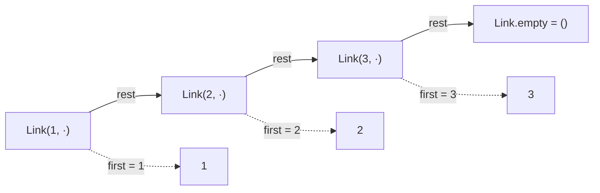

## 一、`[7, 9] is [7, 9]` 为什么是 `False`

- 这一篇对应官方 Lecture 13（Objects）与 Lecture 14（Linked Lists），先讲「一切皆对象」和 `is` / `==` 的区别，

很多人会愣一下：两个列表长得一模一样，凭什么不「是」同一个？

因为 `is` 问的根本不是「内容一样吗」，而是「**是不是同一个对象**」。两个字面量各自造了一个新列表，长得像不等于就是同一份。

这一篇先把这条区分讲清楚，因为它是链表、可变性、环境图题目的共同地基。

## 二、`is` 与 `==`

```python
a = [7, 9]
b = [7, 9]
c = a

print(a == b, a is b, a is c)

e1 = []
e2 = []
print(e1 is e2)

x = 256
y = 256
print(x is y)
```

输出：

```text
True False True
False
True
```

| 运算符 | 比什么 | `a = [7, 9]; b = [7, 9]` | 用在哪 |
| --- | --- | --- | --- |
| `==` | **内容**相等 | `a == b` → `True` | 判断两串数据是否等值 |
| `is` | **身份**相同（同一对象） | `a is b` → `False` | 判断「是不是它本身」 |

两个空列表也是两个对象，所以 `e1 is e2` 为 `False`。最后那行 `x is y` 为 `True`，是因为 CPython 对小整数做了**驻留**（缓存 `-5` 到 `256`）。

**但这是实现细节，不是语言语义。** `256 is 256` 为 `True`、`257 is 257` 通常为 `False`，纯属 CPython 的缓存策略。判身份时只问「它俩是不是同一个对象」，不应拿小整数缓存当推理依据。

## 三、用函数表示数据

61A 有一个让人拍案的设计：**数据不一定非要用数据结构来表示**。

```python
def pair(x, y):
    def dispatch(m):
        if m == 0:
            return x
        elif m == 1:
            return y
    return dispatch

def first(p):
    return p(0)

def second(p):
    return p(1)

p = pair(3, 4)
print(first(p), second(p))
print(callable(p))
```

输出：

```text
3 4
True
```

`pair` 里**没有任何数据结构**——没有列表、没有元组、没有字典。它返回的只是一个闭包，靠 `dispatch` 这个「传消息」的参数决定往外吐哪个值。但对外看，`first(p)` 和 `second(p)` 的行为跟一个真二元组完全一样。

这就是**消息传递**（message passing）式的数据抽象：数据被表示成「一个接收消息的函数」。它提醒你，`pair` 的**接口**（`first` / `second`）才是抽象屏障；里面是列表、元组还是函数，调用方不需要知道——这正是抽象屏障思想在数据上的落地。

## 四、链表：递归定义的数据结构

链表的定义是一句递归的话：

> 一个链表，要么是**空哨兵**，要么由「**第一个元素** + **剩下的那个链表**」构成。

注意后半句——`rest` 本身又是一个链表。这正是在递归那一篇讲过的「同类子问题」：数据结构自己长了递归的形状，处理它的函数自然也该是递归的。

```python
class Link:
    empty = ()

    def __init__(self, first, rest=empty):
        self.first = first
        self.rest = rest

    def __repr__(self):
        if self.rest is Link.empty:
            return f"Link({self.first})"
        return f"Link({self.first}, {self.rest})"

t = Link(1, Link(2, Link(3)))
print(t)
print(t.first, t.rest.first)
```

输出：

```text
Link(1, Link(2, Link(3)))
1 2
```

几个设计细节值得注意：

- **`rest=empty` 用类属性当默认值**。`empty = ()` 是一个**共享的哨兵对象**，整个系列中所有空链表都是同一个 `()`。这里用不可变的 `()` 当默认值很安全——不像 `rest=[]`，那样所有实例会共享同一个列表，是个经典 bug。
- **`__repr__` 递归输出**。`Link(1, Link(2, Link(3)))` 这行字是 `repr` 一层层拼出来的——`f"{self.first}, {self.rest}"` 里的 `{self.rest}` 又触发了下一层的 `__repr__`。
- **`empty` 是唯一表示**。判空必须用 `is Link.empty`，不要用 `t == ()`——后者在值层面比较，语义不对。

## 五、递归遍历链表

```python
class Link:
    empty = ()

    def __init__(self, first, rest=empty):
        self.first = first
        self.rest = rest

def sum_links(t):
    if t is Link.empty:
        return 0
    return t.first + sum_links(t.rest)

def length(t):
    if t is Link.empty:
        return 0
    return 1 + length(t.rest)

t = Link(1, Link(2, Link(3, Link(4))))
print(sum_links(t), length(t))
print(sum_links(Link.empty), length(Link.empty))
```

输出：

```text
10 4
0 0
```

这两个函数是递归三件套的**标准形态**：递归基是「遇到空链表」，递归步骤是「处理 `first` + 递归处理 `rest`」。跟 `count_partitions` 是同一套思路，只是数据换了。

**链表是递归数据结构，处理它的函数就该是递归的。** 你几乎不需要多想。



## 六、就地反转：指针游戏

链表反转的关键在于「三个指针同时挪」：

```python
class Link:
    empty = ()

    def __init__(self, first, rest=empty):
        self.first = first
        self.rest = rest

    def __repr__(self):
        if self.rest is Link.empty:
            return f"Link({self.first})"
        return f"Link({self.first}, {self.rest})"

def reverse(t):
    prev, cur = Link.empty, t
    while cur is not Link.empty:
        cur.rest, prev, cur = prev, cur, cur.rest
    return prev

t = Link(1, Link(2, Link(3)))
print(reverse(t))
```

输出：

```text
Link(3, Link(2, Link(1)))
```

关键是这一行的**平行赋值**：

```python
cur.rest, prev, cur = prev, cur, cur.rest
```

右边三件事先全部求值（此刻 `cur.rest` 还是老值），再一起赋回去。等价于三条语句：

```python
nxt = cur.rest    # 先保存下一个，否则下一句就丢失了
cur.rest = prev   # 掉头
prev = cur
cur = nxt
```

**顺序错了就断链。** 这是链表题最经典的易错点：先改 `cur.rest` 再想记 `nxt`，后半截链表就找不回来了。

## 七、改一个，全跟着变

链表节点是**可变对象**，`rest` 只是指向它，所以就地改动会波及所有引用：

```python
class Link:
    empty = ()

    def __init__(self, first, rest=empty):
        self.first = first
        self.rest = rest

    def __repr__(self):
        if self.rest is Link.empty:
            return f"Link({self.first})"
        return f"Link({self.first}, {self.rest})"

a = Link(1, Link(2))
b = Link(9, a)      # b 的 rest 就是 a 本身，不是 a 的副本
a.first = 100
print(b)
```

输出：

```text
Link(9, Link(100, Link(2)))
```

`b` 的尾巴跟着 `a` 一起变了，因为 `b.rest is a`。这正好呼应第二篇讲的浅拷贝——**这是同一个对象被两个名字指着**，不是两份数据。环境图最需要留意这种「共享结构」。

## 八、小结

| 概念 | 一句话 | 证据 |
| --- | --- | --- |
| `is` vs `==` | 身份 vs 内容 | `[7,9] is [7,9]` → `False` |
| 数据即函数 | 靠闭包 + `dispatch` 表示二元组 | `pair(3, 4)` → `first` 得 `3` |
| 链表定义 | 空哨兵，或 `first` + `rest` 链表 | `Link.empty` 全系列唯一 |
| 判空 | 用 `is Link.empty` | 不要用 `t == ()` |
| 遍历 | 撞空返回基值，否则 `first` + 递归 | `sum_links` / `length` |
| 反转 | 三指针平行赋值，先记 `nxt` | `reverse(Link(1, Link(2, Link(3))))` |
| 共享结构 | `rest` 指向同一对象，改动会传播 | 改 `a.first`，`b` 也变 |

三条能带走的：

1. **`is` 问「是不是它」，`==` 问「长得一样吗」。** 判身份别拿小整数缓存当依据。
2. **链表是递归结构，遍历就写递归；要改结构就动指针。** 判空永远用 `is Link.empty`。
3. **链表节点是可变对象，`rest` 是引用不是副本。** 改一处、动全身，画环境图最稳。
