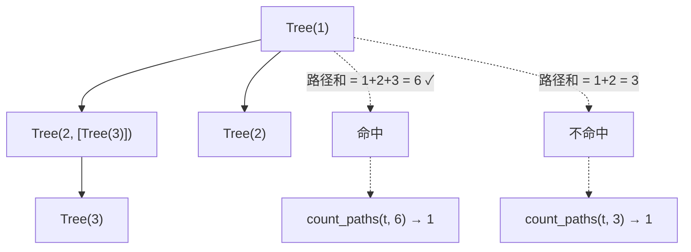
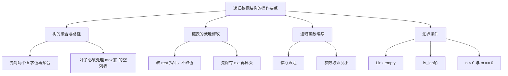

> 链表每个节点最多接一个「下一个」，结构是一条线。
> 这一篇对应官方 Lecture 15（Trees），把线展开成**分叉**：树上每个节点可以挂任意多个子树。
> 所有树算法都长一个样——**对 `branches` 逐个递归，再聚合**。这是树的统一递归形态。

## 一、钩子：树算法只有一句话

链表的递归是「处理 `first`，递归 `rest`」，只有一根枝。

树是把「一根枝」换成了「**一列枝**」：

> 处理 `label`，对 `branches` 里**每一个**子树递归，再把结果**聚合**起来。

认准这句话，树相关的代码大多只是填空。剩下的功夫都在**边界**上——叶子如何处理、空树怎么办。

## 二、树是什么

```python
class Tree:
    def __init__(self, label, branches=[]):
        self.label = label
        self.branches = list(branches)   # 防御性拷贝

    def is_leaf(self):
        return not self.branches

    def __repr__(self):
        if self.is_leaf():
            return f"Tree({self.label})"
        return f"Tree({self.label}, {self.branches})"

t = Tree(1, [Tree(2, [Tree(4)]), Tree(3)])
print(t)
print(t.is_leaf(), t.branches[0].is_leaf())
```

输出：

```text
Tree(1, [Tree(2, [Tree(4)]), Tree(3)])
False False
```

两处设计值得说道：

- **`branches=list(branches)` 是防御性拷贝**。如果直接写 `self.branches = branches` 并让默认值是 `[]`，所有「没传 branches 的树」会**共享同一个列表对象**——改一棵树的子树，别的树跟着变。这是 Python 默认参数最经典的问题，标准写法就是在规避它。
- **叶子判据统一走 `is_leaf()`**，而不是到处写 `len(t.branches) == 0`。判据收在一处，边界就收在一处。

## 三、聚合：节点数与叶子数

```python
class Tree:
    def __init__(self, label, branches=[]):
        self.label = label
        self.branches = list(branches)

    def is_leaf(self):
        return not self.branches

    def __repr__(self):
        if self.is_leaf():
            return f"Tree({self.label})"
        return f"Tree({self.label}, {self.branches})"

def count_nodes(t):
    """所有节点（含根）的个数。"""
    return 1 + sum([count_nodes(b) for b in t.branches])

def count_leaves(t):
    """所有叶子的个数。"""
    if t.is_leaf():
        return 1
    return sum([count_leaves(b) for b in t.branches])

t = Tree(1, [Tree(2, [Tree(4)]), Tree(3)])
print(t.branches)
print(count_nodes(t), count_leaves(t))
```

输出：

```text
[Tree(2, [Tree(4)]), Tree(3)]
4 2
```

**这两个函数的差别，是理解树聚合的关键。**

| 函数 | 对 `t` 本身怎么算 | 对 `branches` 怎么算 |
| --- | --- | --- |
| `count_nodes` | `+1`（自己算一个节点） | 对每个 `b` 求和 |
| `count_leaves` | 叶子才 `+1`，否则 `+0` | 对每个 `b` 求和 |

`count_nodes(t.branches)` 这种写法是**必错**的——`branches` 是**列表**，不是 `Tree`，传进去会 `AttributeError`。聚合类函数永远是「**先对每个 `b` 求值，再把一列结果聚合**」，中间那层 `[f(b) for b in t.branches]` 一步都不能省。

## 四、深度与 `max([])` 陷阱

```python
class Tree:
    def __init__(self, label, branches=[]):
        self.label = label
        self.branches = list(branches)

    def is_leaf(self):
        return not self.branches

def depth(t):
    """从根到最深叶子的边数。"""
    if t.is_leaf():
        return 0
    return 1 + max([depth(b) for b in t.branches])

t = Tree(1, [Tree(2, [Tree(4, [Tree(5)])]), Tree(3)])
print(depth(t))
print(depth(Tree(1)))
```

输出：

```text
3
0
```

`depth` 是「聚合」里最需要小心边界的一个：`max([...])` 遇到**空列表**会直接抛错。

```python
class Tree:
    def __init__(self, label, branches=[]):
        self.label = label
        self.branches = list(branches)

try:
    max([])
except ValueError as e:
    print("max([]) 抛错：", type(e).__name__)

t = Tree(1)                                  # 单节点树，branches 是空列表
try:
    print(1 + max([depth(b) for b in t.branches]))
except ValueError as e:
    print("叶子未处理 →", type(e).__name__)
```

输出：

```text
max([]) 抛错： ValueError
叶子未处理 → ValueError
```

所以 `depth` 开头那句 `if t.is_leaf(): return 0` **不是可选项**。少了它，一棵单节点树就会在 `max([])` 处报错。

真正的难点在这里：**是否主动考虑过空树与叶子？**

## 五、路径搜索：`count_paths`

树的另一大类题是**路径**——从根走到叶，问有多少条路满足条件。

```python
class Tree:
    def __init__(self, label, branches=[]):
        self.label = label
        self.branches = list(branches)

    def is_leaf(self):
        return not self.branches

def count_paths(t, total):
    """有多少条「根到叶」路径的元素和等于 total。"""
    if t.is_leaf():
        return 1 if t.label == total else 0
    return sum([count_paths(b, total - t.label) for b in t.branches])

t = Tree(1, [Tree(2, [Tree(3)]), Tree(2)])
print(count_paths(t, 6))
print(count_paths(t, 3))
```

输出：

```text
1
1
```

两个值得掌握的手法：

- **「把目标减着往下传」**。不要在递归里带一个累加的和，而是每往下一层就 `total - t.label`，走到叶子时看剩下的目标是不是正好等于叶子的标签。这样参数只有两个，状态干净。
- **只有叶子能判定成败**。非叶子节点直接返回「各分支的结果之和」，自己不记数。写成 `sum([...])` 而不是累加循环，是树的通用姿势。



## 六、链表去重：改指针的范例

链表是另一类需要就地修改的递归结构。去重的关键在于「**边走边改 `rest` 指针**」：

```python
class Link:
    empty = ()

    def __init__(self, first, rest=empty):
        self.first = first
        self.rest = rest

    def __repr__(self):
        if self.rest is Link.empty:
            return f"Link({self.first})"
        return f"Link({self.first}, {self.rest})"

def remove_dups(t):
    """就地删掉重复节点，保留首次出现。"""
    seen = []
    cur = t
    while cur is not Link.empty:
        seen.append(cur.first)
        while cur.rest is not Link.empty and cur.rest.first in seen:
            cur.rest = cur.rest.rest        # 跳过重复节点
        cur = cur.rest
    return t

t = Link(1, Link(2, Link(1, Link(3, Link(2)))))
print(remove_dups(t))
```

输出：

```text
Link(1, Link(2, Link(3)))
```

关键在**内层 `while`**：它在 `cur` 处不动，把后面**所有**重复节点一次跳完，而不是只跳一个。写成 `if` 会留下未被跳过的重复节点。改的是 `cur.rest`（指针），不是 `cur.first`（值）——**插入和删除本质都是在改指针**。

## 七、递归数据结构的操作要点



四类操作的要点：

1. **树上的聚合与路径搜索**——路径和、最大路径、`count_paths` 的变体。
2. **链表的就地修改**——去重、反转、拼接、有序插入。
3. **递归函数的编写**——先手算最小例子，再写递归步骤。
4. **多重边界条件**——`Link.empty` / `is_leaf()` / `n < 0`，逐一核对。

**书写与调试习惯**：先在草稿区画出调用树或环境图，再写代码；写完后立即手工推演一个最小例子（例如单节点树、空链表）。这一步通常能提前暴露边界问题。

## 八、小结

| 模式 | 骨架 | 验证 |
| --- | --- | --- |
| 节点计数 | `1 + sum([count_nodes(b) for b in t.branches])` | `count_nodes(t)` → `4` |
| 叶子计数 | 叶子 `+1`，否则求和各分支 | `count_leaves(t)` → `2` |
| 深度 | `1 + max([...])`，叶子先处理 | `depth(t)` → `3` |
| 路径计数 | 目标减着往下传，叶子判定 | `count_paths(t, 6)` → `1` |
| 链表去重 | 内层 `while` 在原位跳过所有重复 | `1→2→1→3→2` → `1→2→3` |
| 链表反转 | 平行赋值，先记 `nxt` | `1→2→3` → `3→2→1` |

三条能带走的：

1. **树算法只有一句话：对 `branches` 逐个递归，再聚合。** 写成 `count_nodes(t.branches)` 一定错——`branches` 是列表。
2. **叶子必须主动处理。** `max([])` 会抛 `ValueError`，`depth` 里那句 `is_leaf()` 不是装饰。
3. **三个必须核对的边界：叶子、`Link.empty`、递归参数是否真的变小。**
