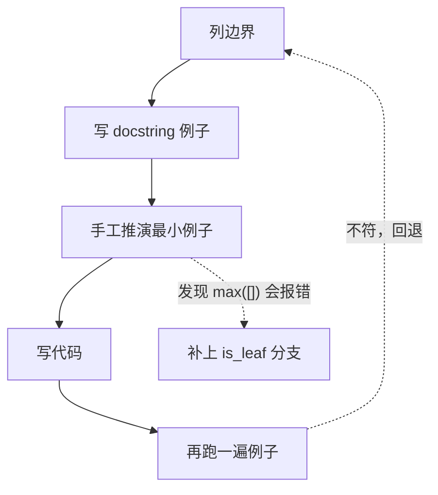
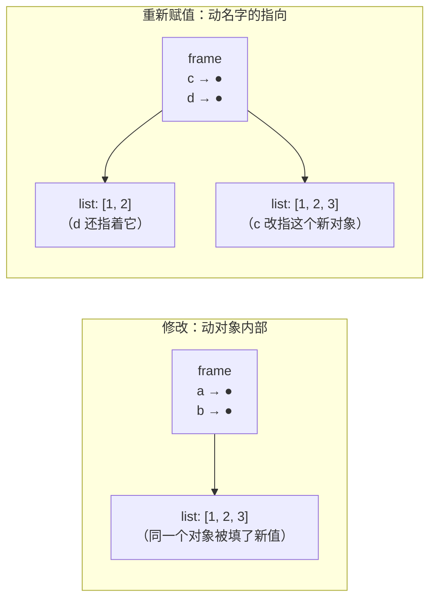

## 一、「会做」与「写对」之间的距离

- 这一篇对应官方 Lecture 17（Problem Solving）与 Lecture 18（Mutation）：前半段给出一套可复用的求解流程，后半段讲一处容易混淆的区分——**修改对象** 与 **重新赋值**。

综合练习的代码往往并不难懂。但面对一个空 docstring 时，写出来的实现常常边界漏一个、参数忘了缩小。

原因不是不会，而是**没有流程**。一上手就写代码，依赖灵感和记忆，灵感一断就难以继续。

这一篇先给流程，再给一个必须靠流程才能理清的语法点。

## 二、四步流程：不可跳步

| 步骤 | 做什么 | 作用 |
| --- | --- | --- |
| ① 列边界 | 空 / 单个 / 最小 / 极值，四类列清 | 边界漏写是最常见的错误来源 |
| ② 写 docstring 例子 | 先把「测试」写出来 | 例子就是验收标准 |
| ③ 手工推演最小例子 | 取最小的那组，在纸上推一遍 | 帮助发现逻辑漏洞 |
| ④ 写代码 | 照着 ①③ 的结论实现 | 写代码变成填空 |

**第 ③ 步最常被跳过，也最关键。** 手工推演一个最小例子只需一两分钟，却能省去后面更长时间的调试。

## 三、流程示范：`max_path_sum`

问题：求从根到每个叶子的路径上，节点标签之和的最大值。

**① 列边界**：叶子（不能再往下走）、空树（本例保证非空，暂不处理）。
**② 写例子**：`Tree(1, [Tree(2), Tree(3)])` 的两条路径是 `1+2=3`、`1+3=4`，答案是 `4`。
**③ 手工推演**：根节点自身不算完整路径，必须走到叶子才算——所以**只有叶子能作为出口**。
**④ 写代码**：

```python
class Tree:
    def __init__(self, label, branches=[]):
        self.label = label
        self.branches = list(branches)
    def is_leaf(self):
        return not self.branches

def max_path_sum(t):
    if t.is_leaf():
        return t.label                              # 边界先处理
    return t.label + max([max_path_sum(b) for b in t.branches])

t = Tree(1, [Tree(2, [Tree(4)]), Tree(3)])
print(max_path_sum(t))
```

输出：

```text
7
```

路径 `1+2+4=7` 与 `1+3=4`，取 `7`。

注意 `max([max_path_sum(b) for b in t.branches])` 里那个 `max`——**它要求 `branches` 非空**。所以开头那句 `if t.is_leaf()` 不是防御性冗余，是**让 `max` 不报错的前提**。这正是第 ① 步「列边界」带来的收益。



## 四、修改 vs 重新赋值

先看一段代码，猜猜输出：

```python
a = [1, 2]
b = a
a.append(3)
print(a, b)
print(a is b)

c = [1, 2]
d = c
c = c + [3]
print(c, d)
print(c is d)
```

输出：

```text
[1, 2, 3] [1, 2, 3]
True
[1, 2, 3] [1, 2]
False
```

对照结果非常有信息量：

| 写法 | 叫什么 | 改了什么 | 别的名字受影响吗 |
| --- | --- | --- | --- |
| `a.append(3)` | **修改**（mutation） | 列表对象**内部** | 受影响（`b` 也变） |
| `c = c + [3]` | **重新赋值**（reassignment） | 帧里**名字的指向** | 不受影响（`d` 不变） |

一行口诀：**`.append()` 打的是对象，`=` 打的是名字。**

环境图上两者长得完全不一样：



**判断速查**：问自己一句「**还有别的名字会跟着变吗？**」会，就是修改；不会，就是重新赋值。

## 五、`nonlocal`：让内层函数能改外层

「记账钱包」是 61A 的经典例子，先看会报错的写法：

```python
def make_withdraw_bad(balance):
    def withdraw(amount):
        balance = balance - amount      # 少了 nonlocal
        return balance
    return withdraw

w = make_withdraw_bad(100)
try:
    w(30)
except UnboundLocalError as e:
    print("报错类型：", type(e).__name__)
```

输出：

```text
报错类型： UnboundLocalError
```

原因是 Python 的一条规则：**函数体里只要对某个名字赋值，这个名字就是局部变量**。于是 `balance = balance - amount` 里右边的 `balance` 也被当成局部变量，而它此时还没被绑定——读不到，报错。

加上 `nonlocal` 就对了：

```python
def make_withdraw(balance):
    def withdraw(amount):
        nonlocal balance                 # 声明「balance 属于外层」
        balance = balance - amount
        return balance
    return withdraw

w = make_withdraw(100)
print(w(30))
print(w(30))
print(w(20))
```

输出：

```text
70
40
20
```

`nonlocal` 只能绑定**外层已经存在的**名字。外层没有，直接 `SyntaxError`，连跑都跑不起来。

## 六、同一个钱包，另一种写法

不用 `nonlocal`，改用**列表的修改**，同样能保存状态：

```python
def make_withdraw(balance):
    b = [balance]                        # 把余额装进列表
    def withdraw(amount):
        b[0] = b[0] - amount             # 改的是列表内部
        return b[0]
    return withdraw

w = make_withdraw(100)
print(w(30))
print(w(30))
print(w(20))
```

输出：

```text
70
40
20
```

行为一模一样，但**环境图完全不同**：

| 写法 | 环境图上的动作 | 要不要 `nonlocal` |
| --- | --- | --- |
| `nonlocal balance` | 每次 `withdraw` 帧里有一条**赋值箭头**指回 `f1` 的 `balance` | 要 |
| `b[0] = ...` | `b` 从头到尾指着**同一个列表对象**，只有格子里的数字在变 | 不要 |

第二种不需要 `nonlocal`，因为**它从来没有对 `b` 这个名字赋值**——它改的是 `b` 指着的那个列表内部。这又是「修改 vs 重新赋值」的一次应用。

最后确认一件事：每次调用 `make_withdraw` 都会造一个**新的 `balance`**：

```python
def make_withdraw(balance):
    def withdraw(amount):
        nonlocal balance
        balance = balance - amount
        return balance
    return withdraw

w1 = make_withdraw(100)
w2 = make_withdraw(100)
print(w1(30), w1(30), w2(30))
```

输出：

```text
70 40 70
```

`w1` 和 `w2` 各有自己的帧，各记各的账。

## 七、小结

| 概念 | 一句话 | 证据 |
| --- | --- | --- |
| 四步流程 | 列边界 → 写例子 → 手工推演 → 写代码 | 第 ③ 步最省时间 |
| 修改 | `.append()` 改对象内部 | `a.append(3)` 后 `b` 也变 |
| 重新赋值 | `=` 改名字指向 | `c = c + [3]` 后 `d` 不变 |
| 判据 | 「还有别的名字会跟着变吗」 | 会 → 修改 |
| `nonlocal` | 让内层能**重新赋值**外层变量 | 缺了 → `UnboundLocalError` |
| 列表代理 | 改 `b[0]` 不需要 `nonlocal` | 因为它没对 `b` 赋值 |
| 帧隔离 | 每次调用 `make_*` 造新状态 | `w1(30)` 不影响 `w2` |

三条能带走的：

1. **先列边界，再写代码。** 边界漏写是最常见的错误来源，`max_path_sum` 里那句 `is_leaf()` 就是列边界带来的收益。
2. **`.append()` 作用于对象，`=` 作用于名字。** 判断「别的名字会不会跟着变」，便能立刻分清修改与重新赋值。
3. **`nonlocal` 是「我要给外层的名字重新赋值」的声明。** 只改列表内部不需要它——这就是那个列表代理写法的全部要点。
