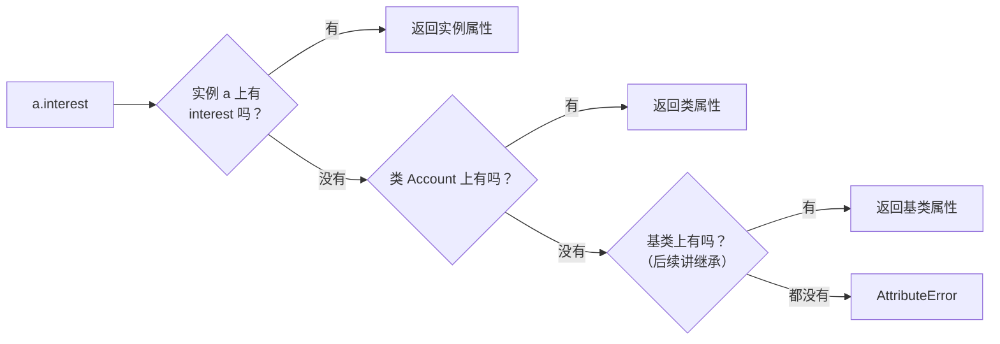

## 一、`a.interest = 0.05` 到底改了什么

- 这一篇对应官方 Lecture 19（Classes）与 Lecture 20（Attributes），换成**类**来组织数据与行为。

假设 `Account` 类上有 `interest = 0.02`，另有一个实例 `a`。执行：

```python
a.interest = 0.05
```

「改利率」听起来理所当然。但 `Account.interest` 仍是 `0.02`，其他实例也仍是 `0.02`。那个 `0.05` 究竟被存到了哪里？

答案是：**它新建了一个实例属性，把类属性挡住了**。这一招叫**遮蔽**（shadowing），是这一篇的核心陷阱。

## 二、类、实例与 `self`

```python
class Account:
    def __init__(self, holder):
        self.holder = holder
        self.balance = 0

    def deposit(self, amount):
        self.balance += amount
        return self.balance

a = Account('Jo')
print(a.deposit(20))
print(a.balance)
print(Account.deposit(a, 20))
print(a.balance)
```

输出：

```text
20
20
40
40
```

四行输出，讲了两件事：

- **`Account('Jo')` 触发实例化**，自动调用 `__init__`，`self` 就是新建的这个实例。`a.deposit(20)` 与 `Account.deposit(a, 20)` **完全等价**——`a.deposit` 是一个**绑定方法**：函数本身 + 已经绑好的 `self`。所以你写 `a.deposit(20)` 时，`self` 是被**自动补上**的。
- **`self.balance += amount` 里的 `self.` 不能省**。

第二条值得单独看：

```python
class Account:
    def __init__(self, holder):
        self.holder = holder
        self.balance = 0

    def broken_deposit(self, amount):
        balance = amount          # 只是局部变量，方法一结束就没了

    def real_deposit(self, amount):
        self.balance += amount    # 改的是实例上的属性

a = Account('Jo')
a.broken_deposit(50)
print("broken →", a.balance)
a.real_deposit(50)
print("real   →", a.balance)
```

输出：

```text
broken → 0
real   → 50
```

`balance = amount` 只是**在帧里建了个局部变量**，跟 `self.balance` 毫无关系，方法一返回就随帧消失。**不报错，但什么也没做**——这是 OOP 里最难自查的一类 bug，因为程序不会报错，只是静默失效。

还有一处对称的问题：定义方法时**漏写 `self` 形参**。

```python
class Bad:
    def deposit(amount):          # 漏了 self
        return amount

b = Bad()
try:
    b.deposit(10)
except TypeError:
    print("调用报错 → TypeError")
```

输出：

```text
调用报错 → TypeError
```

`b.deposit(10)` 实际会调成 `Bad.deposit(b, 10)`——**两个实参，形参只收一个**，于是 `TypeError`。掌握这条就能反推：报「多传了一个参数」，先怀疑漏写 `self`。

## 三、实例属性 vs 类属性

两者的区别只有一条，但后果很大：

| 属性写在哪 | 存在哪 | 谁共享 |
| --- | --- | --- |
| `__init__` 里 `self.x = ...` | **实例**上 | 只有这个实例 |
| 类体里 `x = ...` | **类**上 | 所有实例共享（除非被遮蔽） |

```python
class Account:
    interest = 0.02                    # 类属性：所有账户一个利率

    def __init__(self, holder, balance=0):
        self.holder = holder           # 实例属性：各账户不同
        self.balance = balance

a = Account('Jo')
b = Account('Yu')
print(a.interest, b.interest, Account.interest)
print(a.balance, b.balance)
print(a.balance is b.balance)
```

输出：

```text
0.02 0.02 0.02
0 0
True
```

最后一行是小整数驻留造成的 `True`，别当语义——真正要注意的是**类属性是共享的，实例属性是各自的**。

## 四、遮蔽：最容易出错的一步

```python
class Account:
    interest = 0.02

    def __init__(self, holder, balance=0):
        self.holder = holder
        self.balance = balance

a = Account('Jo')
print(a.interest, Account.interest)

a.interest = 0.04          # 通过实例赋值
print(a.interest, Account.interest)

b = Account('Yu')
print(b.interest)

print('interest' in a.__dict__, 'interest' in b.__dict__)
```

输出：

```text
0.02 0.02
0.04 0.02
0.02
True False
```

最后一行是铁证：`a` 的 `__dict__` 里**多了一个 `interest`**，而 `b` 里没有。`a.interest = 0.04` 并没有「改类的利率」，它只是**在实例上新建了一个同名属性**，从此查找时先命中它，类属性被挡住。

点表达式的查找顺序是：



**先在实例上找，找不到再往上找，第一个命中就停。** 这是本讲最重要的一句话；继承所做的，只是把这条链再延长一格。

想改所有实例共享的那个值，**必须通过类名**：

```python
class Account:
    interest = 0.02

a = Account()
print(a.interest)
Account.interest = 0.05          # 改的是类属性本身
print(a.interest)
```

输出：

```text
0.02
0.05
```

## 五、复合赋值的两处隐患

`a.interest += 0.01` 看起来只是「把利率加一点」。跑一遍：

```python
class Account:
    interest = 0.02

a = Account()
print(a.interest, Account.interest)

a.interest += 0.01        # 等价于 a.interest = a.interest + 0.01
print(a.interest, Account.interest)
```

输出：

```text
0.02 0.02
0.03 0.02
```

`+=` 是「**先读、再算、再写回**」，而「写回」是**对 `a.interest` 赋值**——根据第三节的规则，这就等于**在实例上创建了一个属性**。于是类属性又一次被遮蔽，而且这次是「不小心」发生的。

于是 `a` 从此跟别的实例分道扬镳：改 `Account.interest` 也影响不到它了。

**这种写法极易造成误判。** 看到 `实例.类属性 += ...` 时，先判断：它是要改类属性，还是要改这个实例？

## 六、小结

| 概念 | 一句话 | 证据 |
| --- | --- | --- |
| `a.f(x)` ≡ `A.f(a, x)` | `self` 自动补 | 两者输出都是 `40` |
| 漏写 `self` | 调用时多传一个实参 | `TypeError` |
| 漏写 `self.` | 只建了局部变量，静默失效 | `broken → 0` |
| 查找顺序 | 实例 → 类 → 基类，首个命中即停 | `a.__dict__` 里有 `interest` |
| 类属性共享 | 所有实例共用一份 | `Account.interest` 一改全变 |
| 遮蔽 | `a.x = v` 新建实例属性挡住类属性 | `a.interest` 变、`Account.interest` 不变 |
| 复合赋值 | `a.x += v` 会意外创建实例属性 | `a.interest` → `0.03` |

三条能带走的：

1. **`a.f(x)` 就是 `A.f(a, x)`。** 报「多传了一个参数」就查 `self`；报「属性不存在」就查 `self.` 是不是漏了。
2. **点查找：实例优先，逐级向上回退，首个命中即停。** 这是继承、`super()`、`__mro__` 的共同基础。
3. **通过实例赋值只会创建实例属性，永远不会改到类属性。** 想改共享值，必须写 `类名.属性 = ...`。
