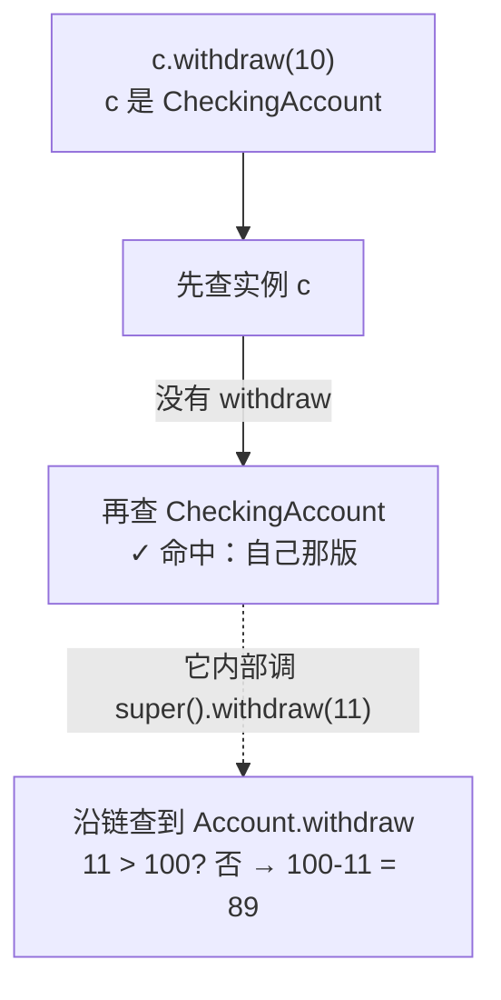

> 属性查找链停在「类」这一层；它还能继续往上——这就是**继承**。
> 这一篇对应官方 Lecture 21（Inheritance）与 Lecture 22（Lazy Evaluation）：
> 前半段把继承链打通，后半段换个方向，讲「**能不现在算，就先不算**」这个思路。

## 一、钩子：查找链还能往上爬

点查找的规则是「先在实例上找，找不到再往类上找」。如果子类上也没有呢？

**继续往上，到基类去找。** 继承做的事情，本质上就是**把那条查找链延长**。把这条链理解清楚，本篇一半的问题会自动消失。

## 二、继承链上的查找

```python
class Account:
    interest = 0.02

    def __init__(self, holder, balance=0):
        self.holder = holder
        self.balance = balance

    def withdraw(self, amount):
        if amount > self.balance:
            return 'Insufficient funds'
        self.balance -= amount
        return self.balance

class CheckingAccount(Account):
    withdraw_fee = 1
    interest = 0.01                 # 重写类属性

    def withdraw(self, amount):     # 重写方法
        return Account.withdraw(self, amount + self.withdraw_fee)

c = CheckingAccount('Yu', 100)
print(c.withdraw(10))
print(c.balance)
print(c.interest, Account.interest)
print(c.withdraw_fee)
```

输出：

```text
89
89
0.01 0.02
1
```

四行输出各讲一件事：

- `c.withdraw(10)` 扣了 `10 + 1` 手续费，余额 `100 - 11 = 89`。子类的 `withdraw` **重写**了基类的版本，`c` 查到的是子类那个。
- `c.interest` 是 `0.01`。子类上定义了 `interest`，查找链在**子类这一格就命中**，不再往上走——基类的 `0.02` 没变。
- `c.withdraw_fee` 走的是子类自己的类属性。

关键一行是重写里那句 `Account.withdraw(self, amount + self.withdraw_fee)`。**`self` 必须显式传**——因为这里是拿**类**去调用一个普通函数，没有绑定方法补上 `self`：

```python
class Account:
    def __init__(self, holder, balance=0):
        self.holder = holder
        self.balance = balance

    def withdraw(self, amount):
        if amount > self.balance:
            return 'Insufficient funds'
        self.balance -= amount
        return self.balance

class CheckingAccount(Account):
    withdraw_fee = 1

    def withdraw(self, amount):
        return super().withdraw(amount + self.withdraw_fee)   # 更现代的写法

c = CheckingAccount('Yu', 100)
print(c.withdraw(10), c.balance)
```

输出：

```text
89 89
```

`super().withdraw(...)` 与 `Account.withdraw(self, ...)` 在单继承里等价。**`super()` 的好处是「不用写死父类的名字」**——将来把 `CheckingAccount` 改成继承别的类，这一行不用动。



## 三、多态：调用方不知道也不关心

继承最实用的产出是**多态**——不同类的对象响应同一个方法名，调用方不用分支判断：

```python
class Account:
    def __init__(self, holder, balance=0):
        self.holder = holder
        self.balance = balance

    def withdraw(self, amount):
        if amount > self.balance:
            return 'Insufficient funds'
        self.balance -= amount
        return self.balance

class CheckingAccount(Account):
    withdraw_fee = 1

    def withdraw(self, amount):
        return Account.withdraw(self, amount + self.withdraw_fee)

def withdraw_all(accounts, amount):
    return [a.withdraw(amount) for a in accounts]

accts = [Account('Jo', 100), CheckingAccount('Yu', 100)]
print(withdraw_all(accts, 10))
print([a.balance for a in accts])
```

输出：

```text
[90, 89]
[90, 89]
```

`withdraw_all` 里**没有一行 `if isinstance(...)`**。它只知道「这些对象都有 `withdraw`」，各按各的规则扣钱。将来新增一类账户，`withdraw_all` 一个字都不用改——这就是「对扩展开放，对修改封闭」在 61A 里的样子。

## 四、转向：能不算，就先不算

前面都在讲「怎么把代码组织好」。后半段换个问题：**能不能让程序少干点活？**

先看反例：

```python
r = range(10**9)
print(len(r))
print(r[999999999])
print(3 in r)
```

输出：

```text
1000000000
999999999
True
```

`range(10**9)` **没有**真的造出十亿个数——它只记了「起点、终点、步长」。所以它占的内存是常数级的，`len` 和取值都是现算的。

对比来看：`[0] * 10**9` 才会真正构造列表，会直接占用数 GB 内存。

**及早求值**（eager）是「先把所有结果算出来」；**惰性求值**（lazy）是「用到第 `i` 个，才算第 `i` 个」。`range` 是后者。

## 五、迭代器协议

惰性求值要落地，靠的是**迭代器协议**：`iter()` 拿游标，`next()` 取下一个，取完了抛异常。

```python
s = iter([1, 2, 3])
print(next(s))
print(next(s))
print(next(s))
try:
    next(s)
except StopIteration:
    print("StopIteration")
```

输出：

```text
1
2
3
StopIteration
```

**`for` 循环内部就是这三行加一个 `try`**：不断 `next()`，捕获 `StopIteration` 后结束。这个循环从不需要手写，是因为语言已经代劳。

一个必须分清的区别：

```python
lst = [1, 2, 3]
print(iter(lst) is iter(lst))

it1, it2 = iter(lst), iter(lst)
print(next(it1), next(it1), next(it2))

try:
    next(lst)
except TypeError:
    print("列表本身不能 next()")
```

输出：

```text
False
1 2 1
列表本身不能 next()
```

| 概念 | 是什么 | 能 `for` 吗 | 能 `next()` 吗 |
| --- | --- | --- | --- |
| 可迭代对象 iterable | `list`、`str`、`dict`、`range` | 能 | **不能** |
| 迭代器 iterator | `iter(...)` 的返回值 | 能 | 能 |

- `iter(lst) is iter(lst)` 是 `False`：每次 `iter()` 都返回**新的独立游标**，所以 `it1` 和 `it2` 各走各的，`next(it1)` 走了两次、`next(it2)` 才第一次，得到 `1 2 1`。
- `next(lst)` 报 `TypeError`：**列表是可迭代对象，但不是迭代器**。要先用 `iter()` 把它变成迭代器。

**一句话判据：能喂给 `next()` 的才叫迭代器。**

## 六、迭代器是一次性的

这是最容易疏忽的一点：

```python
lst = [1, 2, 3]
it = iter(lst)
print(list(it))
print(list(it))
print(list(lst))
```

输出：

```text
[1, 2, 3]
[]
[1, 2, 3]
```

同一个迭代器**走过就走过了**，不能回头。第二次 `list(it)` 是空的——不是 bug，是它已经耗尽。

而 `list(lst)` 每次都能拿到完整内容，因为 `lst` 是可迭代对象，每次都会**新造一个游标**。

**判据：同一个迭代器不能重跑；想要重跑，就重新 `iter()` 一次。**

## 七、小结

| 概念 | 一句话 | 证据 |
| --- | --- | --- |
| 继承 | 把属性查找链延长到基类 | 子类没有的方法去基类找 |
| 重写 | 子类同名方法覆盖基类 | `c.withdraw` 扣手续费 |
| `super()` | 调父类实现，不写死父类名 | 与 `Account.withdraw(self, ...)` 等价 |
| 多态 | 同名方法、不同实现、调用方不分支 | `withdraw_all` 无 `isinstance` |
| 惰性求值 | 用到才算 | `range(10**9)` 不占内存 |
| iterable vs iterator | 后者能 `next()` | `next(lst)` → `TypeError` |
| 迭代器一次性 | 耗尽不能回头 | 第二次 `list(it)` → `[]` |

三条能带走的：

1. **继承 = 查找链延长。** 子类没有的去基类找，第一个命中就停——和点查找是同一套规则。
2. **重写要显式调父类：`super().m(...)`。** 别写死父类名字，也别忘传 `self`（用类名调时要手传）。
3. **能喂给 `next()` 的才是迭代器，迭代器走过不能回头。** 想重跑就重新 `iter()`。
