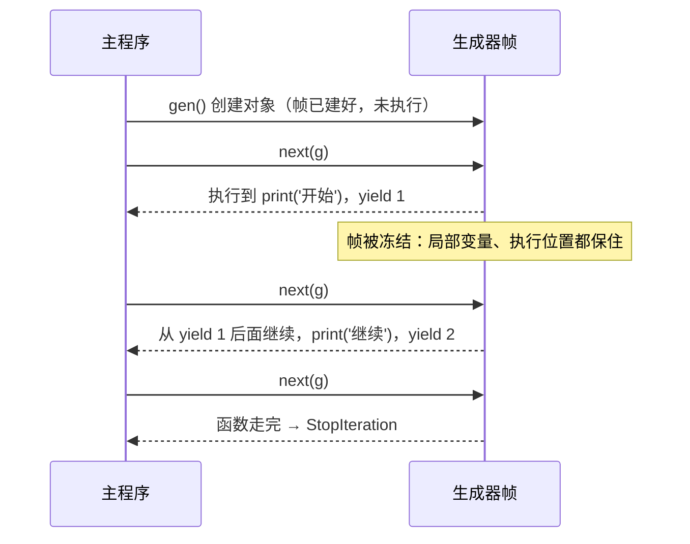

## 一、`evens(0)` 到底跑了几行

- 这一篇对应官方 Lecture 23（Generators）与 Lecture 24（Efficiency）：前半段用 `yield` 把「自己造迭代器」变成几行代码，后半段用 Big-O 给所有的算法**标价**。

```python
def evens(start):
    while True:
        yield start
        start += 2
```

这个函数里有个 `while True`——**死循环**。可是调用 `evens(0)` 之后，程序并没有停住。为什么？

因为**调用生成器函数，一行函数体都不会执行**。它只是返回一个「尚未启动的函数对象」。真正启动，要等到对它执行 `next()` 的时候。这一篇的核心就是这个区分。

## 二、生成器函数 vs 生成器对象

```python
def evens(start):
    while True:
        yield start
        start += 2

e = evens(0)
print(type(e).__name__)
print(next(e), next(e), next(e))
print(next(e))
```

输出：

```text
generator
0 2 4
6
```

| 概念 | 什么时候产生 | 里面跑了吗 |
| --- | --- | --- |
| 生成器**函数** | 写 `def` 的时候 | — |
| 生成器**对象** | 调用 `evens(0)` 时 | **没跑，一行都没有** |
| 执行 | 每次 `next()` 时 | 跑到下一个 `yield` 才停 |

**判据：只要没有 `next()` 也没有 `for`，函数体一行都没执行。** 这一条最能体现对生成器语义的掌握程度。

## 三、暂停与恢复：帧被保住了

看一个带打印的版本，能直接看见「什么时候才开始跑」：

```python
def gen():
    print('开始')
    yield 1
    print('继续')
    yield 2

g = gen()
print("刚创建完生成器")
print(next(g))
print(next(g))
try:
    next(g)
except StopIteration:
    print("耗尽")
```

输出：

```text
刚创建完生成器
开始
1
继续
2
耗尽
```

注意顺序：`g = gen()` 之后只有「刚创建完生成器」被打印，**「开始」是等到第一次 `next()` 才出现的**。



关键在 `yield` 处：**整个帧被原地冻结**——局部变量、执行到哪一行，全都留着。下次 `next()` 从断点继续。这跟普通函数「一返回帧就销毁」完全不同。

生成器**本身就是迭代器**：一次性、能 `for`、耗尽抛 `StopIteration`。

```python
def gen(n):
    for i in range(n):
        yield i * 2

g = gen(3)
print(list(g))
print(list(g))
print(list(gen(3)))
```

输出：

```text
[0, 2, 4]
[]
[0, 2, 4]
```

第二次 `list(g)` 是空的——**同一个生成器一次性，耗尽不能回头**。想重跑就重新 `gen(3)`，那是**另一个生成器**。

## 四、`yield from`：把子生成器平铺出来

写递归生成器时，`yield from` 能省掉一个手写循环：

```python
def countdown(n):
    if n > 0:
        yield n
        yield from countdown(n - 1)

print(list(countdown(3)))
```

输出：

```text
[3, 2, 1]
```

`yield from countdown(n - 1)` 的意思是「把子生成器产出的东西**逐个转出来**」。注意最后一行的形态：**`[3, 2, 1]` 是扁平的**，不是 `[3, [2, [1]]]`。多层 `yield from` 嵌套，最终产出永远是**一个平铺序列**——这一点在嵌套 `yield from` 时最容易被忽略。

## 五、给算法标价：Big-O

前面所有算法，现在都用**增长阶**标一次价。只看 n 变大时的主要项，忽略常数和低阶：

```text
O(1)  <  O(log n)  <  O(n)  <  O(n log n)  <  O(n²)  <  O(2ⁿ)
```

真正拉开差距的不是「谁快一倍」，而是**阶数不同**。同一行代码，换个容器就换一个量级：

| 写法 | 复杂度 | 原因 |
| --- | --- | --- |
| `x in lst` | `O(n)` | 逐个比，最坏扫完 |
| `x in st`（set） | 平均 `O(1)` | 一次哈希定位 |
| `d[k]`（dict） | 平均 `O(1)` | 同上 |
| `lst.insert(0, x)` | `O(n)` | 后面所有元素都要挪一格 |
| `lst.pop()`（尾部） | `O(1)` | 不用挪 |

```python
lst = [5, 2, 9]
st = {5, 2, 9}
print(3 in lst, 3 in st)
print(7 in lst, 7 in st)
```

输出：

```text
False False
False False
```

功能一样，代价差一个量级。**把循环里反复查的容器从 `list` 换成 `set`，往往是最便宜的一次提速。**

## 六、把指数级打回线性

回忆递归那篇的 `fib`，给它数一数调用次数：

```python
calls = 0

def fib(n):
    global calls
    calls += 1
    if n <= 1:
        return n
    return fib(n - 1) + fib(n - 2)

print(fib(15), "调用", calls)
```

输出：

```text
610 调用 1973
```

算个 `fib(15) = 610`，函数被调了 **1973 次**。`n` 只到 15 就快两千次——阶数约是 `φⁿ`，指数级。

加上记忆化（memoization）：

```python
memo = {}
calls = 0

def fib_memo(n):
    global calls
    calls += 1
    if n in memo:
        return memo[n]
    if n <= 1:
        result = n
    else:
        result = fib_memo(n - 1) + fib_memo(n - 2)
    memo[n] = result
    return result

print(fib_memo(15), "调用", calls)
```

输出：

```text
610 调用 29
```

同样的答案，调用次数从 **1973 掉到 29**——约等于 `2n - 1`。**重叠子问题一旦只算一次，指数就塌成线性。**

记忆化有个前提：**函数必须是纯的**。有副作用的函数（比如会打印、会改全局状态）缓存结果会出错——因为缓存把「第二次调用」直接掐掉了，副作用就不发生了。这一点会在函数式编程一篇中展开。

## 七、小结

| 概念 | 一句话 | 证据 |
| --- | --- | --- |
| 生成器函数 | 体里有 `yield` 就是 | `type(evens(0)).__name__` → `generator` |
| 调用 ≠ 执行 | 不 `next` 就一行不跑 | 先打印「刚创建完」，再打印「开始」 |
| 暂停恢复 | `yield` 处冻结整个帧 | 从断点继续，局部变量还在 |
| 一次性 | 耗尽不能回头 | 第二次 `list(g)` → `[]` |
| `yield from` | 平铺子生成器 | `list(countdown(3))` → `[3, 2, 1]` |
| 容器代价 | `list` 查是 `O(n)`，`set` 是 `O(1)` | 换容器换量级 |
| 记忆化 | 纯函数才能缓存 | `fib(15)` 调用 1973 → 29 |

三条能带走的：

1. **调用生成器函数不执行函数体。** 没 `next()`、没 `for`，里面一行都没跑——这一条能直接排除一类错误。
2. **`yield` 会冻结整个帧，所以生成器能保存状态。** 而且它一次性的，耗尽不能回头。
3. **先看阶数，再看常数。** 把循环里的 `list` 换成 `set`、给树递归加记忆化，这两招性价比最高。
