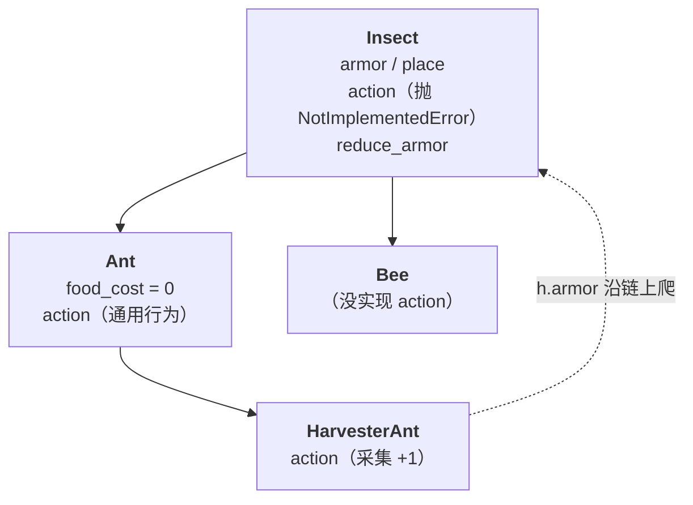
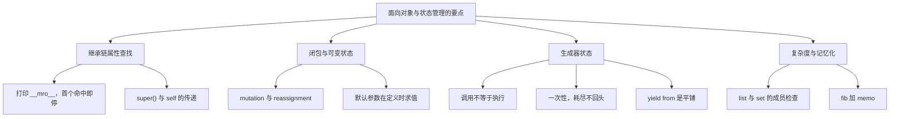

> OOP 的基础构件是：类、属性查找、继承、多态。
> 这一篇对应官方 Lecture 25（Object Examples），把这些构件组合成一个完整系统。
> 官方 Project 3 的塔防游戏就是从这里展开的。

## 一、钩子：新增一种蚂蚁，要不要改老代码

塔防游戏里已经有采集蚁、投掷蚁、忍者蚁……现在产品说要加一种「会挖地道的蚁」。

打开代码准备改动主循环，结果发现**一行都不用改**，只要新写一个子类。

这并非巧合，而是**模板方法模式**：基类把流程写死，子类只填其中变化的一步。这一篇就讲这个「多态在系统层面」的用法。

## 二、模板方法：基类定流程，子类填差异

```python
class Insect:
    def __init__(self, armor=2):
        self.armor = armor
        self.place = None

    def action(self, gamestate):
        raise NotImplementedError("子类必须实现 action")

    def reduce_armor(self, amount):
        self.armor -= amount
        return self.armor

class Ant(Insect):
    food_cost = 0

    def action(self, gamestate):
        return "ant acts"

class HarvesterAnt(Ant):
    def action(self, gamestate):
        gamestate["food"] += 1
        return gamestate["food"]

class Bee(Insect):
    pass

gs = {"food": 0}
h = HarvesterAnt()
print(h.action(gs))
print(h.action(gs))
print(Ant().action(gs))
print(h.armor)
h.reduce_armor(5)
print(h.armor)

try:
    Bee().action(gs)
except NotImplementedError:
    print("Bee 没实现 action → NotImplementedError")
```

输出：

```text
1
2
ant acts
2
-3
Bee 没实现 action → NotImplementedError
```

三段逻辑各自说明一层：

- **`NotImplementedError` 是「抽象方法」的简化做法**。基类把 `action` 声明出来，但故意不实现，强制子类提供实现。`Bee` 忘了写，一旦调用就报错——这是**有意为之**，好过静默执行一个错误的行为。
- **`HarvesterAnt` 只重写变化的那一步**。`armor`、`place`、`reduce_armor` 全部从 `Insect` 继承，一个字都不用重写。
- **`Ant` 与 `HarvesterAnt` 形成两层**。`h.action` 在 `HarvesterAnt` 命中，`h.armor` 一路爬到 `Insect` 才命中——查找链在这里被完整地走了一遍。



新增一种蚂蚁 = **加一个子类**，主循环、`gamestate`、伤害结算全都不用动。这就是「设计模式」在 61A 里的真实价值。

## 三、双向引用：最容易写出不一致状态的地方

`Insect` 有 `self.place`，`Place` 又有 `self.insects`——两边互相指着。这带来一个隐蔽的 bug 源：

| 动作 | 必须同时做两件事 | 漏一边的后果 |
| --- | --- | --- |
| 蚂蚁进场 | `insect.place = p` 且 `p.insects.append(insect)` | 蚂蚁知道自己在哪，战场里却没这只蚂蚁 |
| 蚂蚁离场 | 两边都清 | 战场里还留着这只蚂蚁，伤害还在结算 |

**只改一边，就会出现「在战场上但战场里没有它」这类幽灵状态。** 这类 bug 不会报错，只会让游戏行为异常——这一类项目中最常见的缺陷之一就在这里。

判断方法：**任何改变「谁在谁那儿」的操作，问一句「另一边同步了吗」。**

## 四、继承链上的属性查找

```python
class Account:
    interest = 0.02

class Savings(Account):
    interest = 0.03

class SuperSavings(Savings):
    pass

print(SuperSavings.interest)
print(Savings.interest)
print(Account.interest)
print([c.__name__ for c in SuperSavings.__mro__])
```

输出：

```text
0.03
0.03
0.02
['SuperSavings', 'Savings', 'Account', 'object']
```

`__mro__` 就是**查找顺序的那条链**。`SuperSavings` 自己没有 `interest`，往上第一格 `Savings` 有 `0.03`，命中即停，不再看 `Account`。**把 `__mro__` 打出来，继承链查找就从「推演」变成「读表」。**

## 五、默认参数在定义时求值

这是个非常隐蔽的问题，藏在 `__init__` 的默认参数里：

```python
class Account:
    interest = 0.02

class Savings(Account):
    interest = 0.03
    def __init__(self, holder, rate=interest):     # 定义时就把 rate 定死
        self.holder = holder
        self.rate = rate

s = Savings('Jo')
print(s.rate)
Savings.interest = 0.99        # 事后改类属性
print(s.rate)
print(Savings.interest)
```

输出：

```text
0.03
0.03
0.99
```

因为**默认参数在函数定义时求值一次**，`rate=interest` 当场就固定成 `0.03`。之后你把 `Savings.interest` 改成 `0.99`，`s.rate` 依然是 `0.03`。

**这与类属性遮蔽是两回事**：遮蔽是「查找时先命中实例」，这里是「值在定义时就被固定下来」。两条规则叠加时，最容易出问题。

## 六、闭包状态与生成器状态

```python
def counter():
    n = 0
    def tick():
        nonlocal n
        n += 1
        return n
    return tick

c1, c2 = counter(), counter()
print(c1(), c1(), c2())

def gen(n):
    for i in range(n):
        yield i * 2

print(list(gen(3)), list(gen(3)))
g = gen(3)
print(list(g), list(g))
```

输出：

```text
1 2 1
[0, 2, 4] [0, 2, 4]
[0, 2, 4] []
```

两组输出各对应一条规则：

- **`c1` 和 `c2` 各有独立帧**。`counter()` 每调一次造一份新的 `n`，所以 `c2()` 从头开始，得到 `1`。
- **`gen(3)` 调两次是生成器对象**，各能跑；而同一个 `g` 跑两遍，第二遍是空的（一次性耗尽）。

**判据：`counter()` / `gen(3)` 每调用一次 = 新状态；同一个对象重复用 = 复用旧状态。**

## 七、面向对象与状态管理的要点



四组需要掌握的内容：

1. **继承链上的属性遮蔽与方法覆盖**——先打印 `__mro__`，再逐层查找。
2. **`nonlocal` 与可变对象的环境图**——分清 mutation 与 reassignment。
3. **生成器的暂停与恢复**，含多层 `yield from`。
4. **复杂度分析**——判断 Big-O，并为指数级算法加记忆化。

**三处最容易出错的地方**：

- 这个属性是先在**实例**上找，还是先在**类**上找？（写 `a.x = v` 之前先判断清楚）
- 这个生成器是**刚创建**，还是**已经消耗过**？
- 这个默认参数是在**定义时**固定下来的，还是在**调用时**读取的？

## 八、小结

| 概念 | 一句话 | 证据 |
| --- | --- | --- |
| 模板方法 | 基类定流程，子类填差异 | 只重写 `action` |
| 抽象方法 | 基类抛 `NotImplementedError` | `Bee().action` 直接报错 |
| 双向引用 | 两边必须同步维护 | 否则出现幽灵状态 |
| `__mro__` | 查找顺序的那条链 | `['SuperSavings', 'Savings', 'Account', 'object']` |
| 默认参数 | 定义时求值一次 | 改类属性不影响 `rate` |
| 帧隔离 | 每次调用造新状态 | `c1(), c1(), c2()` → `1 2 1` |
| 生成器一次性 | 同一对象不能重跑 | `list(g), list(g)` → `[]` |

三条能带走的：

1. **新增功能优先加子类，而不是改基类。** 模板方法模式的价值就在于「不修改既有代码」。
2. **`__mro__` 是继承查找的可视化。** 推演受阻时直接打印出来，比在脑中逐层追溯可靠。
3. **三处容易忽视的机制：默认参数在定义时求值、生成器一次性、双向引用需同步维护。** 三者在出错时都不会抛异常，只会让行为变得难以解释。
