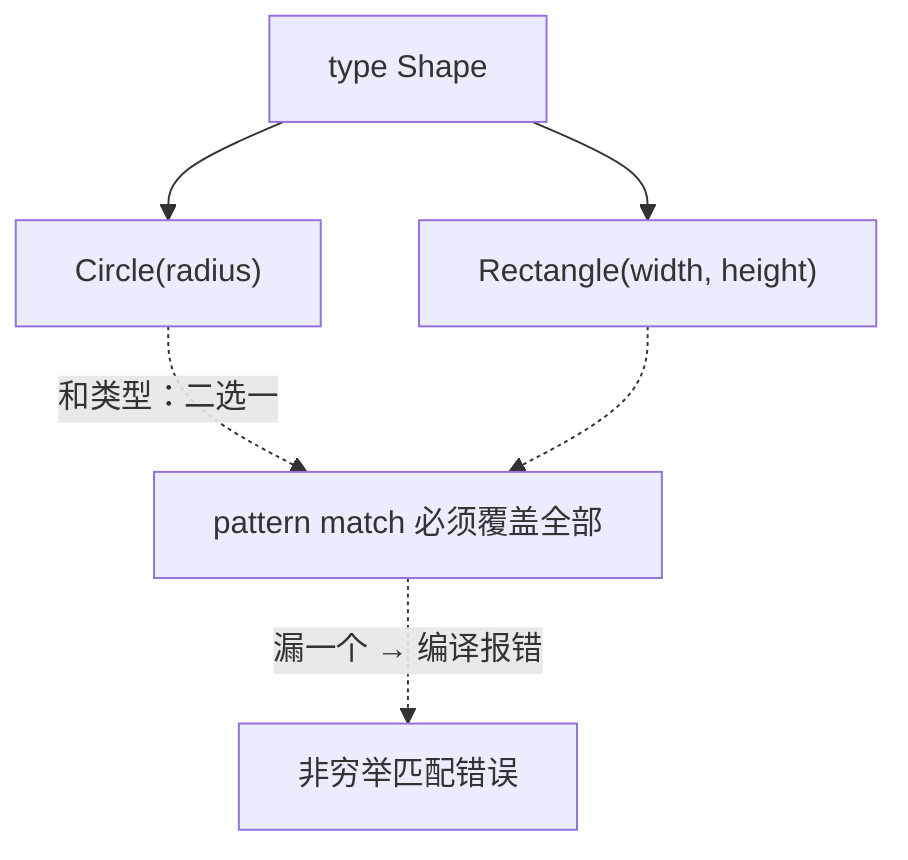

> CS61A 从这里开始**换语言**：改用 Gleam。
> 这一篇对应官方 Lecture 27（Functional Programming）与 Lecture 28（Algebraic Data Types）。
> Gleam 是一门真正的函数式语言——没有 `while`、变量默认不可变、类型在编译期就必须对。
>
> ⚠️ **取证说明**：本机没有 Gleam / Erlang 工具链（已实测确认），所以下面所有 **`gleam` 代码块都没有在本机编译运行过**；
> 但每一段概念都配了**实际运行验证过的 Python 等价实现**，输出是实测的。Gleam 片段请只当作语法样例阅读。

## 一、钩子：为什么还要再学一门语言

前面用 Python 写了几十个函数，不是挺好吗？

因为 Python 在许多方面是宽松的：变量可以随时重新绑定、类型错误要到运行时才暴露、函数里可以随意产生副作用。**这些宽松之处在小程序里是便利，在大系统里则是 bug 的温床。**

Gleam 把这三件事全部收紧：**不许改、类型先定、不许副作用**。代价是代码更冗长，回报是**编译器能挡掉一整类错误**。

## 二、纯函数：三个好性质

**纯函数**：同样输入永远给同样输出，且不碰外部世界。

```python
def square_pure(x):
    return x * x

print(square_pure(3))
print(square_pure(3))
```

输出：

```text
9
9
```

纯函数有三个免费赠品：

| 性质 | 为什么 |
| --- | --- |
| **可测** | 只关心输入输出，不用搭环境 |
| **可缓存** | 同样输入结果一样，算过一次就能复用 |
| **可并行** | 不碰共享状态，就没有竞争 |

「可缓存」这条能实测。给一个**有副作用**的函数加缓存，看它到底被调了几次：

```python
call_log = []

def impure(x):
    call_log.append(x)          # 副作用：记录了调用
    return x + 1

memo = {}

def cached(x):
    if x not in memo:
        memo[x] = impure(x)     # 只在没缓存时才真算
    return memo[x]

print(cached(3), cached(3), cached(5))
print("真正计算了：", call_log)
```

输出：

```text
4 4 6
真正计算了： [3, 5]
```

`cached(3)` 调了两次、`cached(5)` 一次，但 `impure` 只跑了 `[3, 5]`——**缓存的前提就是函数是纯的**。如果 `impure` 每次都得打印或写文件，缓存一开，副作用就没了，行为就变了。

**一句话：有副作用的函数不能随便缓存。** 这正是记忆化那条注意事项的由来。

## 三、Gleam 第一印象

```gleam
pub fn add_one(x: Int) -> Int {
  x + 1
}

pub fn apply_twice(f: fn(Int) -> Int, x: Int) -> Int {
  f(f(x))
}
```

（以下 Gleam 片段均未在本机编译验证。）

三处与 Python 截然不同的设计：

| 差异 | Python | Gleam |
| --- | --- | --- |
| 类型标注 | 可选，`x: int` | **必须**，`x: Int`，返回写 `-> Int` |
| 循环 | `while` / `for` | **没有**，只能递归 |
| 变量 | 随时重绑定 `x = x + 1` | 一旦绑定不能改 |

**没有 `while` 这件事冲击最大。** 所有遍历都得靠递归——所以递归不是练习题，而是**日常工具**。

类型签名写对了，编译器会一并把其余的错误挑出来。这就是静态类型的红利：**把错误从运行时提前到编译时**。

## 四、Gleam 的三处语法约束

```gleam
// ✓ Int 用普通运算符
// pub fn double(x: Int) -> Int { x * 2 }

// ✗ Float 必须用带点的运算符：*. 而不是 *
// pub fn area(r: Float) -> Float { 3.14159 *. r *. r }

// ✓ 字符串拼接用 <>
// pub fn greet(name: String) -> String { "Hello, " <> name }
```

| 约束 | 规则 |
| --- | --- |
| 运算符分族 | `+ - *` 只给 `Int`；浮点必须写 `+. -. *.` |
| 字符串拼接 | 用 `<>`，不是 `+` |
| 不可变 | `x = x + 1` 不是「改」，得换新名字或用递归 |

第三条最反直觉。在 Python 里 `x = x + 1` 是家常便饭，在 Gleam 里这等于「给一个已经有值的名字重新绑定」——**要么换名，要么改写成递归**。用 Python 解释一下这个差别：

```python
def count_up_imperative(n):
    """Python 风格：靠改变量。"""
    total = 0
    i = 1
    while i <= n:
        total += i
        i += 1
    return total

def count_up_recursive(n, acc=0):
    """函数式风格：靠递归传新值，从不改变量。"""
    if n == 0:
        return acc
    return count_up_recursive(n - 1, acc + n)

print(count_up_imperative(5))
print(count_up_recursive(5))
```

输出：

```text
15
15
```

两个版本结果一样。左边靠「改变量 + 循环」，右边靠「**递归 + 把新值当参数传下去**」。

**右边这种写法在 Gleam 里不是风格偏好，是唯一出路**——因为没有 `while`，也没有可变的 `total`。先把 Python 版的递归式子写熟，转到 Gleam 就是换套语法。

## 五、代数数据类型：积与和

Gleam 用**类型**来消灭「这个值可能不存在」这类隐式假设。两种基本组合方式：

| 名称 | 含义 | 例子 |
| --- | --- | --- |
| **积类型** | 字段的「**与**」 | `Rectangle(width, height)` —— 两个都要有 |
| **和类型** | 变体的「**或**」 | `Circle \| Rectangle` —— 只能是其中一种 |

```gleam
type Shape {
  Circle(radius: Float)
  Rectangle(width: Float, height: Float)
}

pub fn area(shape: Shape) -> Float {
  case shape {
    Circle(radius) -> 3.14159 *. radius *. radius
    Rectangle(width, height) -> width *. height
  }
}
```

（未在本机编译验证。）

Python 没有这种语法，同一个逻辑只能用「标签 + 分支」来模拟：

```python
def area(shape):
    kind = shape[0]
    if kind == 'circle':
        r = shape[1]
        return 3.14159 * r * r
    elif kind == 'rect':
        w, h = shape[1], shape[2]
        return w * h
    raise ValueError(f"unknown shape: {kind}")

print(round(area(('circle', 2)), 5))
print(area(('rect', 3, 4)))

try:
    area(('triangle', 1, 2, 3))
except ValueError as e:
    print("忘了处理一种变体：", e)
```

输出：

```text
12.56636
12
忘了处理一种变体： unknown shape: triangle
```

看出差距了吗？

- **Python 版把「有几种形状」写在 `if` 里**，编译器完全不知道，漏掉一种只会在运行时暴露。
- **Gleam 版把「有几种形状」写在 `type` 里**，`case` 必须覆盖全部变体——漏一个，**编译直接失败**。

这就是「**用类型消灭隐式假设**」。`Shape` 一旦多了一种 `Triangle`，所有 `case shape` 的地方都会被编译器点名提醒。这种保障在 Python 里只能靠自觉。



## 六、模式匹配与 `Result`

Gleam 用 `Result` 表示「可能失败的计算」，要求显式处理失败分支：

```gleam
pub fn safe_div(a: Int, b: Int) -> Result(Int, String) {
  case b {
    0 -> Error("division by zero")
    _ -> Ok(a / b)
  }
}
```

（未在本机编译验证。）

Python 里对应的是**异常**——但异常可以被无视，`Result` 不行：

```python
def safe_div(a, b):
    if b == 0:
        return ("error", "division by zero")
    return ("ok", a // b)

print(safe_div(10, 2))
print(safe_div(10, 0))

result = safe_div(10, 0)
if result[0] == "error":
    print("明确处理了错误：", result[1])
```

输出：

```text
('ok', 5)
('error', 'division by zero')
明确处理了错误： division by zero
```

区别在这里：

| 做法 | 能用 `try` 忽略吗 |
| --- | --- |
| Python 抛异常 | 能——不写 `try` 就会向外抛出（甚至可以完全不知情） |
| Gleam 返回 `Result` | **不能**——它是返回值，类型签名上写着，必须显式处理 |

**「可能失败」变成类型的一部分，就没法假装它不存在。** 这是静态类型最实用的一处价值，也和软件测试遥相呼应：**能靠类型挡住的问题，就别留给测试。**

## 七、小结

| 概念 | 一句话 | 取证状态 |
| --- | --- | --- |
| 纯函数 | 同输入同输出、无副作用 | 实测：`impure` 只跑了 `[3, 5]` |
| 可缓存 | 纯函数才能缓存 | 实测：两次 `cached(3)` 只算一次 |
| 无 `while` | 遍历只能递归 | 实测：Python 两版都得到 `15` |
| 运算符分族 | 浮点必须 `+.` `*.` `-.` | ⚠️ 未编译验证 |
| 和类型 | `Circle \| Rectangle` 二选一 | ⚠️ 未编译验证 |
| 穷举匹配 | `case` 漏变体即编译失败 | 实测对照：Python 版运行时才报错 |

三条能带走的：

1. **纯函数是「可缓存」的前提。** 有副作用还上缓存，行为就变了——这是记忆化的隐藏前提。
2. **没有 `while`，所以递归是日常工具。** 先把「递归 + 累加器传新值」写熟，转 Gleam 只是换语法。
3. **代数数据类型的价值是「让编译器知道有几种可能」。** 漏掉一种变体，Python 要到运行时才报错，Gleam 在编译期即报错。
