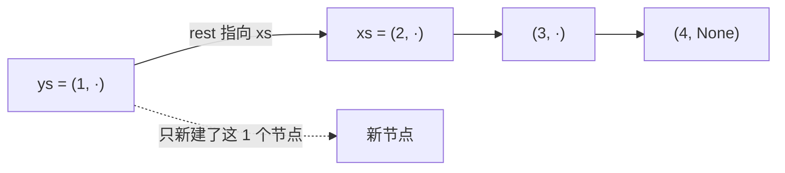
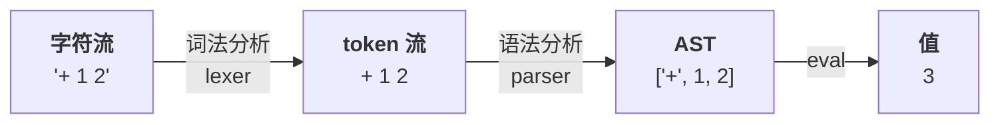
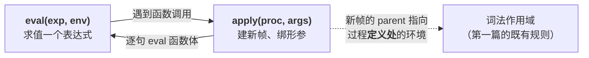

> Gleam 不能改变量、也没有 `while`。那「给列表加个元素」这种事怎么做？
> 这一篇对应官方 Lecture 29（Immutable Data）与 Lecture 30（Interpreters）：
> 前半段回答「数据不能改，那怎么用」，后半段回答一个更大的问题——**计算机是怎么读懂并运行一段代码的**。
>
> ⚠️ Gleam 片段本机无工具链、**未编译验证**；Python 部分全部实测。

## 一、钩子：不能改，那怎么加元素

在 Python 里添加元素非常自然：`xs.append(1)`。而不可变世界里没有 `append`——**只能构造一个新的**。

那岂不是每次加元素都要把整个列表复制一遍？不然。答案叫**结构共享**：新列表直接**复用**旧列表的尾巴，只新建一个节点。

## 二、不可变列表与结构共享

用一个「头 + 尾」的二元组模拟不可变链表（Gleam 的 `List` 就是这么存的）：

```python
def to_list(pair):
    out = []
    while pair is not None:
        out.append(pair[0])
        pair = pair[1]
    return out

xs = (2, (3, (4, None)))     # 不可变链表：first + rest
ys = (1, xs)                 # 头部插入：rest 直接指向 xs

print(to_list(xs))
print(to_list(ys))
print("ys 的尾巴就是 xs 本身：", ys[1] is xs)
print("xs 有没有被改？", to_list(xs))
```

输出：

```text
[2, 3, 4]
[1, 2, 3, 4]
ys 的尾巴就是 xs 本身： True
xs 有没有被改？ [2, 3, 4]
```

`ys[1] is xs` 为 `True`——**新列表的尾巴就是旧列表那个对象本身**，一个元素都没复制。`xs` 也毫发无伤。



| 操作 | 代价 | 原因 |
| --- | --- | --- |
| 头部插入 `[1, ..xs]` | `O(1)` | 只新建一个节点，尾巴复用 |
| 尾部追加 `[..xs, x]` | `O(n)` | 得沿链复制到尾 |

**这就是「不可变」没有想象中贵的原因**：常用操作是头部插入，而它对结构共享友好。

## 三、递归代替循环

没有 `while`，遍历就只能递归。而递归时用**模式匹配**拆头拆尾最自然：

```gleam
pub fn sum_list(items: List(Int)) -> Int {
  case items {
    [] -> 0
    [first, ..rest] -> first + sum_list(rest)
  }
}
```

（未在本机编译验证。）

`[]` 匹配空表，`[first, ..rest]` 拆出头和尾。Python 版的等价写法就是「靠递归传新值」：

```python
def sum_list(items):
    if not items:
        return 0
    first, rest = items[0], items[1:]
    return first + sum_list(rest)

print(sum_list([1, 2, 3, 4]))
print(sum_list([]))
```

输出：

```text
10
0
```

**注意 `[] -> ...` 这个分支不能漏。** Gleam 的穷举检查会因此直接报编译错——这算是额外的安全网。但**逻辑上该停在哪**（比如规模缩到什么程度）仍然得自己想清楚，编译器不管这个。

## 四、尾递归：调用是不是在最后一个位置

上面那个 `sum_list` 有个问题：`first + sum_list(rest)` 里的递归调用**还要参与一次加法**，所以它**不在尾位置**。

正确的尾递归写法要把中间结果**当参数传下去**：

```gleam
pub fn sum_list(items: List(Int)) -> Int {
  sum_acc(items, 0)
}

fn sum_acc(items: List(Int), acc: Int) -> Int {
  case items {
    [] -> acc
    [first, ..rest] -> sum_acc(rest, acc + first)   // 尾位置，可优化成循环
  }
}
```

（未在本机编译验证。）

**判据一句话：递归调用是不是出现在函数体的最后一个位置？** 是，就是尾调用，可以被优化成循环（TCO），不堆栈；不是，就会一层层堆帧。

用 Python 数一数栈深，能直观看到「规模变大、栈就越深」：

```python
max_depth = 0
depth = 0

def sum_non_tail(items):
    global depth, max_depth
    depth += 1
    max_depth = max(max_depth, depth)
    if not items:
        depth -= 1
        return 0
    result = items[0] + sum_non_tail(items[1:])
    depth -= 1
    return result

print(sum_non_tail([1, 2, 3, 4]))
print("最大栈深 =", max_depth)
```

输出：

```text
10
最大栈深 = 5
```

四个元素，栈最深 5 层——**递归深度跟着列表长度涨**。

**需要说清的一点**：CPython **完全不**做尾调用优化，所以在本机上 `sum_acc` 的栈深**一样**是 5，无法用 Python 演示「尾递归不涨栈」。这个差别要到 Gleam / Erlang 上才体现为「长列表会不会耗尽调用栈」。**这里只讲判据，不做实测结论。**

## 五、解释器：REPL 就是一个环

现在换话题。前面所有代码都是「Python 解释器」在跑。那解释器**自己**是怎么工作的？

先明确一个概念：**REPL**。

| 字母 | 做什么 |
| --- | --- |
| **R**ead | 读入一串字符 |
| **E**val | 求值 |
| **P**rint | 打印结果 |
| **L**oop | 回到开头 |

字符串怎么变成可求值的东西？中间要过两道关：



**AST（抽象语法树）就是一棵嵌套的列表。** `['+', 1, ['*', 2, 3]]` 本身就是一棵树：根是 `+`，右子树是 `*`。

这里有一处极易混淆的地方：**AST 是「数据」，不是「结果」**。

```python
print(['+', 1, 2])
print(3)
print(type(['+', 1, 2]).__name__)
```

输出：

```text
['+', 1, 2]
3
list
```

`['+', 1, 2]` 是**一棵树的表示**，`3` 才是**求值结果**。混淆这两者，是所有解释器问题的总源头。

## 六、Eval / Apply：两条咬在一起的环

一个最小的计算器解释器，代码短得出人意料：

```python
def calc_eval(exp):
    if isinstance(exp, (int, float)):
        return exp
    elif exp[0] == '+':
        return calc_eval(exp[1]) + calc_eval(exp[2])
    elif exp[0] == '*':
        return calc_eval(exp[1]) * calc_eval(exp[2])
    raise ValueError(f"unknown operator: {exp[0]}")

print(calc_eval(['+', 1, ['*', 2, 3]]))
print(calc_eval(['*', ['+', 1, 2], ['+', 3, 4]]))
```

输出：

```text
7
21
```

`['+', 1, ['*', 2, 3]]` 先算右子树的 `6`，再加 `1`，得 `7`。**`calc_eval` 对自己递归，就是在遍历那棵树。**

真正有变量的解释器要引入**环境**（就是第一篇那个环境图里的帧）：

```python
def make_env(parent=None):
    return {'bindings': {}, 'parent': parent}

def lookup(env, name):
    while env is not None:
        if name in env['bindings']:
            return env['bindings'][name]
        env = env['parent']            # 往上爬
    raise NameError(name)

def calc_eval(exp, env):
    if isinstance(exp, (int, float)):
        return exp
    if isinstance(exp, str):           # 变量 → 查环境
        return lookup(env, exp)
    if exp[0] == 'define':             # 定义 → 写进环境
        env['bindings'][exp[1]] = calc_eval(exp[2], env)
        return exp[1]
    op = exp[0]
    args = [calc_eval(a, env) for a in exp[1:]]
    if op == '+':
        return sum(args)
    if op == '*':
        r = 1
        for a in args:
            r *= a
        return r
    raise ValueError(op)

env = make_env()
calc_eval(['define', 'x', 10], env)
calc_eval(['define', 'y', ['*', 'x', 2]], env)
print(calc_eval(['+', 'x', 'y'], env))
```

输出：

```text
30
```

**这段代码真的在跑一个解释器**：`x` 存进环境，`y` 在定义时就求出了 `20`，最后 `x + y` 查到两个值算出 `30`。这里的 `lookup` 往上爬 `parent`，跟第一篇讲的作用域查找是**完全同一套东西**。

完整的解释器把这件事拆成两条环：



两条环**互相咬住**：`eval` 里遇到函数调用就转 `apply`，`apply` 建好帧又回头 `eval` 函数体。**递归深度 = 程序的嵌套深度。**

而且注意 `apply` 建帧时那个箭头的方向：新帧的 `parent` 指向**过程定义处**的环境，不是调用处。**这就是第一篇讲过的词法作用域**，到这里变成了解释器的一条实现规则。一通百通。

## 七、小结

| 概念 | 一句话 | 取证状态 |
| --- | --- | --- |
| 结构共享 | 头部插入只新建一个节点 | 实测：`ys[1] is xs` → `True` |
| 不可变代价 | 头插 `O(1)`、尾加 `O(n)` | 实测：`xs` 没被改 |
| 递归遍历 | 没 `while`，拆头拆尾 | 实测：`sum_list` → `10` |
| 尾递归判据 | 调用在函数体最后一个位置 | 实测栈深随长度涨；**TCO 未实测** |
| AST 是数据 | `['+', 1, 2]` ≠ `3` | 实测：`type` 是 `list` |
| eval 递归 | 对树的子节点递归就是求值 | 实测：`calc_eval` → `7` |
| apply 建帧 | `parent` 指**定义处** | 实测：小解释器算出 `30` |

三条能带走的：

1. **不可变不等于慢。** 头部插入只新建一个节点，尾巴直接复用旧列表——这叫结构共享。
2. **尾递归的判据只问一句：调用是不是函数体最后一个动作。** 不是，就会占用调用栈；Gleam/Erlang 会做尾调用优化，CPython 不会。
3. **AST 是数据，求值结果才是值。** 解释器就是「对一棵树递归」；而 `apply` 建帧时 `parent` 指向定义处，这是第一篇词法作用域的直接回响。
