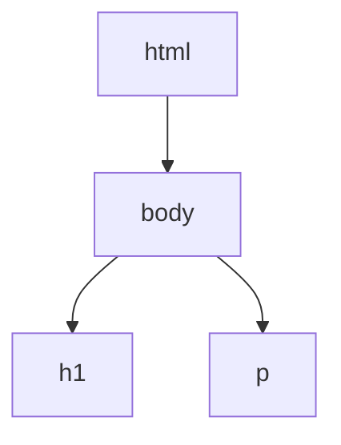
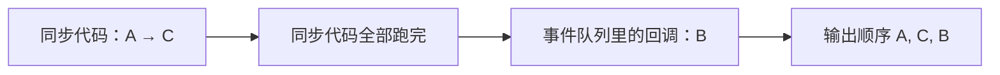

> 这一篇往两头各走一步：
> 往上是**让 AI 来写程序**（Lecture 31 · Coding Agents），往下是**程序跑在浏览器里**（Lecture 32 · Browsers）。
> 两件事看起来无关，实际共用一句话——**循环 + 客观判据**。

## 一、钩子：智能体的循环里，真正关键的是哪一环

「AI 写代码」听起来玄，拆开看就是一个循环：

> 提要求 → 生成代码 → **跑测试** → 看报错 → 改 → 再跑

这个循环里，四个环节有三个都由模型完成。**唯一一个不依赖模型自身判断的环节是运行测试。**

如果没有它，模型就只能依据自身判断修改代码，缺少外部校验。所以这一篇的第一句结论是：**智能体的能力上限，取决于它是否拥有一个外部的客观判据。**

## 二、智能体循环：本质是拿反馈收敛

先把「运行测试」这一环单独取出，写一个**简化版**的循环，观察它的运行过程（下面这个不是 LLM，只是一个收敛过程，但结构完全一样）：

```python
def agent_loop(target, lo=0, hi=100, max_steps=10):
    """每轮拿一次『测量反馈』，据此缩小范围，直到命中。"""
    log = []
    for step in range(1, max_steps + 1):
        guess = (lo + hi) // 2
        value = guess * guess
        log.append((step, guess, value))
        if value == target:
            return guess, log, "通过"
        if value < target:
            lo = guess + 1        # 反馈说「小了」
        else:
            hi = guess - 1        # 反馈说「大了」
    return None, log, "用尽步数"

ans, log, status = agent_loop(49)
for step, g, v in log:
    print(f"第 {step} 轮：猜 {g} → 测量 {v}")
print("结果：", ans, status)
```

输出：

```text
第 1 轮：猜 50 → 测量 2500
第 2 轮：猜 24 → 测量 576
第 3 轮：猜 11 → 测量 121
第 4 轮：猜 5 → 测量 25
第 5 轮：猜 8 → 测量 64
第 6 轮：猜 6 → 测量 36
第 7 轮：猜 7 → 测量 49
结果： 7 通过
```

七轮收敛。每轮只做两件事：**拿一次反馈**，**据此调整**。真实的编码智能体也是这个骨架，只是「猜」换成了模型生成代码，「测量」换成了跑测试：

```text
goal = "让所有 doctest 通过"
loop:
    code   = model(prompt + 当前代码 + 上次报错)
    result = run_tests(code)              # doctest / unittest
    if result.ok: 结束
    else: 把失败信息写回 prompt，继续
```

**关键点仍然是那一句：循环里必须有一个外部的客观判据（测试/断言），否则模型只能依据自身判断修改。**

## 三、智能体的边界：看起来正确的代码

AI 生成的代码最常见的失败模式不是「语法错」——那些一运行就会暴露。**而是边界错**：空列表、`None`、越界、除零。代码读起来完全通顺，运行到极端输入时却会失败。

```python
def average_naive(nums):
    return sum(nums) / len(nums)        # AI 常写的版本

print(average_naive([1, 2, 3]))
try:
    average_naive([])
except ZeroDivisionError:
    print("空列表 → ZeroDivisionError")
```

输出：

```text
2.0
空列表 → ZeroDivisionError
```

所以要**用测试去约束它**，而不是依赖它的自我评估：

```python
def average(nums):
    """求平均值。

    >>> average([1, 2, 3])
    2.0
    >>> average([5])
    5.0
    """
    if not nums:
        raise ValueError("empty sequence")
    return sum(nums) / len(nums)

print(average([1, 2, 3]))
try:
    average([])
except ValueError as e:
    print("明确的错误：", e)
```

输出：

```text
2.0
明确的错误： empty sequence
```

**把 docstring 里的例子当合同，让 AI 去满足它**——这就是 Lecture 37「软件测试」那一讲会展开的做法。此外，本系列的工具箱在这里全部用上了：环境图（L5）看代码怎么执行、复杂度（L24）判断效率、测试（L37）判断正确性。

## 四、换到浏览器：DOM 也是一棵树

网页的结构，浏览器解析 HTML 后得到的就是一棵**树**：



**这跟 Lecture 15 的 `Tree` 完全同构**，只是 `branches` 换名叫 `children`。所以之前写的聚合函数，一个字不用改就能用：

```python
dom = ("html", [
    ("body", [
        ("h1", []),
        ("p", []),
    ]),
])

def count_nodes(node):
    label, children = node
    return 1 + sum(count_nodes(c) for c in children)

def depth(node):
    label, children = node
    if not children:
        return 0
    return 1 + max(depth(c) for c in children)

print("DOM 节点数：", count_nodes(dom))
print("DOM 深度：", depth(dom))
```

输出：

```text
DOM 节点数： 4
DOM 深度： 2
```

`count_nodes` 与 `depth` 跟树那一讲的写法**一模一样**。这不是巧合——**树是前端最基础的数据结构**，HTML、组件树、状态树，全都长这样。

## 五、同步与异步：`setTimeout(f, 0)` 不是「立刻」

浏览器里最反直觉的一件事。先看代码（下面这段用本机 Node.js 22 实测跑过）：

```javascript
console.log("A");
setTimeout(() => console.log("B"), 0);
console.log("C");
```

输出：

```text
A
C
B
```

延迟写的是 `0` 毫秒，`B` 却**最后**才打印。为什么？

因为 `setTimeout` 不是「等 0 毫秒后执行」，而是「**把回调排进事件队列，等当前所有同步代码跑完之后再执行**」。`console.log("A")` 和 `console.log("C")` 是同步的，先跑完；`B` 排在队尾。



| 概念 | 含义 | 典型 |
| --- | --- | --- |
| 同步 | 一行跑完才到下一行 | `console.log` |
| 异步 | 先排进队列，主线程空出来再跑 | `setTimeout`、网络请求 |

**判据一句话：延迟为 0 也只保证「排到最后」，不保证「最快」。**

## 六、两条线本质相同

回头把两半连起来看：

| | 编码智能体 | 浏览器 |
| --- | --- | --- |
| 循环结构 | 生成 → 测 → 改 → 再测 | 同步代码跑完 → 从事件队列取下一个 |
| 关键约束 | 外部客观判据（测试） | 事件循环的先后次序 |
| 共同点 | **都靠一个循环 + 一个明确的就是否判据在推进** | 同左 |

前端也有为「跑起来之前就把一类错消掉」而生的东西——**TypeScript 的静态类型**：

```typescript
interface TreeNode {
  label: string;
  children: TreeNode[];
}

function countNodes(node: TreeNode): number {
  return 1 + node.children.reduce((sum, c) => sum + countNodes(c), 0);
}
```

（本机无 `tsc`，**未编译验证**。逻辑与上面那个 Python 版 `count_nodes` 完全一致。）

TypeScript 和 Gleam 都在编译期挡错，但有区别：

| | TypeScript | Gleam |
| --- | --- | --- |
| 类型系统 | 结构类型 | 名义类型 |
| 运行时 | 类型被**擦除**，跑的是 JS | 编译到强类型目标（Erlang/JS） |
| 挡错时机 | 编译期 | 编译期 |

**TS 的类型只活在编译期**——编译出来的 JS 里没有类型信息，运行时靠的还是动态检查。这一点在调试时很关键：类型通过之后，运行时仍可能失败。

## 七、小结

| 概念 | 一句话 | 取证状态 |
| --- | --- | --- |
| 智能体循环 | 生成 → 测 → 按反馈改 | 实测：简化循环 7 轮收敛 |
| 关键环节 | 必须有外部客观判据 | 实测：`average_naive([])` 报错 |
| 边界错 | AI 代码读起来对、边界常错 | 实测：空列表 → `ZeroDivisionError` |
| DOM 即树 | `children` 版 `branches` | 实测：节点数 4、深度 2 |
| 事件循环 | 延迟 0 也排到最后 | node 22 实测：`A C B` |
| TS vs Gleam | 结构类型 + 擦除 vs 名义类型 | ⚠️ TS 片段未编译验证 |

三条能带走的：

1. **智能体的价值在于循环里的「运行测试」那一环。** 没有客观判据，模型只能自我评估；用 docstring 例子当合同，远比让它自我评估可靠。
2. **DOM 就是 Tree。** 树那一讲的聚合函数原封不动可用——前端最基础的数据结构就是树。
3. **`setTimeout(f, 0)` 只保证「排到最后」。** 同步代码不清空，队列里的回调永远轮不上。
