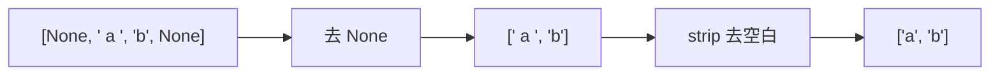

## 一、同一件事，两种说法

- 这一篇对应官方 Lecture 33（Applications）与 Lecture 34（Tables）：前半段看函数式编程怎么把「一串转换」拼成流水线，后半段换上**第四种范式**——**声明式**：只说「需要什么结果」，不说「怎么一步步算」。
- 本机有 Python 标准库的 `sqlite3`，所以下面所有 SQL 都是**真跑**的。

给三个城市，选出位于加州的两个。命令式思维会这样展开：

> 遍历列表 → 逐个判断 `state == 'CA'` → 通过就放进结果

而 SQL 只写一句：`select name from cities where state = 'CA'`。

**没有循环、没有变量、没有「先做什么再做什么」**。这就是**声明式**。这一篇的重点就是把这两种思维钉在一起对照，因为这是初学者最难过的一道门槛。

## 二、函数式的水管：`pipeline`

函数式的思路是「把一串转换接成水管」：

```python
def pipeline(*fns):
    def run(x):
        for f in fns:
            x = f(x)          # 上一个的输出 = 下一个的输入
        return x
    return run

clean = pipeline(
    lambda xs: [x for x in xs if x is not None],       # 第 1 步：去空
    lambda xs: [str(x).strip() for x in xs],           # 第 2 步：去空白
)

print(clean([None, ' a ', 'b', None]))
```

输出：

```text
['a', 'b']
```

**`pipeline` 自己不知道任何业务逻辑**，它只负责「把上一个函数的输出喂给下一个」。要加一步、减一步，改的都是外面那串 `lambda`，`pipeline` 一个字不动。



数据流水线的三个动作，本质上就是这一句话：

| 动作 | 做什么 | Python |
| --- | --- | --- |
| map | 每个元素都变一下 | 推导式 / `map` |
| filter | 筛出一部分 | 推导式带 `if` |
| fold | 压成一个值 | `sum` / 自己写循环 |

## 三、把规则写成数据：迷你 DSL

把「解释器」这个抽象落到实际系统里，就是**DSL（领域特定语言）**：把**规则存成数据**，把**执行**写成一个小 `eval`。

```python
def run_rule(rule, row):
    """rule 是 ('操作符', '列名', 阈值) 这样的数据。"""
    op, col, value = rule
    if op == '==':
        return row[col] == value
    if op == '>':
        return row[col] > value
    raise ValueError(f"unknown op: {op}")

rows = [
    {'name': 'Jo', 'gpa': 3.9},
    {'name': 'Yu', 'gpa': 3.2},
]

rules = [('>', 'gpa', 3.5)]
print([r['name'] for r in rows if all(run_rule(ru, r) for ru in rules)])

rules = [('==', 'name', 'Yu')]
print([r['name'] for r in rows if all(run_rule(ru, r) for ru in rules)])
```

输出：

```text
['Jo']
['Yu']
```

注意 `rules` 是什么——**它只是一个列表，装着一堆元组**。换一组规则不用改 `run_rule` 一行代码，因为它压根不知道规则内容，它只是「按规则查表」。

**配置引擎、查询语言、风控规则引擎，都属于同一个思路。** 规则存入数据库或配置中心，执行逻辑只写一次。这也是「越来越会描述自己」那条演化线的终点。

## 四、换范式：声明式

现在换到表格的世界。SQL 的核心只有一件事：**描述所需要的结果**。

用 Python 的 `sqlite3` 开一个内存数据库：

```python
from sqlite3 import connect

c = connect(':memory:').cursor()
c.execute('create table cities (name text, state text)')
for n, s in [('Berkeley', 'CA'), ('Boston', 'MA'), ('San Jose', 'CA')]:
    c.execute('insert into cities values (?, ?)', (n, s))

print("SQL   :", sorted(c.execute("select name from cities where state = 'CA'").fetchall()))

rows = c.execute('select name, state from cities').fetchall()
result = []
for name, state in rows:
    if state == 'CA':
        result.append((name,))
print("Python:", sorted(result))
```

输出：

```text
SQL   : [('Berkeley',), ('San Jose',)]
Python: [('Berkeley',), ('San Jose',)]
```

同一个结果，两条完全不同的路：

| | SQL（声明式） | Python（命令式） |
| --- | --- | --- |
| 表达内容 | **要什么** | **怎么算** |
| 有循环吗 | 没有 | 有 |
| 有中间变量吗 | 没有 | 有 `rows`、`result`、`state` |
| 优化由谁完成 | 数据库自己决定 | 使用者自己 |

两边都用了 `sorted(...)`，这一步不是多余的——下面说明原因。

## 五、SQL 查的是集合，不保证顺序

`select` 回来的**是一堆行，不是一个有序列表**。不加 `ORDER BY`，顺序就是实现细节，换个数据库版本就可能变。

```python
from sqlite3 import connect

c = connect(':memory:').cursor()
c.execute('create table cities (name text, state text)')
for n, s in [('Berkeley', 'CA'), ('Boston', 'MA'), ('San Jose', 'CA')]:
    c.execute('insert into cities values (?, ?)', (n, s))

print("不排序:", c.execute('select name from cities').fetchall())
print("排序后:", c.execute('select name from cities order by name').fetchall())
```

输出：

```text
不排序: [('Berkeley',), ('Boston',), ('San Jose',)]
排序后: [('Berkeley',), ('Boston',), ('San Jose',)]
```

这里两条刚好一样（数据少、插入顺序恰好相同），**但这不代表 SQL 保证顺序**。要顺序，就必须显式写 `ORDER BY`——当成契约写在查询里，而不是指望数据库心情好。

还有个小细节：`execute` 回来的**是一个迭代器**（`iterator`）。

```python
from sqlite3 import connect

c = connect(':memory:').cursor()
c.execute('create table cities (name text, state text)')
for n, s in [('Berkeley', 'CA'), ('Boston', 'MA')]:
    c.execute('insert into cities values (?, ?)', (n, s))

cur = c.execute('select name from cities')
print("类型:", type(cur).__name__)
print(next(cur))
print(next(cur))
```

输出：

```text
类型: Cursor
('Berkeley',)
('Boston',)
```

`next(cur)` 能一行一行拿——**这个 `Cursor` 就是一个迭代器**。所以「SQL 查什么、Python 拿结果干什么」这套分工，中间那座桥就是迭代器协议。

## 六、引号语义：单引号与双引号

| 引号 | SQL 里被当成 |
| --- | --- |
| 单引号 `'CA'` | **字符串字面量** |
| 双引号 `"CA"` | **标识符**（列名/表名） |

**字符串一律用单引号。** 上面所有 SQL 都使用了单引号，也就避开了这处歧义。

另外，往 SQL 里塞 Python 变量时，**别用字符串拼接**，用占位符 `?`：

```python
from sqlite3 import connect

c = connect(':memory:').cursor()
c.execute('create table cities (name text, state text)')
c.execute('insert into cities values (?, ?)', ('Berkeley', 'CA'))

state = 'CA'
print(c.execute('select name from cities where state = ?', (state,)).fetchall())
```

输出：

```text
[('Berkeley',)]
```

`?` 让数据库负责转义，既避免了引号地狱，也挡住了 SQL 注入。**这是工程上必须养成的习惯**。

## 七、小结

| 概念 | 一句话 | 证据 |
| --- | --- | --- |
| 流水线 | 上一个的输出喂给下一个 | `clean([None,' a ','b',None])` → `['a','b']` |
| 规则即数据 | 换规则不改执行代码 | `rules` 只是元组列表 |
| 声明式 | 说要什么，不说怎么做 | 同一结果，SQL 无循环 |
| SQL 是集合 | 不保证顺序，要序得 `ORDER BY` | 不加 `ORDER BY` 顺序是细节 |
| 结果是迭代器 | `Cursor` 支持 `next()` | `next(cur)` → `('Berkeley',)` |
| 引号 | 字符串用单引号 | `'CA'` 是字面量 |
| 占位符 | 用 `?`，别拼字符串 | 挡住注入 |

三条能带走的：

1. **函数式把转换接成水管，`pipeline` 只管串、不管业务。** 加一步减一步只改外面那串函数。
2. **声明式不是「另一种语法」，是另一种思维**：描述要什么，由数据库决定怎么算。把同一条查询用命令式再写一遍，这道门槛就跨过去了。
3. **SQL 查出来的是集合，`Cursor` 是迭代器。** 要顺序必须显式 `ORDER BY`；传参数必须用 `?` 占位符。
