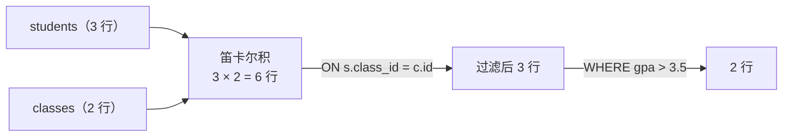

> SQL 是「声明式」的：只说要什么。这一篇把这个「要」具体化——
> 数据散在多张表里，怎么**关联**起来（Lecture 35 · SQL）？成千上万行，怎么**汇总**（Lecture 36 · Aggregation）？
>
> 本机 `sqlite3` 真跑，下面每个输出都是实测的。

## 一、钩子：JOIN 到底做了什么

「连接两张表」听起来抽象，本质只有两步：

> **先做笛卡尔积（所有行两两配对），再按 `ON` 条件把不要的删掉。**

理解这句话，`JOIN` 的许多现象（行数变多、条件写漏、结果成倍膨胀）都有了统一解释。

## 二、`SELECT` 就三件事

```python
from sqlite3 import connect

c = connect(':memory:').cursor()
c.execute('create table students (id int, name text, class_id int, gpa real)')
c.execute('create table classes (id int, location text)')
for r in [(1, 'Ann', 10, 3.9), (2, 'Bob', 10, 3.2), (3, 'Cid', 20, 3.7)]:
    c.execute('insert into students values (?, ?, ?, ?)', r)
for r in [(10, 'Hall A'), (20, 'Hall B')]:
    c.execute('insert into classes values (?, ?)', r)

print(c.execute('select name, gpa from students order by gpa desc').fetchall())
```

输出：

```text
[('Ann', 3.9), ('Cid', 3.7), ('Bob', 3.2)]
```

| 动作 | 关键词 | 在这句里 |
| --- | --- | --- |
| **投影**：选哪些列 | `SELECT` | `name, gpa` |
| **过滤**：留哪些行 | `WHERE` | （这里没写） |
| **排序**：按什么排 | `ORDER BY` | `gpa desc` |

## 三、`JOIN`：先配对，再过滤

学生表里只有 `class_id`，教室位置在另一张表。要一起看，就得连接：

```python
from sqlite3 import connect

c = connect(':memory:').cursor()
c.execute('create table students (id int, name text, class_id int, gpa real)')
c.execute('create table classes (id int, location text)')
for r in [(1, 'Ann', 10, 3.9), (2, 'Bob', 10, 3.2), (3, 'Cid', 20, 3.7)]:
    c.execute('insert into students values (?, ?, ?, ?)', r)
for r in [(10, 'Hall A'), (20, 'Hall B')]:
    c.execute('insert into classes values (?, ?)', r)

q = '''
select s.name, c.location
from students as s
join classes as c on s.class_id = c.id
where s.gpa > 3.5
order by s.name
'''
print(c.execute(q).fetchall())
```

输出：

```text
[('Ann', 'Hall A'), ('Cid', 'Hall B')]
```

三个要点：

- **`as s` / `as c` 是别名**。有了别名，`SELECT` 里写 `s.name` 就明确指「学生表的 name」，而不是教室表的。
- **`ON s.class_id = c.id` 是连接条件**，必须写。漏了会怎样？见下一节。
- **`JOIN` 之后可以继续 `WHERE` / `ORDER BY`**，跟单表查询一样。



## 四、漏写条件的代价：笛卡尔积事故

```python
from sqlite3 import connect

c = connect(':memory:').cursor()
c.execute('create table students (id int, name text, class_id int, gpa real)')
c.execute('create table classes (id int, location text)')
for r in [(1, 'Ann', 10, 3.9), (2, 'Bob', 10, 3.2), (3, 'Cid', 20, 3.7)]:
    c.execute('insert into students values (?, ?, ?, ?)', r)
for r in [(10, 'Hall A'), (20, 'Hall B')]:
    c.execute('insert into classes values (?, ?)', r)

with_on = len(c.execute('select * from students join classes on students.class_id = classes.id').fetchall())
without_on = len(c.execute('select * from students, classes').fetchall())
print("加了 ON 条件:", with_on, "行")
print("漏了 ON    :", without_on, "行")
```

输出：

```text
加了 ON 条件: 3 行
漏了 ON    : 6 行
```

3 × 2 = 6。**这就是「先笛卡尔积，再过滤」的直接后果**：条件一漏，行数变成 `n × m`。

危险的地方在于**它不报错**。查询照样返回，只是结果全错、数据量成倍膨胀。表一大（比如一万行 × 一万行）直接跑不动。这也是「看起来没报错但结果全错」的典型代表。

**检查习惯：看到 `JOIN`，先数一数 `ON` 在不在。**

## 五、自连接：一张表取两个身份

「学生之间互为伙伴」这种关系存在**同一张表**里，怎么查？把表跟**自己**连：

```python
from sqlite3 import connect

c = connect(':memory:').cursor()
c.execute('create table students (id int, name text, buddy_id int)')
for r in [(1, 'Ann', 2), (2, 'Bob', 3), (3, 'Cid', 2)]:
    c.execute('insert into students values (?, ?, ?)', r)

q = '''
select a.name as student, b.name as buddy
from students as a
join students as b on a.buddy_id = b.id
order by a.name
'''
print(c.execute(q).fetchall())
```

输出：

```text
[('Ann', 'Bob'), ('Bob', 'Cid'), ('Cid', 'Bob')]
```

**自连接时别名不是可选项，是必需品**——没有 `a` 和 `b`，就无法区分「左边的学生」和「右边的伙伴」。

自连接有个"写法陷阱"：用逗号写法 `from students as a, students as b` 而**忘了 `WHERE a.buddy_id = b.id`**，立刻变成 3 × 3 = 9 行的笛卡尔积。

| 写法 | 结果 |
| --- | --- |
| `join ... on a.buddy_id = b.id` | 3 行（一对一匹配） |
| `from a, b` 且漏写 `WHERE` | 9 行（全部两两配对） |

## 六、聚合：把很多行压成一行

```python
from sqlite3 import connect

c = connect(':memory:').cursor()
c.execute('create table staff (name text, department text, salary int, status text)')
for r in [('a', 'Eng', 100, 'active'), ('b', 'Eng', 120, 'active'), ('c', 'Eng', 90, 'left'),
          ('d', 'Ops', 80, 'active'), ('e', 'Ops', 85, 'active')]:
    c.execute('insert into staff values (?, ?, ?, ?)', r)

q = '''
select department, count(*) as n, avg(salary) as avg_sal
from staff
where status = 'active'
group by department
having count(*) >= 2
order by department
'''
print(c.execute(q).fetchall())
```

输出：

```text
[('Eng', 2, 110.0), ('Ops', 2, 82.5)]
```

聚合函数把**一堆行压成一个值**：

| 函数 | 作用 |
| --- | --- |
| `COUNT` | 数行数 |
| `SUM` / `AVG` | 求和 / 平均 |
| `MIN` / `MAX` | 最小 / 最大 |

而 `GROUP BY department` 的含义是：**先按 `department` 把行分成几堆，每一堆各算一次聚合**。

**这里有一条硬性约束：`SELECT` 里出现的非聚合列，必须出现在 `GROUP BY` 里。** 例如 `select department, name, count(*) ... group by department` 就是非法的——一个部门对应多个 `name`，数据库无法确定该返回哪一个。

## 七、`WHERE` 还是 `HAVING`：看过滤的是行还是组

这是**最容易混淆的一处**，判据只有一句话：

| 关键词 | 什么时候过滤 | 过滤的对象 | 能用聚合函数吗 |
| --- | --- | --- | --- |
| `WHERE` | **分组前** | **单行** | **不能** |
| `HAVING` | **分组后** | **组（聚合结果）** | 能 |

实测一下「`WHERE` 里用聚合函数」会怎样：

```python
from sqlite3 import connect

c = connect(':memory:').cursor()
c.execute('create table staff (name text, department text, salary int, status text)')
for r in [('a', 'Eng', 100, 'active'), ('b', 'Eng', 120, 'active'), ('c', 'Eng', 90, 'left'),
          ('d', 'Ops', 80, 'active'), ('e', 'Ops', 85, 'active')]:
    c.execute('insert into staff values (?, ?, ?, ?)', r)

try:
    c.execute("select department from staff where count(*) > 1")
except Exception as e:
    print("WHERE 里用聚合函数 →", type(e).__name__)

q = '''
select department, count(*) as n
from staff
group by department
having count(*) > 1
order by department
'''
print("HAVING 里用聚合函数 →", c.execute(q).fetchall())
```

输出：

```text
WHERE 里用聚合函数 → OperationalError
HAVING 里用聚合函数 → [('Eng', 3), ('Ops', 2)]
```

**`WHERE` 报错，`HAVING` 正常。** 因为 `WHERE` 跑的时候，「组」还没形成，`count(*)` 无从谈起。

最后一个小陷阱，`COUNT(*)` 与 `COUNT(列)` 不一样：

```python
from sqlite3 import connect

c = connect(':memory:').cursor()
c.execute('create table t (x int, y int)')
c.execute('insert into t values (1, 10)')
c.execute('insert into t values (2, null)')

print(c.execute('select count(*) as all_rows, count(y) as non_null from t').fetchall())
```

输出：

```text
[(2, 1)]
```

`COUNT(*)` 数**所有行**（2），`COUNT(y)` **跳过 `NULL`**（1）。两者结果常常不同，写报表时差别很大。

## 八、执行顺序：写法 ≠ 运行顺序

写的时候 `SELECT` 在最前面，但**数据库的运行顺序完全不是这样**：


`FROM → WHERE → GROUP BY → HAVING → SELECT → ORDER BY`

理解这个顺序，就能解释两件事：**为什么 `WHERE` 里不能用 `COUNT(*)`**（那时还没分组），以及**为什么 `SELECT` 里起的别名不能直接在 `WHERE` 里用**（`WHERE` 跑得比 `SELECT` 早）。

## 九、小结

| 概念 | 一句话 | 证据 |
| --- | --- | --- |
| `SELECT` 三件事 | 投影 / 过滤 / 排序 | `order by gpa desc` → `Ann, Cid, Bob` |
| `JOIN` 本质 | 笛卡尔积再按 `ON` 过滤 | 3 行 → `Ann/Hall A`、`Cid/Hall B` |
| 漏写 `ON` | 行数 `n × m`，且不报错 | 3 行变 6 行 |
| 自连接 | 同表两个别名 | `[('Ann','Bob'), ('Bob','Cid'), ('Cid','Bob')]` |
| 聚合 + 分组 | 先分组，每组算一次 | `[('Eng', 2, 110.0), ('Ops', 2, 82.5)]` |
| `WHERE` vs `HAVING` | 行级 vs 组级 | `WHERE count(*)` → `OperationalError` |
| `COUNT(*)` vs `COUNT(y)` | 后者跳过 `NULL` | `[(2, 1)]` |
| 执行顺序 | `FROM→WHERE→GROUP BY→HAVING→SELECT→ORDER BY` | 解释 `WHERE` 里不能聚合 |

三条能带走的：

1. **`JOIN` = 笛卡尔积 + `ON` 过滤。** 漏写 `ON` 不报错、只是结果错——看到 `JOIN` 先数条件。
2. **过滤单行用 `WHERE`，过滤组用 `HAVING`。** 判据是「过滤条件是行级还是组级」，`WHERE` 里写聚合函数直接报错。
3. **执行顺序和书写顺序不是一回事。** 把握 `FROM → WHERE → GROUP BY → HAVING → SELECT → ORDER BY`，大部分「为什么这里不能用」的问题就自然解决了。
