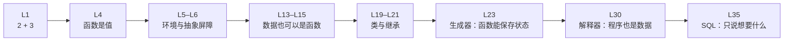

## 一、「准不准」和「该不该用」是两个问题

- 这一篇对应官方 Lecture 39（Ethics）与 Lecture 40（Conclusion）。

一个模型准确率 75%，另一个 92%。选后者？

先不必急于选择。如果那 92% 是靠**牺牲某个群体**换来的呢？它的总体数字看起来很漂亮，但在某一类人身上几乎全错。

**这是两个不同的问题**：`准不准` 是工程问题，`该不该用` 是伦理问题。**工程指标永远回答不了后者。** 这一篇给一个能立刻上手的技术手段，把前者拆成后者能用的证据。

## 二、偏见是「被学走」的

算法偏见不是模型坏，是**数据里的历史偏差被学走了，然后在自动化决策里被放大**：

| 环节 | 偏见怎么进来的 |
| --- | --- |
| 数据来源 | 历史数据本身就带着过去的偏好 |
| 标签选择 | 把「历史上是否被录用」当正确答案 → 把旧偏见固化 |
| 特征选择 | 邮编、姓名、院校常与受保护属性高度相关 |
| 评估方式 | 只看总体准确率，掩盖了某个群体的劣化 |

技术中立是个幻觉——**连「选哪些特征」这个动作本身就承载价值判断**。

## 三、分群体看误差率：一个可直接使用的切入点

「分群体看假阳性/假阴性率」是识别偏见最直接的技术手段。跑一段实测：

```python
data = [
    # (群体, 真实标签, 模型预测)
    ('A', 1, 1), ('A', 1, 1), ('A', 0, 0), ('A', 0, 0),
    ('A', 1, 1), ('A', 0, 0), ('A', 1, 1), ('A', 0, 0),
    ('B', 1, 0), ('B', 1, 0), ('B', 0, 0), ('B', 0, 0),
    ('B', 1, 0), ('B', 0, 0), ('B', 1, 0), ('B', 0, 0),
]

correct = sum(1 for g, t, p in data if t == p)
print("总体准确率:", correct / len(data))

for group in ['A', 'B']:
    rows = [(t, p) for g, t, p in data if g == group]
    tp = sum(1 for t, p in rows if t == 1 and p == 1)
    fn = sum(1 for t, p in rows if t == 1 and p == 0)
    fnr = fn / (tp + fn) if (tp + fn) else 0
    print(f"群体 {group}: 假阴性率 = {fnr:.2f}")
```

输出：

```text
总体准确率: 0.75
群体 A: 假阴性率 = 0.00
群体 B: 假阴性率 = 1.00
```

看这三行：

- **总体准确率 0.75**，看起来「勉强能用」。
- **群体 A 的假阴性率是 0.00**——A 里所有「该被选中」的人都选中了。
- **群体 B 的假阴性率是 1.00**——B 里所有「该被选中」的人，**一个都没选出来**。

**总体 0.75 这个数字，完全掩盖了「B 群体被系统性放弃」这一事实。** 只看总体准确率，很容易以为模型还算可用；拆开看，一个群体被彻底牺牲了。

这就是问题求解流程在实际系统中的用处：

| 用到的能力 | 来自 |
| --- | --- |
| 用字典/元组组织数据 | L11–L13 |
| 推导式 + 条件筛选 | L12 |
| 分组的聚合统计 | L36（`GROUP BY` 的思想） |
| 用具体数字说话，不空谈 | 全系列 |

**「有没有偏见」不需要靠主观争论，算一下分群体误差率就有答案。** 但算完还有第二步：决策要**可解释、可申诉**——无法解释的决策，人连申诉的入口都没有。

## 四、一个问题，四种范式

把整个系列串起来最直观的方式，是拿**同一个问题**问四种范式。问题：求列表里偶数的平方和。

```python
from sqlite3 import connect

xs = [1, 2, 3, 4, 5, 6]

# ① 函数式：把计算组合起来
functional = sum(x * x for x in xs if x % 2 == 0)

# ② 面向对象：把状态和方法打包
class SumOfSquares:
    def __init__(self):
        self.total = 0
    def feed(self, v):
        self.total += v * v
        return self

s = SumOfSquares()
for x in xs:
    if x % 2 == 0:
        s.feed(x)
oop = s.total

# ③ 解释器：把表达式写成数据，再求值
def calc_eval(exp):
    if isinstance(exp, int):
        return exp
    op = exp[0]
    args = [calc_eval(a) for a in exp[1:]]
    if op == '+':
        return sum(args)
    if op == '*':
        r = 1
        for a in args:
            r *= a
        return r
    raise ValueError(op)

ast = ['+', ['*', 2, 2], ['*', 4, 4], ['*', 6, 6]]
interpreter = calc_eval(ast)

# ④ 声明式：只说「要什么」
c = connect(':memory:').cursor()
c.execute('create table xs (v int)')
for x in xs:
    c.execute('insert into xs values (?)', (x,))
declarative = c.execute('select sum(v * v) from xs where v % 2 = 0').fetchone()[0]

print("函数式  :", functional)
print("面向对象:", oop)
print("解释器  :", interpreter)
print("声明式  :", declarative)
```

输出：

```text
函数式  : 56
面向对象: 56
解释器  : 56
声明式  : 56
```

`4 + 16 + 36 = 56`，四条路殊途同归。

| 范式 | 表达方式 | 对应讲次 | 核心问题 |
| --- | --- | --- | --- |
| 函数式 | 高阶函数、纯函数、组合 | L4、L22–L23、L27–L29 | 怎么**组合**计算 |
| 面向对象 | 类、继承、属性查找 | L18–L21、L25 | 怎么**组织**状态与行为 |
| 解释器 | AST、eval / apply | L30、L33 | 怎么**描述并执行**语言 |
| 声明式 | 表、`SELECT`、`GROUP BY` | L34–L36 | 怎么**描述想要什么** |

## 五、贯穿整个系列的一条主线

回望一下这条路：



从 `2 + 3` 到 `JOIN`，走的是一条**抽象能力不断变强**的路：

- 一开始只能写「先算这个、再算那个」；
- 后来能把**函数当值**传来传去；
- 再后来数据、状态、行为都能打包；
- 最后连**程序本身**都变成了可以操作的数据。

所以 SICP 那本书的名字才是答案——**《计算机程序的构造和解释》**：这一系列讲的是如何**构造**抽象、如何**解释**计算。

## 六、这 20 篇的目录

| # | 讲次 | 文章 |
| --- | --- | --- |
| 1 | L1–2 | [表达式求值与函数定义](/posts/c61a0101/) |
| 2 | L3–4 | [控制流与高阶函数](/posts/c61a0102/) |
| 3 | L5–6 | [环境图与抽象屏障](/posts/c61a0103/) |
| 4 | L7–8 | [高阶函数的三种组合模式](/posts/c61a0104/) |
| 5 | L9–10 | [递归与树递归](/posts/c61a0105/) |
| 6 | L11–12 | [序列与容器](/posts/c61a0106/) |
| 7 | L13–14 | [对象与链表](/posts/c61a0107/) |
| 8 | L15–16 | [树的聚合与路径搜索](/posts/c61a0108/) |
| 9 | L17–18 | [问题求解流程与可变性](/posts/c61a0109/) |
| 10 | L19–20 | [类与属性查找](/posts/c61a0110/) |
| 11 | L21–22 | [继承与惰性求值](/posts/c61a0111/) |
| 12 | L23–24 | [生成器与效率](/posts/c61a0112/) |
| 13 | L25–26 | [面向对象综合实践](/posts/c61a0113/) |
| 14 | L27–28 | [函数式编程与代数数据类型](/posts/c61a0114/) |
| 15 | L29–30 | [不可变数据与解释器](/posts/c61a0115/) |
| 16 | L31–32 | [编程智能体与浏览器](/posts/c61a0116/) |
| 17 | L33–34 | [数据流水线与数据表](/posts/c61a0117/) |
| 18 | L35–36 | [SQL 连接与聚合](/posts/c61a0118/) |
| 19 | L37–38 | [测试与追踪](/posts/c61a0119/) |
| 20 | L39–40 | 本篇 |

## 七、延伸方向

| 方向 | 为什么 |
| --- | --- |
| **CS61B** | 数据结构与算法——本系列讲过的链表、树只是开头 |
| **CS61C** | 计算机系统与体系结构——往下一层看代码怎么变成指令 |
| **官方 Project 1–4** | 与本系列的实现细节高度互补，值得对照阅读 |

**串联方式**：与其按讲次横向罗列，不如**按抽象层级纵向串联**——函数 → 数据结构 → 类 → 生成器 → 解释器 → 数据库。这条线索能把知识点连成体系。

## 八、小结

| 概念 | 一句话 | 证据 |
| --- | --- | --- |
| 两个问题 | 「准不准」≠「该不该用」 | 总体 0.75 掩盖了 B 群体 |
| 分群体误差 | 识别偏见最直接的切入点 | A 假阴性 0.00、B 假阴性 1.00 |
| 偏见来源 | 数据、标签、特征、评估四关 | 技术中立是幻觉 |
| 四范式同题 | 一个 56 四条路 | 全部实测得 `56` |
| 主线 | 全系列只讲「抽象」 | `2 + 3` → `JOIN` 同一条路 |

三条能带走的：

1. **总体指标会撒谎，分群体看误差率才不会。** 75% 的总体准确率下面，可能藏着一个 100% 假阴性的群体。
2. **「准不准」和「该不该用」是两个问题。** 工程指标能回答前者，回答不了后者——后者需要可解释、可申诉的设计。
3. **这一系列讲的始终是抽象。** 从 `2 + 3` 到 `JOIN`，每一步都是「用更强的表达能力描述计算」——而程序本身，最终也变成了可操作的数据。
