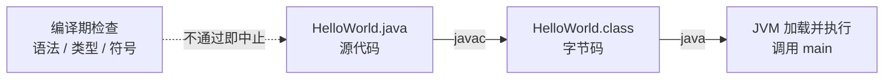
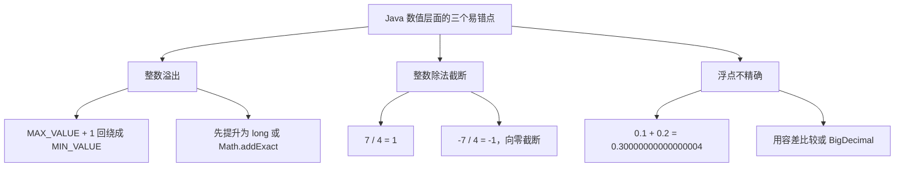

## 一、两条命令的分工

这一篇对应官方 Lecture 1（Intro, Hello World Java）。

第一次写 Java，最容易卡住的不是语法，而是运行方式：写完一个 `.java` 文件，既不能直接双击，也不能像 Python 那样 `python x.py` 就跑。必须先 `javac`，再 `java`。

这不是历史包袱。`javac` 与 `java` 的分工，恰好是 Java「一次编译，到处运行」的全部机制。

```java
public class HelloWorld {
    public static void main(String[] args) {
        System.out.println("Hello, world!");
        System.out.println("命令行参数个数：" + args.length);
        System.out.println("7 / 4   = " + (7 / 4));
        System.out.println("7.0 / 4 = " + (7.0 / 4));
        System.out.println("-7 / 4  = " + (-7 / 4));
    }
}
```

输出：

```text
Hello, world!
命令行参数个数：0
7 / 4   = 1
7.0 / 4 = 1.75
-7 / 4  = -1
```

两条命令分别执行：

```text
javac HelloWorld.java     # 产出 HelloWorld.class
java  HelloWorld          # 执行其中的 main
```

`javac` 产出的是**字节码**（bytecode），一种面向 JVM 的中间指令集。`java` 才负责把字节码交给 JVM 执行。中间那一层 `.class` 文件，就是「一次编译，到处运行」的载体——只要目标机器有对应版本的 JVM，同一份字节码可以直接跑。



## 二、入口点：三段修饰各管什么

`public static void main(String[] args)` 这一行，四个部分没有一个可以省。

| 片段 | 作用 | 省略后的后果 |
| --- | --- | --- |
| `public` | 允许 JVM 从类外部调用 | 报 "Main method not found" |
| `static` | 不需要创建对象即可调用 | 报 "Main method is not static" |
| `void` | 入口不向 JVM 返回值 | 签名不匹配，同样找不到入口 |
| `String[] args` | 接收命令行参数 | 签名不匹配 |

`args` 是启动时传入的参数数组。`java HelloWorld a b c` 会让 `args.length` 等于 3，而不是把参数拼成一整行字符串。

## 三、静态类型：错误提前到编译期

Java 的变量在声明时就固定了类型。`int n = 5` 之后，`n` 一辈子只能装整数。

```java
public class TypeCheck {
    public static void main(String[] args) {
        int n = 5;
        double x = n;                 // 隐式拓宽：int -> double
        System.out.println("x = " + x);

        // 下面这行去掉注释就编译不过：n 是 int，装不下 2.5
        // n = 2.5;

        System.out.println("1 + 2 + \"3\" = " + (1 + 2 + "3"));   // 左结合，先算加法
        System.out.println("\"1\" + 2 + 3 = " + ("1" + 2 + 3));   // 先遇到字符串，后面全拼接
    }
}
```

输出：

```text
x = 5.0
1 + 2 + "3" = 33
"1" + 2 + 3 = 123
```

被注释掉的那一行是本篇的重点：`n = 2.5` 在 Python 里完全合法，在 Java 里连编译都过不了。**类型错误在编译期就暴露，不需要构造测试用例去触发。** 这就是静态类型要换来的东西——代价是写代码时更啰嗦，回报是一整类错误在运行时之前就被拦下。

## 四、整数运算与边界

Java 的整数运算与 Python 有几处关键差异，写算法时最容易在这几处出错。

```java
public class IntLimits {
    public static void main(String[] args) {
        System.out.println("Integer.MAX_VALUE     = " + Integer.MAX_VALUE);
        System.out.println("Integer.MAX_VALUE + 1 = " + (Integer.MAX_VALUE + 1));
        long big = Integer.MAX_VALUE;
        System.out.println("long 版 + 1           = " + (big + 1));
        System.out.println("0.1 + 0.2             = " + (0.1 + 0.2));
        System.out.println("0.1 + 0.2 == 0.3      = " + (0.1 + 0.2 == 0.3));
    }
}
```

输出：

```text
Integer.MAX_VALUE     = 2147483647
Integer.MAX_VALUE + 1 = -2147483648
long 版 + 1           = 2147483648
0.1 + 0.2             = 0.30000000000000004
0.1 + 0.2 == 0.3      = false
```

三件事必须记住：

- **整数溢出静默发生。** `Integer.MAX_VALUE + 1` 不会抛异常，直接回绕成最小值。做加法前要么先提升为 `long`，要么用 `Math.addExact`。
- **整数除法向下取整到零。** 前面 `-7 / 4` 得到 `-1` 而不是 `-2`，说明它是「向零截断」，不是数学意义上的下取整。
- **浮点数不精确。** `0.1 + 0.2 != 0.3` 是二进制浮点的固有限制。比较浮点要用容差，或者改用 `BigDecimal`。



## 五、小结

| 概念 | 一句话 | 证据 |
| --- | --- | --- |
| 两段式工具链 | `javac` 出字节码，`java` 跑字节码 | 产出 `HelloWorld.class` |
| 入口签名 | `public static void main(String[] args)` | 缺 `static` 报 "not static" |
| 静态类型 | 类型错误在编译期拦下 | `n = 2.5` 无法通过编译 |
| 字符串拼接 | `+` 左结合，遇到字符串后全部转拼接 | `1 + 2 + "3"` = `33` |
| 整数除法 | 向零截断，不做下取整 | `-7 / 4` = `-1` |
| 浮点比较 | 二进制浮点不精确，不能直接 `==` | `0.1 + 0.2 == 0.3` → `false` |

三条能带走的：

1. **`javac` 与 `java` 的分工就是 Java 的跨平台机制。** 字节码是中间层，JVM 是各平台的翻译者。
2. **静态类型的价值在于「错误提前」。** 编译不过的代码，就不要谈运行时测试了。
3. **整数除法与溢出是 Java 算法实现里最高频的两个陷阱。** 写二分查找、计算中点、累加求和时，第一反应就该是这两件事。
