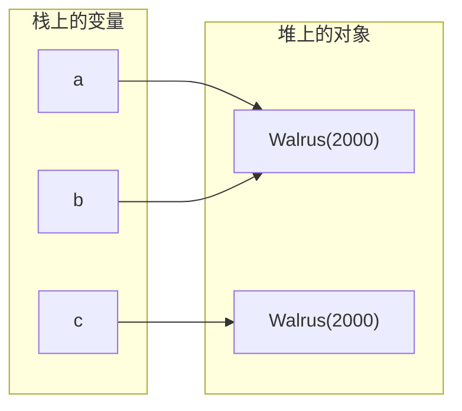

## 一、`b = a` 复制了什么

这一篇对应官方 Lecture 4（References, Recursion, and Lists）。

先看一段代码。`a` 是一个对象，`b = a` 之后修改 `b`，`a` 会变吗？

```java
public class WalrusDemo {
    static class Walrus {
        int weight;
        Walrus(int w) {
            this.weight = w;
        }
    }

    public static void main(String[] args) {
        Walrus a = new Walrus(1000);
        Walrus b = a;                      // 只复制引用，不复制对象
        b.weight = 2000;

        System.out.println("a.weight = " + a.weight);
        System.out.println("b.weight = " + b.weight);
        System.out.println("a == b   -> " + (a == b));

        Walrus c = new Walrus(2000);
        System.out.println("b == c   -> " + (b == c));            // 不同对象
        System.out.println("b.equals(c) -> " + b.equals(c));      // 默认比较引用
    }
}
```

输出：

```text
a.weight = 2000
b.weight = 2000
a == b   -> true
b == c   -> false
b.equals(c) -> false
```

`b = a` 之后 `a.weight` 也变成了 `2000`。原因只有一个：**Java 的变量里装的是引用，不是对象本身。** 赋值复制的是那串指向对象的位串，两个变量因此指向堆上的同一个对象。

## 二、引用的三条推论

从上面这一段可以推出三条贯穿全课的性质：

- **赋值不复制对象。** `b = a` 只多了一个别名。想复制一份独立的对象，必须自己写拷贝逻辑，或者用 `new`。
- **`==` 比较的是引用。** `b == c` 为 `false`，尽管两个对象的 `weight` 相同，因为它们是两个不同的对象。
- **默认 `equals` 等同于 `==`。** 输出里 `b.equals(c)` 也是 `false`，因为 `Object.equals` 的默认实现就是引用比较。要让「内容相等」成立，必须自己重写 `equals`。



`a` 与 `b` 指向同一个对象，所以 `a == b`。`c` 指向另一个对象，所以 `b == c` 为 `false`，哪怕内容一样。

## 三、用递归重写循环

有了引用，就可以定义「自己装自己」的结构。最朴素的形式是裸链表 `IntList`：一个节点装一个整数，再加一个指向下一个节点的引用。

```java
public class IntList {
    public int first;
    public IntList rest;

    public IntList(int f, IntList r) {
        first = f;
        rest = r;
    }

    /** 迭代版：数链表长度 */
    public int iterativeSize() {
        int n = 0;
        IntList p = this;
        while (p != null) {
            n += 1;
            p = p.rest;
        }
        return n;
    }

    /** 递归版：数链表长度。递归基是「没有下一个节点」 */
    public int size() {
        if (rest == null) {
            return 1;
        }
        return 1 + rest.size();
    }

    /** 返回一条新链表，每个元素加 x；原链表保持不变 */
    public IntList incrList(int x) {
        if (rest == null) {
            return new IntList(first + x, null);
        }
        return new IntList(first + x, rest.incrList(x));
    }

    /** 便捷构造：of(1, 2, 3) */
    public static IntList of(int... vals) {
        IntList p = null;
        for (int i = vals.length - 1; i >= 0; i -= 1) {
            p = new IntList(vals[i], p);
        }
        return p;
    }

    @Override
    public String toString() {
        StringBuilder sb = new StringBuilder();
        IntList p = this;
        while (p != null) {
            sb.append(p.first);
            if (p.rest != null) {
                sb.append(" -> ");
            }
            p = p.rest;
        }
        return sb.toString();
    }

    public static void main(String[] args) {
        IntList L = IntList.of(1, 2, 3, 4, 5);
        System.out.println("L = " + L);
        System.out.println("iterativeSize = " + L.iterativeSize());
        System.out.println("size          = " + L.size());

        IntList M = L.incrList(10);
        System.out.println("M = " + M);
        System.out.println("L.first = " + L.first + "，M.first = " + M.first);
    }
}
```

输出：

```text
L = 1 -> 2 -> 3 -> 4 -> 5
iterativeSize = 5
size          = 5
M = 11 -> 12 -> 13 -> 14 -> 15
L.first = 1，M.first = 11
```

`size` 与 `iterativeSize` 结果一致，但思路完全不同：

- **迭代版**用一个局部变量 `p` 沿 `rest` 往前走，数到 `null` 为止。
- **递归版**只回答一个问题：*剩余部分有多长*。长度 = 1 + `rest.size()`，直到 `rest == null` 时返回 1。

关键在递归基。写成 `if (this == null) return 0` 是错的——`this` 永远不会是 `null`，方法能被执行说明对象一定存在。**递归基必须写成 `rest == null`**，也就是「我是最后一个节点」。

## 四、不可变与可变的分野

`incrList` 值得单独看。它不修改任何已有节点，而是从头到尾新建一条链，原链完全不动——调用 `L.incrList(10)` 拿到 `M` 之后，再打印 `L` 依旧是 `1 -> 2 -> 3 -> 4 -> 5`、`L.first` 依旧是 `1`，而 `M` 是 `11 -> 12 -> 13 -> 14 -> 15`。

这就是**不可变（immutable）**风格的递归数据结构：任何「修改」都表现为「返回一个新版本」。好处是调用方不需要担心自己的数据被别人改掉；代价是每次都要分配一整条新链。

对比之下，可变风格会直接改 `L.rest = ...`，省内存但需要调用方清楚「我的数据被改过了」。

| 风格 | 修改的表现 | 空间代价 | 调用方要担心什么 |
| --- | --- | --- | --- |
| 不可变 | 返回新链，原链不动 | 每次 O(N) 新节点 | 几乎不用担心 |
| 可变 | 直接改 `rest` 指针 | O(1) | 引用别处会被连带改动 |

## 五、`null` 到底在什么时候触发异常

`null` 本身不会报错，**解引用**才会。

```java
public class NullPointer {
    static class Node {
        int value;
        Node next;
        Node(int v) {
            value = v;
        }
    }

    public static void main(String[] args) {
        Node head = null;
        System.out.println("声明 null 不报错，head == null -> " + (head == null));

        try {
            System.out.println(head.value);        // 解引用 null
        } catch (NullPointerException e) {
            System.out.println("解引用 null -> NullPointerException");
        }

        Node a = new Node(1);                      // a.next 是 null
        try {
            System.out.println(a.next.value);      // 链条断在中间
        } catch (NullPointerException e) {
            System.out.println("链条断在中间 -> NullPointerException");
        }
    }
}
```

输出：

```text
声明 null 不报错，head == null -> true
解引用 null -> NullPointerException
链条断在中间 -> NullPointerException
```

第二种比第一种更隐蔽。空链表的报错一眼可辨；而在一条长链上某个节点忘了初始化 `next`，报错位置和真正出错的位置可能隔着很远。链表代码写完，先用手画一遍指针走向，比直接跑测试更快定位。

## 六、小结

| 概念 | 一句话 | 证据 |
| --- | --- | --- |
| 引用语义 | 变量装的是指针，赋值只复制指针 | `b = a` 后 `a.weight` 也变成 2000 |
| `==` vs `equals` | 前者比地址，后者默认也比地址 | `b.equals(c)` → `false` |
| 递归基 | 必须判 `rest == null`，不能判 `this == null` | `size()` 与 `iterativeSize()` 同为 5 |
| 不可变风格 | 修改 = 返回新链，原链不动 | `M` 变了，`L.first` 仍是 1 |
| NPE 触发点 | 解引用 `null` 才抛，声明不抛 | `head.value` 抛，`head == null` 不抛 |

三条能带走的：

1. **Java 的变量是引用的持有者，不是对象的容器。** 所有关于「赋值会不会影响另一个变量」的困惑，都从这一句出发。
2. **链表这类结构的递归写法，递归基是「是不是最后一个节点」。** 弄清楚这一点，`size`、`incrList` 到后面所有树形递归都是同一个模子。
3. **不可变风格牺牲空间换取确定性。** 后续的链表、树实现会反复在「改指针」与「造新节点」之间做这个取舍。
