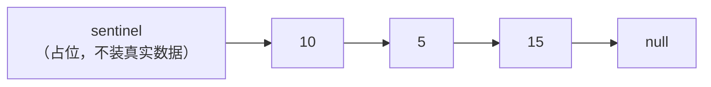

## 一、重复的空表判断

这一篇对应官方 Lecture 5（SLLists, Nested Classes, Sentinel Nodes）。

裸 `IntList` 的问题不是难写，而是**每写一个方法，都要重复一遍空表判断**。

```java
public class NoSentinel {
    private static class IntNode {
        int item;
        IntNode next;
        IntNode(int i) {
            item = i;
        }
    }

    private IntNode first;          // 没有哨兵：空表时 first 就是 null

    public NoSentinel() {
        first = null;
    }

    public void addLast(int x) {
        if (first == null) {         // 每个写操作都要先过这一关
            first = new IntNode(x);
            return;
        }
        IntNode p = first;
        while (p.next != null) {
            p = p.next;
        }
        p.next = new IntNode(x);
    }

    public int getLast() {
        if (first == null) {         // 每个读操作也要过一遍
            throw new IllegalStateException("空链表没有 last");
        }
        IntNode p = first;
        while (p.next != null) {
            p = p.next;
        }
        return p.item;
    }

    public static void main(String[] args) {
        NoSentinel L = new NoSentinel();
        L.addLast(1);
        L.addLast(2);
        L.addLast(3);
        System.out.println("无哨兵版 getLast = " + L.getLast());
        System.out.println("每新增一个方法，都要多写一次 first == null 的分支");
    }
}
```

输出：

```text
无哨兵版 getLast = 3
每新增一个方法，都要多写一次 first == null 的分支
```

两个坏味道很明显：

- `first` 有两个含义——「指向首节点」和「表示链表为空」。同一个字段承担两种语义，读代码时必须在脑子里做二次解释。
- 空表是特例。特例意味着**漏判的风险**，方法越多风险越大。

## 二、封装：把节点藏进内部

第一层改进是封装。调用方只需要 `SLList` 这个抽象，不该看见 `IntNode`。

```java
public class SLList {
    /** 静态嵌套类：不持有对外部实例的隐式引用 */
    private static class IntNode {
        int item;
        IntNode next;
        IntNode(int i, IntNode n) {
            item = i;
            next = n;
        }
    }

    /** 哨兵节点：sentinel.next 恒为真实首节点 */
    private IntNode sentinel;
    private int size;

    public SLList() {
        sentinel = new IntNode(63, null);
        size = 0;
    }

    public SLList(int x) {
        sentinel = new IntNode(63, null);
        sentinel.next = new IntNode(x, null);
        size = 1;
    }

    public void addFirst(int x) {
        sentinel.next = new IntNode(x, sentinel.next);
        size += 1;
    }

    public void addLast(int x) {
        IntNode p = sentinel;
        while (p.next != null) {
            p = p.next;
        }
        p.next = new IntNode(x, null);
        size += 1;
    }

    public int getFirst() {
        return sentinel.next.item;
    }

    public int size() {
        return size;
    }

    @Override
    public String toString() {
        StringBuilder sb = new StringBuilder("[");
        IntNode p = sentinel.next;
        while (p != null) {
            sb.append(p.item);
            if (p.next != null) {
                sb.append(", ");
            }
            p = p.next;
        }
        return sb.append("]").toString();
    }

    public static void main(String[] args) {
        SLList empty = new SLList();
        System.out.println("空表 " + empty + "，size = " + empty.size());
        empty.addLast(7);
        System.out.println("空表 addLast(7) 后 " + empty + "，size = " + empty.size());

        SLList L = new SLList(5);
        L.addFirst(10);
        L.addLast(15);
        System.out.println("L = " + L);
        System.out.println("getFirst = " + L.getFirst() + "，size = " + L.size());
    }
}
```

输出：

```text
空表 []，size = 0
空表 addLast(7) 后 [7]，size = 1
L = [10, 5, 15]
getFirst = 10，size = 3
```

注意 `addLast` 里**没有空表分支**。空表加元素、非空表加元素，走的是同一条路径。

## 三、哨兵节点做了什么

`sentinel` 是一个永远存在、但不装真实数据的节点。它带来的效果是：`sentinel.next` 恒为真实首节点——空表时它是 `null`，非空时它指向第一个节点。



于是：

- **`first` 这个词消失了。** 首节点统一用 `sentinel.next` 表达，含义唯一。
- **空表不再是特例。** `addLast` 从哨兵出发走 `next`，空表时循环一次都不执行，直接接在哨兵后面。
- **`getFirst` 也不需要判空。** 直接返回 `sentinel.next.item`，空表时自然抛 NPE，语义由调用方决定。

哨兵节点里那个 `63` 只是个占位数字，永远不会被读到。取这个值只是为了在调试时一眼认出「这不是真实数据」。

## 四、为什么要用 `static` 嵌套类

`IntNode` 声明成 `private static class`，这个 `static` 不是装饰。

| 写法 | 语义 | 能不能访问 `SLList.this` |
| --- | --- | --- |
| `static class IntNode` | 只是一个「放在 SLList 内部的普通类」 | 不能 |
| `class IntNode`（非静态内部类） | 每个实例都隐含持有外部 `SLList` 实例的引用 | 能 |

非静态内部类会额外持有外部实例引用，一个节点就多一份指针开销，而且让两个类的生命周期互相绑定。链表节点不需要知道「我属于哪个链表」，所以用 `static`。

这也是一个通用判据：**嵌套类如果不需要访问外部实例的成员，就一律加 `static`。**

## 五、`size` 值不值得缓存

`size()` 直接返回 `int size` 字段，O(1)。如果要遍历数长度，每次调用都是 O(N)。链表类几乎总会被频繁问长度，所以 `size` 字段值得维护——代价是每个修改操作都要记得维护它。

这也留下一个隐患：**任何一处忘了同步更新 `size`，缓存就是错的**。所以 `addFirst` / `addLast` 里 `size += 1` 都紧跟在指针操作后面，放在同一个方法里，避免漏改。

## 六、小结

| 概念 | 一句话 | 证据 |
| --- | --- | --- |
| 封装 | `IntNode` 设为 `private static` 嵌套类，调用方看不到 | 外部只能用 `addFirst` / `getFirst` |
| 哨兵节点 | `sentinel.next` 恒为真实首节点，消除空表特例 | 空表 `addLast` 无需判空 |
| 静态嵌套类 | 不持有外部实例引用，节点不该绑定链表 | `private static class IntNode` |
| `size` 缓存 | 用字段换 O(1)，代价是每处修改都要维护 | `size()` 返回 3，与元素数一致 |
| 哨兵取值 | `63` 只是肉眼可辨的占位值 | 永不被读取 |

三条能带走的：

1. **哨兵的实质是「用一个不装数据的节点，把空表和非空表统一成同一种形态」。** 凡是「空 / 非空」分两套逻辑的地方，都值得问一句能不能用哨兵抹平。
2. **嵌套类的 `static` 是设计决策，不是语法细节。** 不需要访问外部实例就写成静态，否则白白多一份引用。
3. **缓存字段换来 O(1)，但把一致性责任推给了所有写操作。** 这类「用空间和正确性风险换速度」的取舍，在后面维护树高、桶数、集合大小时会反复出现。
