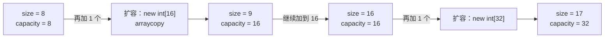

## 一、扩容策略的选择

这一篇对应官方 Lecture 7（ALists, Resizing, vs. SLLists）。

固定数组存满了，想再放一个元素，只有一条路：申请一块更大的，把老数据搬过去。问题在于——**新数组开多大**。

- 每次多开 1 个位置：连续 N 次添加，搬运次数是 1 + 2 + 3 + … + (N−1) ≈ N²/2。
- 每次把容量翻倍：搬运次数是 1 + 2 + 4 + … ≈ N。

两种策略得到的总代价差了一个数量级。这一篇用真实计数把这件事量出来。

## 二、`AList` 的两个长度

动态数组的关键，是把「数组有多长」和「列表里有多少元素」分成两个字段。

```java
public class AList {
    private int[] items;
    private int size;
    /** 记录扩容次数，用于观察均摊行为 */
    public int resizeCount = 0;

    public AList() {
        items = new int[8];
        size = 0;
    }

    private void resize(int capacity) {
        int[] bigger = new int[capacity];
        System.arraycopy(items, 0, bigger, 0, size);
        items = bigger;
        resizeCount += 1;
    }

    public void addLast(int x) {
        if (size == items.length) {
            resize(size * 2);        // 倍增，而不是 +1
        }
        items[size] = x;
        size += 1;
    }

    public int get(int i) {
        return items[i];
    }

    public int removeLast() {
        int last = items[size - 1];
        size -= 1;
        return last;
    }

    public int size() {
        return size;
    }

    public int capacity() {
        return items.length;
    }

    public static void main(String[] args) {
        AList L = new AList();
        System.out.println("初始容量 " + L.capacity());
        for (int i = 0; i < 20; i += 1) {
            L.addLast(i);
            if (i == 7 || i == 8 || i == 15 || i == 16 || i == 19) {
                System.out.println("放完第 " + (i + 1) + " 个：size = " + L.size()
                        + "，容量 = " + L.capacity() + "，扩容次数 = " + L.resizeCount);
            }
        }
        System.out.println("get(19) = " + L.get(19) + "，removeLast() = " + L.removeLast()
                + "，size = " + L.size());
    }
}
```

输出：

```text
初始容量 8
放完第 8 个：size = 8，容量 = 8，扩容次数 = 0
放完第 9 个：size = 9，容量 = 16，扩容次数 = 1
放完第 16 个：size = 16，容量 = 16，扩容次数 = 1
放完第 17 个：size = 17，容量 = 32，扩容次数 = 2
放完第 20 个：size = 20，容量 = 32，扩容次数 = 2
get(19) = 19，removeLast() = 19，size = 19
```

两个观察：

- **第 9 个元素触发扩容。** 前 8 个填满了初始容量 8，第 9 个放不下，容量翻到 16。
- **`size` 与 `capacity` 是两回事。** 输出中 `size = 20` 时容量是 32，有 12 个空位；这些空位属于正常预留，不算浪费。



## 三、均摊分析：把总代价摊到每一次操作

单看一次 `addLast`，最坏情况是 O(N)——它可能正好赶上搬运全部元素。但连续 N 次操作的总代价是多少？

```java
public class ResizeCount {
    public static void main(String[] args) {
        int n = 1_000_000;
        int capacity = 1;
        int resizes = 0;
        long copies = 0;

        for (int i = 0; i < n; i += 1) {
            if (i == capacity) {
                copies += capacity;      // 把已有元素搬过去
                capacity *= 2;
                resizes += 1;
            }
        }

        long linear = (long) n * (n - 1) / 2;

        System.out.println("N = " + n);
        System.out.println("倍增扩容次数 = " + resizes);
        System.out.println("倍增总搬运元素数 = " + copies);
        System.out.println("平均每个元素搬运 " + String.format("%.3f", (double) copies / n) + " 次");
        System.out.println("若每次只 +1 扩容，总搬运元素数 = " + linear);
    }
}
```

输出：

```text
N = 1000000
倍增扩容次数 = 20
倍增总搬运元素数 = 1048575
平均每个元素搬运 1.049 次
若每次只 +1 扩容，总搬运元素数 = 499999500000
```

这组数字把均摊分析讲完了：

- **扩容只发生 20 次**，因为容量按 1、2、4、…、524288 增长，`2^20 = 1048576` 已经覆盖 100 万个元素。
- **总搬运 1048575 次**，恰好是 `2^20 − 1`。等比数列求和，量级是 O(N) 而不是 O(N²)。
- **平均到每个元素只有 1.049 次搬运**，是个常数。所以 `addLast` 的**均摊**复杂度是 O(1)。

对比最后一行：如果改成每次只加 1 个位置，总搬运会到 499999500000 次，相差约 47 万倍。这就是「扩容策略」这一行代码的分量。

## 四、链表与数组列表怎么选

两种列表都能存序列，但代价分布完全不同。

| 操作 | `SLList` | `AList` |
| --- | --- | --- |
| 头部插入 | O(1) | O(N)，要整体后移 |
| 尾部插入 | O(N)，需走到末尾 | 均摊 O(1) |
| 按下标取 | O(N) | O(1) |
| 空间开销 | 每节点一个额外引用 | 预留容量可能空置 |
| 扩容抖动 | 无 | 偶发 O(N) 搬运 |

选型看访问模式：**按下标随机访问多 → 数组；头部/中部插入删除多 → 链表。**

## 五、小结

| 概念 | 一句话 | 证据 |
| --- | --- | --- |
| 双长度 | `size` 是元素数，`items.length` 是容量 | `size = 20` 时容量 32 |
| 倍增扩容 | 满了把容量乘 2，不是加常数 | 20 次扩容覆盖 100 万元素 |
| 均摊分析 | 总代价摊到每次操作，得到常数 | 平均搬运 1.049 次/元素 |
| 线性扩容代价 | 每次 +1 会退化成 O(N²) | 总搬运 499999500000 次 |
| 选型 | 随机访问选数组，插删密集选链表 | 取下标 O(1) vs O(N) |

三条能带走的：

1. **均摊分析看的是「一串操作的总代价」，不是「单次最坏代价」。** 单次可能很贵，但贵的那几次被摊薄后是常数。
2. **容量的增长方式决定了复杂度。** 乘一个常数得 O(1) 均摊；加一个常数得 O(N) 均摊。差别只在一个字符，量级差一个次方。
3. **`size` 与 `capacity` 必须分开。** 混用这两个概念，是动态数组实现里最常见的一类 bug。
