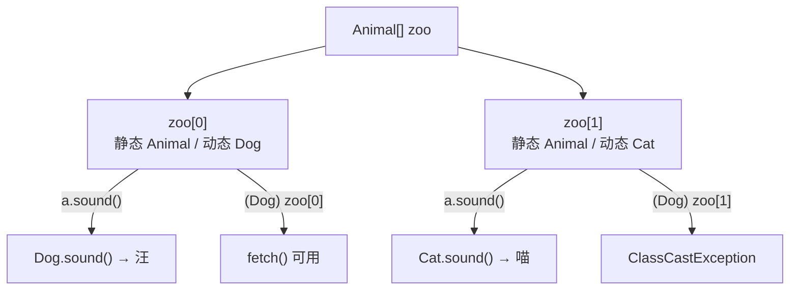

> 这一篇对应官方 Lecture 10（Subtype Polymorphism vs. HoFs）。
> 「给不同类型的对象用同一段逻辑」有两个解法：一是让类型自己会做这件事（多态），二是把「怎么做」当作参数传进去（高阶函数）。
> 这一篇讲清两者的分工，以及 Java 里判断「调用哪个方法」的完整规则。

## 一、钩子：一段 `max` 要写几遍

假设要写一个「取最大」的函数。对 `int` 数组能写，换成 `String` 数组就得再写一遍，换成自定义对象又要再写一遍——代码长得几乎一样，只是比较规则不同。

想要一段逻辑通吃，必须先回答一个问题：**「哪个更大」这件事，由谁决定？**

Java 给了一个答案：把「决定权」抽象成一个接口。

```java
public class DynamicDispatch {
    interface Animal {
        String sound();
    }

    static class Dog implements Animal {
        @Override
        public String sound() {
            return "汪";
        }
        public String fetch() {
            return "捡球";
        }
    }

    static class Cat implements Animal {
        @Override
        public String sound() {
            return "喵";
        }
    }

    public static void main(String[] args) {
        Animal[] zoo = {new Dog(), new Cat()};
        for (Animal a : zoo) {
            System.out.println(a.sound());          // 动态绑定：看实际类型
        }

        // zoo[0].fetch();                          // 编译失败：Animal 里没有 fetch
        System.out.println("强转后：" + ((Dog) zoo[0]).fetch());

        try {
            System.out.println(((Dog) zoo[1]).fetch());   // zoo[1] 实际是 Cat
        } catch (ClassCastException e) {
            System.out.println("错误的强转 -> ClassCastException");
        }
    }
}
```

输出：

```text
汪
喵
强转后：捡球
错误的强转 -> ClassCastException
```

## 二、静态类型与动态类型

上面这段代码里，`a` 的**静态类型**是 `Animal`，**动态类型**是 `Dog` 或 `Cat`。这两个概念分工明确：

| 时刻 | 看哪个类型 | 决定什么 |
| --- | --- | --- |
| 编译期 | 静态类型（声明类型） | 能不能调用某个方法 |
| 运行期 | 动态类型（实际类型） | 实际执行哪个版本的方法 |

两条推论直接来自这张表：

- **`zoo[0].fetch()` 编译不过。** 编译器只认静态类型 `Animal`，而 `Animal` 里没有 `fetch`。
- **`a.sound()` 能跑通，且输出不同结果。** 动态绑定在运行期按实际类型选择实现。

要调用静态类型里没有的方法，必须先显式强转：`((Dog) zoo[0]).fetch()`。但强转只在**运行期**校验——`zoo[1]` 实际是 `Cat`，转成 `Dog` 会抛 `ClassCastException`。所以强转前通常配一个 `instanceof` 判断。



## 三、把比较规则当成参数传进来

理解了「静态类型定可调用性、动态类型定实现」，就能写出通吃的 `max`。

```java
import java.util.Comparator;

public class MaxDemo {
    /** 用 Comparator 找出数组里的最大元素——比较规则由调用方注入 */
    public static <T> T max(T[] a, Comparator<T> cmp) {
        T best = a[0];
        for (int i = 1; i < a.length; i += 1) {
            if (cmp.compare(a[i], best) > 0) {
                best = a[i];
            }
        }
        return best;
    }

    public static void main(String[] args) {
        Integer[] nums = {15, 27, 33, 12};
        System.out.println("自然序最大：" + max(nums, Integer::compareTo));
        System.out.println("按个位最大：" + max(nums, (x, y) -> (x % 10) - (y % 10)));

        String[] words = {"apple", "hi", "banana", "ok"};
        System.out.println("按长度最大：" + max(words, (x, y) -> x.length() - y.length()));
    }
}
```

输出：

```text
自然序最大：33
按个位最大：27
按长度最大：banana
```

同一段 `max`，换一个 `Comparator` 就换了一套语义：

- `Integer::compareTo` 用自然序，最大值是 `33`。
- `(x, y) -> (x % 10) - (y % 10)` 用个位比较，最大值变成 `27`（个位 7 最大）。
- 对字符串按长度比，最大值是 `banana`。

`Comparator<T>` 就是一个**函数对象**：它把「怎么比」打包成一个可以传递的值。这与高阶函数是同一个思路——**Java 用接口承载函数，用 lambda 实现接口**。

| 方案 | 谁决定比较规则 | 新增一种比较方式要改什么 |
| --- | --- | --- |
| 多态（`Comparable`） | 类型自己 | 改类型的 `compareTo`，只此一种 |
| 高阶函数（`Comparator`） | 调用方 | 新写一个 lambda，类型不动 |

这也解释了为什么 Java 同时保留两套：`Comparable` 表达「这个类型的自然顺序」，`Comparator` 表达「这一次我想按什么顺序排」。一个类型只有一种自然序，但可以有无数种排序需求。

## 四、比较器与排序的配合

`Comparator` 也是标准库排序的入口。

```java
import java.util.Arrays;
import java.util.Comparator;

public class SortDemo {
    public static void main(String[] args) {
        String[] words = {"banana", "hi", "apple", "ok", "fig"};

        Arrays.sort(words);
        System.out.println("自然序：      " + Arrays.toString(words));

        Arrays.sort(words, Comparator.comparingInt(String::length));
        System.out.println("按长度升序：  " + Arrays.toString(words));

        Arrays.sort(words, Comparator.comparingInt(String::length).reversed());
        System.out.println("按长度降序：  " + Arrays.toString(words));
    }
}
```

输出：

```text
自然序：      [apple, banana, fig, hi, ok]
按长度升序：  [hi, ok, fig, apple, banana]
按长度降序：  [banana, apple, fig, hi, ok]
```

第二行值得注意：`hi` 和 `ok` 长度都是 2，排序后仍是 `hi` 在前。这是因为 `Arrays.sort` 是**稳定排序**——长度相同时保留它们在上一轮中的相对次序。第三行 `hi` 仍在 `ok` 前，同理。

`Comparator.comparingInt(String::length)` 这一行还展示了接口的另一个用法：**默认方法（default method）**。`Comparator` 接口自带了 `reversed()`、`thenComparing()` 等组合方法，所以比较器可以像积木一样拼装，这正是高阶函数的核心能力。

## 五、小结

| 概念 | 一句话 | 证据 |
| --- | --- | --- |
| 静态类型 | 决定「能调用哪些方法」 | `zoo[0].fetch()` 编译失败 |
| 动态类型 | 决定「实际执行哪个实现」 | 同一 `sound()` 输出 汪 / 喵 |
| 强转 | 运行期校验，失败抛异常 | `(Dog) zoo[1]` → `ClassCastException` |
| 接口即契约 | 只声明能力，不写实现 | `Animal.sound()` 两种实现 |
| `Comparator` | 把比较规则打包成可传递的值 | 换 lambda 即换语义：33 → 27 |
| 组合比较器 | 默认方法支持拼装 | `comparingInt(...).reversed()` |

三条能带走的：

1. **「编译看声明，运行看实际」这八个字概括了 Java 的方法分派。** 遇到「为什么这行编译不过」或者「为什么跑的是那个方法」，都回到这一句。
2. **多态与高阶函数是同一个问题的两种分工。** 前者把变化放在类型里，后者把变化放在调用处。一个类型只有一种自然序，但可以有无数种比较需求，所以 `Comparator` 不可替代。
3. **接口是 Java 表达「函数类型」的手段。** 理解了 `Comparator`，后面遇到 `Runnable`、`Function`、`Predicate` 都是同一回事。
