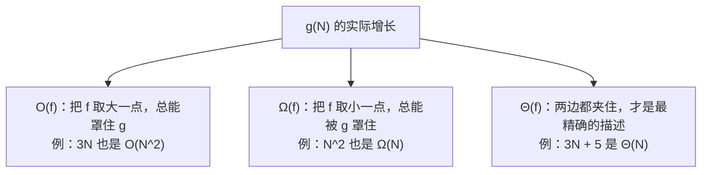
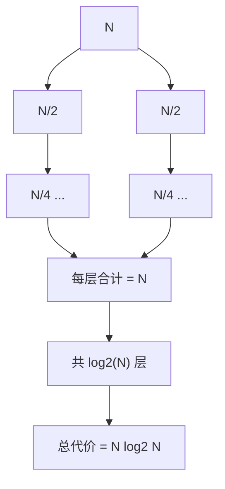

> 这一篇对应官方 Lecture 13（Asymptotics I）与 Lecture 15（Asymptotics II）。
> 「这个算法是 O(N log N)」——这句话到底承诺了什么、没承诺什么，取决于它用的是哪个记号。
> 这一篇把三个记号的定义、化简规则与递归关系的推导连起来，并用操作计数实测一遍。

## 一、钩子：为什么同一句复杂度能有两种理解

先摆出最容易被误用的那句话：**大 O 不是最坏情况。**

`O(N)` 的意思只是「开销的增长速度不超过 N 的某个常数倍」。它在描述**上界**：
- 一个 `Θ(N log N)` 的算法当然也满足 `O(N²)`，因为 `N log N` 的增长确实不超过 `N²`。
- 说「这个算法是 O(N²)」可能是真的，但信息量很小。

要让复杂度描述有用，得区分三个记号。

## 二、三个记号各自承诺什么

| 记号 | 含义 | 通俗说法 | 数学表述 |
| --- | --- | --- | --- |
| `O(f(N))` | 增长**不快于** `f` | 上界 | 存在 `c`、`N₀`，当 `N > N₀` 时 `g(N) ≤ c·f(N)` |
| `Ω(f(N))` | 增长**不慢于** `f` | 下界 | 存在 `c`、`N₀`，当 `N > N₀` 时 `g(N) ≥ c·f(N)` |
| `Θ(f(N))` | 增长**恰好是** `f` 的量级 | 紧确界 | 同时满足上界与下界 |

一张图说清它们的包含关系：



所以在工程表达里，**`Θ` 才是我们真正想说的话**，`O` 常常被当成 `Θ` 用，这是一种历史习惯，但推导时必须分清。

## 三、化简：只留增长最快的项

渐进分析只关心 `N → ∞` 时的增长率，所以两件事可以做：丢掉常数因子、丢掉低阶项。

```java
public class GrowthCount {
    static long ops;

    static void linear(int n) {
        for (int i = 0; i < n; i += 1) {
            ops += 1;
        }
    }

    static void nLogN(int n) {
        for (int k = n; k > 1; k /= 2) {          // 外层 log2(n) 次
            for (int i = 0; i < n; i += 1) {      // 内层 n 次
                ops += 1;
            }
        }
    }

    static void quadratic(int n) {
        for (int i = 0; i < n; i += 1) {
            for (int j = 0; j < n; j += 1) {
                ops += 1;
            }
        }
    }

    public static void main(String[] args) {
        int n = 1024;
        String[] names = {"O(N)", "O(N log N)", "O(N^2)"};

        ops = 0;
        linear(n);
        System.out.println(names[0] + "  N=" + n + " -> 操作数 " + ops);

        ops = 0;
        nLogN(n);
        System.out.println(names[1] + "  N=" + n + " -> 操作数 " + ops);

        ops = 0;
        quadratic(n);
        System.out.println(names[2] + "  N=" + n + " -> 操作数 " + ops);

        System.out.println("log2(1024) = " + (int) (Math.log(n) / Math.log(2)));
    }
}
```

输出：

```text
O(N)  N=1024 -> 操作数 1024
O(N log N)  N=1024 -> 操作数 10240
O(N^2)  N=1024 -> 操作数 1048576
log2(1024) = 10
```

第二行是值得记住的对照：`1024 × 10 = 10240`。外层循环 `k /= 2` 从 1024 降到 1 正好 10 次，也就是 `log₂N`；内层跑满 `N` 次，两者相乘就是 `N log N`。

`N = 1024` 时 `N log N ≈ 10N`，看起来只比线性慢十倍；但 `N` 涨到一百万时，`log₂N ≈ 20`，`N log N` 就是 `20N`。**`log N` 涨得极慢**，这也是为什么 `log` 因子在实践中几乎可以忽略，却不能丢——它决定了「先排序再处理」和「直接处理」是不是同一个量级。

## 四、递归关系：`T(N) = 2T(N/2) + N`

循环好数，递归难数。归并排序的代价可以写成：

```text
T(N) = 2·T(N/2) + N
```

含义是：把规模减半的问题解两遍，再花线性时间把结果合并。用计数程序实测：

```java
public class RecursionCount {
    static long ops;

    /** 归并排序形状的递归关系：T(n) = 2T(n/2) + n */
    static void rec(int n) {
        if (n <= 1) {
            return;
        }
        ops += n;              // 合并阶段的线性代价
        rec(n / 2);
        rec(n / 2);
    }

    public static void main(String[] args) {
        int[] sizes = {64, 128, 256, 512};
        for (int n : sizes) {
            ops = 0;
            rec(n);
            long nLogN = (long) (n * (Math.log(n) / Math.log(2)));
            System.out.println("n = " + n + " -> 总代价 " + ops + "，n log2 n = " + nLogN);
        }
    }
}
```

输出：

```text
n = 64 -> 总代价 384，n log2 n = 384
n = 128 -> 总代价 896，n log2 n = 896
n = 256 -> 总代价 2048，n log2 n = 2048
n = 512 -> 总代价 4608，n log2 n = 4608
```

四行全部精确相等。这不是巧合：取 `N` 为 2 的幂时，递归树有 `log₂N` 层，每层总代价恰好是 `N`，乘积就是 `N log₂N`。**递归关系推出的结果与实测数值一模一样**，这是理解 `O(N log N)` 最直接的方式。

递归树的样子：



## 五、用「翻倍」验证增长阶

判断一个复杂度是否说对了，最实用的手法是：**让 `N` 翻倍，看代价翻几倍。**

```java
public class ScaleCheck {
    static long f1(int n) {
        long c = 0;
        for (int i = 0; i < n; i += 1) {
            c += 1;
        }
        return c;
    }

    static long f2(int n) {
        long c = 0;
        for (int i = 0; i < n; i += 1) {
            for (int j = 0; j < n; j += 1) {
                c += 1;
            }
        }
        return c;
    }

    static long f3(int n) {
        long c = 0;
        for (int k = n; k > 1; k /= 2) {
            for (int i = 0; i < n; i += 1) {
                c += 1;
            }
        }
        return c;
    }

    public static void main(String[] args) {
        System.out.println("     N        O(N)   O(N log N)       O(N^2)");
        int[] sizes = {500, 1000, 2000, 4000};
        for (int n : sizes) {
            System.out.printf("%6d %11d %12d %12d%n", n, f1(n), f3(n), f2(n));
        }
        System.out.println("N 每翻一倍：O(N) 翻 2 倍，O(N log N) 略高于 2 倍，O(N^2) 翻 4 倍");
    }
}
```

输出：

```text
     N        O(N)   O(N log N)       O(N^2)
   500         500         4000       250000
  1000        1000         9000      1000000
  2000        2000        20000      4000000
  4000        4000        44000     16000000
N 每翻一倍：O(N) 翻 2 倍，O(N log N) 略高于 2 倍，O(N^2) 翻 4 倍
```

第三列从 4000 到 9000 是 2.25 倍，从 9000 到 20000 是 2.22 倍。**比 2 倍多一点**，因为 `log N` 也在涨，但它涨得足够慢，指数部分始终被 `N` 主导。这一列就是 `O(N log N)` 的指纹。

## 六、隐藏的常数代价

有几处代价在源码里看不见，但会毁掉复杂度：

- **字符串拼接。** `s = s + c` 每次都新建字符串，循环 `N` 次就是 `O(N²)`。应改用 `StringBuilder`。
- **`substring` 与其他复制型操作。** 每次调用都产生新数组，写在循环里就变成隐藏的乘积。
- **自动装箱。** `List<Integer>` 里每次读写都要在 `int` 与 `Integer` 之间转换，常数因子可观。
- **递归的栈开销。** 时间是 `O(N)`，空间可能是 `O(N)`（递归深度）。

## 七、小结

| 概念 | 一句话 | 证据 |
| --- | --- | --- |
| 大 O | 只承诺上界，不是最坏情况 | 3N 也是 O(N²) |
| 大 Ω / 大 Θ | 下界 / 紧确界 | `3N + 5` 是 Θ(N) |
| 化简 | 丢常数因子与低阶项 | `O(2N)` 即 `O(N)` |
| 递归关系 | `T(N) = 2T(N/2) + N` → `Θ(N log N)` | 实测 384 / 896 / 2048 / 4608 全等于 `n log₂n` |
| 翻倍验证 | `N` 翻倍后代价翻几倍，就是增长阶的证据 | `N log N` 列翻约 2.2 倍 |
| 隐藏代价 | 拼接、复制、装箱都在循环里叠乘 | `s = s + c` 是 `O(N²)` |

三条能带走的：

1. **`Θ` 才是想说的话，`O` 只是习惯用法。** 严格推导时先问「这是上界、下界还是紧确界」。
2. **递归关系的解法就是画递归树：每层的代价 × 层数。** `N log N` 的来源是「`log N` 层、每层 `N`」。
3. **用「翻倍实验」验证复杂度判断。** 理论说不清时，数据会告诉你答案。
