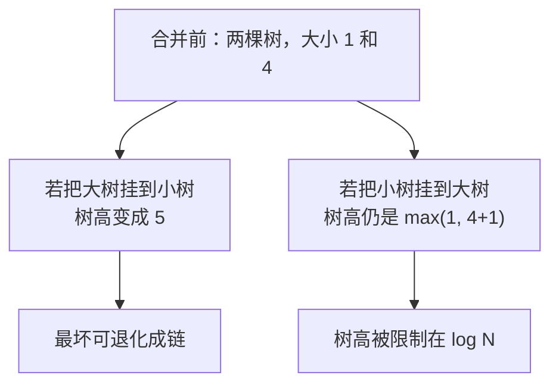

> 这一篇对应官方 Lecture 14（Disjoint Sets）。
> 「这两个元素是否连通」是个看似简单的问题，但要把合并与查询都做得足够快，需要三次关键改进。
> 这一篇用同一组数据把三代实现跑一遍，用查找步数说明每一步改进到底省下了什么。

## 一、钩子：连接会不断加入，怎么随时回答「通不通」

设想一个网络，节点之间不断建立连接。要求是：无论连接怎么加，随时能回答「A 和 B 现在是否连通」。

朴素做法是每次查询都做一次搜索，但连接一多，每次都要重算。并查集换了一个思路：**只维护「谁属于哪个集合」，把连通性变成「是否有同一个根」。**

它只需要两个操作：

| 操作 | 语义 |
| --- | --- |
| `connect(a, b)` | 把 a 与 b 所在的集合合并 |
| `isConnected(a, b)` | 判断 a 与 b 是否在同一集合 |

## 二、第一代：Quick-Find

最直接的想法是开一个 `id[]` 数组，`id[i]` 直接存 `i` 所属集合的编号。

```java
import java.util.Arrays;

public class DisjointSets {
    /** 第一代：Quick-Find，id[] 直接存所属集合的编号 */
    static class QuickFind {
        int[] id;
        long ops = 0;

        QuickFind(int n) {
            id = new int[n];
            for (int i = 0; i < n; i += 1) {
                id[i] = i;
            }
        }

        boolean isConnected(int a, int b) {
            ops += 1;
            return id[a] == id[b];
        }

        void connect(int a, int b) {
            int aid = id[a];
            int bid = id[b];
            for (int i = 0; i < id.length; i += 1) {
                ops += 1;
                if (id[i] == aid) {
                    id[i] = bid;
                }
            }
        }
    }

    /** 第二代：Quick-Union，parent[] 指向父节点，根节点指向自己 */
    static class QuickUnion {
        int[] parent;
        long ops = 0;

        QuickUnion(int n) {
            parent = new int[n];
            for (int i = 0; i < n; i += 1) {
                parent[i] = i;
            }
        }

        int find(int x) {
            while (x != parent[x]) {
                ops += 1;
                x = parent[x];
            }
            return x;
        }

        boolean isConnected(int a, int b) {
            return find(a) == find(b);
        }

        void connect(int a, int b) {
            parent[find(a)] = find(b);
        }
    }

    /** 第三代：加权 Quick-Union，小树挂到大树根下 */
    static class WeightedQuickUnion {
        int[] parent;
        int[] size;
        long ops = 0;

        WeightedQuickUnion(int n) {
            parent = new int[n];
            size = new int[n];
            for (int i = 0; i < n; i += 1) {
                parent[i] = i;
                size[i] = 1;
            }
        }

        int find(int x) {
            while (x != parent[x]) {
                ops += 1;
                x = parent[x];
            }
            return x;
        }

        boolean isConnected(int a, int b) {
            return find(a) == find(b);
        }

        void connect(int a, int b) {
            int ra = find(a);
            int rb = find(b);
            if (ra == rb) {
                return;
            }
            if (size[ra] < size[rb]) {
                parent[ra] = rb;
                size[rb] += size[ra];
            } else {
                parent[rb] = ra;
                size[ra] += size[rb];
            }
        }
    }
}
```

`QuickFind` 的取舍一目了然：`isConnected` 是一次数组比较，O(1)；但 `connect` 必须扫描整个数组把旧的集合编号全部改掉，O(N)。**连接一多，代价就集中到合并上。**

## 三、第二代：Quick-Union

把 `id[]` 换成 `parent[]`，让每个节点指向父节点，根节点指向自己。判断连通就变成「两个节点的根是否相同」。

`connect` 只做一件事：`parent[find(a)] = find(b)`，O(1)。代价转移到了 `find`——它要沿着父指针一路向上，步数等于树高。

代价到底差多少？用同一组「链式连接」实测：

```java
        // 1) 小规模：链式 connect，看 parent 数组长成什么形态
        int small = 8;
        QuickUnion qu = new QuickUnion(small);
        WeightedQuickUnion wqu = new WeightedQuickUnion(small);
        for (int i = 0; i < small - 1; i += 1) {
            qu.connect(i, i + 1);
            wqu.connect(i, i + 1);
        }
        System.out.println("依次 connect(0,1), connect(1,2), ... connect(6,7)：");
        System.out.println("  QuickUnion parent = " + Arrays.toString(qu.parent));
        System.out.println("  Weighted   parent = " + Arrays.toString(wqu.parent));
        System.out.println("  Weighted   size   = " + Arrays.toString(wqu.size));

        // 2) 大规模：同一序列下比较代价
        int n = 4096;
        QuickUnion q2 = new QuickUnion(n);
        WeightedQuickUnion w2 = new WeightedQuickUnion(n);
        for (int i = 0; i < n - 1; i += 1) {
            q2.connect(i, i + 1);
            w2.connect(i, i + 1);
        }
        q2.ops = 0;
        w2.ops = 0;
        for (int i = 0; i < n; i += 1) {
            q2.isConnected(0, i);
            w2.isConnected(0, i);
        }
        QuickFind qf = new QuickFind(n);
        for (int i = 0; i < n - 1; i += 1) {
            qf.connect(i, i + 1);
        }
        System.out.println("N = " + n + "，链式 connect 后做 " + n + " 次 isConnected(0, i)：");
        System.out.println("  QuickUnion 查找步数 = " + q2.ops);
        System.out.println("  Weighted   查找步数 = " + w2.ops);
        System.out.println("  同一序列下 QuickFind 合并步数 = " + qf.ops);
```

输出：

```text
依次 connect(0,1), connect(1,2), ... connect(6,7)：
  QuickUnion parent = [1, 2, 3, 4, 5, 6, 7, 7]
  Weighted   parent = [0, 0, 0, 0, 0, 0, 0, 0]
  Weighted   size   = [8, 1, 1, 1, 1, 1, 1, 1]
N = 4096，链式 connect 后做 4096 次 isConnected(0, i)：
  QuickUnion 查找步数 = 25159680
  Weighted   查找步数 = 4095
  同一序列下 QuickFind 合并步数 = 16773120
```

`QuickUnion` 的 `parent` 数组是 `[1, 2, 3, 4, 5, 6, 7, 7]`——一条不折不扣的链。查找 `0` 必须走 7 步。放大到 `N = 4096` 后，这个链条让 4096 次查询累计走了 **25,159,680** 步。

## 四、第三代：加权合并

问题出在合并策略上。`parent[find(a)] = find(b)` 是「谁先来谁当父节点」，完全不管两棵树的大小，于是很容易长出长链。

改进只有一句：**把小树挂到大树下面。**



为什么树高能压到 `O(log N)`？因为每次一个节点所在树的深度增加 1，说明它所在的树至少翻了一倍（它从小树并入了至少同样大的大树）。一个节点最多只能这样翻 `log₂N` 次。

实测数据很直接：**同一组连接、同一组查询，查找步数从 25,159,680 降到 4,095，相差约 6100 倍。**

三代实现的取舍可以总结成一张表：

| 实现 | `connect` 代价 | `isConnected` 代价 | 最坏情况 |
| --- | --- | --- | --- |
| Quick-Find | O(N) | O(1) | 合并退化 |
| Quick-Union | O(1)（不计 `find`） | O(树高)，最坏 O(N) | 查询退化 |
| 加权 Quick-Union | O(log N) | O(log N) | 树高有上界 |

## 五、路径压缩：查一次，顺手把路径压平

加权合并把树高压到了 `log N`，但还有一层改进空间：**既然查找必须走完整条路径，为什么不顺手把路径上的节点直接挂到根上？**

```java
import java.util.Arrays;

public class PathCompression {
    /** 加权 Quick-Union，不带路径压缩 */
    static class Weighted {
        int[] parent;
        int[] size;
        long ops = 0;

        Weighted(int n) {
            parent = new int[n];
            size = new int[n];
            for (int i = 0; i < n; i += 1) {
                parent[i] = i;
                size[i] = 1;
            }
        }

        int find(int x) {
            while (x != parent[x]) {
                ops += 1;
                x = parent[x];
            }
            return x;
        }

        void connect(int a, int b) {
            int ra = find(a);
            int rb = find(b);
            if (ra == rb) {
                return;
            }
            if (size[ra] < size[rb]) {
                parent[ra] = rb;
                size[rb] += size[ra];
            } else {
                parent[rb] = ra;
                size[ra] += size[rb];
            }
        }
    }

    /** 加权 + 路径压缩：查找时顺手把路径上的节点直接挂到根 */
    static class WeightedCompressed extends Weighted {
        long compressOps = 0;

        WeightedCompressed(int n) {
            super(n);
        }

        @Override
        int find(int x) {
            int root = x;
            while (root != parent[root]) {
                ops += 1;
                root = parent[root];
            }
            while (x != root) {
                int nxt = parent[x];
                if (parent[x] != root) {
                    parent[x] = root;
                    compressOps += 1;
                }
                x = nxt;
            }
            return root;
        }
    }

    public static void main(String[] args) {
        int n = 16;
        // 先两两合并，再逐层合并，构造一棵高度为 log2(n) 的平衡树
        int[][] pairs = {{0, 1}, {2, 3}, {4, 5}, {6, 7}, {8, 9}, {10, 11}, {12, 13}, {14, 15},
                         {0, 2}, {4, 6}, {8, 10}, {12, 14}, {0, 4}, {8, 12}, {0, 8}};

        Weighted a = new Weighted(n);
        WeightedCompressed b = new WeightedCompressed(n);
        for (int[] p : pairs) {
            a.connect(p[0], p[1]);
            b.connect(p[0], p[1]);
        }
        System.out.println("平衡合并后 parent = " + Arrays.toString(a.parent));

        a.ops = 0;
        a.find(7);
        System.out.println("无压缩 find(7) 第 1 次步数 = " + a.ops);

        b.ops = 0;
        b.compressOps = 0;
        b.find(7);
        System.out.println("有压缩 find(7) 第 1 次：走链 " + b.ops + " 步，改写 " + b.compressOps + " 个指针");
        System.out.println("有压缩 parent（压缩后）= " + Arrays.toString(b.parent));

        b.ops = 0;
        b.find(7);
        System.out.println("有压缩 find(7) 第 2 次步数 = " + b.ops);
    }
}
```

输出：

```text
平衡合并后 parent = [0, 0, 0, 2, 0, 4, 4, 6, 0, 8, 8, 10, 8, 12, 12, 14]
无压缩 find(7) 第 1 次步数 = 3
有压缩 find(7) 第 1 次：走链 3 步，改写 2 个指针
有压缩 parent（压缩后）= [0, 0, 0, 2, 0, 4, 0, 0, 0, 8, 8, 10, 8, 12, 12, 14]
有压缩 find(7) 第 2 次步数 = 1
```

先看第一行 `parent` 数组：路径 `7 → 6 → 4 → 0`，高度 3，正好是 `log₂16`。这就是加权合并的效果。

再看压缩后的数组：`parent[7]` 和 `parent[6]` 都变成了 `0`。**第一次查找走 3 步，第二次只需要 1 步。** 压缩的代价是写几个指针，收益是后续所有经过这条路径的查询都变快。

把两者叠加，均摊后的查找代价接近常数——精确上界是阿克曼反函数 `α(N)`，对任何现实规模的输入都不超过 5，可以当作 O(1) 处理。

## 六、小结

| 概念 | 一句话 | 证据 |
| --- | --- | --- |
| Quick-Find | 查找 O(1)，合并 O(N) | 4095 次链式合并共 16,773,120 步 |
| Quick-Union | 合并 O(1)，查找 O(树高) | 链式合并后 `parent = [1..7, 7]` |
| 加权合并 | 小树挂大树，树高降到 O(log N) | 查找步数 25,159,680 → 4,095 |
| 路径压缩 | 查找时把路径上节点挂到根 | 第二次 `find(7)` 从 3 步降到 1 步 |
| 叠加效果 | 均摊接近 O(1)，上界为 α(N) | α(N) 在现实中 ≤ 5 |

三条能带走的：

1. **数据结构的最坏情况由「合并策略」决定，不是由存储形式决定。** `parent[]` 数组本身没问题，出问题的是「谁当父节点」这条规则。
2. **加权给出的是可证明的上界，压缩给出的是实践中的常数。** 两者叠加才得到几乎常数的操作代价。
3. **「顺手做一件额外的事」是经典优化模式。** 查找本来就要走这条路径，压缩是零边际成本的改进——这类机会在实现里值得刻意去找。
