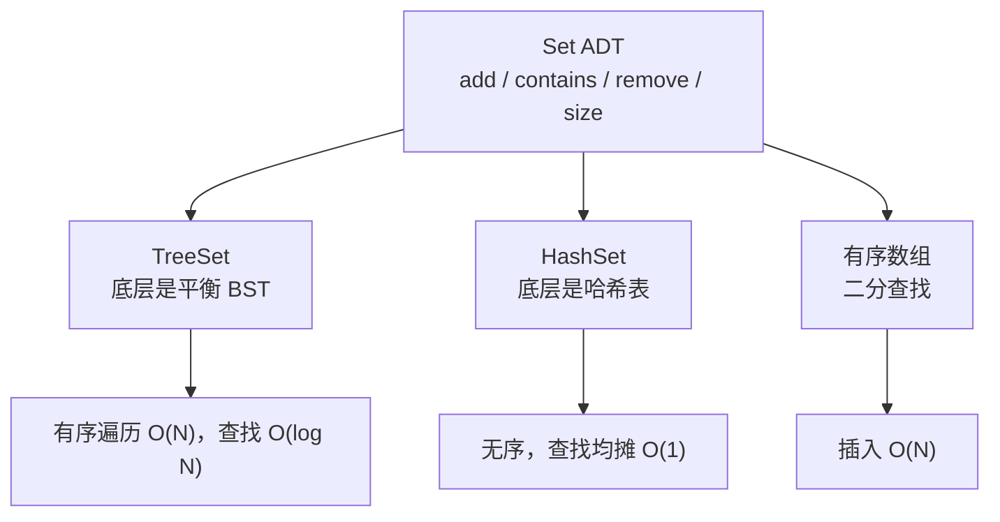
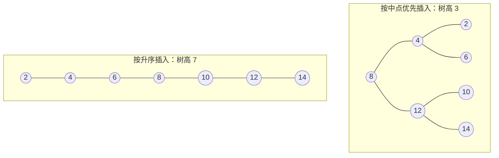

> 这一篇对应官方 Lecture 16（ADTs, Sets, Maps, BSTs）。
> 把「要什么」和「怎么做」分开，是数据结构设计里最基本的一条纪律。
> 这一篇先讲抽象数据类型的边界，再用二叉搜索树作为第一个有序实现，并实测它最怕的输入。

## 一、钩子：`Set` 到底是「什么」

问一个问题：`Set` 和 `ArrayList` 有什么区别？

如果回答「`Set` 不能重复、`ArrayList` 可以」，这只说对了一半。更准确的说法是：**`Set` 是一个抽象数据类型（ADT），它只规定行为，不规定实现。**

| 层面 | 内容 | 例子 |
| --- | --- | --- |
| ADT（要什么） | 只描述可用的操作与语义 | `add`、`contains`、`remove`、`size` |
| 数据结构（怎么做） | 具体的内存布局与算法 | 二叉搜索树、哈希表、跳表、有序数组 |

一个 `Set` ADT 可以用 BST 实现，也可以用哈希表实现。调用方只依赖 ADT，实现可以整个换掉。这也是为什么 Java 的 `Set` 是个接口，`TreeSet` 与 `HashSet` 是两个不同的实现。



## 二、二叉搜索树的有序性质

BST 是「有序集合」最直接的实现。它的约束只有一句：

**左子树里所有键都小于根，右子树里所有键都大于根。**

注意「所有」两个字。约束的是**整棵子树**，不是相邻的两个节点。这决定了查找可以像二分一样，每比较一次就丢掉一半。

```java
public class BST {
    static class Node {
        int key;
        Node left;
        Node right;
        Node(int k) {
            key = k;
        }
    }

    private Node root;
    /** 累计比较次数，用于对照不同插入顺序下的查找代价 */
    public long compares = 0;

    public void insert(int k) {
        root = insert(root, k);
    }

    private Node insert(Node n, int k) {
        if (n == null) {
            return new Node(k);
        }
        compares += 1;
        if (k < n.key) {
            n.left = insert(n.left, k);
        } else if (k > n.key) {
            n.right = insert(n.right, k);
        }
        return n;                       // 重复键直接忽略
    }

    public boolean contains(int k) {
        Node n = root;
        while (n != null) {
            compares += 1;
            if (k == n.key) {
                return true;
            }
            n = (k < n.key) ? n.left : n.right;
        }
        return false;
    }

    public int height() {
        return height(root);
    }

    private int height(Node n) {
        return (n == null) ? 0 : 1 + Math.max(height(n.left), height(n.right));
    }

    public String inOrder() {
        StringBuilder sb = new StringBuilder();
        inOrder(root, sb);
        return sb.toString().trim();
    }

    private void inOrder(Node n, StringBuilder sb) {
        if (n == null) {
            return;
        }
        inOrder(n.left, sb);
        sb.append(n.key).append(" ");
        inOrder(n.right, sb);
    }
}
```

`insert` 与 `contains` 共用同一条逻辑：从根出发，比当前节点小就往左，大就往右，相等就停下。**一条路径走到底，比较次数等于树高。**

## 三、中序遍历是 BST 的指纹

有个不用看结构就能验证 BST 是否正确的方法：中序遍历。

```java
        int[] balancedOrder = {8, 4, 12, 2, 6, 10, 14};
        int[] sortedOrder = {2, 4, 6, 8, 10, 12, 14};

        BST b1 = new BST();
        for (int k : balancedOrder) {
            b1.insert(k);
        }
        System.out.println("按「中点优先」插入：height = " + b1.height());
        System.out.println("  中序遍历 = " + b1.inOrder());
        b1.insert(8);                   // 重复键被忽略
        System.out.println("  重复插入 8 后 height = " + b1.height());

        BST b2 = new BST();
        for (int k : sortedOrder) {
            b2.insert(k);
        }
        System.out.println("按升序插入：      height = " + b2.height());
        System.out.println("  中序遍历 = " + b2.inOrder());

        b1.compares = 0;
        b2.compares = 0;
        for (int k = 2; k <= 14; k += 2) {
            b1.contains(k);
            b2.contains(k);
        }
        System.out.println("查询 7 个键的比较次数：中点优先 = " + b1.compares + "，升序 = " + b2.compares);
        System.out.println("链式退化下 N 个键总比较次数 = N(N+1)/2 = " + (7 * 8 / 2));
```

输出：

```text
按「中点优先」插入：height = 3
  中序遍历 = 2 4 6 8 10 12 14
  重复插入 8 后 height = 3
按升序插入：      height = 7
  中序遍历 = 2 4 6 8 10 12 14
查询 7 个键的比较次数：中点优先 = 17，升序 = 28
链式退化下 N 个键总比较次数 = N(N+1)/2 = 28
```

两个重要观察：

- **两棵树的中序序列完全一样。** 不管怎么插入，中序遍历都输出升序。这就是 BST 的指纹，也是判定实现是否正确的第一道检查。
- **重复插入 `8` 后树高仍是 3。** `insert` 里对相等的处理是直接返回 `n`，不新建节点，所以重复键被忽略。

## 四、退化：BST 最怕的输入

看第四行：按升序插入同样的 7 个键，树高从 3 变成了 7。

原因在于插入顺序。每次新键都比所有已有键大，它必然接在最右侧——树长成一条链：



后果直接体现在比较次数上：

| 插入顺序 | 树高 | 查询 7 个键的总比较次数 |
| --- | --- | --- |
| 中点优先 | 3 | 17 |
| 升序 | 7 | 28 |

**升序插入让查找退化成链表上的线性扫描。** 链式情况下，第 `k` 个键要比较 `k` 次，总数就是 `1 + 2 + … + N = N(N+1)/2`，实测的 28 与输出最后一行的 `7 × 8 / 2 = 28` 完全一致。

这就是 BST 的致命弱点：**它的性能依赖输入顺序，而输入顺序不由你控制。** 用户按字典序上传数据、数据库按主键导出——任何有序输入都会让 BST 退化成 O(N)。

三代改进的方向很清楚：

| 方案 | 思路 | 代价 |
| --- | --- | --- |
| 随机插入 | 把输入顺序打乱 | 无法控制外部输入 |
| 平衡 BST（AVL / 红黑树） | 插入后旋转，强制树高 O(log N) | 实现复杂度上升 |
| B 树 | 节点存多个键，降低树高 | 结构更复杂，但更适合磁盘 |

## 五、小结

| 概念 | 一句话 | 证据 |
| --- | --- | --- |
| ADT vs 实现 | ADT 规定行为，实现可换 | `Set` 可由 BST 或哈希表实现 |
| BST 性质 | 整棵左子树小于根，整棵右子树大于根 | `contains` 只需走一条路径 |
| 中序遍历 | 输出升序，是 BST 的指纹 | 两棵树输出相同序列 |
| 重复键 | 相等即返回，不新建节点 | 重复插入 8 后树高不变 |
| 退化 | 有序插入使树高等于 N | height 3 → 7 |
| 退化代价 | 查找总次数 `N(N+1)/2` | 实测 28，与公式一致 |

三条能带走的：

1. **先分清 ADT 与实现，再谈数据结构。** 「需要什么操作」和「用什么结构」是两个独立问题，混在一起想就会过早绑定实现。
2. **中序遍历是验证 BST 最快的手段。** 输出非升序，结构一定有问题。
3. **BST 的性能取决于输入顺序，这不是实现缺陷而是定义决定的。** 解决它的唯一出路是让结构自己维持平衡，这也是后续所有平衡树的出发点。
