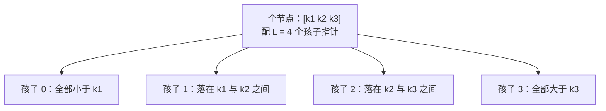
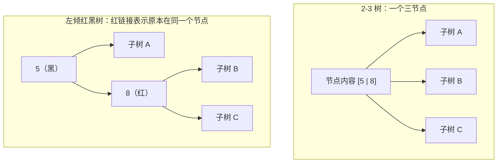

## 一、树高就是访问次数

这一篇对应官方 Lecture 17 & 18（B-Trees & Red-Black Trees）。

先算一笔账。假设要在一百万个键里查找，而树是用节点和指针串起来的：

| 树高 | 一次查找要访问的节点数 | 实际感受 |
| --- | --- | --- |
| 20 | 20 | 全部节点大概率还在缓存里，很快 |
| 1000 | 1000 | 每次访问都可能是一次缓存缺失，开始变慢 |
| 1000000 | 1000000 | 退化成逐条扫描 |

关键在第三行的来源。如果把键按升序逐个插入一棵普通的二叉搜索树，每个新键都比已有的所有键大，于是它永远挂在最右侧，树长成一条链——**树高等于键的个数**。

这就是 BST 的软肋：**它的形状由输入顺序决定，而输入顺序不由你控制。** 从数据库按主键导出的数据、按字典序上传的文件、按时间戳生成的 ID，全都是有序列。

所以后续所有结构的目标可以写成同一句话：**让树高保持在对数级别，且不依赖输入顺序。**

## 二、B 树：一个节点装多个键

第一条思路很直接：既然每下一层都要付一次访问代价，那就让一次访问多办一点事。

**B 树不再限制一个节点只放一个键，而是允许一个节点放 L-1 个键、挂 L 个孩子。**



节点内部的键有序排列，孩子被这些键切成若干区间。查找时在一层之内先用一次顺序比较定位区间，再顺着对应的孩子往下走。

B 树的两条结构约束：

1. **每个节点最多 L-1 个键**，超过就分裂；
2. **所有叶节点处在同一深度**，没有例外。

第二条是整个结构能保持平衡的根本原因。它不是靠旋转去修补形状，而是从一开始就只允许「所有叶同深」这一种形态。

## 三、插入：分裂是唯一的增高方式

插入的流程可以用一句话概括：**一路下降到叶节点，途中遇到装满的节点就先劈开。**

为什么要在下降途中提前劈？因为这样能保证真正插入时，叶子一定有空间，不需要再往回退。

```java
    public void insert(int k) {
        if (root.n == maxKeys) {            // 根满，先抬升一层
            Node newRoot = new Node(maxKeys);
            newRoot.leaf = false;
            newRoot.children[0] = root;
            splitChild(newRoot, 0);
            root = newRoot;
        }
        insertNonFull(root, k);
    }

    /** 前提：node.n < maxKeys，路径上不会溢出 */
    private void insertNonFull(Node node, int k) {
        if (node.leaf) {
            int i = node.n - 1;
            while (i >= 0 && node.keys[i] > k) {
                node.keys[i + 1] = node.keys[i];
                i--;
            }
            node.keys[i + 1] = k;
            node.n++;
            return;
        }
        int i = node.n - 1;
        while (i >= 0 && node.keys[i] > k) {
            i--;
        }
        i++;
        if (node.children[i].n == maxKeys) {
            splitChild(node, i);
            if (node.keys[i] < k) {
                i++;
            }
        }
        insertNonFull(node.children[i], k);
    }
```

分裂的动作是把一个装满了的节点从中间切开，**中位键升进父节点**，左半边和右半边各留下若干个键：

```java
    /** 把 parent.children[i] 从中间劈成两半，中位键升入 parent */
    private void splitChild(Node parent, int i) {
        Node child = parent.children[i];
        int mid = child.n / 2;
        int median = child.keys[mid];

        Node right = new Node(maxKeys);
        right.leaf = child.leaf;
        int rn = child.n - mid - 1;
        for (int j = 0; j < rn; j++) {
            right.keys[j] = child.keys[mid + 1 + j];
        }
        if (!child.leaf) {
            for (int j = 0; j <= rn; j++) {
                right.children[j] = child.children[mid + 1 + j];
            }
        }
        right.n = rn;
        child.n = mid;

        for (int j = parent.n; j > i; j--) {
            parent.keys[j] = parent.keys[j - 1];
        }
        for (int j = parent.n + 1; j > i + 1; j--) {
            parent.children[j] = parent.children[j - 1];
        }
        parent.keys[i] = median;
        parent.children[i + 1] = right;
        parent.n++;
    }
```

这里有一个非常关键的性质：**分裂只会把中位键往上送，左右两侧的深度完全一致。因此树高只在根节点分裂时才加一，而根分裂会让所有叶同时下沉一层。** 于是「所有叶同深」这条约束在整个插入过程中自动成立，不需要任何额外的修复步骤。

## 四、实测 B 树的高度

用一个节点最多放 3 个键的 B 树（即 L = 4）升序插入 1 到 10：

```java
    public static void main(String[] args) {
        BTree t = new BTree(3);
        for (int k = 1; k <= 10; k++) {
            t.insert(k);
        }
        System.out.println("每个节点最多 3 个键，升序插入 1..10 后的结构：");
        System.out.print(t.levelOrder());
        System.out.println("树高 = " + t.height() + "，节点数 = " + t.countNodes()
                + "，插入过程中单节点最大键数 = " + t.maxKeysEver + "（上限 3）");
        System.out.println("叶节点深度集合 = " + t.leafDepths() + "（只有一个值说明所有叶同深）");
    }
```

```text
每个节点最多 3 个键，升序插入 1..10 后的结构：
  level 0: [4]
  level 1: [2] [6 8]
  level 2: [1] [3] [5] [7] [9 10]
树高 = 3，节点数 = 8，插入过程中单节点最大键数 = 3（上限 3）
叶节点深度集合 = [2]（只有一个值说明所有叶同深）
```

三行输出对应三条验证：

- **`单节点最大键数 = 3（上限 3）`**：分裂逻辑在整个插入过程中都没有让任何节点越界，也没有提前浪费空间；
- **`叶节点深度集合 = [2]`**：集合里只有一个值，说明所有叶子确实在同一层；
- **叶子上的键并不均匀**（`[9 10]` 比 `[1]` 多），但**深度一定相同**——平衡约束管的是深度，不是键的数量。

把规模放大，对比就更直观了：

```java
        System.out.println("升序插入 N 个键后的树高对比（B 树单节点上限 7 个键）：");
        int[] ns = {1000, 10000, 100000, 1000000};
        for (int n : ns) {
            BTree b = new BTree(7);
            for (int k = 1; k <= n; k++) {
                b.insert(k);
            }
            String bst;
            if (n <= 10000) {
                bst = String.valueOf(sortedInsertBstHeight(n));
            } else {
                bst = "不适用（高度 = N，构造需约 "
                        + String.format("%.0e", n * (double) n / 2) + " 次比较）";
            }
            System.out.println("N = " + n + "   B 树高度 = " + b.height()
                    + "   朴素 BST 高度 = " + bst);
        }
```

```text
升序插入 N 个键后的树高对比（B 树单节点上限 7 个键）：
N = 1000   B 树高度 = 5   朴素 BST 高度 = 1000
N = 10000   B 树高度 = 7   朴素 BST 高度 = 10000
N = 100000   B 树高度 = 8   朴素 BST 高度 = 不适用（高度 = N，构造需约 5e+09 次比较）
N = 1000000   B 树高度 = 10   朴素 BST 高度 = 不适用（高度 = N，构造需约 5e+11 次比较）
```

一百万这个量级值得停一下：

- **B 树高度是 10。** 同样是有序输入，同样是升序插入，树高从一百万压到十，一次查找最多访问 10 个节点。
- **B 树那一列为什么不是整数倍增长？** 因为 N 每涨 10 倍，高度只涨 1 到 2 层——这正是对数增长的样子，高度大致落在 log₄ N 到 log₈ N 之间。
- **朴素 BST 那一列在大 N 处写「不适用」不是回避。** 有序插入让每次插入都要走到当前最右端，总比较次数是 N(N+1)/2 的量级：N = 10000 时约 5×10⁷ 次尚可接受，N = 1000000 时约 5×10¹¹ 次，构造这棵树本身就已经不可行。**树高退化的代价，首先体现在构造上。**

## 五、红黑树：把宽节点折回二叉树

B 树好用，但它有一个工程上的代价：节点里存的是键的数组，插入和分裂都要搬动数组元素。如果场景要求**每个节点只有一个键、两个指针**——比如很多语言里表示树的接口就是这样——B 树没法直接用。

那能不能把 B 树的形状，用纯二叉树表示出来？

可以。做法是：**把 B 树里同一个节点的多个键，拆成二叉树里一串用「红色链接」相连的节点。**



对照图里可以读出一个精确的对应关系：

| 2-3 树 | 左倾红黑树 |
| --- | --- |
| 二节点（1 个键，2 个孩子） | 一个黑节点，左右两条黑链接 |
| 三节点（2 个键，3 个孩子） | 一黑一红两个节点，红链接指向小的那个 |
| 节点内的两个键 | 红链接连接的两个节点 |
| 树高 | 黑链接的层数 |

**树高对应的是黑链接的层数，不是红黑节点总数。** 这句话是理解红黑树全部复杂度的钥匙：红色的节点只是「挂在同一个 B 树节点里的额外键」，它不增加 B 树意义上的层数。

所以红黑树不是「另一种平衡树」，它就是 **2-3 树换了一个二叉表示**。理解 2-3 树之后，红黑树的那些旋转规则不再是需要背诵的条文，而是维护这个对应关系时必须做的修补。

## 六、左倾红黑树的三条修复规则

规定红色链接一律**向左倾**（红节点只能作为左子出现），就可以把「三节点」这一种形状写死，规则数量随之收敛到三条。

插入的骨架和普通 BST 完全一样，差别只在回溯时多加三段判断：

```java
    private Node insert(Node h, int k) {
        if (h == null) {
            return new Node(k, true);       // 新键一律先挂红链接
        }
        if (k < h.key) {
            h.left = insert(h.left, k);
        } else if (k > h.key) {
            h.right = insert(h.right, k);
        }
        if (isRed(h.right) && !isRed(h.left)) {
            h = rotateLeft(h);              // 规则一：红的跑到右边了，掰回左边
        }
        if (isRed(h.left) && isRed(h.left.left)) {
            h = rotateRight(h);             // 规则二：左边连着两条红，右旋拆开
        }
        if (isRed(h.left) && isRed(h.right)) {
            flipColors(h);                  // 规则三：两侧都红，合并成一个临时的四节点
        }
        return h;
    }
```

三条规则各对应一个操作：

```java
    private Node rotateLeft(Node h) {
        Node x = h.right;
        h.right = x.left;
        x.left = h;
        x.red = h.red;
        h.red = true;
        rotations++;
        return x;
    }

    private Node rotateRight(Node h) {
        Node x = h.left;
        h.left = x.right;
        x.right = h;
        x.red = h.red;
        h.red = true;
        rotations++;
        return x;
    }

    private void flipColors(Node h) {
        h.red = true;
        h.left.red = false;
        h.right.red = false;
    }
```

按 2-3 树的视角读它们，含义立刻清楚了：

| 规则 | 代码动作 | 2-3 树里的含义 |
| --- | --- | --- |
| 一 | 左旋 | 三节点写反了方向，把小的那个摆到上面 |
| 二 | 右旋 | 同一个节点里挤了三个键，必须拆成两个节点 |
| 三 | 变色 | 三节点升级成四节点，或者四节点分裂后把中间键交给父节点 |

真实的形状变化，看升序插入 1 到 6 的结果（`*` 表示该节点由红链接指向）：

```text
升序插入 1..6 后的分层结构（* 表示该节点由红链接指向）：
  level 0: 4
  level 1: 2* 6
  level 2: 1 3 5*
  树高 = 3，旋转次数 = 4，黑高 = 3

继续插入 7 之后：
  level 0: 4
  level 1: 2 6
  level 2: 1 3 5 7
  树高 = 3，旋转次数 = 4，黑高 = 4
```

第一棵树里，`2*` 和 `5*` 是红节点：`4` 与 `2` 在 2-3 树里其实是同一个节点（一个三节点），`6` 与 `5` 同理。插入 `7` 之后三条规则依次触发，两处红链接被变色消掉，整棵树变成全黑——**对应到 2-3 树，就是两个三节点各自升级又分裂，中间键上交给根**。注意树高没变，仍然 3 层，但它容纳的键从 6 个变成了 7 个。

## 七、不变量校验与实测高度

红黑树的正确性可以拆成三条能机械检查的不变量：

1. **所有根到空指针的路径上，黑节点个数相同**（等价于 B 树的所有叶同深）；
2. **不存在父子连红**（不允许出现一个节点里挤了三个以上键）；
3. **红链接一律左倾**（形状标准化，避免重复表示）。

```java
        System.out.println("不变量校验（升序插入 N 个键）：");
        int[] ns = {1000, 100000, 1000000};
        for (int n : ns) {
            LLRB x = new LLRB();
            for (int k = 1; k <= n; k++) {
                x.insert(k);
            }
            System.out.println("N = " + n
                    + "   高度 = " + x.height()
                    + "   黑高 = " + x.blackHeightOrFail()
                    + "   全部左倾 = " + x.leftLeaningOk()
                    + "   无父子连红 = " + x.noDoubleRed()
                    + "   旋转次数 = " + x.rotations);
        }
```

```text
不变量校验（升序插入 N 个键）：
N = 1000   高度 = 10   黑高 = 10   全部左倾 = true   无父子连红 = true   旋转次数 = 991
N = 100000   高度 = 17   黑高 = 17   全部左倾 = true   无父子连红 = true   旋转次数 = 99984
N = 1000000   高度 = 20   黑高 = 20   全部左倾 = true   无父子连红 = true   旋转次数 = 999981

理论高度上界 2*log2(N+1)：N = 1000000 时约为 40
```

四个可以读出来的结论：

- **三项不变量在三个规模上全部成立。** 前两列是校验结果，`true` 不是随手写的，是逐节点走完全树检查出来的。
- **黑高与树高相等。** 这说明这几棵树里一个红节点都没有——有序插入在这种修复规则下恰好长成了完全平衡的形态。红链接出现于插入过程的中间状态，落定后可能被变色消掉。
- **高度 20，上界 40。** 红黑树的经典结论是树高不超过 2·log₂(N+1)，实测值远低于这个宽松的上界，但没有任何一次超过它。
- **旋转次数约等于插入次数。** 一百万次插入对应 999981 次旋转，平均每次插入不到 1 次旋转，而且旋转只改指针不动数据。**这正是红黑树在工程上比「插入后重新平衡整棵子树」更受欢迎的原因。**

## 八、小结

同样是升序插入一百万个键，三种结构的实测高度：

| 结构 | 高度 | 一次查找的节点访问次数 | 说明 |
| --- | --- | --- | --- |
| 朴素 BST | 1000000 | 1000000 | 退化成链，构造本身需约 5×10¹¹ 次比较 |
| B 树（L = 8） | 10 | 10 | 节点宽，层数压到最低，适合块设备 |
| 左倾红黑树 | 20 | 20 | 纯二叉表示，旋转次数约等于插入次数 |

| 概念 | 一句话 | 证据 |
| --- | --- | --- |
| BST 退化 | 形状由输入顺序决定，有序输入等于链 | 升序插入高度 = N |
| B 树平衡 | 所有叶同深，靠分裂维持，不靠旋转 | 叶深度集合只有一个值 |
| 分裂方向 | 中位键上行，两侧同深，只有根分裂才增高 | 单节点最大键数始终等于上限 |
| 红链接 | 记录「原本在同一个 B 树节点里」 | 2-3 树三节点对应一黑一红 |
| 黑高 | 黑链接层数才是 B 树意义上的高度 | 黑高与树高同为 20 |
| 旋转代价 | 只改指针，均摊不到 1 次/插入 | 1e6 次插入对应 999981 次旋转 |

三条能带走的：

1. **压住树高的手段有两类：把节点做宽，或者把形状标准化。** B 树选前者，红黑树选后者；后者是前者的二叉表示，所以理解了 2-3 树，红黑树的规则就不再需要硬记。
2. **平衡的本质是「所有叶同深」这一条约束，而不是某一种具体操作。** B 树用分裂维持它，红黑树用旋转和变色维持它，检查手段却可以统一成「根到空的路径上黑节点数是否相同」。
3. **不要只看最终的高度指标，要看维护这个高度要付什么代价。** 朴素 BST 什么也不用维护，代价是形状失控；红黑树每次插入分摊不到一次旋转，代价是代码复杂度——工程选型就是在两者之间取平衡。
