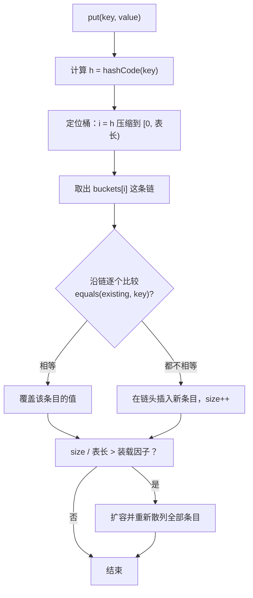

## 一、一次查找花在哪一步

这一篇对应官方 Lecture 19（Hashing）。

想在一堆键里找一个键，已知的最快方式是二分查找：每比较一次丢掉一半，代价是 log N 次比较。但它有前提——**数据必须有序**，而且插入新键要挪动数组。

哈希表换了个思路：**不算比较次数，直接算出这个键应该在哪。** 如果算得足够均匀，一次定位就能找到目标所在的格子，查找代价从 O(log N) 降到 O(1)。

代价也随之转移了：

| 环节 | 承担后果 |
| --- | --- |
| 散列函数不够均匀 | 大量键挤进同一个桶，退化成链表 |
| 装载因子过高 | 链变长，查找退化 |
| 键的相等语义和散列值不一致 | 明明在表里却查不到 |

这一篇的核心结论可以提前说：**哈希表能不能达到 O(1)，不取决于表本身，取决于上面这三件事有没有处理对。**

## 二、一次 put 的完整路径

一次 `put(key, value)` 分两步，一步都不能少。



图里有两处细节值得单独说：

- **散列不参与判断「是不是同一个键」，只有 equals 参与。** 散列值只用来决定「去哪个桶里找」。所以散列值相同不等于键相等，这是后面所有契约问题的根源。
- **扩容是整个表一起动的。** 表长变了，原来算出来的桶下标全部失效，必须把每个条目重新散列一遍。

## 三、散列函数：从直接取模到混合

最朴素的散列函数是取模：

```java
    /** 直接取模：表长与键共享因子时分布会塌陷 */
    static int naiveIndex(int key, int cap) {
        return key % cap;
    }

    /** 先做一步乘法混合，再取高位，把低位规律打散 */
    static int mixedIndex(int key, int cap) {
        long h = key * 2654435761L;
        return ((int) (h >>> 32)) & (cap - 1);
    }
```

取模看起来已经很好了，只要键是随机的，它就能把键均匀撒开。问题在于**真实的键往往不是随机的**，它们常常带着规律，而取模会把规律原样保留下来。

实测：表长 1024，插入 4096 个键，每个键都是 1024 的整数倍。

```java
    public static void main(String[] args) {
        final int cap = 1024;
        final int n = 4096;
        int[] keys = new int[n];
        for (int i = 0; i < n; i++) {
            keys[i] = (i + 1) * cap;         // 每个键都是表长的整数倍
        }

        int[] naiveBuckets = new int[cap];
        int[] mixedBuckets = new int[cap];
        for (int k : keys) {
            naiveBuckets[naiveIndex(k, cap)]++;
            mixedBuckets[mixedIndex(k, cap)]++;
        }
        System.out.println("表长 = " + cap + "，插入 " + n + " 个键（每个键都是 " + cap + " 的整数倍）");
        System.out.println("  键值直接取模    ：被占用的桶数 = " + countNonZero(naiveBuckets)
                + "，最长链 = " + max(naiveBuckets));
        System.out.println("  乘法混合后取高位：被占用的桶数 = " + countNonZero(mixedBuckets)
                + "，最长链 = " + max(mixedBuckets));
    }
```

```text
表长 = 1024，插入 4096 个键（每个键都是 1024 的整数倍）
  键值直接取模    ：被占用的桶数 = 1，最长链 = 4096
  乘法混合后取高位：被占用的桶数 = 1024，最长链 = 5
```

差距是碾压性的：

| 散列方式 | 被占用的桶数 | 最长链 | 一次失败查找要比较的条目数 |
| --- | --- | --- | --- |
| 键值直接取模 | 1 | 4096 | 4096 |
| 乘法混合后取高位 | 1024 | 5 | 5 |

**直接取模的结果是「整张表退化成一个桶」。** 原因很直白：每个键都等于 1024 的整数倍，`key % 1024` 恒等于 0，4096 个键全部挤进 0 号桶，查找变成在这条 4096 长的链上线性扫描。

乘法混合的做法是先乘一个大奇数把结果打散到 64 位空间，再取**高位**——低位里的规律被乘法扩散到了整条链上，取高位拿到的是混合之后的比特，不再保留「都是 1024 的倍数」这个特征。

真实的哈希表实现里，`java.util.HashMap` 就是先调用 `key.hashCode()`，再做一次异或移位把高低位混合，最后按位与取低位。**原因和这里一样：不能让键里原有的规律直接决定落桶位置。**

## 四、实测：坏散列函数下的真实代价

把上面的键真的插进一张链地址法的表，然后逐个查询，统计每次查询沿链走过多少个节点：

```java
    public void put(int key, int value) {
        int i = naiveIndex(key, buckets.length);
        for (Entry e = buckets[i]; e != null; e = e.next) {
            if (e.key == key) {
                e.value = value;
                return;
            }
        }
        buckets[i] = new Entry(key, value, buckets[i]);
        size++;
        if ((double) size / buckets.length > 0.75) {
            resize();
        }
    }

    private void resize() {
        Entry[] old = buckets;
        buckets = new Entry[old.length * 2];
        resizes++;
        for (Entry head : old) {
            Entry e = head;
            while (e != null) {
                Entry nxt = e.next;
                int i = naiveIndex(e.key, buckets.length);
                e.next = buckets[i];
                buckets[i] = e;
                e = nxt;
                rehashMoves++;
            }
        }
    }
```

```text
用「键值直接取模」建表并查询 4096 个键：
  最终桶数 = 8192，元素数 = 4096，扩容次数 = 3
  被占用的桶数 = 8，最长链 = 512
  查询走过 1050624 个节点，平均每次 256.50 个
```

这张表最终有 8192 个桶、4096 个元素，按均匀分布每桶应该只挂 0 到 1 个。实际情况是：

- **被占用的桶只有 8 个。** 所有元素挤在这 8 条链上。原因是扩容只是把表长翻倍，而键始终是 1024 的倍数，翻倍之后仍然是表长的整数倍，取模依然是 0——**扩容救不了坏散列函数。**
- **4096 ÷ 8 = 512**，正好是实测的最长链长度。
- **平均每次查询走 256.50 个节点**，也就是每次查找都在做 256 次比较。查找复杂度从预期的 O(1) 变成了 O(N)。

这一条实证很重要：**很多人以为哈希表变慢是因为「撞了」几个键，实测给出的量级是慢了 256 倍。** 冲突不是小概率的偶然事件，散列函数选错会让它变成常态。

## 五、扩容与装载因子：均摊 O(1) 的来源

装载因子是已存元素数与桶数的比值。它越高，链越长；它越低，内存越浪费。实践中常见的阈值是 0.75。

扩容本身是一次 O(N) 的重活，那为什么哈希表的插入还能算 O(1)？用实测数据回答：

```java
        System.out.println("顺序键下的扩容代价（键 = 1..N，表长按 2 倍增长）：");
        int[] ns = {10000, 100000, 1000000};
        for (int nn : ns) {
            HashTable x = new HashTable(4);
            for (int k = 1; k <= nn; k++) {
                x.put(k, k);
            }
            System.out.println("N = " + nn + "   扩容次数 = " + x.resizes
                    + "   最终桶数 = " + x.capacity()
                    + "   累计搬迁元素 = " + x.rehashMoves
                    + "   平均每元素搬迁 = " + String.format("%.3f", x.rehashMoves / (double) nn));
        }
```

```text
顺序键下的扩容代价（键 = 1..N，表长按 2 倍增长）：
N = 10000   扩容次数 = 12   最终桶数 = 16384   累计搬迁元素 = 12297   平均每元素搬迁 = 1.230
N = 100000   扩容次数 = 16   最终桶数 = 262144   累计搬迁元素 = 196621   平均每元素搬迁 = 1.966
N = 1000000   扩容次数 = 19   最终桶数 = 2097152   累计搬迁元素 = 1572880   平均每元素搬迁 = 1.573
```

**平均每元素搬迁次数始终小于 2，而且不随 N 增长。** 这就是均摊 O(1) 的实证。

推导也很短：表长按 2 倍增长，第 k 次扩容时表里有约 2^(k-1) 个元素，把它们全部搬到 2^k 的桶里。到 N 个元素时累计搬迁次数是

```text
1 + 2 + 4 + … + N/2  <  N
```

再加上每次插入本身的那一次，总工作量小于 2N，平均到每个元素不到 2 次。**扩容的 O(N) 代价被「次数很少」平摊掉了**——最后一行扩容次数只有 19 次，这就是全部。

三点工程结论：

- **扩容的代价取决于「元素少的时候扩容得频繁」还是「元素多的时候才扩容」。** 按 2 倍增长意味着早期扩容很频繁但很便宜，后期扩容很贵但很少，两者正好抵消。
- **装载因子是时间与空间的旋钮。** 调低它链更短、更快、更费内存；调高它省内存但变慢。
- **扩容无法修复坏散列函数。** 前面那 4096 个键扩容了 3 次，被占用的桶数依然是 8 个。

## 六、equals 与 hashCode 的契约

到这里还有一个前提没被验证：**散列值必须与相等语义一致。**

契约只有一条：**如果两个对象相等，它们的散列值必须相同。** 反过来说不成立——散列值相同不代表相等。

### 违反契约：只写 equals 不写 hashCode

```java
    /** 只覆盖 equals、遗漏 hashCode 的键 */
    static class BadKey {
        final int id;

        BadKey(int id) {
            this.id = id;
        }

        @Override
        public boolean equals(Object o) {
            return o instanceof BadKey b && b.id == id;
        }
        // 故意不覆盖 hashCode，于是走 Object 的身份散列
    }
```

```text
只覆盖 equals 的键：
  b1.equals(b2)            = true
  b1.hashCode() == b2.hashCode() = false
  用 b1 自己取回        = 值
  用相等的 b2 取回      = null
  表里实际条目数        = 1
```

`b1.equals(b2)` 是 `true`，两个对象逻辑上是同一个键，但散列值不同，于是 `get(b2)` 去了另一个桶，什么也找不到。把 `hashCode` 一起写上，结果立刻正确：

```text
equals 与 hashCode 成对覆盖后：
  用相等的 GoodKey(7) 取回 = 值
  表里实际条目数           = 1
```

有一点值得单独说明——**散列值相同的不同键是完全正常的**：

```text
不同字符串可能共享散列值：
  "Aa".hashCode() = 2112，"BB".hashCode() = 2112，相等？ = true
  "Aa".equals("BB") = false，因此它们落进同一个桶但仍是两个不同的键
```

`"Aa"` 和 `"BB"` 的散列值都是 2112，它们落进同一个桶，但 `equals` 判定它们不相等，所以是两条并存于同一链上的条目。这不是 bug，而是哈希表的正常工作方式：**散列负责快速定位，equals 负责最终判决。**

### 违反契约：让参与散列的字段可变

```java
    /** 参与散列的字段是可变的 */
    static class Point {
        int x;
        int y;

        // equals 比较 (x, y)，hashCode 由 (x, y) 算出
    }
```

```text
把可变对象放进集合之后修改它：
  修改前 contains((1, 2)) = true
  修改后 contains((1, 2)) = false
  修改后 contains(被改的那个对象) = false
  集合里仍然写着 [(100, 2)]，size = 1，但已经取不出来了
```

对象在加入集合之后字段被改，散列值随之变化，但它在表里的位置**早就固定了**。结果就是：集合里明明有一条 `(100, 2)`，`size` 也还是 1，却既不能用相等的对象查到，也不能用它自己查到。集合不做任何报错，这个条目变成了一个不可达的幽灵。

**结论是把参与散列的字段设为不可变。** 这也是为什么 `HashMap` 的键在实践中几乎都用 `String`、`Integer` 这类不可变类型——`String` 内部还缓存了散列值，让重复计算变成一次读取。

## 七、小结

| 环节 | 正确做法 | 出错时的实测后果 |
| --- | --- | --- |
| 散列函数 | 幂等、均匀，且不与表长共享因子 | 直接取模：4096 个键全进 1 个桶 |
| 冲突处理 | 链地址法或开放寻址，配合 equals | 平均每次查询走 256.50 个节点 |
| 装载因子 | 超过阈值就扩容 | 链变长；但扩容修不了坏散列函数 |
| equals/hashCode | 相等则散列值必须相同 | 相等的键查不到，返回 `null` |
| 键的可变性 | 参与散列的字段不可变 | 条目留在表里但永久不可达 |

| 概念 | 一句话 | 证据 |
| --- | --- | --- |
| 落桶位置 | 由散列值决定，不由 equals 决定 | 只写 equals 时 `get` 返回 `null` |
| 散列碰撞 | 不同键可以共享散列值，属正常现象 | `"Aa"` 与 `"BB"` 都是 2112 |
| 扩容代价 | 累计搬迁次数小于 N，均摊后小于 2 | 三个规模实测 1.230 / 1.966 / 1.573 |
| 散列质量 | 决定了哈希表是 O(1) 还是 O(N) | 坏函数下平均 256.50 次比较 |

三条能带走的：

1. **哈希表的 O(1) 是「散列均匀」这个前提换来的，不是表结构本身给的。** 换成有规律的键，O(1) 立刻退回 O(N)，而扩容救不回来。
2. **equals 与 hashCode 必须成对覆盖，并且语义要一致。** 只写一半的系统不会报错，只会在某些查询上悄悄返回 `null`——这类缺陷排查成本极高。
3. **让参与散列的字段不可变。** 可变键会造成「条目还在、但永远取不出来」的状态，这是哈希表里最难定位的一类问题。
