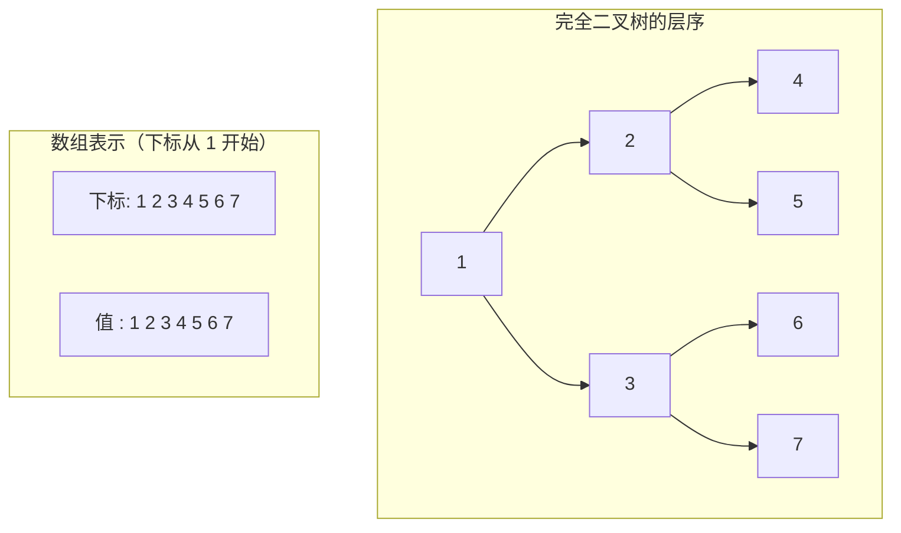

> 这一篇对应官方 Lecture 20（Heaps and PQs）。
> 优先队列只承诺一件事：随时能拿到当前的最小元。它不承诺整体有序。
> 这一篇讲清这条承诺如何用一棵完全二叉树的数组表示兑现，并实测「逐个插入建堆」与「自底向上建堆」的代价差距。

## 一、钩子：只要最小元，为什么要维护全局有序

假设有一批任务要按优先级调度，每次只取优先级最高的那个。一个很自然的想法是：**把所有任务排序，然后从头取。**

排序的代价是 N log N，取一个元素是 O(1)。但如果任务在运行中会不断新增，每次新增都要重新排序，或者插入到有序数组的正确位置（挪动 O(N) 个元素），这个结构就变得笨重了。

换一个角度问：**我们真的需要全体有序吗？**

不需要。只需要知道「哪个最小」。这是一个弱得多的要求，而弱要求通常能用更低的代价满足。二叉堆就是这个更低的代价：

| 需求 | 有序数组 | 二叉堆 |
| --- | --- | --- |
| 取最小元 | O(1) | O(1) |
| 插入新元素 | O(N)（挪动数组） | O(log N) |
| 建堆（N 个元素） | O(N log N)（排序） | O(N) |
| 全部有序地取出 | O(N) | O(N log N) |

二叉堆把「有序」这个信息**只保留到够用的程度**：父节点不大于子节点，其余一概不管。这条弱约束让插入和建堆都变便宜了。

## 二、形状约束：完全二叉树用数组存

优先队列的第二个设计选择是形状。普通二叉树要用节点和指针表示，不但占内存，指针本身还会打散访问的局部性。二叉堆避开了这一点，它规定树必须是**完全二叉树**——除了最后一层，其余层都填满，且最后一层的节点全部靠左。

这个约束的作用是：**树可以直接摊进一个数组，不需要任何指针。**



对应关系是纯算术，不需要任何额外存储：

| 关系 | 公式 |
| --- | --- |
| 节点 i 的左孩子 | 2i |
| 节点 i 的右孩子 | 2i + 1 |
| 节点 i 的父节点 | i / 2（向下取整） |

**完全二叉树这个形状约束，换来的正是「父子的下标关系可以用一次乘法算出来」。** 节点数 N 的完全二叉树高度是 ⌊log₂ N⌋，数组里也没有空位浪费。

## 三、堆序与两个基本操作

形状定好之后，剩下的是内容约束：**每个父节点都不大于它的两个孩子。**

注意这条约束管的是**父子之间**，不是兄弟之间，也不是不相干的节点之间。所以堆里除了「根是最小元」之外，别的位置并没有确定的先后关系——这也是为什么堆不唯一。

维护这条约束只需要两个操作：

```java
    private void swim(int i) {
        while (i > 1) {
            compares++;
            if (a[i / 2] <= a[i]) {
                break;
            }
            swap(i, i / 2);
            i /= 2;
        }
    }

    private void sink(int i) {
        while (2 * i <= n) {
            int c = 2 * i;
            if (c + 1 <= n) {
                compares++;
                if (a[c + 1] < a[c]) {
                    c++;
                }
            }
            compares++;
            if (a[i] <= a[c]) {
                break;
            }
            swap(i, c);
            i = c;
        }
    }
```

两个操作是镜像的：

| 操作 | 什么时候用 | 走的方向 | 比较对象 | 代价 |
| --- | --- | --- | --- | --- |
| 上浮 `swim` | 新元素挂在末尾 | 从下往上 | 只跟父节点比 | O(log N) |
| 下沉 `sink` | 根被换掉之后 | 从上往下 | 先跟两个孩子比出较小的，再跟它比 | O(log N) |

`sink` 里有一处容易写错的细节：**必须先比较左右两个孩子，选出较小的那个，再拿它和当前节点比。** 如果先跟左孩子比、发现要换就换，那么右孩子可能更小，堆序就破了。

## 四、建堆：逐个插入 vs 自底向上

有了这两个操作，把一堆无序数据变成堆就有两条路。

**路线一：逐个插入。** 从空堆开始，每个元素挂到末尾再上浮。

**路线二：自底向上。** 先把数组原样当作完全二叉树，然后**从最后一个内部节点开始，逐个往前下沉**。

```java
    /** 自底向上建堆：从最后一个内部节点开始逐个下沉 */
    public static MinHeap fromArray(int[] data) {
        MinHeap h = new MinHeap(data.length);
        System.arraycopy(data, 0, h.a, 1, data.length);
        h.n = data.length;
        for (int i = h.n / 2; i >= 1; i--) {
            h.sink(i);
        }
        return h;
    }

    /** 逐个插入建堆：每来一个元素就先挂到末尾再上浮 */
    public static MinHeap byInsert(int[] data) {
        MinHeap h = new MinHeap(data.length);
        for (int v : data) {
            h.add(v);
        }
        return h;
    }
```

路线二的起点为什么是 `n / 2`？因为下标大于 `n / 2` 的节点全是叶子，叶子天然满足堆序，不需要处理。

两条路线的复杂度差别，用实测比较次数来说：

```java
        System.out.println("两种建堆方式的比较次数对比（同一批数据）：");
        Random rnd = new Random(2025);
        int[] ns = {1000, 100000, 1000000};
        for (int N : ns) {
            int[] random = new int[N];
            int[] desc = new int[N];
            for (int i = 0; i < N; i++) {
                random[i] = rnd.nextInt();
                desc[i] = N - i;              // 递减序列：每次插入的新元素都要一路升到堆顶
            }
            double nlogn = N * (Math.log(N) / Math.log(2));
            MinHeap r1 = MinHeap.fromArray(random);
            MinHeap r2 = MinHeap.byInsert(random);
            MinHeap d1 = MinHeap.fromArray(desc);
            MinHeap d2 = MinHeap.byInsert(desc);
            System.out.println("N = " + N + "，N*log2(N) = " + String.format("%.0f", nlogn));
            System.out.println("    随机数据：自底向上建堆 = " + r1.compares
                    + "   逐个插入建堆 = " + r2.compares);
            System.out.println("    递减数据：自底向上建堆 = " + d1.compares
                    + "   逐个插入建堆 = " + d2.compares);
        }
```

```text
两种建堆方式的比较次数对比（同一批数据）：
N = 1000，N*log2(N) = 9966
    随机数据：自底向上建堆 = 1837   逐个插入建堆 = 2212
    递减数据：自底向上建堆 = 1982   逐个插入建堆 = 7987
    四种情况的堆序校验 = true / true / true / true
N = 100000，N*log2(N) = 1660964
    随机数据：自底向上建堆 = 188106   逐个插入建堆 = 228058
    递减数据：自底向上建堆 = 199978   逐个插入建堆 = 1468946
    四种情况的堆序校验 = true / true / true / true
N = 1000000，N*log2(N) = 19931569
    随机数据：自底向上建堆 = 1880986   逐个插入建堆 = 2279722
    递减数据：自底向上建堆 = 1999974   逐个插入建堆 = 17951445
    四种情况的堆序校验 = true / true / true / true
```

这张表里有三条值得单独拆开的结论。

### 自底向上建堆是线性的

自底向上的比较次数几乎不受数据形态影响：递减数据下 N = 1000 / 100000 / 1000000 分别是 1982 / 199978 / 1999974，**始终约等于 2N**。

原因在下沉的距离上。下沉的代价等于「还能往下走几层」，而树里绝大多数节点都在最底层附近，它们能下沉的距离很短：

| 层 | 节点数 | 最多下沉层数 |
| --- | --- | --- |
| 最底层（叶） | 约 N/2 | 0 |
| 倒数第二层 | 约 N/4 | 1 |
| 倒数第三层 | 约 N/8 | 2 |
| … | … | … |

把所有节点的下沉距离加起来：

```text
Σ (节点数 × 下沉层数) = N/4 × 1 + N/8 × 2 + N/16 × 3 + …  <  N
```

这是一个收敛的级数。**节点越多的地方，每个节点要走的距离越短，两者正好相互抵消**，总代价是 O(N) 而不是 O(N log N)。

### 逐个插入的代价取决于数据顺序

逐个插入建堆在随机数据下只有 2279722 次比较，接近线性；换成递减数据立刻涨到 17951445 次，**约为前者的 7.9 倍，也约为自底向上建堆的 9.0 倍**。

差别出在上浮距离上：

| 数据形态 | 每次插入平均上浮层数 | 总代价 |
| --- | --- | --- |
| 随机 | 约 1.6 层（新元素多半一进去就停住） | 接近 O(N) |
| 递减 | 约 log₂ N 层（每个新元素都是新的最小值，一路升到堆顶） | O(N log N) |

**同一份代码，换一种输入顺序，代价差一个数量级。** 这也说明了一个常见的观察偏差：如果只用随机数据测试，两条路线的比较次数看起来很接近，容易得出「两种建堆差不多」的错误结论。

### 堆不唯一

最后一行还给出了两种建堆方式在小规模上的结果：

```text
递减序列 [9, 8, 7, 6, 5, 4, 3, 2, 1] 的两种建堆结果：
  自底向上建堆层序：
  level 0: 1
  level 1: 2 3
  level 2: 6 5 4 7
  level 3: 8 9
  逐个插入建堆层序：
  level 0: 1
  level 1: 2 4
  level 2: 3 7 8 5
  level 3: 9 6
```

两棵树层序完全不同，但都通过了堆序校验。**这正好印证了堆序约束只作用于父子之间**：只要每个父节点不大于它的孩子，树的形状和内部排布可以有多种选择。

## 五、弹出最小元与堆排序

有了堆，取最小元只剩三步：

```java
    public int removeMin() {
        int min = a[1];
        a[1] = a[n--];
        sink(1);
        return min;
    }
```

用最后一片叶子顶替根的位置，堆的大小减一，然后从根下沉一次。**注意这里不能把数组末尾的元素丢掉，而是用它填补根的空位**——这样数组里始终是紧凑的前 `n` 个位置，没有任何空洞。

```java
        int[] small = {9, 4, 7, 1, 8, 3, 6, 2, 5};
        MinHeap h = MinHeap.fromArray(small);
        System.out.println("原始数组 = " + Arrays.toString(small));
        System.out.println("自底向上建堆后的层序：");
        System.out.print(h.levelDump());
        System.out.println("满足堆序 = " + h.isValid());
        System.out.println("逐个弹出最小元 = " + h.drain());
```

```text
原始数组 = [9, 4, 7, 1, 8, 3, 6, 2, 5]
自底向上建堆后的层序：
  level 0: 1
  level 1: 2 3
  level 2: 4 8 7 6
  level 3: 9 5
满足堆序 = true
逐个弹出最小元 = 1 2 3 4 5 6 7 8 9

java.util.PriorityQueue 的弹出顺序 = 1 2 3 4 5 6 7 8 9
```

两点观察：

- **层序并不是升序。** `level 2` 是 `4 8 7 6`，`8` 排在 `7` 前面——但 `8` 的父母是 `2`，`7` 的父母是 `3`，各自都满足父子约束。**堆序不等同于整体有序**，这一点决定了堆不能用来做范围查询或中位数查询。
- **弹出序列是严格升序的。** 因为每一步取出的都是当前堆里的最小值，而堆里的最小值一定在根上。

把弹出的元素按顺序落在数组尾部，就得到原地堆排序：**建堆 O(N) + N 次弹出各 O(log N) = O(N log N)**，全程不需要额外数组。对标准库的对照也验证了这一点：用 `java.util.PriorityQueue` 处理同一份数据，弹出顺序与自己的实现完全一致。

## 六、小结

| 概念 | 一句话 | 证据 |
| --- | --- | --- |
| 形状 | 完全二叉树，摊进数组，下标关系靠算术 | 父 i / 2，孩子 2i 与 2i+1 |
| 堆序 | 只约束父子，不约束兄弟 | 两种建堆结果层序不同但都合法 |
| 取最小元 | 根上就是，O(1) | 弹出序列严格升序 |
| 上浮 | 新元素挂末尾，向上修复 | 递减数据下每次上浮约 log₂ N 层 |
| 下沉 | 根被换掉后向下修复 | 必须先比出较小的孩子 |
| 自底向上建堆 | 从 n/2 往前逐个下沉，O(N) | 三个规模都约 2N 次比较 |
| 逐个插入建堆 | 最坏 O(N log N) | 递减数据 17951445 次，约为前者 9.0 倍 |

| 建堆方式 | N = 1000 | N = 100000 | N = 1000000 | 复杂度 |
| --- | --- | --- | --- | --- |
| 自底向上（递减数据） | 1982 | 199978 | 1999974 | O(N) |
| 逐个插入（递减数据） | 7987 | 1468946 | 17951445 | O(N log N) |
| 逐个插入（随机数据） | 2212 | 228058 | 2279722 | 平均接近 O(N) |

三条能带走的：

1. **先问清楚到底需要多少有序性。** 只要最小元，就不要排序；只要父子有序，就不要整体有序。把需求收窄到刚好够用，代价会立刻降下来——这正是堆存在的理由。
2. **形状约束和数据约束要分开设计。** 完全二叉树负责「怎么存」，堆序负责「怎么排」，两者互不干扰。前者让存储变成纯数组运算，后者让修复只需要两个局部操作。
3. **复杂度要看最坏情况，不能只看随机数据下的实测值。** 逐个插入建堆在随机数据下接近线性，在递减数据下退化到 O(N log N)；只用随机数据做基准测试，很容易把最坏情况漏掉。
