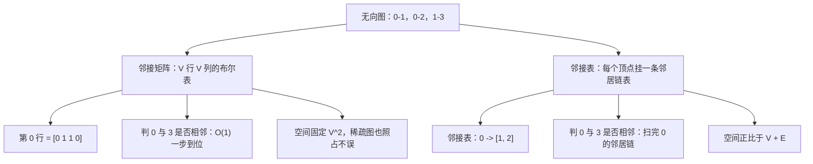

> 这一篇对应官方 Lecture 21 & 22（Tree and Graph Traversals & Implementations）。
> 树是图的一个特例，唯一多出来的麻烦是「可能绕回自己」。
> 这一篇把两种遍历放在同一张图上对照，并用实测说明它们各自解决了什么问题。

## 一、钩子：树和图差在哪一件事

遍历一棵树之所以简单，是因为有一条性质在保证：**从根到任意节点只有一条路径。** 所以只要往下走，永远不会回到走过的位置，也不需要担心漏掉谁。

图的这条性质没了。两个顶点之间可能有多条路径，甚至可能存在环。这带来两个直接后果：

- **必须有 `seen` 标记。** 否则遇到环就会无限绕圈。
- **「第一次到达」变成了一个有含义的时刻。** 因为路径可能不止一条，第一次到达用的是哪条路径、有多长，就成了一件需要记录的事。

这一篇的两条主线就是围绕这两点展开的：BFS 记录「第一次到达的层数」，DFS 记录「回溯的次序」。

## 二、表示法：邻接矩阵与邻接表

先解决存的问题。图有两种标准表示。



两种表示的选择依据是**图的稠密程度**：

| | 邻接矩阵 | 邻接表 |
| --- | --- | --- |
| 空间 | O(V²) | O(V + E) |
| 判断两点是否相邻 | O(1) | O(deg) |
| 枚举某点的全部邻居 | O(V) | O(deg) |
| 遍历全图 | O(V²) | O(V + E) |
| 适合 | 稠密图、需要频繁判断两点相邻 | 稀疏图、以遍历为主 |

实测的网格图能把差距量化得很清楚：

**100 × 100 的网格图有 10000 个顶点、19800 条边。用邻接矩阵要开 10000 × 10000 = 10⁸ 个格子；用邻接表只需要存 39600 个条目（每条无向边存两次），差了约 2500 倍。**

绝大多数真实问题里的图都是稀疏的——社交网络里一个人认识的人数远小于总人数，路由表里一个节点的邻居也只是少数。所以遍历类算法默认用邻接表。

## 三、BFS：队列与「第一次到达即最短」

广度优先搜索用一条队列，把「当前层的所有顶点」放在一起处理。

```java
    static int[] bfsDist(int src) {
        int[] dist = new int[n];
        Arrays.fill(dist, -1);
        dist[src] = 0;
        ArrayDeque<Integer> q = new ArrayDeque<>();
        q.add(src);
        while (!q.isEmpty()) {
            int u = q.poll();
            for (int v : adj.get(u)) {
                if (dist[v] == -1) {
                    dist[v] = dist[u] + 1;
                    q.add(v);
                }
            }
        }
        return dist;
    }
```

关键在 `if (dist[v] == -1)` 这一句：**只有没被访问过的顶点才会入队，并且它的距离在这里一次定死，之后再也不改。**

这正是 BFS 那条核心性质的来源：

**在无权图里，第一次到达某个顶点的路径，一定是最短路径。**

理由用反证法一句话说完：队列保证顶点是按距离递增的顺序被处理的，所以当距离为 k 的顶点 u 发现未访问的邻居 v 时，不可能存在一条更短的路径通向 v——否则 v 早就被更早的层发现了。

在一个 8 个顶点的图上跑一遍，队列的每一步都可以跟出来：


**注意第 5 步。** 弹出顶点 4 时它的两个邻居（2 和 5）都已经在队列里了，于是什么也不做。**「已经入队」和「已经处理完」必须用同一个标记来记录**——如果只标记「处理过」，顶点 4 就会把 5 再入队一次，队列里出现重复元素，BFS 的距离语义随之失效。

## 四、DFS：栈与回溯

深度优先搜索沿着一条路走到底，走不动再退回来。

```java
    static void dfs(int u, boolean[] seen, List<Integer> order) {
        seen[u] = true;
        order.add(u);
        for (int v : adj.get(u)) {
            if (!seen[v]) {
                dfs(v, seen, order);
            }
        }
    }
```

和 BFS 只差一处：**BFS 把待访问的顶点放进队列（先进先出），DFS 放进栈（后进先出）。** 用递归写法时，函数调用栈本身就是那个栈，不需要显式声明。

DFS 的「第一次到达」没有最短性——它记录的是**回溯次序**：一个顶点的处理在它的所有后代都处理完之后才结束，这个时刻在后序位置上非常有用，后面的拓扑排序正是靠它。

## 五、实测：两种遍历的次序差异

在同一张 8 顶点、9 条边的无向图上分别跑两种遍历：

```java
        System.out.println("BFS 跳数（顶点: 距离）= " + sb.toString().trim());
        System.out.println("最远顶点跳数 = " + Arrays.stream(dist).max().getAsInt());
        System.out.println("BFS 访问次序 = " + bfsOrder(src));
        System.out.println("DFS 访问次序 = " + dfsOrder(src));
```

```text
无向图：顶点数 = 8，边数 = 9，邻接表条目总数 = 18（等于 2 倍边数）
BFS 跳数（顶点: 距离）= 0:0  1:1  2:1  3:2  4:2  5:3  6:4  7:5
最远顶点跳数 = 5
BFS 访问次序 = [0, 1, 2, 3, 4, 5, 6, 7]
DFS 访问次序 = [0, 1, 3, 2, 4, 5, 6, 7]
```

三个可以读出来的点：

- **BFS 次序按距离严格分层。** `[0] [1, 2] [3, 4] [5] [6] [7]`，前面是距离 0、1、2 的两组，后面依次是距离 3、4、5。BFS 的访问次序天然就是按层排的。
- **DFS 次序是「一条路走到底」的结果。** `0` 之后先钻进 `1`，再从 `1` 钻进 `3`，`3` 发现 `1` 走过、`2` 没走过，于是绕回 `2`——注意 `2` 是 `0` 的直接邻居，却在第 4 位才被访问。**DFS 不保证邻居之间的先后顺序**，它只保证沿着当前分支一路向下。
- **邻接表条目总数 = 2 × 边数 = 18。** 无向边 `(u, v)` 在 `u` 和 `v` 的链表里各存一次。这是邻接表空间复杂度 O(V + E) 的具体形状，也提醒一件事：**遍历的时间复杂度 O(V + E) 里，`E` 那一项要按邻接表条目数来数，也就是 2E。**

两者在复杂度上没有差别——都是每个顶点进出一次、每条邻接条目扫一次，总计 O(V + E)。**差别在于记录了什么：BFS 记录层级，DFS 记录回溯点。**

## 六、从遍历出发的三个应用

### 连通分量：把 DFS 当探针

一次 DFS 只能走遍一个连通分量。在整张图上依次从未访问的顶点出发，出发了几次就有几个分量：

```java
    static int components() {
        boolean[] seen = new boolean[n];
        int c = 0;
        for (int i = 0; i < n; i++) {
            if (!seen[i]) {
                c++;
                dfs(i, seen, new ArrayList<>());
            }
        }
        return c;
    }
```

```text
含孤立顶点的图：顶点数 = 12，边数 = 7
连通分量数 = 7（含顶点 5、9、10、11 四个单点分量）
```

12 个顶点只连成了 3 个多顶点分量，加上 4 个孤立顶点，一共 7 个分量。**孤立顶点不需要特殊处理**：它没有邻居，`dfs` 进来之后立刻返回，但计数器已经在出发前加过一了。

### 网格最短路：BFS 的典型用法

```text
100 x 100 网格图：顶点数 = 10000，边数 = 19800
  从左上角出发，到右下角的跳数 = 198（等于 99 + 99），最远跳数 = 198
```

在网格上从左上走到右下，横着要走 99 格、竖着要走 99 格，一共 198 步——BFS 给出的正是这个数。**这里没有显式建模「上下左右」，而是把每个格子看成顶点、相邻格子之间连边，问题就自动变成了无权图最短路。** 这类「把状态空间当成图」的转换，是 BFS 最常用的使用方式。

### 拓扑排序：用 DFS 的后序

在有向无环图上，按 DFS 后序的**逆序**排列顶点，就得到一个满足所有边方向约束的序列：

```java
    static void topoVisit(int u, List<List<Integer>> g, boolean[] seen, List<Integer> post) {
        seen[u] = true;
        for (int v : g.get(u)) {
            if (!seen[v]) {
                topoVisit(v, g, seen, post);
            }
        }
        post.add(u);
    }
```

```text
有向无环图（8 个顶点，8 条有向边）的拓扑序 = [7, 0, 2, 5, 1, 3, 4, 6]
拓扑序满足所有边的先后关系 = true
```

为什么成立，可以这样理解：当 `u` 被加入后序时，它的所有后代都已经在里面了；整体反转之后，`u` 就排在所有后代之前。**「u 排在后代之前」正是边 u → v 需要的先后关系。**

第二行的 `true` 是逐条边检查出来的——对每条有向边 `u → v`，确认 `u` 在序列中的位置严格小于 `v`。**拓扑序通常不唯一**，这一条只是其中之一。

## 七、递归 DFS 的栈风险

DFS 的递归写法读起来最自然，但它有一个真实的工程隐患：**调用栈的深度等于 DFS 走过的路径长度。**

```java
    public static void main(String[] args) {
        int n = 100000;
        // 构造一条长度为 100000 的链，每个顶点只和前后两个顶点相连
        for (int i = 0; i + 1 < n; i++) {
            adj.get(i).add(i + 1);
            adj.get(i + 1).add(i);
        }
        // ...
        try {
            List<Integer> rc = dfsRecursive(n, 0);
            System.out.println("递归式 DFS：访问顶点数 = " + rc.size());
        } catch (StackOverflowError e) {
            System.out.println("递归式 DFS：抛出 StackOverflowError");
        }
    }
```

```text
链状图：顶点数 = 100000，边数 = 99999，图本身就是一条依次相连的路径
迭代式 DFS：访问顶点数 = 100000，前 5 个 = [0, 1, 2, 3, 4]，最后一个 = 99999
递归式 DFS：抛出 StackOverflowError
```

**同一个算法，只因为实现方式不同，一个正常返回、一个直接崩溃。**

链状图是最坏情况：DFS 会一路递归到第 100000 层，而默认的调用栈容量装不下这么多帧。遇到宽而浅的图不会出问题，这恰恰是它危险的地方——**在小规模测试里永远不会暴露，换一份真实数据才会触发。**

三种处理方式：

| 做法 | 说明 | 代价 |
| --- | --- | --- |
| 改成迭代写法 | 显式维护一个栈，栈放在堆上，容量不受限 | 代码复杂一些，需要手动倒序压栈 |
| 调大线程栈 | 用指定栈大小的构造函数起线程 | 治标，只把上限往后推 |
| 保持递归 | 图是宽而浅的形状时可行 | 需要事先知道图的形状 |

迭代写法有一个容易写错的细节：

```java
            List<Integer> ns = adj.get(u);
            for (int i = ns.size() - 1; i >= 0; i--) {
                if (!seen[ns.get(i)]) {
                    st.push(ns.get(i));
                }
            }
```

**邻居要倒序压栈。** 栈是后进先出，倒序压进去才能让第一个邻居最先被弹出，否则访问次序会和递归版本反过来。

## 八、小结

| 概念 | 一句话 | 证据 |
| --- | --- | --- |
| 邻接表空间 | O(V + E)，无向边存两次 | 8 顶点 9 边 → 18 个条目 |
| 邻接矩阵空间 | O(V²)，与边的多少无关 | 10000 顶点要开 10⁸ 个格子 |
| BFS 顺序 | 按距离分层，先近后远 | 次序 `[0][1,2][3,4][5][6][7]` |
| BFS 最短路 | 无权图里第一次到达即最短 | 网格对角跳数 = 198 = 99 + 99 |
| DFS 顺序 | 沿分支走到底再回溯 | 次序 `[0,1,3,2,4,5,6,7]` |
| 连通分量 | 数一数 DFS 出发了几次 | 12 个顶点 → 7 个分量 |
| 拓扑排序 | DFS 后序反转 | 8 顶点 DAG → 序列通过逐边校验 |
| 递归风险 | 递归深度等于路径长度 | 10 万顶点链上 StackOverflowError |

| 遍历 | 数据结构 | 记录了什么 | 典型用途 | 复杂度 |
| --- | --- | --- | --- | --- |
| BFS | 队列 | 第一次到达的层数 | 无权最短路、层序遍历 | O(V + E) |
| DFS | 栈（或调用栈） | 回溯的先后次序 | 连通分量、拓扑排序、环检测 | O(V + E) |

三条能带走的：

1. **树遍历和图遍历只差一个标记数组。** 树没有环，所以不需要标记；图有环，所以「已访问」这件事必须显式记录下来，而且「已入队」与「已处理」要用同一个标记，否则队列里会出现重复元素。
2. **BFS 和 DFS 的复杂度相同，区别在记录的信息。** 需要最短层数就用 BFS，需要回溯次序就用 DFS。选错不会变慢，只会拿不到想要的信息。
3. **递归深度和输入规模是两回事。** DFS 的递归深度取决于图的**最长路径**，不取决于顶点总数。一条 10 万个顶点的链足以让递归版本崩溃，而递归写法在小规模测试里毫无异常——这类缺陷只能靠事先判断图的形状来规避。
