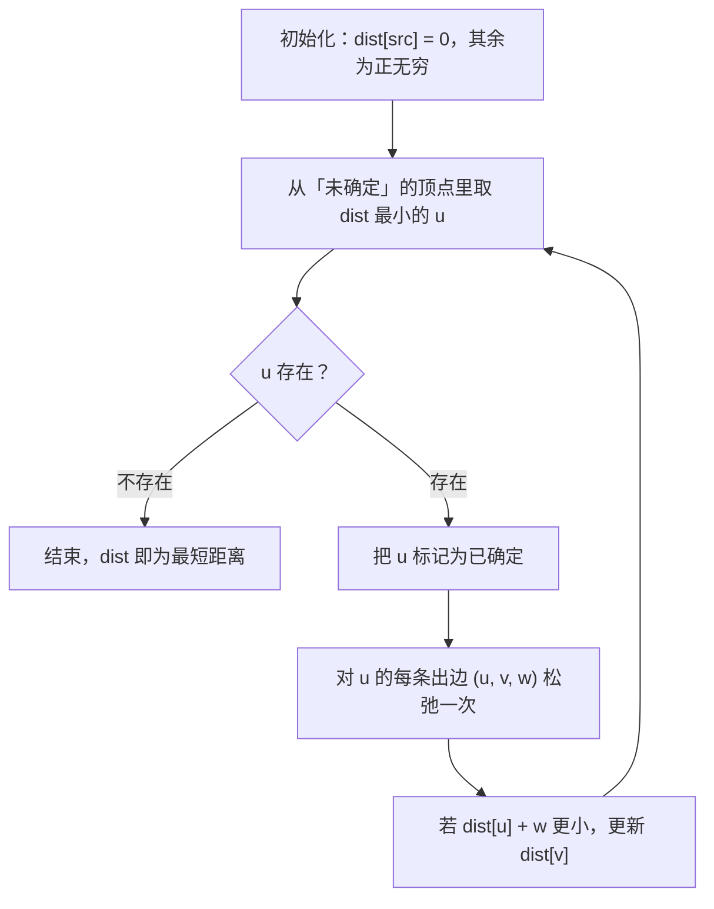

> 这一篇对应官方 Lecture 23（Shortest Paths）。
> 无权图里「第一次到达」就是最短，有权图里这条性质直接失效。
> 这一篇讲清松弛这个动作如何统一最短路的求解过程，并实测 Dijkstra 那条「权重非负」的前提到底卡在哪里。

## 一、钩子：跳数最少不等于距离最短

在无权图里，一条路径的长度就是它经过的边数，所以「跳数最少」和「长度最短」是同一件事，广度优先搜索一次遍历就能全部算出来。

一旦边带上权重，两件事立刻分家。

实测一张 7 个顶点、10 条边的无向带权图，从顶点 0 出发：

```text
无向带权图：7 个顶点，10 条边，全部权重非负
  从 0 出发的最短距离 = 0:0  1:3  2:1  3:8  4:8  5:11  6:12
  从 0 出发的最少跳数 = 0:0  1:1  2:1  3:2  4:2  5:3  6:4
  松弛次数 = 20（邻接条目总数 = 20），入队次数 = 10
  到顶点 6：跳数 4，权重和 12——两者不是一回事
```

看顶点 6 这一列：跳数是 4，权重和是 12。**没有任何理由认为这两列会成比例**——一条由 4 段小权重边组成的路，完全可能比另一条由 2 段大权重边组成的路更长。所以 BFS 在这里完全用不上，必须换算法。

## 二、松弛：一个动作贯穿所有最短路算法

换算法之前，先看清真正的难点在哪。

如果从源点出发，已知到达 `u` 的最短距离是 `dist[u]`，而 `u` 到 `v` 有一条权重为 `w` 的边，那么**至少存在一条到 `v` 的路径长度为 `dist[u] + w`**。如果这个值比当前记录的 `dist[v]` 更小，就更新它：

```java
                int v = e[0];
                int w = e[1];
                if (dist[u] + w < dist[v]) {
                    dist[v] = dist[u] + w;
                }
```

这个动作叫**松弛**（relaxation）。它是所有最短路算法的共同内核——Dijkstra、Bellman-Ford、Floyd-Warshall 都在做同一件事，区别只在于**按什么顺序选出下一个要处理的顶点**。

| 算法 | 挑顶点的顺序 | 复杂度 |
| --- | --- | --- |
| BFS | 按跳数，先进先出 | O(V + E)，仅限无权 |
| Dijkstra | 取当前距离最小的未确定顶点 | O(E log V) |
| Bellman-Ford | 不看顺序，全图松弛 V-1 轮 | O(V·E) |

**既然松弛这个动作是一样的，那算法的差别就只有「顺序」这一件事。** Dijkstra 的聪明之处在于：只要权重非负，那么当前距离最小的那个顶点，它的距离一定已经是最终值了，可以直接「确定」下来。

这条推理就是它的全部依据，也是后面所有问题的来源。

## 三、Dijkstra 的三步循环



三步循环是：**取最小 → 确定 → 松弛它的出边。**

用优先队列实现时，代码短到几乎可以直接背下来：

```java
    static int[] dijkstraPq(List<int[]>[] adj, int src, long[] stats) {
        int n = adj.length;
        int[] dist = new int[n];
        Arrays.fill(dist, INF);
        dist[src] = 0;
        PriorityQueue<int[]> pq = new PriorityQueue<>((a, b) -> Integer.compare(a[0], b[0]));
        pq.add(new int[]{0, src});
        long relax = 0;
        long pushes = 1;
        while (!pq.isEmpty()) {
            int[] cur = pq.poll();
            if (cur[0] > dist[cur[1]]) {
                continue;
            }
            int u = cur[1];
            for (int[] e : adj[u]) {
                int v = e[0];
                int w = e[1];
                relax++;
                if (dist[u] + w < dist[v]) {
                    dist[v] = dist[u] + w;
                    pq.add(new int[]{dist[v], v});
                    pushes++;
                }
            }
        }
        if (stats != null) {
            stats[0] = relax;
            stats[1] = pushes;
        }
        return dist;
    }
```

`if (cur[0] > dist[cur[1]]) continue;` 这一句是**惰性删除**：优先队列不支持修改已有元素的键，所以一个顶点的距离每次被改进就重新入队一条新记录，旧记录留在队列里变成过期条目，弹出时用这句跳过。

## 四、实测：距离与跳数的差别

回到开头那张图，两种算法的输出放在一起对比：

| 顶点 | 0 | 1 | 2 | 3 | 4 | 5 | 6 |
| --- | --- | --- | --- | --- | --- | --- | --- |
| 最短距离 | 0 | 3 | 1 | 8 | 8 | 11 | 12 |
| 最少跳数 | 0 | 1 | 1 | 2 | 2 | 3 | 4 |

两处值得注意：

- **顶点 1 的距离是 3，而跳数是 1。** 直达边的权重是 4，绕道 `0 → 2 → 1` 的权重是 1 + 2 = 3。**更长的路径反而更短**，这正是权重带来的变化。
- **距离不是跳数的线性函数。** 顶点 2 距离 1、跳数 1；顶点 5 距离 11、跳数 3；顶点 6 距离 12、跳数 4。每一跳的「单价」都不相同。

输出里还有两个可以用来对照复杂度的数字：

- **松弛次数 = 20，恰好等于邻接表条目总数。** 在权重非负的图上，每个顶点只会被确定一次，于是每条出边恰好被检查一次，总松弛次数正好是 E。
- **入队次数 = 10，也恰好等于顶点数。** 这张图上每个顶点都只被改进过一次，所以没有产生任何过期条目。真实图上这个数字会略大于 V。

## 五、为什么必须非负：`settled` 语义

Dijkstra 能「直接确定」一个顶点，靠的是这样一条论证：

```text
设 u 是当前未确定顶点里 dist 最小的那个。
假设存在一条更短的路径到 u，它必然要经过某个尚未确定的顶点 x。
从源点到 x 的距离已经是 dist[x] >= dist[u]（u 是最小的），再加上 x 到 u 那一段，
由于权重非负，总长度 >= dist[x] + 0 >= dist[u]。
这与「更短」矛盾。
```

**「权重非负」这个条件是链条上不可拆的一环。** 只要有一段边是负的，`总长度 >= dist[x]` 这一步就断了——经过 x 反而可能让路径变短。

所以经典实现里有一个关键动作：**顶点一旦被确定，就不再接受任何更新。**

```java
            settled[u] = true;
            for (int[] e : adj[u]) {
                int v = e[0];
                int w = e[1];
                if (!settled[v] && dist[u] + w < dist[v]) {
                    dist[v] = dist[u] + w;
                }
            }
```

注意 `!settled[v]` 这个前置条件。它正是 Dijkstra 正确性证明的直接落地：既然被确定的顶点距离已是最终值，就不该再改。**但这条规则在负权图上会把正确答案挡在门外。**

## 六、实测：负权边下的失效

造一个有向图：`0 → 1` 权重 1，`0 → 2` 权重 2，`2 → 1` 权重 −2。到顶点 1 的两条路分别是 1 和 2 − 2 = 0，真正的最短距离是 0。

```text
含负权边的有向图：0->1 权重 1，0->2 权重 2，2->1 权重 -2
  Bellman-Ford（基准）      = 0:0  1:0  2:2
  教科书版 Dijkstra         = 0:0  1:1  2:2   与基准一致？ false
  优先队列版 Dijkstra       = 0:0  1:0  2:2   与基准一致？ true
```

教科书版给出的 `dist[1] = 1` 是错的，正确答案是 0。过程可以完整复盘：

| 步骤 | 动作 | 结果 |
| --- | --- | --- |
| 1 | 确定顶点 0 | `dist[1] = 1`，`dist[2] = 2` |
| 2 | 未确定顶点里最小的是 1（距离 1） | 确定顶点 1，它没有出边 |
| 3 | 确定顶点 2 | 松弛 `2 → 1` 得到 0，但 1 已被确定，跳过 |
| 4 | 结束 | `dist[1]` 停留在 1 |

**错的根源在第 3 步：正确的更新被 `!settled[v]` 挡掉了。** 顶点 1 在第 2 步被确定时，`2 → 1` 这条负权边还没有被看到。

不过输出还有第三行值得注意：**优先队列版给出的结果是 0，与基准一致。** 它没有 `settled` 标记，改进后重新入队，于是第 3 步那条被挡掉的更新在这里正常生效了。

这个现象不是巧合，而是一条可以证明的结论：

```text
终止时队列为空，意味着对每条边 (u, v, w) 都有 dist[v] <= dist[u] + w。
沿着任何一条路径把它串起来，得到 dist[v] <= 该路径的总长度，取最短的那条即 dist[v] <= 最短距离。
另一方面，每个 dist 值都等于某条真实路径的长度，所以 dist[v] >= 最短距离。
两边夹逼：dist[v] 就等于最短距离。
```

推广到随机图上验证一下。用只连 `i → j`（`i < j`）的随机有向无环图，天然不含负环，权重落在 `[-5, 10]`：

```text
随机有向无环图（顶点 8 个，权重落在 [-5, 10]，共 2000 次试验，平均边数 9.85）：
  教科书版与 Bellman-Ford 不一致的次数 = 160（占 8.0%）
  优先队列版与 Bellman-Ford 不一致的次数 = 0
```

**2000 次随机试验里，教科书版错了 160 次，优先队列版一次都没错。**

但这里必须把话说完整——**这不能推出「可以用 Dijkstra 处理负权图」：**

| 问题 | 说明 |
| --- | --- |
| 有负环时不终止 | 每绕一圈距离都变小，队列永远不为空 |
| 复杂度保证没了 | 一个顶点可能被反复弹出，O(E log V) 不再成立，最坏退化到 Bellman-Ford 的量级 |
| 论证不能用 | 上面那段夹逼依赖「整数权重」和「无负环」两个额外条件，教科书版连这两个都不需要 |

负权图的正规做法仍然是 Bellman-Ford：不看顺序、全图松弛 V−1 轮，代价是 O(V·E)。**用更高的复杂度换取对负权的容忍度，这才是两者的真正分工。**

## 七、规模

最后看一眼实际量级。随机有向图，20000 个顶点、99995 条边：

```text
规模测试：随机有向图，顶点 20000 个，边 99995 条
  可达顶点数 = 19861，不可达顶点数 = 139
  Dijkstra 松弛次数 = 99300，入队次数 = 28825，单次运行耗时量级 = 十毫秒以内
```

三个数字都对得上：

- **松弛次数 99300 小于边数 99995。** 差的 695 条是那 139 个不可达顶点的出边——**不可达的顶点根本不会被弹出，它的出边一次也不会被检查。** 这也说明 Dijkstra 天然只处理源点可达的部分，不需要额外过滤。
- **入队次数 28825 略大于顶点数 20000。** 多出来的约 8800 条是过期条目，对应那些距离被改进过两次以上的顶点。
- **耗时在十毫秒以内。** 松弛 99300 次、堆操作 28825 次，量级和 O(E log V) 完全相符。

## 八、小结

| 概念 | 一句话 | 证据 |
| --- | --- | --- |
| 松弛 | 若 `dist[u] + w < dist[v]` 就更新 `dist[v]` | 所有最短路算法共用这一个动作 |
| 算法差别 | 只在于「下一个处理哪个顶点」 | BFS 按层、Dijkstra 按距离、Bellman-Ford 按轮 |
| 距离 vs 跳数 | 有权之后两者没有关系 | 顶点 1 距离 3、跳数 1 |
| 非负权重的作用 | 保证「距离最小的顶点已是最终值」 | 负权时教科书版错 160/2000 次 |
| 惰性删除 | 改进后重新入队，过期条目靠比较跳过 | 20000 顶点图上入队 28825 次 |
| 可达性 | 不可达顶点的出边根本不会被检查 | 松弛 99300 < 边数 99995 |

| 算法 | 前提 | 复杂度 | 负权 | 适用场景 |
| --- | --- | --- | --- | --- |
| BFS | 权重全为 1 | O(V + E) | 不适用 | 最少跳数、网格最短路 |
| Dijkstra | 权重非负 | O(E log V) | 不可用 | 非负权图单源最短路 |
| Bellman-Ford | 无负环 | O(V·E) | 可用 | 含负权边、需要检测负环 |

三条能带走的：

1. **有权图不等于无权图加了个数字。** 一旦允许权重，BFS 那条「第一次到达即最短」的性质就没了，必须换成按距离顺序处理的策略——这是 Dijkstra 存在的全部理由。
2. **算法的前提条件写在证明里，读代码看不出来。** `!settled[v]` 只是一行普通的条件判断，但它承载的是「权重非负」这条假设；把前提破坏掉，代码不会报错，只会安静地给出错误答案。
3. **不要用随机测试替代最坏情况分析。** 优先队列版在 2000 次含负权的随机试验里全对，但它依然不是负权图的正确解法——在有负环的输入上它根本不终止，而这恰恰是随机测试很难碰到的情形。
