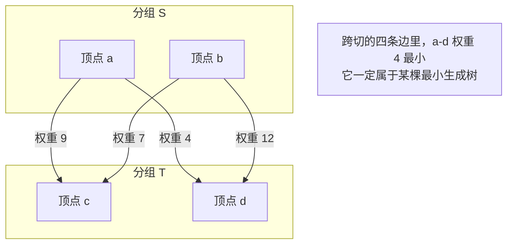

## 一、连通但代价最小

这一篇对应官方 Lecture 24（Minimum Spanning Trees）。

一个连通图里的边可能远多于必要的数量。要在所有顶点之间保持连通，需要多少条边？

答案是**顶点数减一**。一条边最多把两个原本分开的集合合并成一个，从 V 个孤立顶点出发，至少要 V−1 次合并才能连成一体。而恰好 V−1 条边连成的连通图没有环——它是一个**树**。

于是问题变成：在所有「包含全部顶点、恰好 V−1 条边、连通」的子图里，找总权重最小的那个。这个子图就是**最小生成树**（Minimum Spanning Tree）。

它的形状约束只有三条：

| 约束 | 含义 |
| --- | --- |
| 包含全部顶点 | 不能漏 |
| 恰好 V − 1 条边 | 不能多，多了就是环 |
| 连通 | 不能散成两块 |

**注意「树」这个形状是结论，不是前提。** 只要满足「连通」和「边数最少」，形状自动就是树。

## 二、切分性质：为什么贪心可行

一眼看去，这类问题很容易让人联想到旅行商问题那一类「局部最优凑不出全局最优」的难题。但最小生成树不同——**它可以用贪心求解**，而且证明很干净。

关键性质叫**切分性质**：

> 把顶点任意分成两组，横跨这两组的所有边里，权重最小的那条一定属于某棵最小生成树。



为什么成立，用反证最直接：

```text
设跨切最小的边是 e，假设某棵最小生成树 M 里没有 e。
把 e 加进 M，就出现了一个环。
这个环上必然还有另一条跨切的边 f（因为环要从 S 走到 T 再走回来）。
按 e 是最小的假设，w(e) <= w(f)。
于是 M - f + e 仍然连通、边数不变，而总权重不增加——它也是最小生成树，且包含 e。
矛盾。
```

这条性质解释了为什么两种看起来完全不同的算法都是对的：**它们只是在用不同的方式寻找可以安全使用的切分。**

## 三、Kruskal：按边排序，用并查集判环

Kruskal 的做法最接近直觉：**把所有边按权重从小到大排好，依次尝试加入，只要不形成环就留下。**

「不形成环」的判定条件非常好写：**一条边的两个端点如果已经在同一个连通块里，加进去必然成环。**

于是整个算法的重担就落到了「快速判断两个顶点是否连通」上，而这正是并查集擅长的事：

```java
    /** 返回 true 表示两个端点原本不在同一集合，这条边被接受 */
    static boolean union(int a, int b) {
        int ra = find(a);
        int rb = find(b);
        if (ra == rb) {
            return false;
        }
        if (sz[ra] < sz[rb]) {
            int t = ra;
            ra = rb;
            rb = t;
        }
        parent[rb] = ra;
        sz[ra] += sz[rb];
        return true;
    }

    static List<Edge> kruskal(int n, List<Edge> edges, long[] stats) {
        resetDsu(n);
        List<Edge> sorted = new ArrayList<>(edges);
        Collections.sort(sorted);
        List<Edge> mst = new ArrayList<>();
        long rejected = 0;
        for (Edge e : sorted) {
            if (union(e.u, e.v)) {
                mst.add(e);
            } else {
                rejected++;
            }
            if (mst.size() == n - 1) {
                break;
            }
        }
        // ...
        return mst;
    }
```

三处细节：

- **`find` 里带了路径减半**（`parent[x] = parent[parent[x]]`），把链压平，让后续查找接近 O(1)；
- **`union` 按集合大小合并**，避免长链；
- **`mst.size() == n - 1` 之后立即结束**，剩下的边不必再看。

## 四、Prim：从一棵树向外扩张

Prim 换了一个角度：**从任意一个顶点开始，每次把「离当前树最近的那个外部顶点」拉进来。**

这里的切分就是「已在树里的顶点」和「还没进来的顶点」。跨切的边里最小的那条，正是安全的那条。所以 Prim 每轮只需要在候选边里取最小——又是一个优先队列的用武之地。

```java
    static List<Edge> prim(int n, List<int[]>[] adj, int start, long[] stats) {
        boolean[] inTree = new boolean[n];
        PriorityQueue<int[]> pq = new PriorityQueue<>((a, b) -> Integer.compare(a[0], b[0]));
        pq.add(new int[]{0, start, -1});
        List<Edge> mst = new ArrayList<>();
        long pushes = 1;
        long stale = 0;
        while (!pq.isEmpty() && mst.size() < n - 1) {
            int[] cur = pq.poll();
            int w = cur[0];
            int u = cur[1];
            int from = cur[2];
            if (inTree[u]) {
                stale++;
                continue;
            }
            inTree[u] = true;
            if (from != -1) {
                mst.add(new Edge(from, u, w));
            }
            for (int[] e : adj[u]) {
                if (!inTree[e[0]]) {
                    pq.add(new int[]{e[1], e[0], u});
                    pushes++;
                }
            }
        }
        // ...
        return mst;
    }
```

和 Dijkstra 的结构几乎一模一样——**换成优先队列、把「已确定」换成「已在树中」，再记录一下是从哪条边进来的**。这里同样用了惰性删除：一个外部顶点可能被多个树内顶点看到，队列里会留下多条候选，弹出时靠 `inTree[u]` 跳过过期的那些。

两条路线的差别可以列成一张对照表：

| | Kruskal | Prim |
| --- | --- | --- |
| 增长的是一棵树还是一片森林 | 一片森林，逐步合并 | 始终是一棵连通的树 |
| 数据结构 | 并查集 + 边排序 | 优先队列 + 邻接表 |
| 主导复杂度 | O(E log E)，排序 | O(E log V)，堆操作 |
| 需要什么形式的输入 | 边的列表 | 邻接表 |
| 适合 | 稀疏图、边已经有序 | 稠密图、需要邻接表结构 |

## 五、实测：两条路线给出同一总权重

在一张 7 个顶点、11 条边的无向带权图上分别跑两种算法：

```text
无向带权图：顶点 7 个，边 11 条
  Kruskal 选中的边 = [(0-3:5), (2-4:5), (3-5:6), (0-1:7), (1-4:7), (4-6:9)]
  Kruskal 总权重 = 39，选边数 = 6，被判定成环而丢弃的边数 = 3
  Prim    选中的边 = [(0-3:5), (3-5:6), (0-1:7), (1-4:7), (4-2:5), (4-6:9)]
  Prim    总权重 = 39，选边数 = 6
  两条路线总权重相同 = true，选边集合相同 = true
  入堆次数 = 12，弹出的过期条目 = 3
```

四点可以读出来：

- **两个总权重都是 39，边数都是 6 = V − 1。** 两条完全独立的路线给出了相同结论，这是对实现正确性的第一层证据。
- **边集合也完全相同。** 注意 `(2-4:5)` 和 `(4-2:5)` 是同一条边的两种写法——比较时要把端点顺序抹平。这张图的权重大小关系比较分明，没有给不同选择留下空间。
- **Kruskal 丢掉了 3 条边。** 11 条边里选了 6 条、丢 3 条，剩下 2 条是在选满 6 条之后被提前跳过的。
- **Prim 入堆 12 次、弹出过期条目 3 次。** 7 个顶点、11 条边，每条边最多贡献一次入堆。

两条路线在复杂度上差在哪里，也可以直接看出来：**Kruskal 的瓶颈是排序（O(E log E)），Prim 的瓶颈是堆操作（O(E log V)）。** 稀疏图里 E 和 V 同阶，两者差不多；稠密图里 E 接近 V²，Prim 的 O(E log V) 更划算——不过稠密图另外还有一条不用堆、直接线性扫描未访问顶点的 Prim 变体，复杂度 O(V²)，常数更小。

## 六、实测：最小生成树不唯一

把规模放大到 20000 个顶点、119996 条边，情况就变了：

```text
规模测试：连通无向图，顶点 20000 个，边 119996 条
  Kruskal：选边 19999 条，总权重 2012976，排除了 79935 条成环边，比较了 119996 条排序后的边
  Prim   ：选边 19999 条，总权重 2012976，入堆 119997 次，弹出过期条目 79903 次
  两条路线总权重一致 = true
  选中边集合一致 = false
```

**总权重依然一致，但选出来的边集合不一样了。**

这不是 bug，而是最小生成树本身的性质：**当图中存在权重相同的边时，最小生成树可能不唯一。** 差别恰恰出现在那些「权重并列」的位置——Kruskal 按排序后的顺序优先取靠前的，Prim 按顶点扩张的顺序优先取更早遇到的，遇到相等权重时两者会做出不同但同样合法的选择。

由此可以得出一条实用的判断标准：

| 问题 | 是否唯一 | 说明 |
| --- | --- | --- |
| 最小生成树的总权重 | 唯一 | 两条路线在 20000 顶点的图上给出同一个数 |
| 最小生成树的边集合 | 可能不唯一 | 有并列权重时出现分歧 |

**所以校验实现是否正确，要比较总权重，不要比较边集合。** 拿边集合去比对，会把正确的实现判成错的。

另外看那两个数字：Kruskal 排除了 79935 条成环边，Prim 弹出了 79903 条过期条目。**两者几乎是同一个数量级，都在 8 万左右**——这不是巧合，它们本质上都在处理「因为已经连通而被淘汰的候选边」这件事，只是发生在算法的不同阶段。

## 七、不连通图与规模

最小生成树只对连通图有定义。如果图不连通，算法会安静地给出**最小生成森林**——每个连通分量各自一棵树：

```text
不连通的图：顶点 8 个，边 5 条
  Kruskal 得到的边数 = 5（小于 顶点数 - 1 = 7）
  连通分量数 = 3，恰等于 顶点数 - 选中边数 = 3
```

这里有一条恒等式值得记住：**连通分量数 = 顶点数 − 选中边数。** 原因是并查集每接受一条边就减少一个集合，从 V 个集合出发，接受 V−C 条边之后就剩下 C 个集合。

于是不连通的情况不需要任何额外判断：**跑完之后如果选中边数小于 V−1，图就是不连通的，差值正好是分量数减一。** 这也是判断连通性的顺手副产品。

最后把 Kruskal 依赖的那条定理也验证一下。切分性质说「跨切最小的边一定安全」，它有一个直接推论：**全图最轻的那条边一定落在某棵最小生成树里。** 用 500 张随机连通图检验：

```text
切分性质实测：随机连通图（顶点 12 个，共 500 次试验，跳过 27 次不连通）
  把全图最轻的边强制入选之后，总权重不变（即它属于某棵最小生成树）的次数 = 473 / 473
```

做法是：先算出普通最小生成树的权重，再强制把最轻的那条边加入集合、重新跑一遍 Kruskal。**473 张连通图上，两次的总权重全部相同。**

这条性质是 Kruskal 敢从最轻的边开始贪心的依据，也是 Prim 敢每次只扩张最短跨界边的依据。**两种算法形式差别很大，站在切分性质上看却是同一件事。**

## 八、小结

| 概念 | 一句话 | 证据 |
| --- | --- | --- |
| 树的边数 | 连通 V 个顶点恰好需要 V−1 条边 | 两条路线都选了 6 条（V = 7） |
| 切分性质 | 跨切最轻的边一定安全 | 473/473 张随机图上总权重不变 |
| Kruskal | 按边排序 + 并查集判环 | 11 条边里丢弃 3 条成环边 |
| Prim | 从一棵树向外扩张 + 优先队列 | 12 次入堆、3 条过期条目 |
| 总权重 | 唯一 | 20000 顶点图上两条路线都是 2012976 |
| 边集合 | 有并列权重时可能不同 | 小图相同，大图不同 |
| 不连通图 | 得到最小生成森林 | 分量数 = 顶点数 − 选中边数 = 3 |

三条能带走的：

1. **贪心能不能用，取决于有没有一条可证明的性质作为保证。** 最小生成树有切分性质，所以从小到大挑边是对的；换一个没有这条性质的图问题（比如最少顶点覆盖），同样的贪心就会错。
2. **同一性质可以导出完全不同的两种算法。** Kruskal 把切分看成「两个连通块之间」的，Prim 把切分看成「树内与树外」的，两者形式差异很大，正确性却建立在同一条定理上。
3. **校验要挑对指标。** 最小生成树的总权重唯一、边集合可能不唯一，所以断言应该写在权重上。用边集合去比对实现，遇到并列权重就会把正确的算法判成错的。
