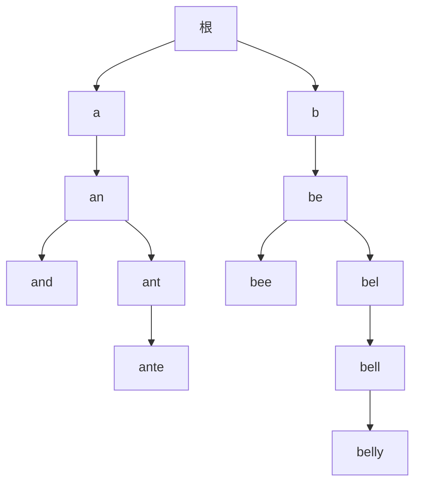

> 这一篇对应官方 Lecture 26（Prefix Operations and Tries）。
> 哈希表能回答「这个键在不在」，但回答不了「以这几个字母开头的有哪些」。
> 这一篇讲清前缀树为什么天然擅长后一类问题，并实测它在共享前缀上省下了什么、又在内存上花掉了什么。

## 一、钩子：前缀检索为什么扫描法撑不住

考虑一个自动补全框。用户敲进两个字母，需要列出词表里所有以这两个字母开头的词。

最直接的做法是扫描整个词表，逐个调用 `startsWith`：

```java
    static long scanCompares(List<String> vocab, String p) {
        long c = 0;
        for (String w : vocab) {
            int m = Math.min(w.length(), p.length());
            for (int i = 0; i < m; i++) {
                c++;
                if (w.charAt(i) != p.charAt(i)) {
                    break;
                }
            }
        }
        return c;
    }
```

这个做法的问题不在单次比较有多慢，而在于**它必须看过词表里的每一个词**。词表有 20 万个词，就要检查 20 万次；有 2000 万个词，就要检查 2000 万次。而用户每敲一个字母，都要重跑一遍。

哈希表也帮不上忙。它能 O(1) 判断「某个完整的键在不在」，因为它把整个键压成一个散列值；而一旦压成了散列值，**原本的字母顺序信息就丢掉了**。剩下「以 ab 开头的所有键」这类问题，哈希表只能退化成枚举全部键。

前缀树（Trie）的出发点就是：**不丢掉字母顺序，把「共同前缀」这件事直接写进结构里。**

## 二、结构：字符挂在边上，单词挂在节点上

前缀树是一棵多叉树，每个节点代表**一个前缀**：

- 从根到某个节点的路径，拼起来就是这个节点代表的前缀；
- 每个节点带一个布尔标记，表示「这个前缀本身是不是一个完整单词」。

以词表 `[a, an, and, ant, ante, be, bee, bell, belly]` 为例，树长这样：



三个可以直接从图上读出来的性质：

- **`ant` 与 `ante` 共用同一条路径。** 从根走到 `ant` 的那个节点，再加一个字母 `e` 就是 `ante`。前缀共享不是靠额外优化，而是结构本身的形状。
- **节点存在不等于单词存在。** 图里有一个表示 `an` 的节点，也有一个表示 `ant` 的节点，但它们之间那条路上还有一个表示 `ane` 的节点——这个词不在词表里。**所以每个节点必须带一个「到这里是不是单词结尾」的标记，光看节点是否存在判断不了。**
- **每个节点恰好对应一个互异前缀。** 不多不少，这条性质后面会变成一个可验证的等式。

## 三、四个基本操作

```java
        void insert(String w) {
            Node cur = root;
            for (int i = 0; i < w.length(); i++) {
                int c = w.charAt(i) - 'a';
                if (cur.next[c] == null) {
                    cur.next[c] = new Node();
                    nodes++;
                }
                cur = cur.next[c];
            }
            cur.isWord = true;
        }

        boolean contains(String w) {
            Node cur = root;
            for (int i = 0; i < w.length(); i++) {
                int c = w.charAt(i) - 'a';
                if (c < 0 || c >= 26 || cur.next[c] == null) {
                    return false;
                }
                cur = cur.next[c];
            }
            return cur.isWord;
        }
```

`insert` 和 `contains` 是同一个骨架：**沿着单词的每个字符往下走，中途缺节点就补，走完看标记。** 代价是 O(len(w))，与树里存了多少词无关。

注意 `contains` 最后返回的是 `cur.isWord` 而不是 `true`。**如果返回 `true`，那么在一个存了 `ante` 的树里查询 `ane` 就会错误地成功**——`ane` 的路径确实存在，但它不是一个单词。

前缀检索无非是把「走完再看标记」改成「走完再收集整棵子树」：

```java
        List<String> keysWithPrefix(String p) {
            List<String> out = new ArrayList<>();
            Node cur = descend(p);
            if (cur == null) {
                return out;
            }
            collect(cur, new StringBuilder(p), out);
            return out;
        }

        private void collect(Node n, StringBuilder sb, List<String> out) {
            if (n.isWord) {
                out.add(sb.toString());
            }
            for (int c = 0; c < 26; c++) {
                if (n.next[c] != null) {
                    sb.append((char) ('a' + c));
                    collect(n.next[c], sb, out);
                    sb.deleteCharAt(sb.length() - 1);
                }
            }
        }
```

一次前缀检索的成本可以明确拆成两段：


**第一段的代价与词表规模完全无关**，第二段只和「匹配上的词有多少」有关。这两句话就是前缀树的全部价值所在。

第四个操作是**最长前缀词**，自动补全之外的另一个常见需求（比如把输入流切成已知词）：

```java
        String longestPrefixOf(String s) {
            Node cur = root;
            String best = cur.isWord ? "" : null;
            for (int i = 0; i < s.length(); i++) {
                int c = s.charAt(i) - 'a';
                if (c < 0 || c >= 26 || cur.next[c] == null) {
                    break;
                }
                cur = cur.next[c];
                if (cur.isWord) {
                    best = s.substring(0, i + 1);
                }
            }
            return best;
        }
```

做法是**一边下降一边记录**：每经过一个 `isWord` 为真的节点，就更新一次答案。走不动了，最后一次记录的就是最长的那个。

## 四、实测：共享前缀省下了什么

先看小词表：

```text
示例词表（12 个词）= [a, an, and, ant, ante, be, bee, bell, belly, cat, cattle, catalog]
  节点数（含根）= 22
  前缀 an 的补全 = [an, and, ant, ante]
  前缀 bel 的补全 = [bell, belly]
  前缀 cat 的补全 = [cat, catalog, cattle]
  前缀 ba 的补全 = []
  含 and = true，含 ane = false
  "antelope" 的最长前缀词 = ante
  "cattlelog" 的最长前缀词 = cattle
```

几处对照：

- **`an` 的补全包含它自己。** `an` 既是前缀也是单词，所以出现在结果里。这依赖 `isWord` 标记，光靠路径判断不出来。
- **`ba` 返回空列表。** 树里根本没有以 `b` 开头的路径——`be` 走的是 `b → e`，`ba` 走的是 `b → a`，第一步就在 `a` 处卡住。
- **`cattlelog` 的最长前缀词是 `cattle` 而不是 `cat`。** 算法边下降边记录，遇到更长的就覆盖，所以拿到的是最长的那个而不是最先遇到的。
- **`antelope` 的最长前缀词是 `ante`。** 走到 `e` 之后继续找 `l` 时失败退出，答案停在 `ante`。

12 个词用掉 22 个节点。把规模放大到 20000 个词，共享的规模效应就非常清楚了：

```text
大规模词表：单词数 = 20000，每词 4 个音节、共 8 个字母
  单词字符总数 = 165127
  互异前缀总数 = 77962
  前缀树节点数（含根）= 77963，节点数 - 1 = 77962，与互异前缀数相等 = true
```

最后一行是一个**可以机械验证的恒等式**：

```text
节点数 - 1 = 互异前缀总数
77963 - 1 = 77962
```

等式成立的理由很直接：树里每个非根节点都对应唯一一条从根出发的路径，也就对应唯一一个前缀；反过来每个互异前缀都有一条路径。**「节点数」和「互异前缀数」在这两种数法下是同一件事。**

这也解释了为什么节点数（77963）远小于字符总数（165127）：**77962 个互异前缀里，大量前缀被多个单词共用**，每个只存一次。如果换成把 20000 个单词各自存成字符串，公共前缀会被重复保存 20000 遍不同次数。

## 五、实测：检索成本与词表规模的关系

把同一个前缀放到两种规模的词表上，看成本怎么变：

```text
同一前缀在不同词表规模下的检索成本：
  词表 20000 个词，前缀 "al"：扫描法要检查全部 20000 个词、20770 次字符比较；Trie 走 2 步索引 + 子树 2999 个节点
  词表 20000 个词，前缀 "albe"：扫描法要检查全部 20000 个词、21570 次字符比较；Trie 走 4 步索引 + 子树 115 个节点
  词表 200000 个词，前缀 "al"：扫描法要检查全部 200000 个词、207693 次字符比较；Trie 走 2 步索引 + 子树 18197 个节点
  词表 200000 个词，前缀 "albe"：扫描法要检查全部 200000 个词、215682 次字符比较；Trie 走 4 步索引 + 子树 699 个节点
```

四行之间的对比给出两条结论：

| 对比维度 | 扫描法 | 前缀树 |
| --- | --- | --- |
| 词表从 2 万涨到 20 万 | 检查词数 2 万 → 20 万，字符比较 20770 → 207693，**同步涨 10 倍** | `al` 的子树 2999 → 18197，**只涨 6.1 倍** |
| 前缀从 2 个字母加到 4 个字母 | 字符比较几乎不变（20770 → 21570，因为绝大多数词在前两个字母就失配了） | 子树从 2999 降到 115，**降 26 倍** |

- **扫描法的成本下限是「词表规模」。** 无论前缀多长、匹配多少个，它都必须把整个词表走一遍，字符串比较次数随 N 线性增长。
- **前缀树的成本只由「前缀长度 + 匹配数量」决定。** 前缀变长，匹配数量按字母表大小指数级收缩，成本随之下降；词表变大，成本只跟着匹配数量涨，而匹配数量涨得比 N 慢（实测 6.1 倍 vs 10 倍）。

两者的差距可以直接算出来：前缀 `albe` 在 20 万词的词表上，扫描法要做 215682 次字符比较，前缀树只走 4 步索引加 699 个节点，**相差约 300 倍**。而前缀越长，这个倍数还会继续拉大。

## 六、字典序是免费的

`collect` 里那个 `for (int c = 0; c < 26; c++)` 循环是按字母表顺序遍历的，所以**收集出来的结果天然就是字典序**：

```text
  补全结果天然按字典序 = true
```

这一条不需要任何额外工作。对比一下：如果用一个无序的 `HashSet` 存词表，要输出有序的补全结果就得先全收集再排序，代价 O(M log M)；而前缀树的输出顺序是结构自带的。

**这也是「不丢掉字母顺序」换来的直接好处之一。**

## 七、内存代价与三种改进

前缀树不是没有代价，而且代价不小。上面那份实现里，每个节点固定持有 26 个引用槽：

```text
内存代价：每个节点固定持有 26 个引用槽，共 2027038 个槽；按每槽 8 字节估算约 15.5 MB，而单词字符本身只有约 0.31 MB
```

**约 15.5 MB 换 0.31 MB 的字符数据，放大约 50 倍。** 原因是绝大多数槽都是空的：`albe` 这种前缀节点只有一个子节点，剩下 25 个槽全在浪费。词表越稀疏（字符集越大、单词越短），浪费越严重。

三种常见的改进方向：

| 改进 | 做法 | 效果 |
| --- | --- | --- |
| 子节点换成哈希表 | 每个节点只存实际存在的孩子 | 稀疏时省内存，但常数变大、失去顺序 |
| 压缩前缀树（radix / Patricia） | 把只有单个孩子的连续节点压成一条边，边上存整个字符串 | 节点数大幅下降，适合长公共前缀 |
| 三叉搜索树 | 每个节点只放一个字符 + 左中右三个指针 | 内存接近二叉搜索树，同时保留前缀性质 |

选择取决于瓶颈在哪：

- **词表稠密、字母集小、查询频繁** → 定长数组的常数最小，最划算；
- **词表稀疏、需要省内存** → 哈希表子节点或压缩前缀树；
- **既要前缀性质又要低内存占用** → 三叉搜索树。

**定长数组版本是「用内存换常数」的极端选择**，它在论文和教材里最常见，因为结构最简单、分析最干净；但落地到生产环境时，几乎都会换成上面三种之一。

## 八、小结

| 概念 | 一句话 | 证据 |
| --- | --- | --- |
| 节点含义 | 一个节点对应一个互异前缀 | 节点数 − 1 = 互异前缀数 = 77962 |
| 前缀共享 | 公共前缀在树里只存一次 | 165127 个字符 → 77963 个节点 |
| `isWord` 标记 | 节点存在不代表单词存在 | 含 `and`，不含 `ane` |
| 前缀检索成本 | 前缀长度 + 子树规模，与词表总量无关 | 成本随 N 只涨 6.1 倍，扫描法涨 10 倍 |
| 前缀越长越快 | 匹配数量按字母表大小收缩 | `al` 子树 2999 → `albe` 子树 115 |
| 字典序输出 | 按字母顺序遍历子树，无需排序 | 结果天然有序 |
| 内存代价 | 定长 26 槽的稀疏浪费 | 15.5 MB 存 0.31 MB 字符 |

| 结构 | 完整键查找 | 前缀枚举 | 有序输出 | 内存 |
| --- | --- | --- | --- | --- |
| 无序数组 | O(N) | O(N) | 需排序 | 紧凑 |
| 哈希表 | 均摊 O(1) | 不支持 | 需排序 | 中等 |
| 平衡 BST | O(log N) | O(log N + M) | 天然有序 | 中等 |
| 前缀树 | O(len) | O(len + M) | 天然有序 | 定长数组版本偏大 |

三条能带走的：

1. **数据结构的形状决定了它能回答哪类问题。** 哈希表把键压成一个数，于是彻底失去了顺序；前缀树把键摊成一条路径，于是顺序和前缀关系都被完整保留。**能答什么，是由「信息被保留成什么形状」决定的。**
2. **共享是结构自带的，不是额外优化。** 前缀树不存单词，只存前缀；公共前缀只存一次不是压缩的结果，而是「一个节点一个前缀」这条定义的自然推论——节点数等于互异前缀数这条恒等式就是它的表达式。
3. **省下来的时间往往要用内存去换。** 定长 26 槽的实现在检索上常数最小，代价是 50 倍的内存放大。工程上真正要做的不是选「最优解」，而是先看清瓶颈在时间还是内存，再决定用哪一种变体。
