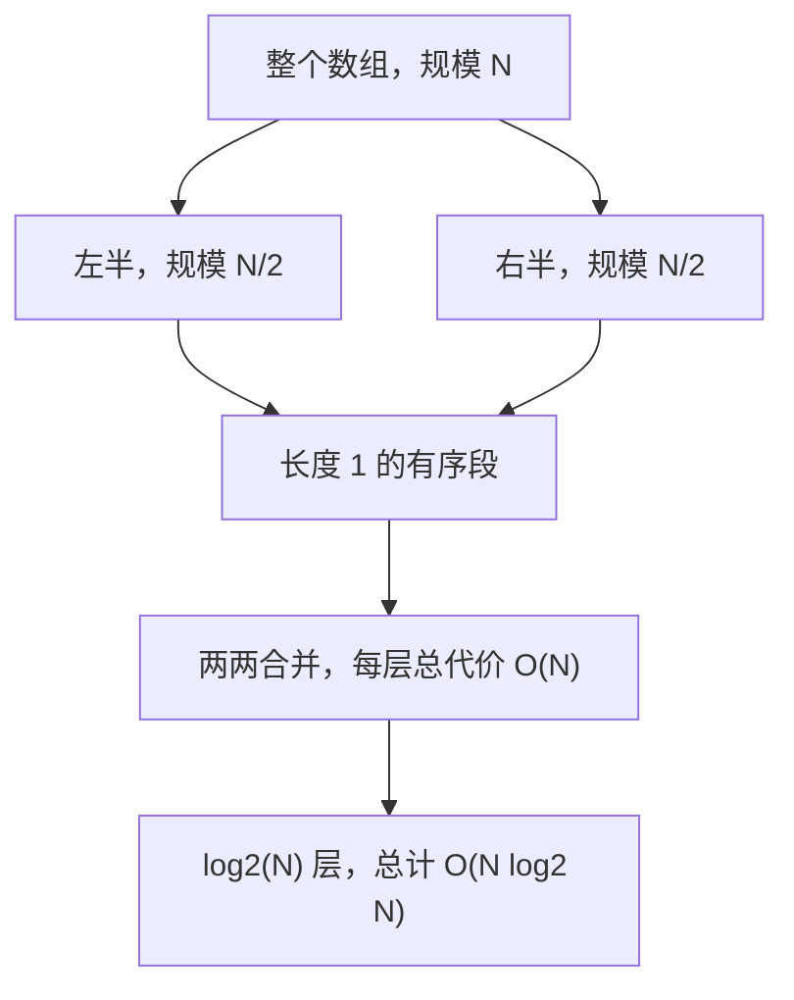

> 这一篇对应官方 Lecture 29（Basic Sorts）。
> 一个排序算法好不好，至少要同时看三件事：比较多少次、移动多少次、遇到特殊输入会不会失控。
> 这一篇用同一批数据把三种基础排序放在一起，把这三个数字都测出来。

## 一、钩子：一个数字说明不了问题

「这个排序是 O(N²)，那个是 O(N log N)」——这句话在很多场合是对的，但它省略了两件重要的事。

第一件：**常数和大 O 是两回事。** N² 和 N log N 在 N 很小的时候可能完全反过来了。实测数据里，N = 10000 时选择排序要做 49995000 次比较，而插入排序在升序输入上只需要 9999 次——**差了 5000 倍，而这个差距跟大 O 无关**。

第二件：**比较次数和数据移动次数是两笔账。** 选择排序比较得很勤，但几乎不挪动数据；插入排序刚好相反。在真实系统里，如果比较一个元素很便宜（比如比整数）而移动它很贵（比如移动一个几百字节的结构体），这两个数字的权重完全不同。

所以这一篇把三种基础排序放在同一批数据上，把**比较次数**和**移动次数**分别测出来，再补上第三个容易被忽略的指标——**稳定性**。

## 二、选择排序：比较次数固定

选择排序的思路是：每一轮从未排序区间里选出最小的，跟区间头部交换。

```java
    static void selectionSort(long[] a) {
        for (int i = 0; i < a.length; i++) {
            int min = i;
            for (int j = i + 1; j < a.length; j++) {
                compares++;
                if (key(a[j]) < key(a[min])) {
                    min = j;
                }
            }
            if (min != i) {
                long t = a[i];
                a[i] = a[min];
                a[min] = t;
                moves += 2;
            }
        }
    }
```

它的一个重要性质是：**比较次数完全固定，只由数组长度决定。**

内层循环的轮数不受任何数据特征影响——不管数组是有序、逆序还是全相等，第 i 轮总要走完 `n − 1 − i` 次比较，总数恒为 `n(n−1)/2`。这是它最大的优点（行为可预测）也是最大的缺点（永远拿不到「输入很好」的红利）。

不过它的**移动次数极少**：每轮最多一次交换，也就是两次赋值。放到移动代价高的场景里，这个特点是有价值的。

## 三、插入排序：对输入敏感

插入排序维护一个「已排序区间」，每轮把下一个元素插入到区间里的正确位置。

```java
    static void insertionSort(long[] a) {
        for (int i = 1; i < a.length; i++) {
            long v = a[i];
            int j = i - 1;
            while (j >= 0) {
                compares++;
                if (key(a[j]) <= key(v)) {
                    break;
                }
                a[j + 1] = a[j];
                moves++;
                j--;
            }
            a[j + 1] = v;
            moves++;
        }
    }
```

和选择排序正好相反：**它的代价强烈依赖输入。**

- 输入已经有序时，每个元素只需和左邻居比一次就停，总比较次数 `n − 1`；
- 输入完全逆序时，每个元素都要一路移到最左端，总比较次数 `n(n−1)/2`，与选择排序持平。

这个「有序输入下线性」的性质非常有用。实际数据往往是**近似有序**的（日志按时间追加、列表只被局部修改过），插入排序在这种数据上表现极好。这也是为什么很多工业级排序库在切分到很小的子数组时会切换成插入排序——**子问题规模小且往往接近有序**。

`if (key(a[j]) <= key(v)) break;` 这一行里的 `<=` 不是随手写的：

| 写法 | 全相等输入下的比较次数 | 后果 |
| --- | --- | --- |
| `<=`（相等就停） | n − 1，最好情况 | 稳定，且等值输入极快 |
| `<`（相等就继续移） | n(n−1)/2，最坏情况 | 不稳定，等值输入退化 |

**一个字符之差，等值输入下的代价差 5000 倍。** 差别出在相等元素的相对次序有没有被保留——`<=` 保留了它，`<` 破坏了它，这正是排序里「稳定性」这件事的分水岭。

## 四、归并排序：分治与稳定的合并

归并排序把数组一分为二、递归排好、再合并两个有序段。

```java
    static void msort(long[] a, long[] buf, int lo, int hi) {
        if (hi - lo <= 1) {
            return;
        }
        int mid = (lo + hi) / 2;
        msort(a, buf, lo, mid);
        msort(a, buf, mid, hi);
        int i = lo;
        int j = mid;
        int k = lo;
        while (i < mid && j < hi) {
            compares++;
            if (key(a[i]) <= key(a[j])) {
                buf[k++] = a[i++];
            } else {
                buf[k++] = a[j++];
            }
        }
        while (i < mid) {
            buf[k++] = a[i++];
        }
        while (j < hi) {
            buf[k++] = a[j++];
        }
        for (int t = lo; t < hi; t++) {
            a[t] = buf[t];
            moves++;
        }
    }
```



归并排序的代价结构很干净：**每一层合并都要把 N 个元素过一遍，一共有 log₂N 层**，所以比较次数是 O(N log N)。

合并那一步有一个细节决定了稳定性：`if (key(a[i]) <= key(a[j]))` 里用的是 `<=`。**当左右两段的当前元素键相等时，优先取左边的。** 左段的元素本来就在右段之前，于是相等元素的相对次序被完整保留下来。

## 五、实测：比较次数与移动次数

N = 10000，四种输入形态，三个数字分别测：

```text
N = 10000 时的键比较次数：
  随机          选择 = 49995000  插入 = 24920495  归并 = 120402
  升序          选择 = 49995000  插入 = 9999  归并 = 64608
  降序          选择 = 49995000  插入 = 49995000  归并 = 69008
  全相等         选择 = 49995000  插入 = 9999  归并 = 64608

N = 10000 时的数据移动次数：
  随机          选择 = 19972  插入 = 24858748  归并 = 133616
  升序          选择 = 0  插入 = 9999  归并 = 133616
  降序          选择 = 10000  插入 = 50004999  归并 = 133616
  全相等         选择 = 0  插入 = 9999  归并 = 133616
```

四行数据可以拆成四条独立结论。

### 选择排序那一列：完全不动

从 49995000 到 49995000 到 49995000 到 49995000——**四种输入形态下比较次数一模一样**，正好等于 `10000 × 9999 / 2 = 49995000`。这就是「代价固定」的直接证据。

移动次数那一列同样极端：升序和全相等时是 0（一次交换都不需要），逆序时也只有 10000（每个位置换一次）。**比较得多、移动得少**，是选择排序的画像。

### 插入排序那一列：跨度 5000 倍

比较次数从升序的 9999 一路涨到逆序的 49995000，**同一个算法，跨度 5000 倍**。

值得单独注意的是**全相等那一行：比较 9999 次、移动 9999 次**——和升序输入完全一样，都是最好情况。原因就在前面提到的 `<=`：一发现左边的键不大于当前值就立即停下。**如果换成 `<`，这一行会变成最坏情况。**

移动次数那一列更夸张：随机数据下 24858748 次，逆序下 50004999 次。**插入排序的移动次数是它的真实瓶颈**——它一次挪一格，而选择排序一次跨任意距离。

### 归并排序那一列：移动次数完全恒定

比较次数随输入变化（120402 / 64608 / 69008 / 64608），但**移动次数四行全是 133616**，一个数字都不差。

原因很直接：归并排序不关心元素之间的比较结果，它**总是**把每个元素从缓冲区抄回原数组。每一次合并的代价等于这一段元素的个数，把所有合并段的长度加起来就是总移动次数——**这个总量只取决于数组长度和递归的切分方式，与元素之间的比较结果毫无关系。**

实测 133616 次，相当于每个元素平均被搬运 13.36 次，与递归层数 ⌈log₂10000⌉ = 14 处在同一量级。**「代价与输入无关」在工程上是优点**：不需要担心某一天遇到特殊数据时性能突然掉下去。

### 归并排序在有序输入上为什么反而更快

比较次数那一列有个反直觉的地方：升序输入只要 64608 次，比随机输入的 120402 次**少了将近一半**。

原因是合并过程。当左段完全小于右段时，每次比较都从左边取，而左边的元素取完时右段一个都没动——**根本不用继续比较，直接把右段整段接上就行**。于是每层合并的比较次数从「接近 N」降到「恰好等于左段长度」，也就是 N/2：

```text
10000 / 2 × log2(10000) ≈ 5000 × 13.3 ≈ 66500，与实测 64608 同量级
```

**归并排序在有序输入上是最好情况，但仍然远贵于插入排序的 9999 次**——因为它照样要把所有元素搬一遍。

## 六、稳定性：一个必须单独测的性质

**稳定性**的定义是：如果两个元素的排序键相等，排序之后它们的相对次序必须保持不变。

这个性质不能用「排完之后数组是升序的」来验证——**一个不稳定的排序同样能输出升序结果**。验证的方法是把原始位置编码进元素里：高 32 位放排序键，低 32 位放原始下标。

先用一个最小的例子说明差别。键序列 `[3, 3, 1]`，两个 `3` 的原始序号分别是 0 和 1：

```text
极简例子：键序列 [3, 3, 1]，两个 3 的原始序号分别是 0 和 1
  选择排序结果 = (键 1, 序号 2) (键 3, 序号 1) (键 3, 序号 0)，稳定 = false
  插入排序结果 = (键 1, 序号 2) (键 3, 序号 0) (键 3, 序号 1)，稳定 = true
  归并排序结果 = (键 1, 序号 2) (键 3, 序号 0) (键 3, 序号 1)，稳定 = true
```

**选择排序把两个 `3` 的相对次序颠倒了（序号 1 跑到了 0 前面），插入排序和归并排序都保住了原次序。**

选择排序不稳定的原因在于它用的是**交换**：第一轮要把最小的 `1` 换到头部，`1` 和第一个 `3` 交换之后，两个 `3` 的相对位置就被打乱了。**跨距离的交换必然可能跨越等值元素。**

换到随机数据上看，结论一样：

```text
N = 5000、键只有 1..10 共十种取值（大量重复）时的正确性与稳定性：
  选择排序：已升序 = true，稳定 = false，比较 = 12497500，移动 = 8964
  插入排序：已升序 = true，稳定 = true，比较 = 5669750，移动 = 5669754
  归并排序：已升序 = true，稳定 = true，比较 = 53420，移动 = 61808
```

**三个算法都输出了升序结果，但只有一个不稳定。** 这就是为什么稳定性必须单独测——它不体现在「排序结果对不对」上，而体现在「排序过程有没有顺手打乱别的东西」上。

三种排序的稳定性来源完全不同：

| 算法 | 稳定性 | 原因 |
| --- | --- | --- |
| 选择排序 | 不稳定 | 跨距离交换可能跨越等值元素 |
| 插入排序 | 稳定 | 只在严格小于时才移动，等值元素不跨越 |
| 归并排序 | 稳定 | 合并时相等优先取左段 |

稳定性什么时候要紧？当数据带有「主键相同但次键有意义」的结构时：

- 先按姓名排序、再按部门排序，如果第二次排序是稳定的，同一部门内的人仍然保持姓名的次序；
- 按时间戳排序的日志，如果时间戳有重复，稳定排序能保住它们原本的写入顺序。

**这个需求用不稳定的排序实现不了**，只能靠稳定排序，或者在键里补上第二排序字段来模拟。

## 七、小结

| 算法 | 比较次数 | 移动次数 | 稳定性 | 特点 |
| --- | --- | --- | --- | --- |
| 选择排序 | 恒为 n(n−1)/2，与输入无关 | 极少，每轮最多 2 次赋值 | 不稳定 | 代价可预测，移动便宜 |
| 插入排序 | 最好 n−1，最差 n(n−1)/2 | 与逆序程度成正比，可达 n² 量级 | 稳定 | 近似有序输入上极快 |
| 归并排序 | O(N log N)，有序输入约减半 | 恒为 N·log₂N，与输入无关 | 稳定 | 代价可预测，需要额外缓冲数组 |

| 输入形态 | 选择（比较） | 插入（比较） | 归并（比较） |
| --- | --- | --- | --- |
| 随机 | 49995000 | 24920495 | 120402 |
| 升序 | 49995000 | 9999 | 64608 |
| 降序 | 49995000 | 49995000 | 69008 |
| 全相等 | 49995000 | 9999 | 64608 |

三条能带走的：

1. **大 O 只说明增长趋势，不说明实际代价。** 选择排序和归并排序在 N = 10000 时差 415 倍，但在 N = 20 时两者都只有几十到一百多次操作。选算法之前先看清楚 N 的量级和数据形态。
2. **比较和移动是两笔账，要分别算。** 选择排序比较 5000 万次只移动 2 万次，插入排序两者都在千万量级。元素本身很大（比如结构体）时，移动次数才是决定性的。
3. **稳定性必须单独验证，它不会体现在「结果是否有序」上。** 一个不稳定的排序照样能输出升序数组，问题只会在「等值元素的次序」这种具体语义上暴露出来。
