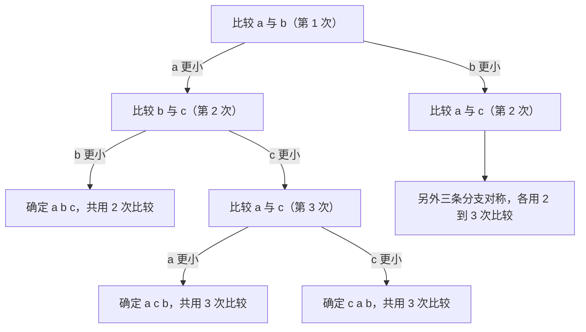

## 一、还能不能更快

这一篇对应官方 Lecture 34（Sorting and Algorithmic Bounds）。

已经见过 O(N log N) 的排序，也见过退化到 O(N²) 的排序。自然会问：**能不能做到 O(N)？**

在回答之前，得先把问题拆成两半：

| 问题 | 答案 |
| --- | --- |
| 在「只能比较元素」这个前提下，能不能突破 N log N？ | 不能，有严格下界 |
| 如果允许做别的事情呢？ | 可以，下界不再适用 |

**下界不是关于某个算法的结论，而是关于「允许使用哪些操作」这个前提的结论。** 这一篇的主要内容就是把这条界线划清楚：先证明比较模型下的下界，再用一个不做任何比较的排序说明前提一旦放开会怎样。

## 二、判定树：把「比较」这件事画成树

一个只靠比较来排序的算法，它的全部行为可以画成一棵**判定树**：

- 每个内部节点是一次比较，例如「比较 a 和 b」；
- 每个内部节点有两条出边，分别对应比较的两种结果；
- 每个叶子是一次输出，也就是一个确定下来的排列。

以三个元素 `a, b, c` 为例，用「比较后交换」的思路排一遍：



树上有两个可以直接读出的性质：

- **从根到某个叶子的路径长度，就是这一条输入对应的比较次数。** 因为一路上每经过一个节点就做了一次比较。
- **整棵树的高度，就是这个算法在最坏情况下的比较次数。** 最坏情况就是最长的那条路径。

于是「这个算法最少要比较多少次」这个问题，被翻译成了「这棵树至少要多高」。

## 三、下界：log₂(N!)

要回答树至少要多高，先数一数叶子够不够。

**排序算法必须能区分所有可能的输入排列。** N 个互不相同的元素有 N! 种排列，每一种排列都应该把算法引导到不同的叶子——如果两种排列落到同一个叶子，算法对它们输出同样的结果，但正确答案不同，这个算法就是错的（至少对其中一种）。

所以：

```text
叶子数 >= N!
```

一棵高度为 h 的二叉树最多有 2^h 个叶子，所以：

```text
2^h >= N!  →  h >= log2(N!)
```

再加上高度必须是整数：

```text
比较排序的最坏情况比较次数 >= ceil(log2(N!))
```

这个推导有三点需要留意：

1. **它只用了「每次比较有两种结果」这一条事实。** 结论强烈，前提却很朴素。
2. **它对平均情况同样成立。** 一棵有 N! 个叶子的二叉树，叶子平均深度至少是 log₂(N!)，所以平均比较次数也下不去。
3. **它没有说是哪个算法。** 这是对所有比较排序的统一约束，包括还没被发明出来的。

把小的 N 精确算出来：

```text
小规模可精确计算：
  N = 2：排列数 = 2，log2(N!) = 1.000，比较次数下界 = 1
  N = 3：排列数 = 6，log2(N!) = 2.585，比较次数下界 = 3
  N = 4：排列数 = 24，log2(N!) = 4.585，比较次数下界 = 5
  N = 5：排列数 = 120，log2(N!) = 6.907，比较次数下界 = 7
  N = 8：排列数 = 40320，log2(N!) = 15.299，比较次数下界 = 16
  N = 10：排列数 = 3628800，log2(N!) = 21.791，比较次数下界 = 22
```

N = 3 这一行值得盯一下：`log₂6 = 2.585`，取整得到 3。**不多不少正好 3 次**，而判定树图里最坏情况的路径长度也确实是 3。原因是 6 个叶子在高度 2 的树里装不下（最多 4 个），必须到高度 3。

## 四、实测：归并排序离下界有多远

下界说「至少要这么多次」，那已有的算法实际用了多少次？把两者并排放：

```text
归并排序的实测比较次数与下界的距离：
  N = 100：下界 = 525，归并实测 = 544，实测 / 下界 = 1.036，已升序 = true
  N = 1000：下界 = 8530，归并实测 = 8734，实测 / 下界 = 1.024，已升序 = true
  N = 10000：下界 = 118459，归并实测 = 120526，实测 / 下界 = 1.017，已升序 = true
  N = 100000：下界 = 1516705，归并实测 = 1536750，实测 / 下界 = 1.013，已升序 = true
```

**归并排序在随机数据上只比下界高出 1.3% 到 3.6%，而且这个比例随 N 增大还在收窄。**

这个结果回答了一开始那个问题：**在比较模型里，N log N 这条线已经被逼近到头了。** 剩下的改进空间只有百分之几的常数，而且这百分之几还要靠精心设计的算法（比如专为小规模优化的 merge-insertion）才能拿到，代价是实现的复杂度。

值得对照的是归并排序的两笔账：它的**比较次数**接近最优，但**移动次数**是 N·log₂N 且与输入无关——而这笔账不在下界的管辖范围内。**下界只约束比较次数，不约束数据搬动。** 这也是为什么真实排序库最终选择的是「快速排序 + 插入排序 + 堆排序」这一类混合方案：比较次数的差距只有百分之几，但它们在数据搬动和内存占用上更划算。

## 五、下界的常见形式

`log₂(N!)` 这个形式不方便直接和 `N log N` 比较，工程上更常用它的近似：

```text
下界的另一种写法（斯特林近似）：log2(N!) ≈ N*log2(N) - 1.4427*N
  N = 1000：精确值 = 8529，近似值 = 8523，相对误差 = 0.0740%
  N = 10000：精确值 = 118458，近似值 = 118450，相对误差 = 0.0068%
  N = 1000000：精确值 = 18488885，近似值 = 18488869，相对误差 = 0.0001%
```

这个近似就是斯特林公式取对数后的结果。它揭示了一件重要的事：

```text
log2(N!) = N*log2(N) - 1.4427*N + O(log N)
```

**主项是 N log₂N，前面那个系数 1 是紧的。** 所以比较排序的下界可以放心地写成 `Ω(N log N)`——不是「大概这么多」，而是「主项就是这个，前面的常数最多只能省到 1」。

后面那个 `1.4427N` 也不是可忽略的项：N = 100000 时它贡献约 144270，占总量（1516705）的近 10%。**所以「下界约等于 N log₂N」这个说法在定性上对，在定量上偏松。**

## 六、打破下界：计数排序

下界的推导只用到了一条事实：**每次比较最多把候选情形一分为二。** 那如果绕过「比较」这件事本身呢？

如果键的取值是有限范围内的整数，可以直接统计每个值出现了多少次：

```java
    /** 计数排序：完全不做键比较，只统计每个取值出现的次数 */
    static int[] countingSort(int[] a, int k, long[] steps) {
        int[] cnt = new int[k];
        long s = 0;
        for (int v : a) {
            cnt[v]++;
            s++;
        }
        int[] out = new int[a.length];
        int idx = 0;
        for (int v = 0; v < k; v++) {
            s++;
            for (int c = 0; c < cnt[v]; c++) {
                out[idx++] = v;
                s++;
            }
        }
        steps[0] = s;
        return out;
    }
```


实测：

```text
跳出比较模型：计数排序
  N = 1000000，取值只有 0..999 共 1000 种
  计数排序：键比较次数 = 0，总步数 = 2001000（统计 1000000 次 + 扫计数器 1000 次 + 写出 1000000 次）
  已升序 = true
  同样的数据用归并排序：下界 = 18488885，量级上完全不是一回事
```

**比较次数是 0，总步数是 2001000。**

这个结果并不矛盾，原因是计数排序**根本没有从比较里获取信息**：

| | 比较排序 | 计数排序 |
| --- | --- | --- |
| 信息来源 | 元素之间的大小关系 | 元素本身的数值 |
| 每次能取多少信息 | 1 比特（小于 / 大于） | 直接得到这个元素该放在哪个桶 |
| 下界 | ⌈log₂(N!)⌉ | 不适用 |

**比较排序把元素当成「只能互相比较的黑盒」；计数排序直接读它的值。** 后者能利用的信息更多，所以不受那条约束。这也是下界推导里那句「每次比较最多区分 2 种情形」的直接后果——把前提拿掉，结论就消失了。

代价也随之而来：

| 限制 | 说明 |
| --- | --- |
| 只适用于整数或可映射成整数下标的键 | 浮点、字符串要做额外的映射 |
| 需要长度等于值域大小的计数器 | 值域 10⁹ 时开不出这么大的数组 |
| 值域远大于元素数时不划算 | 步数 2N + K，K 很大时反而比 N log N 慢 |

**所以计数排序不是「更好的排序」，而是「在特定数据形态下更划算的排序」。** 数据是 [0, 999] 范围内的整数时它压倒性地快；键是任意字符串时它根本用不了。

沿着这条路走出来的还有基数排序（按位分批做计数排序）和桶排序（按区间分桶再桶内排序），它们都是同一条思路的延伸：**用「键的结构」换取「不比较」。**

## 七、小结

| 概念 | 一句话 | 证据 |
| --- | --- | --- |
| 判定树 | 内部节点是比较，叶子是输出排列 | N = 3 的树高为 3 |
| 叶子数约束 | 必须能区分全部 N! 种排列 | 6 种排列至少要 3 次比较 |
| 下界 | 比较次数 ≥ ⌈log₂(N!)⌉ | N = 10 时是 22 次 |
| 平均情况 | 同样受下界约束 | 平均叶子深度 ≥ log₂(N!) |
| 归并排序的位置 | 随机数据上距下界 1.3% 到 3.6% | N = 100000 时 1536750 / 1516705 |
| 下界的形式 | N log₂N − 1.4427N | 近似误差小于 0.1% |
| 打破下界 | 不通过比较获取信息 | 计数排序比较次数为 0 |

| 下界项 | 表达式 | N = 100000 时的量级 |
| --- | --- | --- |
| 主项 | N log₂N | 1660964 |
| 修正项 | −1.4427N | −144270 |
| 下界合计 | ⌈log₂(N!)⌉ | 1516705 |

三条能带走的：

1. **下界是关于「允许做什么」的结论，不是关于某个算法的结论。** 「比较排序至少需要 log₂(N!) 次比较」这句话里的前提是「只能比较」，前提一放开，结论立刻失效。
2. **下界的作用是告诉你什么时候该停止优化。** 归并排序已经贴到只差百分之一，继续在比较次数上投入的回报非常有限；有意义的改进方向变成了「减少数据搬动」和「降低内存占用」这些不在下界管辖内的指标。
3. **跳出模型比在模型内优化更值钱。** 比较排序花了几十年把常数从 2 压到 1.01，而计数排序换一个前提就直接拿到了 O(N)。**遇到性能瓶颈时，先问「这个问题必须通过这种方式解决吗」，往往比继续调参数收获更大。**
