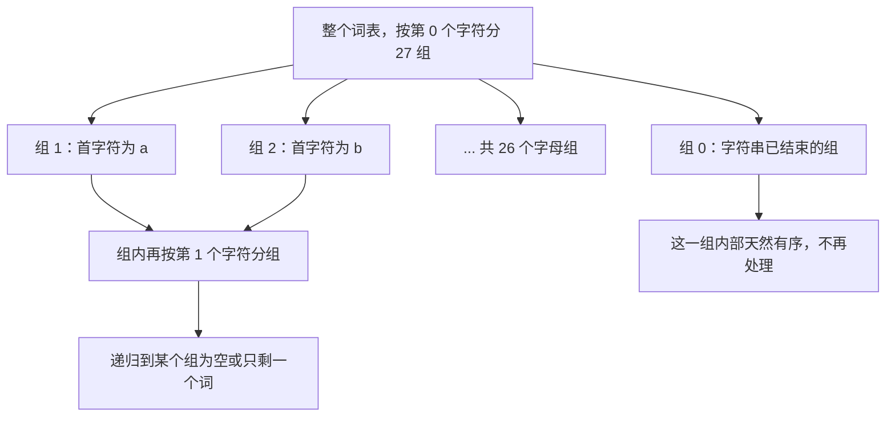

## 一、值域太大怎么办

这一篇对应官方 Lecture 35（Radix Sorts）。

计数排序的速度来自一个交换：**不做比较，直接用一个计数器数组统计每个取值出现多少次。**

但它有一个硬限制：计数器数组的长度必须等于值域大小。键是 `0..999` 时，开 1000 个格子就够；键是 32 位整数时，值域是 42 亿——开不出这么大的数组。

基数排序的做法是把值域拆开：**不一次性统计整个键，而是每次只看键的一位。**

- 一个 32 位整数看成 4 个 8 位的「数字」，每位的值域只有 256；
- 一个字符串看成若干个字符，每个字符的值域取决于字符集。

于是计数器数组永远只需要 256 个（或字母表大小）格子，而总处理次数是「位数 × 元素个数」——**又一个用固定位数换掉值域大小的交换。**

## 二、按位分桶：LSD 的逐趟追踪

最直观的做法是**从最低位开始**（Least Significant Digit），一趟处理一位。用一个十进制例子看完整过程：

```java
    static void lsdDecimalTrace(int[] arr) {
        int[] a = arr.clone();
        int[] buf = new int[a.length];
        int[] cnt = new int[10];
        int[] src = a;
        int[] dst = buf;
        for (int p = 0; p < 3; p++) {
            int div = (int) Math.pow(10, p);
            Arrays.fill(cnt, 0);
            for (int v : src) {
                cnt[(v / div) % 10]++;
            }
            int sum = 0;
            for (int d = 0; d < 10; d++) {
                int c = cnt[d];
                cnt[d] = sum;
                sum += c;
            }
            for (int v : src) {
                dst[cnt[(v / div) % 10]++] = v;
            }
            int[] t = src;
            src = dst;
            dst = t;
        }
    }
```

这段代码就是**一个只跑一趟的计数排序，重复若干趟，每趟换一位**。逐趟输出：

```text
LSD 基数排序追踪，原始序列 = 170 45 75 90 802 24 2 66
  按个位分桶后： 170 90 802 2 24 45 75 66
  按十位分桶后： 802 2 24 45 66 170 75 90
  按百位分桶后： 2 24 45 66 75 90 170 802
```

三趟之后得到完整有序的序列。**关键在于「为什么从最低位开始、往上走」。**

正确性可以用归纳法看清楚：

```text
第 1 趟之后：数组按「个位」有序。即个位小的排在前面。
第 2 趟之后：按「十位」分桶。十位相同的元素保持上一趟的相对次序，
            也就是「个位有序」——于是它们按「十位、个位」有序。
第 k 趟之后：数组按「后 k 位」有序。
第 3 趟之后：按「后 3 位」有序，也就是完整有序。
```

**归纳的每一步都依赖同一句：桶内元素保持上一趟的相对次序。**

## 三、稳定性是前提，不是优点

上面那句「保持上一趟的相对次序」，正是**稳定性**的定义。

对一个只跑一趟的排序来说，稳定性常常被当成「锦上添花的性质」；但在基数排序里，**它是正确性的前提**，去掉它算法直接出错。

把分桶那一步改成不稳定版本——每个桶从右端开始填，于是桶内元素的相对次序被颠倒：

```java
            int[] end = new int[10];
            int acc = 0;
            for (int d = 0; d < 10; d++) {
                acc += raw[d];
                end[d] = acc - 1;      // 每个桶从右端开始填
            }
            for (int v : src) {
                dst[end[(v / div) % 10]--] = v;
            }
```

```text
同样的序列，把分桶改成不稳定版本（每个桶内次序被颠倒）：
  用不稳定分桶排完： 90 75 66 45 24 2 170 802
  对比正确结果： 2 24 45 66 75 90 170 802
```

**结果完全错了，而且错得几乎看不出规律。** 这段代码的每一行都和正确版本一样，唯一的差别是「同一个桶里先写的排在前面还是后面」。

这个反例说明了一件事：**基数排序本身不解决排序问题，它把排序问题拆成了若干个子问题，然后依赖稳定性把子问题的结果拼起来。** 拼接的粘合剂就是稳定性，胶水没了，碎片就散了。

在实际实现里，这句「必须用稳定版本」落成了具体的约束：**基数排序内部的子排序不能用快速排序**（不稳定），只能用计数排序、桶排序，或者特意写成稳定的版本。这也是基数排序的代码看起来总在重复写一小段计数排序的原因。

## 四、二进制 LSD：把比较次数降到 0

整数排序用不着十进制，直接按二进制位分组更快。32 位整数按 8 位一组，只需要 4 趟，每趟 256 个桶：

```java
    static long lsdRadix(int[] a, int passes) {
        // 每趟：统计 256 个桶 → 求前缀和 → 稳定地写回
        int shift = p * 8;
        Arrays.fill(cnt, 0);
        for (int v : src) {
            cnt[(v >>> shift) & 0xFF]++;
        }
        // 前缀和把「桶计数」变成「桶起始下标」
        for (int v : src) {
            dst[cnt[(v >>> shift) & 0xFF]++] = v;
        }
    }
```

（完整实现里 `src` 和 `dst` 每趟交换一次，省掉反复分配数组的开销。）

跑一百万个数：

```text
二进制 LSD 基数排序：非负整数，每趟按 8 位分 256 个桶，共 4 趟
  N = 1000000，总操作次数 = 8001024（4 趟，每趟统计 1000000 次 + 前缀和 256 次 + 写入 1000000 次）
  每次写入都对应一次元素搬动，累计搬动 = 4000000
  键比较次数 = 0，已升序 = true
  同一批数据用归并排序：键比较次数 = 18674146，已升序 = true
```

三个数字都有自己的含义：

- **总操作次数 = 8001024，正好是 4 × (1000000 + 256 + 1000000)。** 操作次数完全由「趟数 × (元素数 + 桶数)」决定，**与数据的排列顺序无关**——不管输入是有序、逆序还是随机，这个数字都是 8001024。这一点和归并排序的移动次数很像，但基数排序连比较都省了。
- **键比较次数 = 0。** 它真的没有比较过任何两个元素，从头到尾只做了「取数位、计数、按计数放置」这三件事。
- **对照的归并排序比较了 18674146 次。** 两者不是同一个单位，但都是「元素级的基本操作」，量级差 2.3 倍。

**这个差距的来源是「信息效率」，不是常数优化。** 归并排序每次比较只能把候选情形一分为二，所以至少要 log₂N 次；基数排序每次取数位直接得到 256 种可能之一——**一次操作取到的信息量是 log₂256 = 8 比特，而不是 1 比特。**

## 五、字符串：MSD 基数排序

整数用 LSD（从最低位开始）最自然，因为所有整数都是定长的。字符串不一样：它们的长度可能不同，而且**区分两个字符串往往只要看前几个字符**。

这时候该从高位开始，也就是 **MSD**（Most Significant Digit）。思路是：



关键的两点是：

- **每个组递归时只看下一位字符**，小组之间互不干扰——因为它们已经按首字符分开了；
- **「已结束」那一组不需要再递归**，因为组内所有字符串完全相同，天然有序。

```java
            for (int r = 1; r < R; r++) {     // r = 0 是「已结束」组，内部天然有序，不再递归
                msd(a, buf, lo + start[r], lo + start[r + 1], d + 1);
            }
```

实测 20 万个定长 8 字符的小写字母单词：

```text
字符串 MSD 基数排序：小写字母表，定长 8 个字符
  单词数 = 200000，字符访问次数 = 1748818，键比较次数 = 0，已升序 = true
  同一批单词用归并排序：字符串比较次数 = 3272864，已升序 = true
```

**20 万 × 8 = 160 万个字符，基数的字符访问是 174.9 万次，只比「把所有字符看一遍」多出不到 10%。**

这个比例正是 MSD 的威力所在。字母表是 26，随机单词大约在第 4 个字符处就已经区分开（26⁴ = 456976 > 200000），所以**绝大多数单词只需要被看前几个字符**，剩下的递归在很小的组里结束。

LSD 做不到这一点：它必须把每个键的每一位都看一遍，8 个字符就是 8 趟。**MSD 利用的是「前缀就能区分」这个数据特征。**

两种顺序的选择依据很清楚：

| | LSD | MSD |
| --- | --- | --- |
| 处理顺序 | 从最低位到最高位 | 从最高位递归向下 |
| 递归 | 无，纯迭代 | 有，按分组递归 |
| 适合 | 定长键（整数、固定长度 ID） | 变长键、前缀区分度高的字符串 |
| 前缀优势 | 用不上 | 核心优势 |
| 额外开销 | 最小 | 每组要开一个计数器数组 |

## 六、代价与适用边界

把两种排序的代价换算到同一个口径上，对比会更公平。**一次字符串比较的代价不是一个常数**：两个单词最坏要比较到第 8 个字符才分出胜负。按平均看 3 个字符估算：

```text
两种排序的成本单位不同，需要换算之后才能比较：
  MSD 基数排序的每一次字符访问只看 1 个字符，代价固定；
  归并排序的一次字符串比较，最坏要比较到两个单词的第 8 个字符才分出胜负。
  按「一次比较平均看 3 个字符」估算，归并排序的字符读取量约为 9818592，是 MSD 的 5.6 倍
```

**归并排序实际读的字符数量约为 MSD 的 5.6 倍。** 这个倍数不是常数差距，它随数据特征变化：

| 数据特征 | MSD 的相对优势 |
| --- | --- |
| 前缀区分度高（随机单词、UUID） | 大，前几个字符就能分开 |
| 前缀高度重复（同前缀的网址、同前缀的编码） | 小，要走到很深才能区分 |
| 键长很长（长文本） | 大，归并的每次比较成本更高 |

基数排序的代价也有明确的边界：

| 限制 | 说明 |
| --- | --- |
| 需要把键拆成「位」 | 浮点数要用位级技巧映射，复杂类型基本用不了 |
| 每趟要开一个桶数组 | 值域 2³² 时桶数会失控，所以必须按位分组 |
| 趟数固定 | LSD 的代价与输入无关，换个角度看也是「最坏情况没有变好的余地」 |
| MSD 有额外开销 | 每个分组都要开计数器数组，小组很多时开销显著 |

**所以基数排序的定位是「键结构规则、前缀区分度高时的专用武器」**，而不是通用排序的替代品。真实系统里它出现在特定的位置：整数 ID 排序、IP 地址排序、固定长度编码排序、后缀数组构造——**都是「键能被拆成有限位、且位数固定或前缀区分度高」的场景。**

## 七、小结

| 概念 | 一句话 | 证据 |
| --- | --- | --- |
| 分桶思路 | 每趟只看键的一位，值域被压到桶数大小 | 32 位整数按 8 位分 4 趟、每趟 256 桶 |
| LSD 正确性 | 第 k 趟后按「后 k 位」有序 | 三趟追踪后完整有序 |
| 稳定性 | 是正确性前提，不是可选优化 | 不稳定分桶的输出完全错误 |
| 代价可预测 | 操作次数 = 趟数 × (N + 桶数)，与输入无关 | 100 万个数恒为 8001024 |
| 零比较 | 不从「比较结果」获取信息 | 键比较次数为 0 |
| MSD | 从高位递归，前缀区分度高时只看前几字符 | 20 万单词只访问 174.9 万字符 |
| 与归并的差距 | 字符读取量约为其 1/5.6 | 174.9 万 vs 估算的 981.9 万 |

| 排序 | 基本操作 | 次数（N = 1000000 整数） | 与输入有关 |
| --- | --- | --- | --- |
| 归并排序 | 键比较 | 18674146 | 有关，有序输入减半 |
| LSD 基数排序 | 取数位 + 放置 | 8001024 | 无关，恒等于 4×(2N+256) |
| 计数排序 | 计数 + 写出 | 2N + 值域 | 无关，但值域不能大 |

三条能带走的：

1. **「不比较」不是取巧，是换了一种信息来源。** 基数排序每次取一位数，一次拿到 log₂(桶数) 比特的信息，而不是比较给出的 1 比特。信息效率变了，下界的约束就不再适用。
2. **稳定性在单趟排序里是性质，在多趟拼接里是前提。** 同一段计数排序代码，稳定版本能排序，不稳定版本输出完全错误，而且没有任何报错——这类缺陷只能靠对算法前提的理解来防。
3. **先看键的形状，再决定用哪种排序。** 定长整数适合 LSD，变长字符串适合 MSD，值域小到能一次装下就直接用计数排序。**这三种做法共享同一个内核，区别只在「怎么拆键」。**
