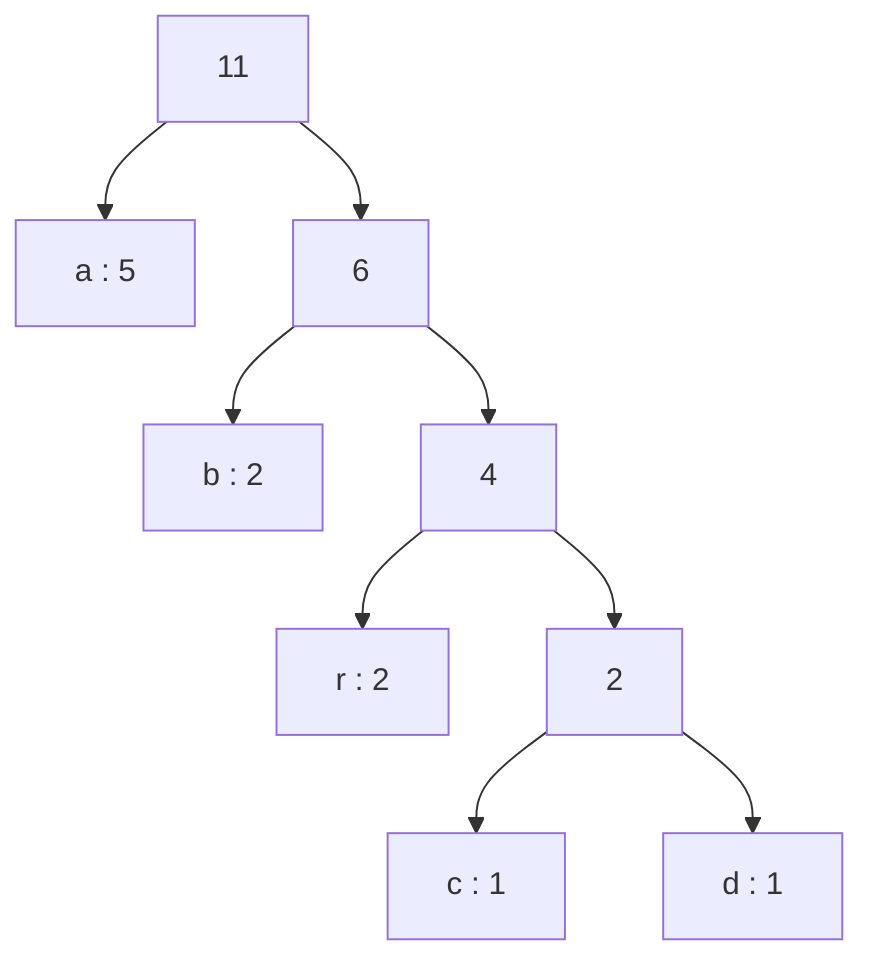
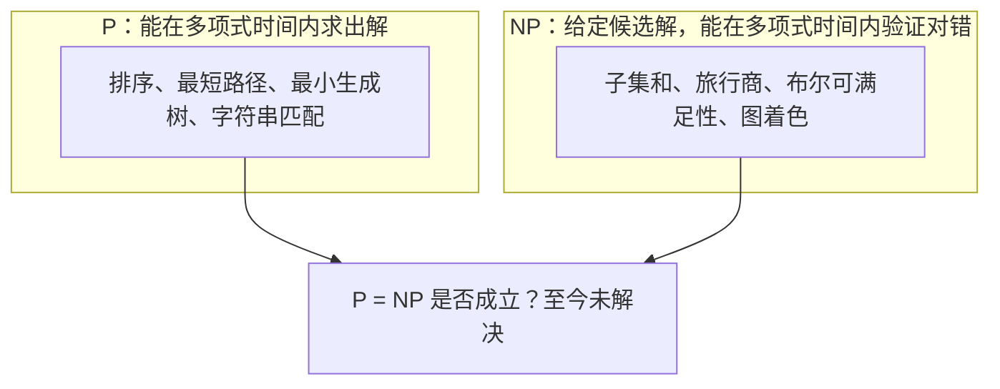

> 这一篇对应官方 Lecture 38 & 39（Compression & Complexity）。
> 压缩要回答的是「最少要用多少个比特表示这些信息」，计算复杂性要回答的是「有些问题为什么找不到快算法」。
> 前者有确定的最优解，后者到今天仍是悬而未决的问题——这一篇把两件事分别讲清，再实测它们的边界。

## 一、钩子：为什么固定长度编码不是最优

要把一段文字存成二进制，最直接的办法是给每个字符分配固定长度的编码。8 位能覆盖 256 个字符，够用。

但「够用」和「最优」是两回事。英文字母里，`e` 出现的频率大约是 `z` 的 100 倍。**给它们分配同样长度的编码，等于把大量比特浪费在很少出现的字符上。**

直觉上的改进方向很清楚：**出现得多的字符用短码，出现得少的用长码。** 比如让 `e` 只要 3 位，`z` 用 12 位，只要平均长度比 8 位短，整体就省下来了。

这里立刻冒出一个问题：变长之后，怎么知道一个码在哪里结束？

```text
假设 a 编码为 0，b 编码为 01
读取比特流「01」——这是 a 后面跟了个 1，还是 b？
```

**歧义的根源是「一个编码是另一个的前缀」。** 所以变长编码第一条约束就是：**任何一个编码都不能是另一个编码的前缀。**

## 二、前缀码：解码不需要分隔符

满足「谁都不是谁的前缀」的编码叫**前缀码**。它有一个很干净的几何表示：**把编码挂到一棵二叉树上。**

- 从根出发，往左走记 `0`、往右走记 `1`；
- 每个需要编码的字符放在一个**叶子**上；
- 从根到叶子的路径，就是这个字符的编码。

这样一来，「没有编码是另一个的前缀」自动成立——**前缀对应路径的中间节点，而字符只在叶子上，路径不可能在到达叶子之前先到达另一个叶子。**

解码也变成了一次树上行走：从根开始，读一位走一步，走到叶子就输出一个字符，然后回到根重新开始。**全程不需要任何分隔符。**

这一系列用 `abracadabra` 做例子。字符频率是：

```text
示例文本 = "abracadabra"，长度 = 11
  字符频率：a=5  b=2  c=1  d=1  r=2
```

## 三、霍夫曼算法：每次合并两个最小的

知道了要建一棵二叉树、把字符放在叶子上，接下来的问题是**树的形状怎么定**。

霍夫曼给出的办法非常简洁：**把所有字符按频率放进一个优先队列，每次取出频率最小的两个，合并成一个新节点，新节点的频率是两个之和，再放回队列。重复到只剩一个节点为止。**

```java
    static Node buildTree(int[] freq) {
        PriorityQueue<Node> pq = new PriorityQueue<>();
        for (int c = 0; c < freq.length; c++) {
            if (freq[c] > 0) {
                pq.add(new Node(freq[c], (char) c, null, null));
            }
        }
        while (pq.size() > 1) {
            Node a = pq.poll();
            Node b = pq.poll();
            Node parent = new Node(a.freq + b.freq, '\0', a, b);
            pq.add(parent);
        }
        return pq.poll();
    }
```

**为什么「取两个最小的」是对的？** 直觉是这样的：

- 频率最低的两个字符，在最优树里应该处在最深的叶子位置上；
- 而树上最深的两个位置必然是兄弟（否则可以把更深的那一个上移，代价更小）；
- 所以把它们合并成一个节点，等于把这棵树的形状问题缩小了一号的同类问题。

每一次合并都在减少一个待处理的节点，最后必然拼成一棵完整的树。把过程打印出来看：

```text
  合并过程（每步取两个频率最小的节点）：
    c(1) + d(1) = 2
    r(2) + (2) = 4
    b(2) + (4) = 6
    a(5) + (6) = 11
```

四步合并，最后那个 `11` 正好是文本总长度。得到的树：



从左走 `0`、往右走 `1`，编码表就出来了：

```text
  编码表：a→0(1位)  b→10(2位)  c→1110(4位)  d→1111(4位)  r→110(3位)
  前缀码校验（没有任何一个码是另一个的前缀） = true
  变长编码总位数 = 23，定长 8 位需要 88 位，压缩到原来的 26.1%
```

三点观察：

- **频率最高的 `a` 拿到最短的 1 位码，频率最低的 `c`、`d` 拿到 4 位码。** 长码短码的分配完全由频率决定，不需要人为设定。
- **`b` 只有 2 位而 `r` 有 3 位**，尽管两者频率都是 2。这不是错误——两个字符频率相同，落在哪个位置取决于合并时的先后，两种结果的总位数完全一样。
- **前缀码检验通过。** 那两两比较全部编码的检查，是自建编码器时必须做的验证：一旦有前缀冲突，解码就会产生歧义，而且错误只在特定比特序列上暴露。

## 四、实测：规模数据上的压缩率

换一份有倾斜分布的规模数据：字母表只有 `a` 到 `h` 八个字符，出现概率按 1/(k+1) 递减。

```text
规模测试：字母表只有 'a'..'h' 共 8 个字符，出现概率按 1/(k+1) 倾斜
  前 40 个字符 = cabfgacbbdggbbaaafbcaaadcfhgaabfabacafba
  频率与编码：a 368714次→11(2位)  b 183515次→00(2位)  c 122674次→100(3位)  d 91820次→010(3位)  e 73596次→1011(4位)  f 61618次→1010(4位)  g 52333次→0111(4位)  h 45730次→0110(4位)
  前缀码校验 = true
  字符总数 = 1000000
  霍夫曼总位数 = 2681048，平均每字符 2.6810 位
  香农熵 H = 2.6183 位/字符
  霍夫曼平均码长 - 熵 = 0.0627 位（理论保证这个差值小于 1）
  只用 3 位定长编码需要 3000000 位
  定长 8 位需要 8000000 位
  霍夫曼相对 3 位定长节省 10.6%
```

三组数字值得对照着看：

| 编码方式 | 总位数 | 平均每字符 | 相对霍夫曼 |
| --- | --- | --- | --- |
| 定长 8 位 | 8000000 | 8.0000 位 | 贵 2.98 倍 |
| 定长 3 位（字母表刚好 8 个） | 3000000 | 3.0000 位 | 贵 11.9% |
| 霍夫曼变长 | 2681048 | 2.6810 位 | — |

- **相对 8 位定长，霍夫曼把体积压到了 33.5%。** 但这里有一个不公平的地方：这份数据只用 8 个字符，3 位定长就够了，所以真正的对照组是 3 位那一行。
- **相对 3 位定长，霍夫曼只省了 10.6%。** 这个数字更诚实——**编码的下限受字母表大小约束，霍夫曼能省下的空间取决于分布的倾斜程度**，而不是「压缩」这个词听起来那么夸张。
- **平均码长 2.6810 位，比 3 位定长还短。** 这完全可能，因为变长编码允许某些字符只占 2 位，代价是另一些字符占 4 位。

## 五、霍夫曼离理论下界有多远

那最少需要多少位？信息论给出了答案——**香农熵**：

```text
H = -Σ p(c) × log2(p(c))
```

实测这份数据的熵是 **2.6183 位/字符**。这是一个硬下界：任何编码的平均长度都不可能低于它。霍夫曼给出的是 2.6810 位，差距 **0.0627 位**。

这个差距不是偶然，而是一条可以证明的定理：

```text
H ≤ 霍夫曼的平均码长 < H + 1
```

也就是说，**霍夫曼编码的距离下界最多 1 位**，而且在这个例子里实际上只差 0.06 位。换成百分比看：

| 指标 | 数值 |
| --- | --- |
| 香农熵（理论下界） | 2.6183 位/字符 |
| 霍夫曼平均码长 | 2.6810 位/字符 |
| 差距 | 0.0627 位，占下界的 2.4% |

**霍夫曼编码已经贴着下界了。** 这也解释了它为什么几十年过去仍然是压缩标准的基础。它确实不是「最优」的——**算术编码（arithmetic coding）能逼近到任意接近熵**，因为它把整个消息映射成一个分数而不是逐字符分配整数长度的码。但霍夫曼的差距只有百分之几，而实现简单得多。

## 六、P 与 NP：找解难，验解易

压缩问题有确定的答案，而另一类问题到今天仍然没有答案。

考虑这些问题：

- **子集和**：给定一组数和一个目标值，问是否存在一个子集的和恰好等于目标；
- **旅行商**：给定城市之间的距离，问是否存在一条总长不超过 L 的回路；
- **布尔可满足性**：给定一个逻辑表达式，问是否存在一组变量取值使它为真。

它们有一个共同的结构：**找答案很难，检查答案却很容易。**

```text
找一个和等于 137 的子集 → 要从 2^n 种组合里翻找
给定一个候选子集，检查它的和是不是 137 → 把元素加一遍就行，O(n)
```

这个不对称性正是复杂性理论的中心：



需要注意两点：

- **P 里的问题都在 NP 里**，因为能求出解就必然能验证解；
- **P 是否等于 NP 是未解决的。** 如果相等，意味着所有「容易验证」的问题都「容易求解」；如果不等，就意味着存在一类问题在本质上不可能高效求解。

这个问题之所以重要，是因为**很多现实问题都是 NP 完全的**——它们互相之间可以在多项式时间内转换。**只要其中任何一个被找到多项式解法，全部都会被解决。** 反过来，如果能证明其中一个不可能有快算法，那也就一并证明了这一整类问题的困难性。

## 七、实测：暴力搜索的规模

困不困难，用规模说话。子集和问题的暴力解法就是枚举所有 2ⁿ 个子集：

```java
    /** 子集和：枚举全部 2^n 个子集 */
    static boolean subsetSum(int[] w, int target) {
        int n = w.length;
        for (int mask = 0; mask < (1 << n); mask++) {
            int sum = 0;
            for (int i = 0; i < n; i++) {
                if ((mask & (1 << i)) != 0) {
                    sum += w[i];
                }
            }
            if (sum == target) {
                return true;
            }
        }
        return false;
    }
```

```text
子集和问题的暴力搜索：枚举全部 2^n 个子集
  n = 10：子集数 = 1024，内层加法次数上限 = 10240，找到解 = true
  n = 14：子集数 = 16384，内层加法次数上限 = 229376，找到解 = true
  n = 18：子集数 = 262144，内层加法次数上限 = 4718592，找到解 = true
  n = 22：子集数 = 4194304，内层加法次数上限 = 92274688，找到解 = true
  继续往上：
    n = 30：子集数 = 1,073,741,824
    n = 40：子集数 = 1,099,511,627,776
    n = 50：子集数 = 1,125,899,906,842,624
    n = 60：子集数 = 1,152,921,504,606,846,976
  每增加一个元素，暴力搜索的工作量翻一倍；元素数从 22 加到 60，工作量放大约 2^38 倍。
```

从 n = 22 到 n = 60，只多了 38 个元素，工作量却是 2³⁸ ≈ 2.7×10¹¹ 倍。**如果把 n = 22 的那次搜索看作一秒钟，n = 60 需要大约八千五百年。**

而对照之下：

```text
对照：给定一个候选子集，验证它的和是否等于 target 只要把元素加一遍，
  代价是 O(n)——找解很难，验解很容易，这正是 P 与 NP 的分界。
```

**n = 60 的验证只需要 60 次加法。** 同一个问题，找解和验解的代价差了 10¹⁰ 倍以上。

还有一层实践上的意义：**暴力搜索的复杂度是 2ⁿ，而 n 只出现在指数位置上，不在底数上。** 这意味着优化常数项毫无意义——把内层循环优化到快 100 倍，也只能让 n 的可用范围增加约 6.6 个元素。**面对指数复杂度，唯一的出路是换算法或换问题表述，而不是调性能。**

## 八、这 20 篇的目录

| # | 讲次 | 文章 |
| --- | --- | --- |
| 1 | L1 | [Java 的编译运行机制与静态类型](/posts/c61b0101/) |
| 2 | L4 | [引用语义、递归与裸链表](/posts/c61b0102/) |
| 3 | L5 | [单链表封装与哨兵节点](/posts/c61b0103/) |
| 4 | L7 | [动态数组与均摊复杂度](/posts/c61b0104/) |
| 5 | L10 | [子类型多态与比较器](/posts/c61b0105/) |
| 6 | L13 & 15 | [渐进分析：大 O、大 Ω 与大 Θ](/posts/c61b0106/) |
| 7 | L14 | [并查集：加权合并与路径压缩](/posts/c61b0107/) |
| 8 | L16 | [抽象数据类型与二叉搜索树](/posts/c61b0108/) |
| 9 | L17 & 18 | [B 树与左倾红黑树](/posts/c61b0109/) |
| 10 | L19 | [哈希表：函数、冲突与装载因子](/posts/c61b0110/) |
| 11 | L20 | [二叉堆与优先队列](/posts/c61b0111/) |
| 12 | L21 & 22 | [图的表示与深度优先、广度优先遍历](/posts/c61b0112/) |
| 13 | L23 | [最短路径与 Dijkstra](/posts/c61b0113/) |
| 14 | L24 | [最小生成树：Kruskal 与 Prim](/posts/c61b0114/) |
| 15 | L26 | [前缀树与自动补全](/posts/c61b0115/) |
| 16 | L29 | [基础排序：选择、插入与归并](/posts/c61b0116/) |
| 17 | L30 & 32 | [快速排序与三路切分](/posts/c61b0117/) |
| 18 | L34 | [比较排序的下界](/posts/c61b0118/) |
| 19 | L35 | [基数排序：LSD 与 MSD](/posts/c61b0119/) |
| 20 | L38 & 39 | 本篇 |

这条路线可以按「问题类型」分成四段来看：

| 阶段 | 讲次 | 主题 | 核心问题 |
| --- | --- | --- | --- |
| 语言基础 | L1 起 | 引用、递归、列表、数组 | 数据在内存里怎么摆 |
| 抽象与平衡 | L10 起 | 多态、渐进分析、并查集、BST | 怎么把「要什么」和「怎么做」分开 |
| 平衡树与索引 | L17 起 | B 树、红黑树、哈希表、堆、前缀树 | 怎么把查找代价压下去 |
| 图与排序 | L21 起 | 遍历、最短路、最小生成树、排序下界 | 怎么在结构上做决策 |

## 九、小结

| 概念 | 一句话 | 证据 |
| --- | --- | --- |
| 前缀码 | 没有编码是另一个编码的前缀 | 二叉树上字符只放叶子 |
| 霍夫曼算法 | 每次合并频率最小的两个 | 四步合并得到 `abracadabra` 的树 |
| 压缩率 | 取决于分布倾斜程度，不取决于字符多少 | 相对 3 位定长节省 10.6% |
| 下界 | 香农熵 H = −Σ p log₂p | H = 2.6183 位/字符 |
| 霍夫曼的位置 | H ≤ 平均码长 < H + 1 | 实测差距 0.0627 位 |
| P 与 NP | 找解难、验解易，是否相等未解决 | n = 60 验证只需 60 次加法 |
| 指数代价 | 优化常数无用，只能换算法 | n 从 22 到 60，工作量 ×2³⁸ |

三条能带走的：

1. **变长编码的合法性来自「前缀码」这条约束，而二叉树是它的天然表示。** 编码、解码、前缀检查三件事，都能在一次树上行走里完成——这类「用结构表达约束」的思路，在这一系列里反复出现。
2. **有下界的问题可以知道自己离最优有多远。** 压缩有香农熵作为下界，霍夫曼离它只差 2.4%；而排序有 log₂(N!) 作为下界，归并排序离它只差 1% 到 3%。**当下界已知，优化就有了停止的判据。**
3. **NP 完全问题的困难不是「算法还不够好」，而是「可能根本不存在」。** 面对 2ⁿ 的搜索空间，把常数优化一百倍只能换来六个元素的余量——**这提醒我们：先判断问题属于哪一类，再决定投入多少工程成本。**
