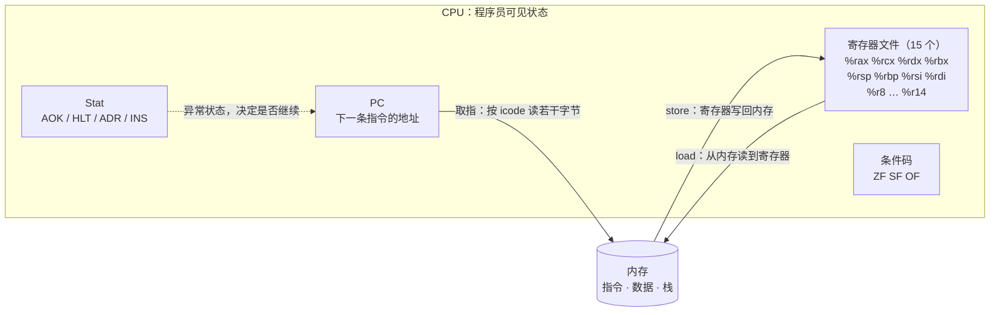
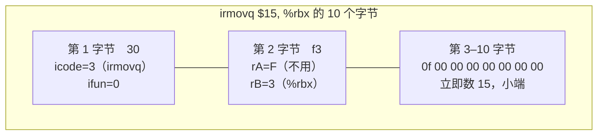
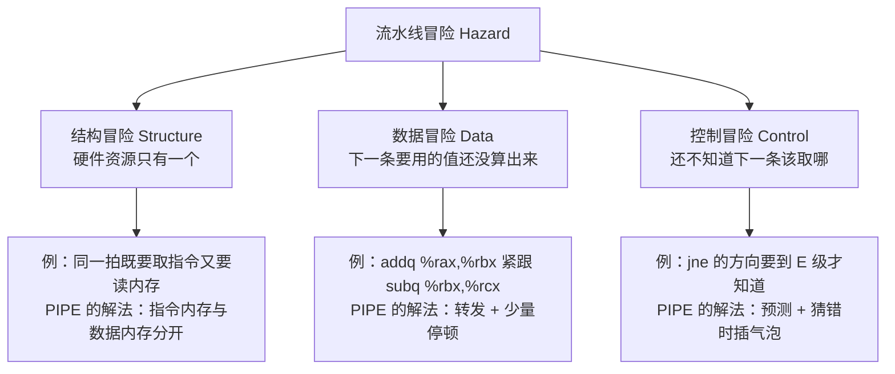
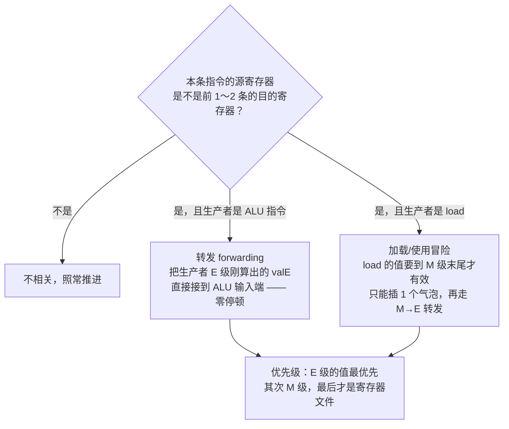
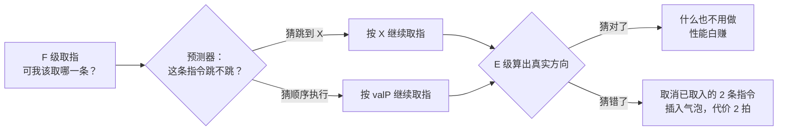

上一章我们看 `gcc -Og -S` 的输出，一条 C 语句常变成三五行汇编。但如果你以为 CPU 是"执行完一条再取一条"，那所有性能直觉都会跑偏：现代处理器在同一时刻手里至少攥着五条指令。

最典型的一幕是这样两行：

```asm
mrmovq 8(%rsp), %rax     # 从内存读一个值
addq   %rax, %rbx        # 立刻用它
```

第二条在"执行"阶段就要用 `%rax`，可第一条的结果还卡在"访存"阶段。按最朴素的算法，CPU 得干等两拍；实际只停了一拍。**这一章要拆的就是这个窟窿是怎么被填上的**——顺带回答另一个问题：为什么整个流水线里最贵的指令是 `jne`。

## 1. ISA 是合同，微架构是实现

先把两个容易混的词分清：

- **ISA（指令集架构）**：程序员看到的一切——有哪些指令、有哪些寄存器、内存怎么寻址、异常怎么触发。它是硬软件之间的**合同**。
- **微架构**：这份合同的一种实现。同样的 x86-64 合同，Intel 用乱序超标量实现，AMD 用另一套，结果都能跑同一个二进制。

CSAPP 为了讲清微架构，自己造了一个教学 ISA —— **Y86-64**。它砍掉了 x86 里所有"历史包袱"（变长指令的极端情况、段寄存器、复杂的寻址模式），只留下讲流水线必需的部分。



这张图就是全部"可见状态"。**没画出来的东西——流水线寄存器、旁路网络、预测器——都是微架构的自由发挥空间**，合同里一个字都没提。

## 2. Y86-64：一个"够用就好"的教学 ISA

指令不多，十四类，足以覆盖算术、访存、跳转、过程调用：

| icode | 指令 | 说明 | 长度 |
| --- | --- | --- | --- |
| 0x0 | `halt` | 停机 | 1 |
| 0x1 | `nop` | 空操作 | 1 |
| 0x2 | `rrmovq`（ifun=0）/ `cmovXX`（ifun=1～6） | 寄存器间传送 | 2 |
| 0x3 | `irmovq` | 立即数 → 寄存器 | 10 |
| 0x4 / 0x5 | `rmmovq` / `mrmovq` | 寄存器 ↔ 内存 | 10 |
| 0x6 | `OPq` | `addq` `subq` `andq` `xorq` | 2 |
| 0x7 | `jXX` | `jmp` `je` `jne` `jl` `jge` … | 9 |
| 0x8 | `call` | 调用 | 9 |
| 0x9 | `ret`（ifun=0） | 返回 | 1 |
| 0xA / 0xB | `pushq` / `popq` | 压栈 / 出栈 | 2 |

编码规则只有一句话：**第 1 字节的高 4 位是 icode，低 4 位是 ifun；第 2 字节高 4 位是 rA、低 4 位是 rB；需要常数的指令再跟 8 字节小端立即数。**



把编码规则写成二十行 Python，就能亲手验证教材图 4-2：

```python
REG = {n: i for i, n in enumerate(
    "%rax %rcx %rdx %rbx %rsp %rbp %rsi %rdi %r8 %r9 %r10 %r11 %r12 %r13 %r14".split())}
REG["F"] = 15                                    # 0xF 表示"没有寄存器"
JMP = {"jmp": 0, "jle": 1, "jl": 2, "je": 3, "jne": 4, "jge": 5, "jg": 6}
OP = {"addq": 0, "subq": 1, "andq": 2, "xorq": 3}
CMOV = {"rrmovq": 0, "cmovle": 1, "cmovl": 2, "cmove": 3,
        "cmovne": 4, "cmovge": 5, "cmovg": 6}
LEN = {0x0: 1, 0x1: 1, 0x2: 2, 0x3: 10, 0x4: 10, 0x5: 10, 0x6: 2, 0x7: 9,
       0x8: 9, 0x9: 1, 0xA: 2, 0xB: 2}


def icode_of(op):                                # 助记符 → icode，用来查指令长度
    if op in ("halt", "nop", "ret"):
        return {"halt": 0x0, "nop": 0x1, "ret": 0x9}[op]
    if op in OP:
        return 0x6
    if op in CMOV:
        return 0x2
    if op in JMP:
        return 0x7
    return {"irmovq": 0x3, "rmmovq": 0x4, "mrmovq": 0x5, "call": 0x8,
            "pushq": 0xA, "popq": 0xB}[op]


def encode(body, labels=None):
    labels = labels or {}
    op, *rest = body.replace(",", " ").split()
    if op in ("halt", "nop", "ret"):
        return bytes([{"halt": 0x00, "nop": 0x10, "ret": 0x90}[op]])
    if op in OP:                                  # 2 字节：[6x][rA:rB]
        return bytes([0x60 | OP[op], (REG[rest[0]] << 4) | REG[rest[1]]])
    if op in CMOV:                                # 2 字节：[2x][rA:rB]
        return bytes([0x20 | CMOV[op], (REG[rest[0]] << 4) | REG[rest[1]]])
    if op == "irmovq":                            # 10 字节：[30][F:rB][8 字节立即数]
        return bytes([0x30, 0xF0 | REG[rest[1]]]) + \
            int(rest[0][1:]).to_bytes(8, "little", signed=True)
    if op in JMP:                                 # 9 字节：[7x][8 字节绝对地址]
        return bytes([0x70 | JMP[op]]) + labels[rest[0]].to_bytes(8, "little")
    if op == "call":                              # 9 字节：[80][8 字节绝对地址]
        return bytes([0x80]) + labels[rest[0]].to_bytes(8, "little")
    if op in ("pushq", "popq"):                   # 2 字节：[Ax/Bx][rA:F]
        return bytes([0xA0 if op == "pushq" else 0xB0, (REG[rest[0]] << 4) | 15])
    r, m = (rest[1], rest[0]) if op == "mrmovq" else (rest[0], rest[1])
    off, base = m.split("(")                      # rmmovq/mrmovq：[4x/5x][rA:rB][8 字节偏移]
    return bytes([0x40 if op == "rmmovq" else 0x50,
                  (REG[r] << 4) | REG[base.rstrip(")")]]) + \
        int(off).to_bytes(8, "little", signed=True)


for asm in ("irmovq $15, %rbx", "irmovq $-1, %rax", "addq %rax, %rbx",
            "mrmovq 8(%rsp), %rdx", "rmmovq %rdx, 16(%rsp)", "pushq %rbp"):
    print(f"{asm:<24}{encode(asm).hex(' ')}")
```

```text
irmovq $15, %rbx        30 f3 0f 00 00 00 00 00 00 00
irmovq $-1, %rax        30 f0 ff ff ff ff ff ff ff ff
addq %rax, %rbx         60 03
mrmovq 8(%rsp), %rdx    50 24 08 00 00 00 00 00 00 00
rmmovq %rdx, 16(%rsp)   40 24 10 00 00 00 00 00 00 00
pushq %rbp              a0 5f
```

注意 `irmovq $-1, %rax` 那行：机器码里没有"负号"，`ff ff ff ff ff ff ff ff` 就是 -1 的补码，而小端序让最低位字节排在最前面。**上一章讲的两件事，在这里第一次落到真实字节上。**

再补一个标签扫描，就有了一个迷你汇编器。加上 `loop:` 标签解析两遍（第一遍记地址，第二遍编码），把求和循环翻出来：

```python
# 承接上面的表定义：第一遍定位标签，第二遍编码；SRC 是带 loop: 标签的求和循环
addr, labels, parsed = 0, {}, []
for line in SRC.strip("\n").splitlines():
    body = line.split("#")[0].strip()            # 去掉行尾注释
    if ":" in body:                              # 第一遍：记录标签地址
        lab, body = body.split(":", 1)
        labels[lab.strip()] = addr
        body = body.strip()
    if not body:
        continue
    parsed.append((addr, body))
    addr += LEN[icode_of(body.split()[0])]       # 按 icode 累加指令长度

print(f"{'地址':<8}{'机器码':<40}汇编")
for pc, body in parsed:                          # 第二遍：连同标签地址一起编码
    print(f"0x{pc:03x}  {encode(body, labels).hex(' '):<38}{body}")
```

```text
地址      机器码                                     汇编
0x000  30 f1 05 00 00 00 00 00 00 00         irmovq $5, %rcx
0x00a  30 f3 00 00 00 00 00 00 00 00         irmovq $0, %rbx
0x014  60 13                                 addq   %rcx, %rbx
0x016  30 f2 01 00 00 00 00 00 00 00         irmovq $1, %rdx
0x020  61 21                                 subq   %rdx, %rcx
0x022  74 14 00 00 00 00 00 00 00            jne    loop
0x02b  00                                    halt
```

`addq` 只占 2 字节，`jne` 占 9 字节 —— **取指级每次要按 icode 决定读 1、2、9 还是 10 个字节**。这个"变长取指"就是后面流水线里 `split` 逻辑存在的全部理由。

## 3. HCL：用布尔式描述一块电路

硬件怎么描述？画电路图太啰嗦，写 Verilog 又跑偏了。CSAPP 用 HCL（Hardware Control Language）——**看着像 C 的布尔表达式，其实是组合逻辑的写法**：

```text
# 这条指令合法吗？只有列出的 icode 组合才算合法
bool instr_valid = icode in { IRRMOVQ, IIRMOVQ, IRMMOVQ, IMRMOVQ,
                              IOPQ, IJXX, ICALL, IRET, IPUSHQ, IPOPQ };

# 要读寄存器吗？pushq 只读 rA，popq 和 ret 只读 %rsp
bool need_regids = icode in { IRRMOVQ, IOPQ, IPUSHQ, IPOPQ,
                              IIRMOVQ, IRMMOVQ, IMRMOVQ };
bool need_valC  = icode in { IIRMOVQ, IRMMOVQ, IMRMOVQ, IJXX, ICALL };

# ALU 的 A 端输入从哪来（优先级：靠后的分支胜出）
word srcA = [
    icode in { IRRMOVQ, IRMMOVQ, IOPQ, IPUSHQ } : rA;
    icode in { IPOPQ, IRET }                    : RESP;
    1                                           : RNONE;   # 不用
];
```

三个要点：`in {}` 是集合成员判断，**综合出来是一堆与门/或门**；`[ ... ]` 是字级多路复用器（MUX），**靠后的分支优先级更高**；`1 :` 是"其余情况"的默认分支。**HCL 里没有循环、没有变量赋值——因为电路里也没有。**

## 4. SEQ：一条指令，六个阶段

最直白的实现叫 SEQ：**一个时钟周期执行完一条指令**，内部拆成六个阶段。


SEQ 的关键数字：**时钟周期必须覆盖最慢的那个阶段**。教材里的硬件参数是取指 20ps、译码 12ps、执行 15ps、访存 25ps、写回 15ps（其中还要加上寄存器延迟）——于是取指和访存成了瓶颈。

结果就是：每次只有一级在干活，另外五级闲着。**一条指令 5 个周期，CPI = 5。** 这不比"不做流水线"更糟，但也谈不上快。

## 5. 流水线：把六段叠起来

流水线的想法朴素到不像话：**既然六个阶段用的是不同硬件，那就让六条指令各占一段，同时开工**。

```mermaid
gantt
    title 同样 5 条指令：SEQ 要 25 拍，理想 5 级流水线只要 9 拍
    dateFormat X
    axisFormat %s
    section SEQ 一次一条
    SEQ-I1 :0, 5
    SEQ-I2 :5, 10
    SEQ-I3 :10, 15
    section PIPE 流水重叠
    PIPE-I1 :0, 5
    PIPE-I2 :1, 6
    PIPE-I3 :2, 7
```



**单条指令的延迟没变，还是 5 拍；变的是吞吐——稳态下每拍流出一条。** 理想加速比是一条很干净的公式：

```text
S = n·k / (k + n - 1)        n 条指令，k 级流水线
```

拿上面那 5 条有依赖的指令真跑一遍（转发开 / 关各一次）：

```python
STAGES = ("F", "D", "E", "M", "W")
# (汇编, 目的寄存器, 源A, 源B, 是否 load)
PROG = [("mrmovq 8(%rsp), %rax", "rax", "rsp", None,  True),
        ("addq   %rax, %rbx",   "rbx", "rax", "rbx", False),
        ("xorq   %rbx, %rcx",   "rcx", "rbx", "rcx", False),
        ("rmmovq %rcx, 16(%rsp)", None, "rcx", "rsp", False),
        ("subq   %rsi, %rdi",   "rdi", "rsi", "rdi", False)]


def min_gap(prod, forward):
    """生产者必须比消费者早几个周期开始，值才来得及被读到。"""
    if not forward:
        return 3                  # 只能等生产者 W 级写回寄存器文件
    return 2 if prod[4] else 1    # 转发：ALU 结果 1 拍可用，load 要等 M 级末尾


def simulate(prog, forward):
    starts = [1]
    for i in range(1, len(prog)):
        need = {r for r in (prog[i][2], prog[i][3]) if r}
        t = starts[-1] + 1
        for j in range(i):
            if need & {r for r in (prog[j][1],) if r}:
                t = max(t, starts[j] + min_gap(prog[j], forward))
        starts.append(t)
    return starts, starts[-1] + len(STAGES) - 1


for fwd in (True, False):
    starts, total = simulate(PROG, fwd)
    print(f"转发 {'开' if fwd else '关'}：总周期 {total}，"
          f"CPI = {total / 5:.2f}，相对 SEQ（25 拍）加速比 = {25 / total:.2f}x")
```

```text
转发 开：总周期 10，CPI = 2.00，相对 SEQ（25 拍）加速比 = 2.50x
转发 关：总周期 15，CPI = 3.00，相对 SEQ（25 拍）加速比 = 1.67x
```

同一段程序，**开转发 10 拍、关转发 15 拍**。差的 5 拍就是"数据相关"的全部代价——下面展开。

顺便把理想公式也列一下，看看流水线的收益是怎么被"指令数"摊薄的：

```text
       n     SEQ 周期       流水周期      加速比 S
       1          5          5      1.000      ← 就一条指令，流水线毫无用处
       5         25          9      2.778
     100        500        104      4.808
  1000000    5000000    1000004      5.000      ← 无限逼近 k=5
```

**流水线只对"指令流"有效。** 一条孤零零的指令，5 级流水线白搭。

## 6. 三种冒险

重叠执行会撞车，撞的姿势只有三类：



结构冒险最好解决——**加硬件**。PIPE 的取指级和数据访存级各用一套内存端口，冲突就消失了。（真实 CPU 里对应的是分离的 L1I / L1D。）

数据冒险和控制冒险没法靠堆硬件消灭，只能靠**转发、停顿、预测**这三招。

## 7. 数据冒险：转发与停顿

核心洞察是：**值其实早就有了，只是还没写回寄存器文件。** `addq %rax, %rbx` 在 E 级末尾就算出了 `%rbx` 的新值，只是要等到 W 级才写回。既然 ALU 的输出线就摆在那里，为什么不让下一条指令直接从线上取值？



转发在 HCL 里就是一组多路复用器，把三个候选值按优先级选一个：

```text
word aluA = [
    icode in { IRRMOVQ, IOPQ } : valA;      # 普通寄存器操作数
    icode in { IIRMOVQ, IRMMOVQ, IMRMOVQ } : valC;   # 立即数
    icode in { ICALL, IPUSHQ } : -8;        # 压栈：%rsp 减 8
    icode in { IRET, IPOPQ }   : 8;         # 出栈：%rsp 加 8
];

# 转发优先级：先看 E 级（最近算出来的），再看 M 级
word valA_forwarded = [
    dstE == srcA : valE;      # E→E 转发：值就在 ALU 输出线上
    dstM == srcA : valM;      # M→E 转发：load 刚读出来的值
    1            : valA;      # 都没有，老老实实读寄存器文件
];
```

`load` 为什么特殊？因为它的值**直到 M 级结束才从内存里出来**，转发也追不上。这一拍停顿无法避免，只能插入一个 `bubble`（气泡，即一条 `nop`）：

- **停顿（stall）**：让 F 级、D 级寄存器**保持原值**，PC 不更新 —— 相当于把当前两条指令"按住"，等一拍。
- **气泡（bubble）**：把 D 级寄存器置成 `nop`，让它流进 E、M、W 级时什么都不做。

一句话总结：**停顿是"按住上游"，气泡是"给下游塞一个空指令"。** 加载/使用冒险同时需要这两个动作，所以代码里那两行 HCL 是成对出现的。

## 8. 控制冒险：最贵的两拍

`jne loop` 这条指令，方向（跳不跳）要到 **E 级**才算出来，跳转目标地址也要到 E 级才知道。可 F 级不能闲着等——它必须每拍都取一条指令。



教材里的 PIPE 用最朴素的策略：**跳转一律预测"要跳"**（因为循环回边占绝大多数）。猜错的代价是 2 拍——而 `ret` 更麻烦，返回地址在内存里，必须等 M 级读出来才知道下一条取哪儿，所以在 `ret` 之后要停顿到确定为止。

**这就是"分支预测"最初的样子：不是聪明，而是"猜错也要猜"。** 现代 CPU 的预测器已经复杂到能记住几百条历史分支的模式，但本质没变——它们仍然会猜错，只是猜错的概率被压得很低。

## 9. 离真实 CPU 还有多远

PIPE 是教学模型。真实 CPU 在这条路上又走了三十年：

**① 乱序执行。** PIPE 里必须停顿的地方，真实 CPU 会**把后面的无关指令先调到前面执行**。这需要寄存器重命名（把逻辑寄存器 `%rax` 映射到几十个物理寄存器上）和重排序缓冲（ROB）来保证"看起来还是按顺序执行"。

这一招直接解释了 C/C++ 里那些让人头大的内存序问题：

```cpp
// 两个线程各自写一个标志位，然后用另一个变量传递数据
// CPU 可能把两个写重排，另一个核看到 flag 却读不到 data
std::atomic<int> data{0};
std::atomic<bool> flag{false};
data.store(42, std::memory_order_relaxed);
flag.store(true, std::memory_order_release);   // release：保证前面的写先完成

// 读侧
while (!flag.load(std::memory_order_acquire)) {}   // acquire：保证后面的读不会提前
assert(data.load(std::memory_order_relaxed) == 42); // 这才成立
```

**`volatile` 解决不了这个问题**——它只禁止编译器优化，管不住 CPU 的乱序和 Store Buffer。Java 的 `volatile` 则是另一回事：JMM 里它带 `happens-before` 语义，等于替你插了上面那对 release/acquire 屏障。

**② 超标量。** 每周期发射 4～8 条指令，所以真实 CPU 的 IPC 常态是 2～4，**CPI 小于 1**——这在 SEQ 的世界里根本无法想象。

**③ 依赖链是新的瓶颈。** 在乱序机器上，串行的累加是最伤的写法：

```c
// 每次迭代都依赖上一次的 sum，一条长长的依赖链
for (int i = 0; i < n; i++) sum += a[i];

// 拆成 4 条独立的链，让流水线有活可干
int s0 = 0, s1 = 0, s2 = 0, s3 = 0;
for (int i = 0; i + 3 < n; i += 4) {
    s0 += a[i]; s1 += a[i + 1]; s2 += a[i + 2]; s3 += a[i + 3];
}
sum = s0 + s1 + s2 + s3;
```

两段代码算的是同一个数，编译到 `-O2` 后第二段往往更快——因为第一段每条 `add` 都得等上一条的结果。**GCC 的 `-O2` 自己就会做这件事**（循环展开 + 多累加器 + 向量化），想看差异就用 `gcc -O1 -fno-tree-vectorize` 关掉优化再对比，或者 `perf stat -e cycles,instructions` 数周期。这也是"改写循环比换 CPU 更有效"这句话的出处。

**④ 分支预测错误的代价涨了。** PIPE 猜错罚 2 拍，现代深度流水线要罚 15～20 拍，所以编译器宁可生成无分支代码（`cmov`）也不愿留一个难预测的 `if`——上一章讲的 `cmov`，在这里找到了它的动机。

## 10. 三档处理器对照

| 维度 | SEQ（单周期） | PIPE（5 级流水） | 真实超标量 CPU |
| --- | --- | --- | --- |
| 同时执行的指令数 | 1 | 5（每级 1 条） | 4～8 条发射 + 数百条在飞 |
| 时钟周期由谁决定 | 最慢的那一级 | 最慢的那一级 | 关键路径 + 乱序窗口 |
| 数据相关 | 天然无（顺序执行） | 转发 + 1 拍 load-use 停顿 | 转发 + 寄存器重命名 + 乱序隐藏 |
| 控制相关 | 天然无 | 预测 + 猜错罚 2 拍 | 深度预测器 + 投机执行，罚 15～20 拍 |
| CPI | 5 | 1.0～1.3 | < 1（IPC 2～4） |
| 实现复杂度 | 一个实验课的量 | 一个学期的量 | 数百人年 |
| 对应现实 | 早期简单处理器 | 教科书模型 | 你手上这台机器 |

## 小结

1. **ISA 是合同，微架构是实现。** 流水线寄存器、旁路网络、预测器全在合同之外——所以同一份二进制在不同 CPU 上跑出不同速度，是合同的正常发挥空间，不是 Bug。
2. **Y86-64 的编码规则只有三条**：高 4 位 icode、低 4 位 ifun，第二字节 rA:rB，需要常数的再跟 8 字节小端立即数。`jne` 占 9 字节、`addq` 占 2 字节，取指级必须按 icode 决定读几个字节。
3. **HCL 是组合逻辑的写法**：`in {}` 是与或门，`[ ... ]` 是优先级多路复用器，没有循环也没有赋值——电路里本来就没有。
4. **SEQ 的毛病是"每拍只有一级在忙"**，CPI 固定为 5；流水线不改变单条指令的延迟，只把吞吐提到每拍一条。理想加速比 `S = n·k/(k+n-1)`——**指令数越少，流水线越没用**。
5. **三类冒险里，结构冒险靠加硬件解决，数据冒险靠转发**。转发能零停顿地喂饱 ALU，唯独 `load` 例外：值要等 M 级末尾才出来，只能插一个气泡。
6. **停顿是"按住上游"，气泡是"向右塞一条 nop"**，加载/使用冒险两者都要。
7. **控制冒险最贵**，所以流水线从第一天起就得"猜"。猜错罚 2 拍（PIPE）到 20 拍（现代 CPU），这就是 `cmov`、无分支代码、以及现代预测器存在的理由。
8. **真实 CPU 用乱序、重命名、超标量把 CPI 压到 1 以下**，代价是暴露给程序员的内存序问题——`volatile` 管不住它，`std::atomic` 的 release/acquire 和 Java 的 `happens-before` 才是对的语言级工具。

下一篇进入**存储器层次与 Cache** —— 流水线解决了"谁能同时开工"，接下来要解决的是"数据从哪来才够快"。
