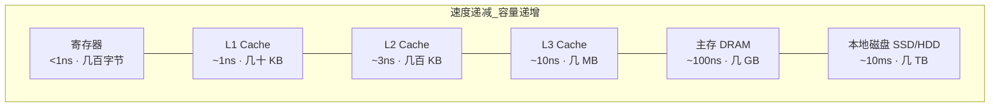
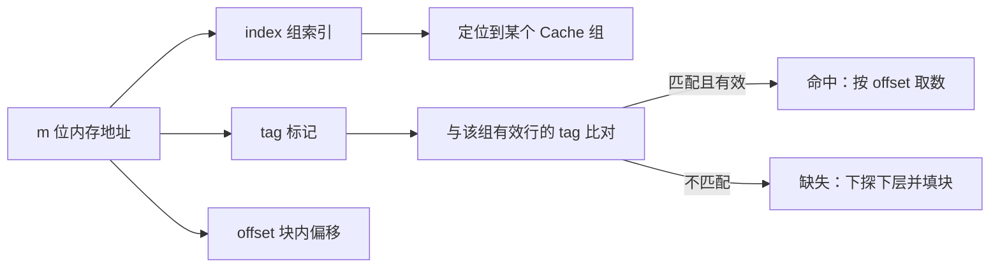
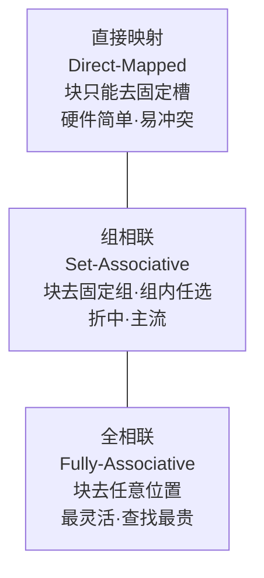
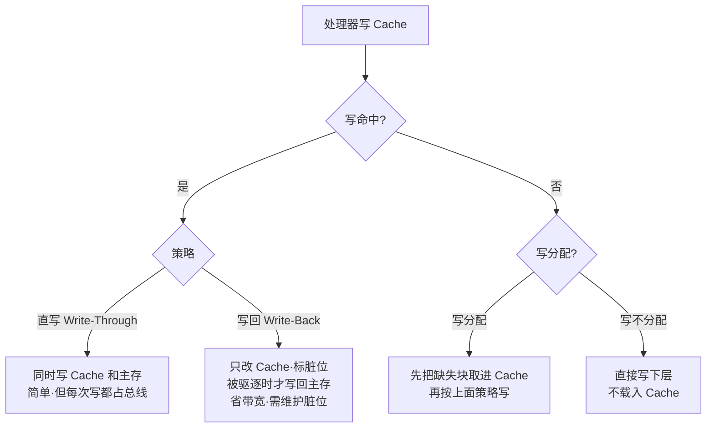

## 引子：CPU 跑得飞快，内存却拖了后腿

上一篇我们聊了处理器怎么靠流水线把 IPC 怼上去。但有个尴尬的事实：CPU 算得再快，数据要是还在慢吞吞的内存里，它也只能干等。

现代 CPU 一个时钟周期能执行好几条指令，而从主存（DRAM）取一个字，动辄要几百个周期。这个时间差就是「存储器墙」。CSAPP 第 6 章给出的解法是**存储器层次结构（memory hierarchy）**——用一层层更小更快、也更贵的存储，把慢存储的延迟「藏」起来。而其中最关键的一层，就是 **Cache**。

> 本质一句话：**Cache 之所以能加速，靠的不是魔法，而是「程序大多在反复访问同一小块数据」这个事实——局部性原理。**

本文从存储技术讲起，落到 Cache 的地址划分、映射方式、缺失类型和写策略，把第 6 章的骨架讲透。

---

## 1. 为什么要分层：一个金字塔

存储器的核心矛盾是：**快的东西贵且小，大的东西便宜但慢**。于是系统设计者把它们叠成金字塔——越往上越快越贵越小，越往下越慢越便宜越大。



每一层都把自己下面那层的「热门数据」缓存上来。CPU 要数据时，先问 L1，没有问 L2，再没有问 L3、主存……逐层下探。只要**绝大多数访问都命中在高层**，整体感觉就像只用最快那层一样。

---

## 2. 三种存储技术：SRAM / DRAM / 磁盘

Cache 和寄存器用 **SRAM**（静态随机存取存储器），主存用 **DRAM**（动态），磁盘是磁/闪存。它们的物理差异决定了成本和速度：

| 技术 | 存储单元 | 是否需要刷新 | 每比特成本 | 典型访问时间 | 用途 |
| --- | --- | --- | --- | --- | --- |
| SRAM | 6 个晶体管锁存 | 否 | 高 | ~1ns | 寄存器、L1–L3 Cache |
| DRAM | 1 个晶体管 + 1 电容 | 是（漏电） | 中 | ~100ns | 主存 |
| 磁盘/SSD | 磁畴 / 浮栅 | 否 | 低 | ~10ms / ~100μs | 持久化存储 |

SRAM 靠双稳态电路「记住」比特，不需要刷新，所以快但占面积、贵；DRAM 用电容存电荷，电容会漏电，得周期性「刷新」，慢一截但密度高。这就是为什么 Cache 用 SRAM 而主存用 DRAM。

---

## 3. 一切的基石：局部性原理

Cache 能成立，前提是程序存在**局部性（locality）**：

- **时间局部性**：刚访问过的东西，很可能马上再用（循环变量、函数栈帧）。
- **空间局部性**：访问某个地址时，它附近的地址也大概率会被访问（数组遍历、指令顺序执行）。

下面用一段 Python 模拟 C 的「扁平数组」行主序 vs 列主序求和，直观看局部性的威力（行主序连续访问相邻元素，列主序每次跨 `N` 个元素跳着访问，把 Cache 行浪费光）：

```python
import time, random
N = 2000
M = [random.random() for _ in range(N * N)]   # 扁平一维数组，模拟 C 的连续内存

def sum_row_major(M, N):
    s = 0.0
    for i in range(N):
        for j in range(N):
            s += M[i * N + j]      # 连续访问，空间局部性好
    return s

def sum_col_major(M, N):
    s = 0.0
    for j in range(N):
        for i in range(N):
            s += M[i * N + j]      # 大步长跳跃，缓存行几乎每次只用一个元素
    return s

t0 = time.perf_counter(); sum_row_major(M, N); t1 = time.perf_counter()
t2 = time.perf_counter(); sum_col_major(M, N); t3 = time.perf_counter()
row_t, col_t = t1 - t0, t3 - t2
print("row-major: %.4f s" % row_t)
print("col-major: %.4f s" % col_t)
print("col/row 耗时比 = %.2f x" % (col_t / row_t))
```

输出（本机实测）：

```
row-major: 0.1296 s
col-major: 0.3357 s
col/row 耗时比 = 2.59 x
```

同一个数组、同样多的加法，只是遍历顺序不同，列主序就慢了 **2.5 倍**。这就是空间局部性被糟蹋的后果。写 C/C++ 时 `for i for j` 把最内层循环放在列上，是性能基本盘。

---

## 4. Cache 怎么工作：把地址切成三块

Cache 把主存按「块（block / line）」为单位搬运，典型块大小 64 字节。对于一个 `m` 位的内存地址，Cache 把它切成三段：

| 字段 | 含义 | 作用 |
| --- | --- | --- |
| 块偏移 offset | 块内字节位置 | 在 64B 块里定位具体字节，占 `log2(64)=6` 位 |
| 组索引 index | 该地址该去哪个组 | 直接定位 Cache 组，避免全表扫描 |
| 标记 tag | 组内到底放的是哪一块 | 比对确认是不是想要的那个块 |



**命中（hit）**：tag 对上了，直接从 Cache 取数，几十个周期省下。
**缺失（miss）**：tag 对不上或组为空，得去下层取块（可能先驱逐一个旧块），再返回数据。

---

## 5. 三种映射方式：放哪儿的取舍

一个新块该放进 Cache 的哪个位置？这是映射策略要回答的：



- **直接映射**：`组索引 = 地址 mod 组数`，每个块只有一个归宿。硬件最简单，但不同地址若映射到同一槽会**互相驱逐**（冲突缺失，见第 6 节 B 序列）。
- **组相联（如 8-way）**：把 Cache 分成若干组，组内多个槽，块先按 index 选组，再在组内任选空槽。是灵活性与成本的折中，现代 CPU 的 L1/L2 几乎都用这个。
- **全相联**：块可去任意位置，命中率最高，但每次都要比对所有 tag，硬件代价爆炸，一般只用在 TLB 或小容量场景。

---

## 6. 缺失的三种原因（附迷你 Cache 模拟器）

不是所有缺失都一样，教材把缺失分成三类：

- **冷缺失（cold / compulsory）**：第一次访问某块，必然 miss，谁也躲不掉。
- **容量缺失（capacity）**：Cache 太小，装不下工作集，有用的块被挤出去又得取回来。
- **冲突缺失（conflict）**：直接映射下，多个常用块抢同一个槽，反复互相驱逐——即使 Cache 还有大量空位也会 miss。

下面写个极简直接映射模拟器，跑两组访问序列，把「局部性好」和「冲突颠簸」的差距拉满：

```python
CACHE_SLOTS = 4  # 4 个直接映射槽
cache = {}

def run(seq):
    cache.clear()
    hits = misses = 0
    for a in seq:
        slot = a % CACHE_SLOTS
        if slot in cache and cache[slot] == a:
            r = "hit"; hits += 1
        else:
            cache[slot] = a
            r = "miss"; misses += 1
        print("addr=%2d -> %s" % (a, r))
    print("  命中率 = %.0f%% (%d hit / %d miss)\n" % (100*hits/(hits+misses), hits, misses))

print("-- 序列 A：良好时间局部性 --")
run([0, 0, 0, 1, 1, 2, 2, 3, 3, 0])
print("-- 序列 B：冲突颠簸（0 与 4 同槽） --")
run([0, 4, 0, 4, 1, 5, 1, 5, 0, 4])
```

输出（本机实测）：

```
-- 序列 A：良好时间局部性 --
addr= 0 -> miss
addr= 0 -> hit
addr= 0 -> hit
addr= 1 -> miss
addr= 1 -> hit
addr= 2 -> miss
addr= 2 -> hit
addr= 3 -> miss
addr= 3 -> hit
addr= 0 -> hit
  命中率 = 60% (6 hit / 4 miss)

-- 序列 B：冲突颠簸（0 与 4 同槽） --
addr= 0 -> miss
addr= 4 -> miss
addr= 0 -> miss
addr= 4 -> miss
addr= 1 -> miss
addr= 5 -> miss
addr= 1 -> miss
addr= 5 -> miss
addr= 0 -> miss
addr= 4 -> miss
  命中率 = 0% (0 hit / 10 miss)
```

序列 A 反复访问同一块，命中率 60%；序列 B 里 `0` 和 `4` 都模 4 余 0、抢同一个槽，每次都把对方踢出去，于是 **100% 缺失**——明明 4 个槽里只住了 2 个地址，却全程 miss。这正是冲突缺失的教科书现场，也是为什么现代 Cache 普遍改组相联。

---

## 7. 写策略：改了数据怎么办

读好办，写就麻烦了：Cache 里的副本和主存不一致，何时同步回去？



- **直写（write-through）**：写 Cache 的同时写主存，永远一致，但每次写都占内存总线，带宽压力大。
- **写回（write-back）**：只改 Cache，给块打一个「脏（dirty）」标记，等这个块要被驱逐时才写回主存。省了大量总线流量，是主流方案，代价是要跟踪脏位。
- **写分配 / 写不分配**：缺失时是否先把块载入 Cache。通常写回配写分配、直写配写不分配，但这不是硬绑定。

---

## 🐾 小结

- 存储器墙靠**层次结构**缓解：快而贵的小存储缓存慢而便宜的大存储。
- 层次能生效的根基是**局部性**（时间 + 空间），第 3 节的行/列主序 2.5 倍差距就是证据。
- Cache 把地址拆成 **tag / index / offset** 三段来定位；命中省几百周期，缺失下探。
- 映射方式在「硬件成本 ↔ 冲突率」之间权衡，现代多用**组相联**。
- 缺失分**冷 / 容量 / 冲突**三类，其中冲突缺失纯属映射策略的锅，可用组相联消解。
- 写有两对选择：**直写 vs 写回**、**写分配 vs 写不分配**，主流是「写回 + 写分配」。

| 维度 | 直接映射 | 组相联 | 全相联 |
| --- | --- | --- | --- |
| 块的去处 | 唯一固定槽 | 固定组内任选 | 任意位置 |
| 冲突缺失 | 高 | 中 | 低 |
| 查找硬件 | 最便宜 | 适中 | 最贵 |
| 典型用途 | 简单_cache | L1/L2/L3 | TLB |

> 下一篇进入 **《虚拟内存》**——把「地址空间」这件事，从 Cache 的物理块，拉到进程视角的虚拟地址，看分页、TLB 和缺页怎么把内存用出花来。
