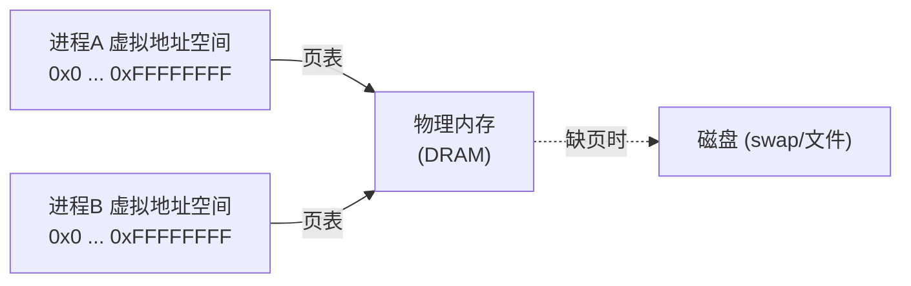
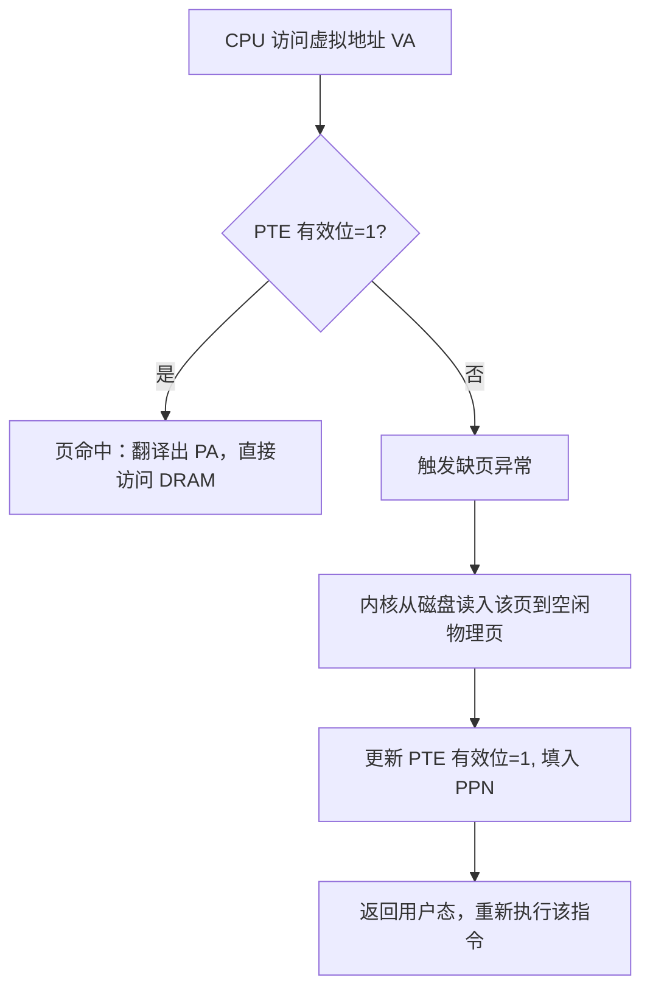
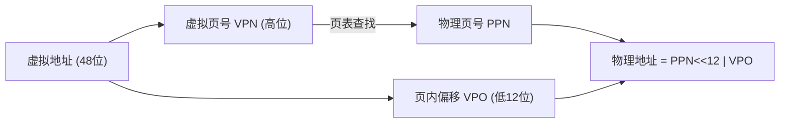
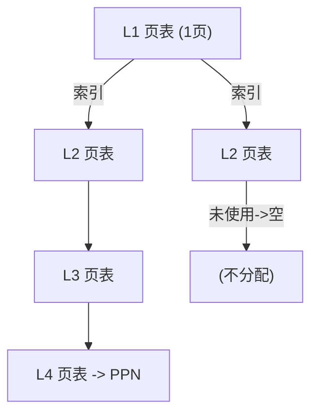
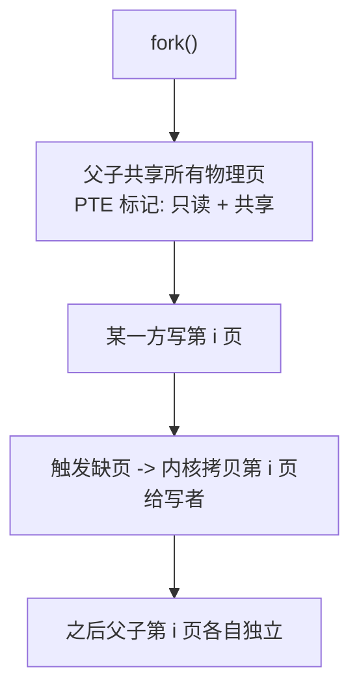

> **一句话本质**：虚拟内存是「一个间接层」——它让每个进程都以为自己独占一整块连续、从 0 开始的地址空间，而背后由操作系统 + MMU 悄悄把虚拟地址映射到物理内存的任意角落。这一层间接解决三件事：**缓存（当主存用）、内存管理（隔离进程）、内存保护（权限）**。

## 1. 钩子：为什么每个进程都「独享」4 GB？

你在自己机器上同时开着浏览器、IDE、微信。它们都在读写「地址 0x400000」。如果地址就是物理内存，三个程序早就把彼此踩烂了。但现实是它们相安无事——因为程序看到的地址（**虚拟地址**）根本不是内存条上的物理位置，中间隔了一层由硬件+内核维护的**页表**。

CSAPP 把虚拟内存（VM）讲成三件独立但共用一套机制的事，这是本章和 61C《虚拟内存》最大的视角区别：61C 偏「硬件如何让地址翻译跑得快」，CSAPP 偏「VM 作为编程抽象，它给进程提供了哪三种能力」。

## 2. 地址空间：一个 N 元素的大数组

**地址空间**就是「可能地址的有序集合」。虚拟地址空间大小为 $N=2^n$（$n$ 为地址位数；x86-64 用 48 位有效虚拟地址，即 $2^{48}$）。物理地址空间是内存条上真实字节的编号。

关键点：**虚拟地址空间连续、从 0 开始；物理地址空间零散、由内核分配**。VM 的职责，就是维护这张「虚拟页号 → 物理页号」的映射表。



每个进程有自己的页表，所以两个进程的「0x400000」被映射到**不同的物理页**——隔离由此而来。

## 3. 分页：VM 怎么当缓存用

物理内存被切成固定大小的**页（page）**，典型 4 KiB。虚拟内存同样按页切。映射的最小单位就是「一页」，不是「一个字节」。

页表（page table）是一个数组，第 $i$ 项（PTE，页表项）描述虚拟页 $i$ 的状态：

- **有效位（valid bit）**：1 = 该虚拟页已缓存在物理内存；0 = 不在内存（要么还未分配，要么被换出到磁盘）。
- **权限位（R/W/U）**：只读 / 读写 / 用户态可否访问——这就是「保护」能力的来源。
- **地址字段**：有效时指向物理页号（PPN）。

`页命中` 与 `缺页` 是两种核心事件：

- **页命中**：CPU 访问的虚拟页在物理内存里，MMU 直接翻译，无阻塞。
- **缺页（page fault）**：有效位为 0，MMU 触发异常 → 内核的**缺页处理程序**把该页从磁盘读入一个空闲物理页、更新 PTE、返回 → 进程重新执行那条指令。

VM 之所以能当缓存，靠的是「局部性」：程序短时间内只访问一小部分页，绝大多数虚拟页可以长期不占物理内存。



## 4. 地址翻译：VPN + 偏移

虚拟地址被切成两段：**虚拟页号（VPN）** + **页内偏移（VPO）**。页大小 4 KiB ⇒ 偏移占低 12 位，VPN 占高位。翻译时 **偏移原样保留**，只把 VPN 换成 PPN：

$$\text{PA} = \text{PPN} \times \text{PAGE\_SIZE} + \text{VPO}$$

为什么要「偏移不变」？因为一页内部是连续字节，物理页和虚拟页同大小，页内相对位置天然一致，硬件只要换页号、拼接偏移即可。



### 4.1 真跑：x86-64 地址位域拆分

48 位虚拟地址、$4\ \text{KiB}$ 页、4 级页表时，偏移 12 位、剩余 36 位平均分给 4 级（每级 9 位）。下面这段 Python 如实拆出一个真实地址：

```python
VA_BITS, OFF_BITS, LEVELS = 48, 12, 4
per = (VA_BITS - OFF_BITS) // LEVELS
va = 0x00007FABCDEF1234
print(f"  虚拟地址 = 0x{va:012X}")
off = va & ((1 << OFF_BITS) - 1)
rest = va >> OFF_BITS
idxs = []
for i in range(LEVELS):
    idxs.append(rest & ((1 << per) - 1))
    rest >>= per
print(f"  页内偏移   = {off}  (低 {OFF_BITS} 位)")
for i, idx in enumerate(reversed(idxs)):
    print(f"  第{4-i}级页表索引 = {idx}  (各 {per} 位)")
```

输出：

```text
虚拟地址 = 0x7FABCDEF1234
页内偏移   = 564  (低 12 位)
第4级页表索引 = 255  (各 9 位)
第3级页表索引 = 175  (各 9 位)
第2级页表索引 = 111  (各 9 位)
第1级页表索引 = 241  (各 9 位)
```

可见一个虚拟地址被「层层索引」：先查第 1 级页表拿到第 2 级基址，再查第 2 级……直到第 4 级拿到真正的 PPN。这就是 **4 级页表**。

### 4.2 多级页表：为什么省内存

如果为每个进程维护一张「全地址空间」的线性页表，48 位地址、每 PTE 8 字节，光页表就要 $2^{36}\times 8 \approx 512\ \text{GiB}$——荒谬。多级页表的妙处是：**大部分虚拟地址根本没被用，对应的中间页表根本不分配**。只有实际映射到的路径才建节点，未用区域用「空指针」跳过。这把页表本身从「与平面地址空间一样大」压成「和实际占用页数成正比」。



## 5. TLB：给地址翻译加缓存

每次访存都查页表（可能走 4 级）太慢。于是 MMU 内部有一小块**快表（TLB, Translation Lookaside Buffer）**，缓存「最近用过的 VPN → PPN」。TLB 命中时，地址翻译在 1 个周期内完成、且**不访问内存里的页表**。

> 和 CPU 缓存同理：TLB 命中率极高（因为访存也有局部性）。一旦 TLB 未命中，就要走页表——甚至连带缺页，代价陡增。

下面用 Python 模拟「页表 + TLB + 缺页」的完整链路，并统计命中率与缺页次数（输出为真实运行结果）：

```python
PAGE_SIZE = 4096
class VM:
    def __init__(self, present_vpns):
        self.pt = {vpn: (ppn if vpn in present_vpns else None)
                   for vpn, ppn in enumerate(range(0, 8))}
        self.tlb = {}
        self.tlb_hits = self.tlb_miss = self.page_faults = 0

    def translate(self, vaddr):
        vpn, off = vaddr // PAGE_SIZE, vaddr % PAGE_SIZE
        if vpn in self.tlb:
            self.tlb_hits += 1
            ppn = self.tlb[vpn]
        else:
            self.tlb_miss += 1
            ppn = self.pt.get(vpn)
            if ppn is None:                 # 缺页：从"磁盘"换入
                self.page_faults += 1
                ppn = self.pt[vpn] = vpn + 100
            self.tlb[vpn] = ppn             # 回填 TLB
        return ppn * PAGE_SIZE + off

vm = VM(present_vpns={0, 1, 2})            # 初始只有 VPN 0/1/2 在内存
seq = [0x0000, 0x1000, 0x2000, 0x0000, 0x3000, 0x1000, 0x4000, 0x2000]
for va in seq:
    print(f"  VA=0x{va:04X} -> PA=0x{vm.translate(va):05X}  (VPN={va//PAGE_SIZE})")
print(f"  TLB 命中={vm.tlb_hits}  TLB 未命中={vm.tlb_miss}  缺页={vm.page_faults}")
```

输出：

```text
VA=0x0000 -> PA=0x00000  (VPN=0)
VA=0x1000 -> PA=0x01000  (VPN=1)
VA=0x2000 -> PA=0x02000  (VPN=2)
VA=0x0000 -> PA=0x00000  (VPN=0)
VA=0x3000 -> PA=0x67000  (VPN=3)
VA=0x1000 -> PA=0x01000  (VPN=1)
VA=0x4000 -> PA=0x68000  (VPN=4)
VA=0x2000 -> PA=0x02000  (VPN=2)
TLB 命中=3  TLB 未命中=5  缺页=2
```

注意两次 `0x0000`：第一次建立映射，第二次直接 TLB 命中；而 `0x3000`、`0x4000` 初始不在内存，触发了 2 次缺页后被换入。这正是真实硬件上「冷启动有开销、跑起来后变快」的缩影。

## 6. 内存映射与写时复制：VM 怎么当管理工具

**内存映射（mmap）** 让内核把「一个文件 / 一块设备」直接映射进进程的虚拟地址空间，进程像读内存一样读文件，省掉 `read` 系统调用与内核态拷贝。

**写时复制（Copy-on-Write, COW）** 是 fork 高效的关键：子进程创建时并不真的复制父进程的全部页，而是共享同一份物理页、并把 PTE 标成「只读 + 共享」。任一方要写某页时，触发缺页 → 内核才**真正拷贝那一页**给写者。未改的页全程零拷贝。



下面用 Python 实跑一段 mmap 读文件 + 一个 COW 模型，验证「子进程改写不影响父进程、且只为改过的页付出拷贝代价」：

```python
import os, tempfile, mmap

with tempfile.NamedTemporaryFile(delete=False) as tf:
    tf.write(b"Hello, Virtual Memory!\n")
    path = tf.name
with open(path, "rb") as f:
    mm = mmap.mmap(f.fileno(), 0, access=mmap.ACCESS_READ)
    print("  通过 mmap 读文件首 22 字节:", mm[:22].decode("utf-8", "replace").rstrip())
    mm.close()

class Page:
    def __init__(self, data):
        self.data, self.shared = list(data), True

base = [Page(b"page-A"), Page(b"page-B")]
child = [Page(p.data) for p in base]          # fork: 继承（共享）
copies = 0
def child_write(pages, i, new):
    global copies
    if pages[i].shared:                       # 写时复制：先拷贝再改
        pages[i] = Page(pages[i].data); copies += 1
    pages[i].data = list(new)

print("  父进程页:", [bytes(p.data) for p in base])
print("  fork 后子进程页(共享):", [bytes(p.data) for p in child])
child_write(child, 0, b"page-A-mod")
print("  子进程改写第0页后:", [bytes(p.data) for p in child])
print("  父进程页(未被影响):", [bytes(p.data) for p in base])
print(f"  发生真正拷贝的页数 = {copies}  (COW 避免了对未修改页的拷贝)")
os.unlink(path)
```

输出：

```text
通过 mmap 读文件首 22 字节: Hello, Virtual Memory!
父进程页: [b'page-A', b'page-B']
fork 后子进程页(共享): [b'page-A', b'page-B']
子进程改写第0页后: [b'page-A-mod', b'page-B']
父进程页(未被影响): [b'page-A', b'page-B']
发生真正拷贝的页数 = 1  (COW 避免了对未修改页的拷贝)
```

## 7. VM 当保护工具：权限位

PTE 里除了有效位还有 **R/W/U 权限位**。用户态程序访问「内核页」（U=0）或写「只读页」（W=0）时，MMU 拒绝并触发保护异常 → 内核通常直接给进程发 `SIGSEGV`（段错误）。这是 VM 的第三种角色：**内存保护**。

对比一下三种角色看硬件的同一套机制被复用了多少：

| 角色 | 解决的问题 | 关键机制 |
| --- | --- | --- |
| 缓存 | 内存不够 / 提速 | 页表有效位 + 缺页换入换出 |
| 内存管理 | 进程隔离 / 共享 | 每进程独立页表 + mmap + COW |
| 内存保护 | 越权访问 | PTE 的 R/W/U 权限位 |

## 8. 常见 C 内存错误（与 VM 强相关）

以下代码仅供理解，**无需在本机运行**；C 的段错误本质基本都是「访问了页表里有效位=0、或权限不匹配的虚拟地址」。

```c
int main() {
    int *p = (int *)malloc(4 * sizeof(int));
    p[4] = 0;        // 越界写：踩到相邻未映射/只读区域 -> 可能段错误
    free(p);
    p[0] = 1;        // 野指针：访问已归还给系统的页 -> 未定义行为
    return 0;
}
```

典型症状与 VM 的对应关系：

- **段错误（SIGSEGV）**：访问了 PTE 无效或权限不符的地址（空指针 `0x0` 在几乎所有系统都未映射）。
- **内存泄漏**：`malloc` 后丢了指针，对应物理页一直被「有效位=1」占着，进程退出前无法回收。
- **忙等待 / thrashing**：物理内存太小，页频繁换入换出，CPU 大部分时间在等磁盘——这是 VM 当缓存失败的典型表现。

## 🐾 小结

- VM = **一层地址间接**：虚拟地址经页表翻译成物理地址，进程各自「独享」从 0 开始的连续空间。
- 一个机制，三种能力：**缓存**（有效位 + 缺页）、**管理**（独立页表 + mmap + COW）、**保护**（R/W/U 权限位）。
- 翻译 = VPN 换 PPN，**偏移原样拼接**；多级页表靠「不用的中间层不分配」省下海量内存。
- **TLB 是翻译的缓存**，命中即 1 周期；未命中要查页表、极端情况连带缺页，代价陡增。
- 缺页与 COW 都走「异常 → 内核处理 → 返回重执行」，这是 VM 把昂贵操作藏到幕后、对进程透明的核心手法。
- 下一篇进入 **系统级 I/O**：从 `open/read/write` 到文件描述符，看 VM 之上的字节是怎么真正进出磁盘与网络的。
