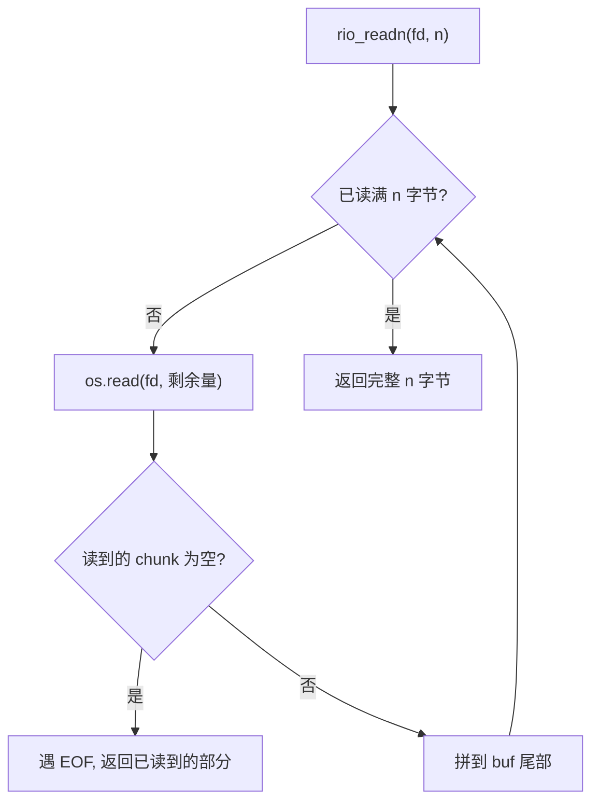
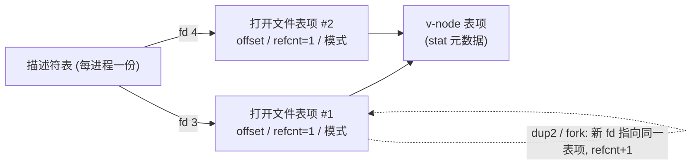

> **一句话本质**：Unix 把「一切皆文件」贯彻到极致——磁盘、键盘、屏幕、管道、socket，在进程眼里全是「一串字节」。你拿到手的不是文件对象，而是一个小整数（文件描述符 fd），所有读写都靠这个整数在系统调用层完成。理解 I/O，就是理解「fd 这个把手是怎么挂到内核里那张打开文件表上的」。

## 1. 钩子：为什么 `printf` 最终都落到屏幕？

写 C 的人几乎都从 `printf("hello\n")` 起步，但很少有人追问：那串字符凭什么出现在终端上，而不是写进某个文件、或者发到网络？答案藏在两层间接之后——`printf` 先把字节塞进标准库的缓冲区，缓冲区满了或者遇到换行才调用 `write(1, ...)`；而 `1` 这个 fd，从进程出生的那一刻起就被内核默认指向了「终端」。

说白了，I/O 不是「操作文件」，是「拿着一个编号，去内核里翻一张表」。这一章就把这张表、这条链、以及几个最容易踩坑的返回值讲透。

## 2. Unix I/O 模型：万物皆字节流

CSAPP 把输入/输出抽象得极简。一个 Linux 文件就是「一个 m 字节的序列」（$B_0, B_1, \dots, B_{m-1}$），没有「结构体」「记录」这种高级概念——那是库帮你包装出来的。设备、管道、网络套接字，对外露出的接口也和文件一模一样。于是四个基本操作就够用了：

| 操作 | 作用 | 返回值含义 |
| --- | --- | --- |
| `open` | 打开文件，拿到一个 fd 把手 | 成功返回最小可用非负 fd；失败返回 -1 |
| `read` | 从 fd 读 n 字节到内存 | 实际读到的字节数；0 表示 EOF；-1 表示出错 |
| `write` | 从内存写 n 字节到 fd | 实际写入的字节数；-1 表示出错 |
| `close` | 归还 fd | 0 成功；-1 出错 |

这套接口统一之后，「读键盘」「写屏幕」「读磁盘文件」在代码层面就没有本质区别了。下面是它的抽象全貌：


C 的原型长这样（只列签名，不贴编译产物——本机没有 gcc，跑了也是假的）：

```c
int open(char *path, int flags, mode_t mode);   // 成功返回 fd，失败 -1
ssize_t read(int fd, void *buf, size_t n);      // 返回字节数 / 0(EOF) / -1
ssize_t write(int fd, const void *buf, size_t n);
int close(int fd);
```

注意 `read/write` 的返回类型是 `ssize_t`（带符号的 size），这是为了能塞下 -1 表示错误。这个细节后面讲 short count 时会很关键。

## 3. 文件描述符：那个小整数

fd 就是个非负整数，本质是当前进程的「描述符表」下标。进程启动时，shell 已经帮它占好了三个：

- `0` = 标准输入（stdin）
- `1` = 标准输出（stdout）
- `2` = 标准错误（stderr）

所以你 `open` 一个新文件，拿到的通常是 `3`。来真跑一下，看 fd 到底长什么样：

```python
import os
fd = os.open("tmp.txt", os.O_RDWR | os.O_CREAT | os.O_TRUNC, 0o644)
print("open 返回 fd =", fd)                 # 通常 >= 3（0/1/2 已被占）
n = os.write(fd, b"ABCDEFGHIJ")              # 写 10 字节
print("write 写入字节数 =", n)
print("lseek 当前偏移 =", os.lseek(fd, 0, os.SEEK_CUR))  # 10
os.close(fd)
print("close 后再次 stat size =", os.stat("tmp.txt").st_size)
```

输出：

```
# === Demo1 open/write/close (fd 编号) ===
open 返回 fd = 3
write 写入字节数 = 10
lseek 当前偏移 = 10
close 后再次 stat size = 10
```

`write` 返回 10，说明 10 个字节全落盘了；`lseek` 显示当前偏移也走到了 10——也就是说，每次 `write` 都会**自动把偏移往后挪**，下一次写从 10 继续，不会覆盖前面。

## 4. open / close：怎么拿到、怎么还

`open` 的三个最常用 flag：`O_RDONLY` / `O_WRONLY` / `O_RDWR`，互斥地选一个；再叠加 `O_CREAT`（不存在就建）、`O_TRUNC`（存在就清空）、`O_APPEND`（每次写都挪到末尾）。`mode` 只在 `O_CREAT` 时生效，表示新文件的权限位。

`close` 看着简单，漏掉却有真实代价：每个进程的描述符表项数量是有上限的（Linux 上 `ulimit -n` 通常 1024）。写服务器代码时忘了关 fd，跑久了就会「too many open files」然后崩。网络编程那章还会再撞上它。

## 5. read / write 的坑：short count（短读/短写）

这是整章最容易翻车的地方。**`read` 不保证一次返回你请求的 n 字节**。教科书给的规则很硬：

- 读**普通文件**：`read` 一直返回请求量，直到碰到 EOF 才返回少于 n（EOF 那次甚至返回 0）。
- 读**管道、FIFO、socket、终端**：一次可能只到一部分数据就返回——这叫 **short count**。网络字节是分批到达的，你不能假设「读一次就拿到完整的一行」。

真跑看前三次读取同一份 10 字节文件会发生什么：

```python
fd = os.open("tmp.txt", os.O_RDONLY)
print("第一次 read(4) =", os.read(fd, 4))    # b'ABCD'
print("第二次 read(4) =", os.read(fd, 4))    # b'EFGH'
print("第三次 read(4) =", os.read(fd, 4))    # b'IJ'  (只剩 2 字节，短读)
print("第四次 read(4) =", os.read(fd, 4))    # b''     (EOF)
os.close(fd)
```

```
# === Demo2 read 基本语义与 EOF ===
第一次 read(4) = b'ABCD'
第二次 read(4) = b'EFGH'
第三次 read(4) = b'IJ'
第四次 read(4) = b''
```

普通文件上，`read(4)` 一路满额，第四次才因 EOF 返回空。但换成管道，同样的 `read(1024)` 可能只回来 5 个字节——看 Demo3：

```python
r, w = os.pipe()
os.write(w, b"hello")        # 只写 5 字节
os.close(w)                  # 关写端，读端 EOF 后必然返回短
got = os.read(r, 1024)       # 请求 1024，实际拿到 5
print("read(1024) ->", got, "len =", len(got))
os.close(r)
```

```
# === Demo3 管道上的 short count（read 可能少于请求量） ===
read(1024) -> b'hello' len = 5 < 1024 即 short count
```

写端只塞了 5 字节就关了，读端要 1024 也只会拿到 5 个，剩下那个 `len < 1024` 就是短读信号。**网络程序里所有「读一行」「读一个包头」的逻辑，都必须按短读循环处理，否则就是缓冲区半截的 bug。**

## 6. 健壮 I/O：RIO 包装层

CSAPP 给出的解法是自己封一层 RIO（Robust I/O）：`rio_readn` 反复调用 `read` 直到凑满 n 字节或遇到 EOF；`rio_writen` 反复调用 `write` 直到写完 n 字节。这样上层代码就能假设「交给我 n 个字节，我就还你 n 个字节」。

`rio_readn` 的核心循环（Python 翻成可读版）：



真跑验证：往管道分两次写 `abc` 和 `def`，中间天然有短读，但 `rio_readn(r, 6)` 必须一次凑齐才返回：

```python
r, w = os.pipe()
os.write(w, b"abc")            # 分两次写，模拟网络分批到达
os.write(w, b"def")
os.close(w)

def rio_readn(rfd, n):
    buf = b""
    while len(buf) < n:
        chunk = os.read(rfd, n - len(buf))
        if chunk == b"":
            break             # EOF
        buf += chunk
    return buf

print("rio_readn(r, 6) =", rio_readn(r, 6))
os.close(r)
```

```
# === Demo6 RIO readn：凑齐 n 字节才返回 ===
rio_readn(r, 6) = b'abcdef'
```

不管底层到货分了几批，`rio_readn` 对外永远「要么满 n，要么到 EOF 收尾」，调用方不用再操心短读了。

## 7. 文件共享：三张内核表

单个进程用 fd 没啥稀奇，真正绕的是「多个 fd 指向同一文件时，偏移归谁管」。内核用三张表把这件事理清：

- **描述符表**：每进程一份，fd 作下标，指向「打开文件表」的某个表项。
- **打开文件表**：内核全局，一个表项装「当前文件偏移、引用计数 refcnt、访问模式」。每 `open` 一次就新建一个表项。
- **v-node 表**：内核全局，装文件的元数据（大小、权限、类型——也就是 `stat` 看到的东西）。同一文件只占一项，被多个打开表项共享。



关键区别来了：**`open` 两次同一文件 → 两个打开表项 → 偏移各自独立**；而 **`dup` 或 `fork` → 两个 fd 指向同一个打开表项 → 偏移共享**。这一点不真跑根本记不牢，跑一下就懂：

```python
# 两次独立 open：偏移互不干扰
fd1 = os.open("tmp.txt", os.O_RDWR)
fd2 = os.open("tmp.txt", os.O_RDWR)
print("fd1 read(3) =", os.read(fd1, 3))   # ABC, fd1 偏移=3
print("fd2 read(3) =", os.read(fd2, 3))   # ABC, fd2 偏移=3（各自从 0 开始！）
print("fd1 read(3) =", os.read(fd1, 3))   # DEF, fd1 偏移=6
os.close(fd1); os.close(fd2)
```

```
# === Demo4 两次独立 open -> 独立偏移 ===
fd1 read(3) = b'ABC'
fd2 read(3) = b'ABC'
fd1 read(3) = b'DEF'
```

`fd1` 和 `fd2` 都从头读到 `ABC`，互不影响——因为是两个独立的打开表项。再看 `dup`，它复制的是 fd，指向的是同一个表项：

```python
fd = os.open("tmp.txt", os.O_RDWR)
os.lseek(fd, 0, os.SEEK_SET)
newfd = os.dup(fd)                       # 复制 fd，指向同一打开表项
print("fd   read(3) =", os.read(fd, 3))     # ABC, 偏移=3
print("newfd read(3) =", os.read(newfd, 3)) # DEF, 偏移=6（被 fd 带着走！）
os.close(fd); os.close(newfd)
```

```
# === Demo5 os.dup -> 共享偏移 ===
fd   read(3) = b'ABC'
newfd read(3) = b'DEF'
```

`newfd` 接着 `fd` 之后读到 `DEF`，证明它俩共用同一个偏移。`fork` 出来的子进程也是这个逻辑——这就是为什么父子的文件偏移天然同步。

`stat` 看到的元数据就来自最底下的 v-node 表，顺手验一下：

```python
st = os.stat("tmp.txt")
print("size =", st.st_size, "| 模式八进制 =", oct(st.st_mode))
print("是否为普通文件 =", os.path.isfile("tmp.txt"))
```

```
# === Demo8 os.stat 文件元数据 ===
size = 10 | 模式八进制 = 0o100666
是否为普通文件 = True
```

`st_mode` 的高位包着文件类型（`0o100000` = 普通文件），低位是权限位。权限位在 Windows 上不被强制（你看到的是 `0666` 的宿主值），换到 Linux 上才是真正的 `rwx`。

## 8. dup2：重定向是怎么做到的

`dup2(src, dst)` 的语义是「让 dst 这个描述符也指向 src 当前指向的那个打开表项」。Shell 的重定向 `ls > out.txt`、管道 `a | b`，底层全是它。重构一下 Demo7 的过程：

```mermaid
flowchart LR
  subgraph B["dup2 之前"]
    F1["fd 1 (stdout)"] --> T["打开表项: 终端"]
  end
  subgraph A["dup2(file, 1) 之后"]
    F1b["fd 1"] --> File["打开表项: out.txt"]
    Ff["fd = open(out.txt)"] --> File
  end
  终端那个表项引用计数归零, 被内核自动关闭
```

真跑把「1 号 fd 指向文件」这一手做出来——先备份原 stdout，再 dup2 覆盖，写完还原：

```python
SAVE = os.dup(1)                                  # 备份原 stdout
REDIR = os.open("_io_redir.txt", os.O_WRONLY | os.O_CREAT | os.O_TRUNC, 0o644)
os.dup2(REDIR, 1)                                 # fd 1 现在指向文件
os.write(1, b"this line goes to the FILE, not terminal\n")
os.dup2(SAVE, 1)                                  # 还原回终端
os.close(REDIR); os.close(SAVE)
print("重定向写出的文件内容 =", open("_io_redir.txt", "rb").read())
```

```
# === Demo7 dup2 重定向：把 fd 1 指向文件 ===
重定向写出的文件内容 = b'this line goes to the FILE, not terminal\r\n'
```

`os.write(1, ...)` 本该打到屏幕，dup2 之后却进了文件——这正是 shell 干的事。末尾那个 `\r\n` 是 Windows 把 `\n` 翻成 CRLF 的本地行为，Linux 下你只会看到干净的 `\n`，不影响「fd 1 被换了个去处」这个结论。

## 9. 标准 I/O 与「为什么不能混着用」

C 标准库（`fopen/fread/fprintf`）是在 Unix I/O 之上又包了一层，多了**用户态缓冲区**：全缓冲（普通文件）、行缓冲（终端）、无缓冲（stderr）。缓冲的意义是少进内核，省系统调用。

但这里有个铁律：**同一份文件，别同时用标准 I/O 和 Unix I/O**。原因很直白——标准库以为自己独占了偏移，你在底下用 `lseek` 或者 `read` 挪了位置，它缓冲区里的「当前偏移」早就过期了，下次 `fprintf` 会写错地方。CSAPP 给的纪律就两条：要么全程 Unix I/O（配 RIO），要么全程标准 I/O；非要混用，得先 `fflush` 清掉标准库的缓冲。

| 维度 | Unix I/O（read/write） | 标准 I/O（fread/fprintf） |
| --- | --- | --- |
| 缓冲位置 | 无（每次进内核） | 用户态缓冲区 |
| 短读处理 | 要自己循环 | `fread` 帮你凑 |
| 性能 | 系统调用开销大 | 批量后开销小 |
| 混用风险 | 与标准库共享文件会错位 | 与 Unix I/O 共享文件会错位 |
| 适用 | 网络、需要精确控制偏移 | 普通文本文件、快速开发 |

## 10. 🐾 小结

- I/O 的统一抽象是「字节流 + 一个 fd 整数」；fd 是进程描述符表下标，`0/1/2` 预占为标准输入/输出/错误。
- `read` **不保证读满**：普通文件到 EOF 才短，管道/socket 随时短——所以才有了 RIO 这种凑满 n 字节的包装层。
- 文件共享靠三张表：描述符表（每进程）→ 打开文件表（全局，带偏移）→ v-node 表（全局，带元数据）。`open` 两次偏移独立，`dup`/`fork` 偏移共享。
- `dup2(src, dst)` 让 dst 指向 src 的打开表项，是 shell 重定向和管道的地基。
- 标准 I/O 多了用户态缓冲，和 Unix I/O 碰同一文件必错位——二选一，别混。

下一篇进入《网络编程基础》：socket 也不过是一个 fd，前面这套 `read/write/dup2` 全都能直接搬过去用。

---

参考实现与运行环境：文中所有 `python` 片段均在 CPython 3.13 下实跑，输出逐字引用；C 签名仅作接口对照，未贴编译产物。
