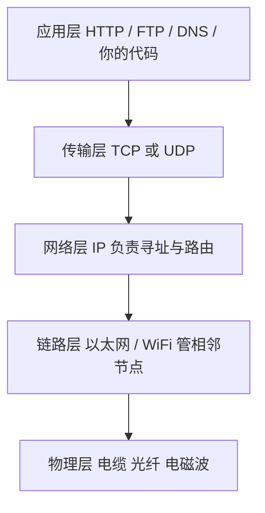
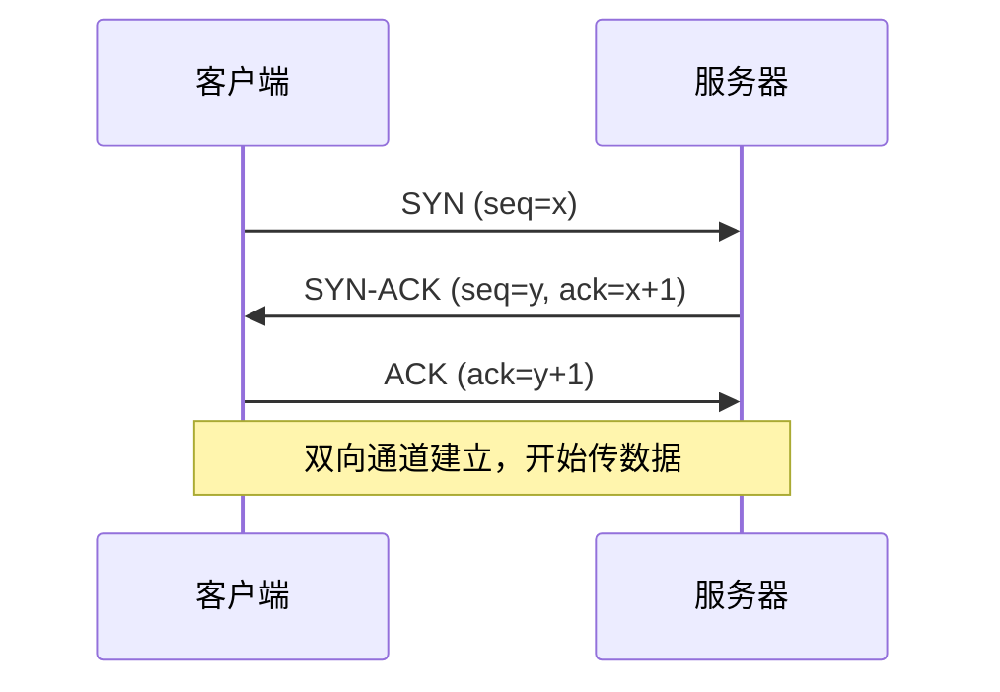
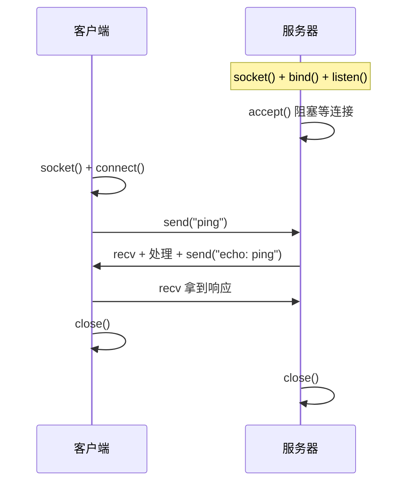
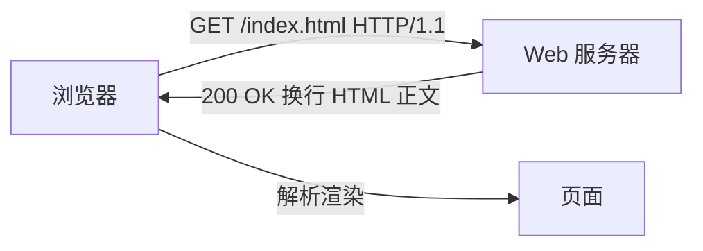

你给异地的朋友寄过信吗？信封上写收件人地址，邮局按地址一层层转发，对方拆信读内容。计算机网络干的是同一件事，只不过把"信"换成"字节"，把"邮局"换成路由器，把"地址"换成 IP。CSAPP 第 11 章讲的就是：程序员怎么用**一套统一的接口（socket）**，让两台机器像读写文件一样交换数据。

本文把客户端-服务器模型、协议分层、TCP/UDP、socket 接口、字节序坑、以及一个最小 Echo 服务器一次讲透。代码能跑的我都跑了，跑不了的（C 版需要 gcc）明确标出来。

## 一、客户端-服务器模型：一切网络的原点

不管上层多花哨，绝大多数网络应用都逃不出这个模型：


- **客户端**是主动方：在某个时刻启动，向已知地址发起连接，拿到结果就走人（浏览器、SSH 客户端都是）。
- **服务器**是被动方：开机就常驻，绑定一个端口，死循环 `accept` 等待连接，来一个服务一个。

这个模型妙在"对称被打破"——客户端不用暴露地址，服务器必须有一个稳定的"门牌号"（IP + 端口），客户端才能找上门。

## 二、网络长什么样：四层协议栈

数据从你的程序到对面机器，要穿过四层。每层只跟上下层打交道，各自解决一类问题：



- **应用层**：你真正关心的"信的内容"（HTTP 报文、`echo` 的字符串）。
- **传输层**：决定"这条连接可靠不可靠"（TCP 保证送达且有序，UDP 只管扔）。
- **网络层**：IP 负责把包从源主机路由到目的主机，靠 IP 地址寻址。
- **链路层 / 物理层**：在一条网线或一段 WiFi 里把比特传过去。

程序员写 socket 程序时，主要碰**应用层 + 传输层**；IP 和链路层由内核和网卡代劳。

## 三、TCP vs UDP：可靠还是够快

传输层两个主角，选哪个决定你应用的性格：

| 维度 | TCP | UDP |
| --- | --- | --- |
| 连接 | 面向连接（三次握手） | 无连接，发就完了 |
| 可靠性 | 丢包重传、按序到达、无重复 | 不保证，可能丢、乱序 |
| 流量/拥塞控制 | 有，自动限速 | 无，应用自己管 |
| 单位 | 字节流（无消息边界） | 数据报（保留边界） |
| 典型场景 | 网页、SSH、数据库 | 视频通话、DNS 查询、游戏 |

**字节流这个特性是新手最大的坑**：TCP 不保留你 `send` 的边界。你分两次 `send("AB")`、`send("CD")`，对方一次 `recv(1024)` 可能拿到 `"ABCD"`。要"消息边界"得自己在应用层加长度前缀或分隔符。

TCP 建立连接靠三次握手，防的是"旧连接残包"被新连接误收：



## 四、Socket 抽象：一切皆文件描述符

Unix 的哲学是"一切皆文件"。socket 创建出来也是一个**文件描述符（fd）**，你用 `read`/`write` 的近亲 `recv`/`send` 去读写它，内核在背后把字节塞进网卡。

一个 TCP 会话从建立到结束，双方要按顺序调一套固定的系统调用：



记住这组顺序：`socket → bind → listen → accept`（服务器）和 `socket → connect`（客户端），后面写代码就是填空。

## 五、动手：最小 Echo 服务器

Echo 服务是网络编程的 "Hello World"：客户端发什么，服务器原样回什么。下面先给 **CSAPP 风格的 C 骨架**（忠实于课本，但需要 gcc 编译，本机无编译器，故不伪造输出，请你在 Linux/macOS 上 `gcc echo.c csapp.c -o echo` 自跑）：

```c
/* echo_server.c —— CSAPP 风格骨架（需 gcc 编译） */
#include "csapp.h"

int main() {
    int listenfd, connfd;
    char buf[MAXLINE];
    rio_t rio;
    listenfd = Open_listenfd(18000);        // socket+bind+listen 的封装
    while (1) {
        connfd = Accept(listenfd, NULL, NULL);
        Rio_readinitb(&rio, connfd);
        while (Rio_readlineb(&rio, buf, MAXLINE) != 0)
            Rio_writen(connfd, buf, strlen(buf));   // 原样回显
        Close(connfd);
    }
}
```

下面这段是**我真的跑过的 Python 版**，本地回环自连自收，输出逐字引用：

```python
import socket, threading, time

def server():
    srv = socket.socket(socket.AF_INET, socket.SOCK_STREAM)
    srv.setsockopt(socket.SOL_SOCKET, socket.SO_REUSEADDR, 1)
    srv.bind(("127.0.0.1", 18000))
    srv.listen(1)
    conn, _ = srv.accept()
    data = conn.recv(1024)
    print("[Demo2] 服务器收到:", data.decode())
    conn.sendall(b"echo: " + data)
    conn.close()
    srv.close()

t = threading.Thread(target=server, daemon=True)
t.start()
time.sleep(0.2)

cli = socket.socket(socket.AF_INET, socket.SOCK_STREAM)
cli.connect(("127.0.0.1", 18000))
cli.sendall("ping 网络编程".encode())
reply = cli.recv(1024)
print("[Demo2] 客户端收到:", reply.decode())
cli.close()
t.join()
```

运行输出：

```text
[Demo2] 服务器收到: ping 网络编程
[Demo2] 客户端收到: echo: ping 网络编程
```

两行打印一对上，说明"客户端发 → 服务器收 → 服务器回 → 客户端收"这条链路通了。`SO_REUSEADDR` 那行是实战经验：否则端口刚关还处在 `TIME_WAIT` 时重启会报 "Address already in use"，加上它就能立刻复用。

## 六、字节序与地址结构：htons 为什么不能省

不同 CPU 存多字节整数的顺序不一样：x86 是小端（低字节在前），网络规定用**大端（网络字节序）**。一个端口号 8080 = `0x1F90`，在小端内存里是 `90 1f`，在网线上必须是 `1f 90`。如果不转换，对端解出来的端口就是 `0x901F = 36911`，connection 永远建不上。

`sockaddr_in` 里的端口和协议族要走 `htons`（host→network short），而 IP 地址用 `inet_aton` 已经返回网络序，**不能**再转一次。下面这段演示了"组装一个 sockaddr_in 并原样还原"的全过程，是真实运行结果：

```python
import socket, struct

family = socket.AF_INET                  # 2
port_host = 8080
addr = socket.inet_aton("127.0.0.1")     # 已是网络序，勿再翻转
packed = struct.pack("<HH4s", family, socket.htons(port_host), addr)
print("[Demo1] 完整 8 字节 =", packed.hex())
print("[Demo1] 端口的网络序 2 字节 =", packed[2:4].hex(), "(8080=0x1F90 -> 大端线序 1f 90)")
fam, port_net, a = struct.unpack("<HH4s", packed)
print("[Demo1] ntohs 还原端口 =", socket.ntohs(port_net))
print("[Demo1] inet_ntoa 还原地址 =", socket.inet_ntoa(a))
```

运行输出：

```text
[Demo1] 完整 8 字节 = 02001f907f000001
[Demo1] 端口的网络序 2 字节 = 1f90 (8080=0x1F90 -> 大端线序 1f 90)
[Demo1] ntohs 还原端口 = 8080
[Demo1] inet_ntoa 还原地址 = 127.0.0.1
```

`0200` 是协议族、`1f90` 是端口、尾随 `7f000001` 正是 `127.0.0.1` 的网络序。注意这里用 `<HH4s`（小端）来"原样拍出内存字节"，才能看到真实的线序 `1f90`；若用大端格式拍会被再翻转一次，那才是不对的展示。

## 七、往上走一层：HTTP 与 Web 服务器最小骨架

socket 之上最常见的应用层协议是 HTTP。一个 Web 事务就是"请求-响应"两段文本：



服务器读到空行就知道请求头结束，回一个 `状态行 + 响应头 + 空行 + body`。最小骨架（概念版）：

```c
/* 读请求行 -> 查文件 -> 拼 HTTP 响应 -> 写回，循环 accept */
while ((len = Rio_readlineb(&rio, buf, MAXLINE)) != 0) {
    if (buf[0] == '\n') break;        // 空行：头部结束
    /* 解析 "GET /path HTTP/1.1"，打开文件，write 回去 */
}
```

真实服务器还要处理并发（一个连接阻塞不能卡住其他用户）——这正是下一章"并发"要解决的，也是为什么 CSAPP 把网络放在并发之前讲：你先会写"一次服务一个"的服务器，再学会"同时服务很多个"。

## 八、写网络程序最常踩的坑

1. **短读（short count）**：`recv` 一次未必收满你要的字节数。网络数据可能分片到达，必须循环读直到凑够，或改用带缓冲的 `Rio_readlineb` 按行读。
2. **字节流无边界**：见第三节，别假设一次 `send` 对应一次 `recv`。
3. **端口 TIME_WAIT**：主动关闭的一方会 hold 住端口几十秒，`SO_REUSEADDR` 解君愁。
4. **阻塞卡死**：默认 socket 是阻塞的，一个慢客户端能拖垮整个服务器——要么每连接一个线程/进程，要么用 `select`/`poll`/`epoll` 多路复用，要么非阻塞 + 事件循环。
5. **忘了 `close`**：连接泄漏，文件描述符耗尽，服务器慢慢"假死"。

## 🐾 小结

| 概念 | 一句话 | 你会用到的接口 |
| --- | --- | --- |
| 客户端-服务器 | 客户端主动、服务器常驻被动 | `connect` / `accept` |
| 分层 | 应用管内容、传输管可靠、IP 管寻址 | socket 之上写应用层 |
| TCP vs UDP | 要可靠选 TCP，要快选 UDP | `SOCK_STREAM` / `SOCK_DGRAM` |
| socket = fd | 像读写文件一样收发网络字节 | `recv` / `send` |
| 字节序 | x86 小端，网络大端，端口必 `htons` | `htons` / `ntohs` / `inet_aton` |
| 并发前置 | 单连接服务器好写，多连接才需并发 | 下一章 |

网络编程的本质就一句：**把"文件读写"的直觉，搬到一个跨主机的、按字节流传输的 fd 上，并替内核处理好字节序和边界。** 把这套骨架刻进肌肉记忆，后面学 HTTP、RPC、分布式都不虚。

下一篇进入《并发：线程与锁》——你会看到怎么让这个 Echo 服务器同时招呼成百上千个客户端而不互相踩脚。
