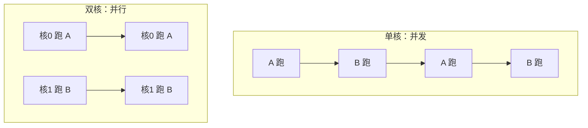
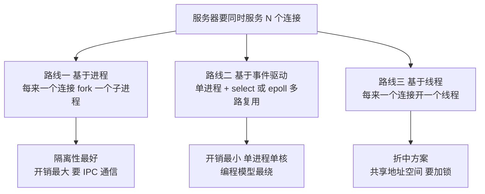
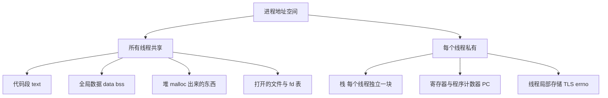
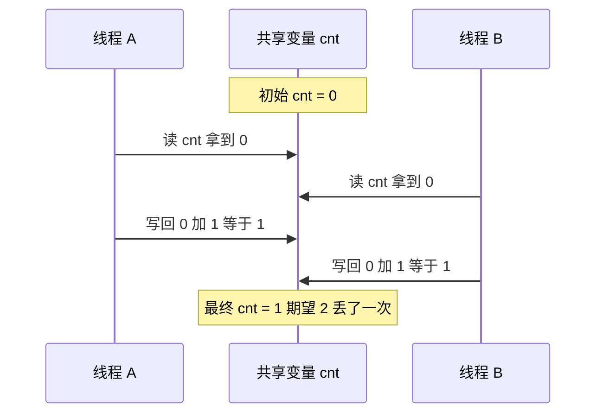

上一篇的 Echo 服务器有个致命毛病：`accept` 拿到连接之后，它就守着这一个客户端，对方不发数据，整个服务器就傻站着，后面排队的连接一个也进不来。想同时招呼几百个客户端，程序就得同时干几件事——这就是并发。

CSAPP 第 12 章有意思的地方在于，它前半章教你三种并发写法，后半章几乎全在讲这些写法会怎么咬你。这篇讲前半：并发的三条路线、线程共享了什么、丢失更新怎么来的、以及把窗口关上的那把锁。竞争与死锁的完整细节留给下一篇。

## 一、并发和并行，不是一回事

日常说话这俩词混着用，课本里是两码事：

- **并发（concurrency）**：多个逻辑流在**同一个时间窗口内推进**，物理上可以只有一个核，靠切换制造"同时在跑"的错觉。
- **并行（parallelism）**：多个逻辑流在**同一时刻真的同时执行**，得有多个核。



并行一定是并发，并发不一定是并行。一台单核路由器上跑着几百个连接的转发，那是并发；24 核机器上 4 个进程压满 4 个核，那是并行。

**并发要解决的核心问题，其实只有两个字：切分。** 你手里只有一条指令流，怎么把它切成"看起来互不干扰"的若干条。切得不好，代价就是下文的丢失更新、竞争、死锁。

## 二、三条路线：进程、事件驱动、线程

CSAPP 12.3 到 12.5 用同一个"迭代式 Echo 服务器"改了三版，正好对应三条路线：



三条路线各自的性格：

| 维度 | 基于进程 | 基于事件驱动 | 基于线程 |
| --- | --- | --- | --- |
| 状态是否天然共享 | 私有地址空间，不共享 | 单进程，全局可见 | 共享，随便改 |
| 创建/切换开销 | 大（fork 拷贝页表） | 无切换，只轮询 | 中（栈约 8 MB 起） |
| 数据传递 | 管道、共享内存、信号 | 函数调用、闭包 | 直接读写变量 |
| 崩一个会不会全倒 | 不会，子进程挂了父进程还在 | 会，全在一个进程里 | 会，段错误整个进程完 |
| 典型实现 | Apache prefork、FastCGI | Nginx、Redis、Node.js | Tomcat 线程池、Java 后端 |

三条路线到现在都还活着，没人能把谁淘汰掉——因为它们压的是不同的成本：进程路线花在隔离上，事件驱动路线花在编程复杂度上，线程路线花在同步上。**选路线就是选一种痛法。**

线程是三者里最常被用的，因为它写起来最像普通代码：想读取共享数据就读，不用管道、不用状态机。代价嘛，也正出在"随便读随便写"上。

## 三、线程到底共享了什么

一个进程里开几个线程，地址空间是同一份，但栈各是各的：



这件事用二十行代码就能看见，下面这段我本机跑过：

```python
import threading, multiprocessing

GX = 1

def touch_thread():
    global GX
    GX = 42

def touch_process():
    global GX
    GX = 999

if __name__ == "__main__":
    t = threading.Thread(target=touch_thread)
    t.start(); t.join()
    print("线程改完，主线程看到 GX =", GX)

    GX = 1
    p = multiprocessing.Process(target=touch_process)
    p.start(); p.join()
    print("子进程改完，主进程看到 GX =", GX)
```

运行输出：

```text
线程改完，主线程看到 GX = 42
子进程改完，主进程看到 GX = 1
```

线程改完的 `42` 主线程看得一清二楚，因为改的就是同一块内存；子进程里的 `999` 主进程完全看不见，因为子进程拿到的是地址空间的一份拷贝，改自己那份，跟爹没关系。

**本质一句话：线程是"共享地址空间的执行流"。** 它省掉了进程间通信的全部仪式感，也顺手把"谁都能改谁"这件事合法化了。省下的通信成本，全部转移到同步成本上。

## 四、第一个坑：丢失更新

先看一个反直觉的现象。这是四线程各加 20 万次的天真写法：

```python
import threading, time

def race_naive(N, K):
    c = [0]
    def w():
        for _ in range(N):
            c[0] += 1
    ts = [threading.Thread(target=w) for _ in range(K)]
    for t in ts: t.start()
    for t in ts: t.join()
    return c[0], N * K

if __name__ == "__main__":
    for i in range(3):
        got, want = race_naive(200_000, 4)
        print("第%d次: 期望 %d 实际 %d 丢失 %d" % (i + 1, want, got, want - got))
```

运行输出：

```text
第1次: 期望 800000 实际 800000 丢失 0
第2次: 期望 800000 实际 800000 丢失 0
第3次: 期望 800000 实际 800000 丢失 0
```

一次都没丢。很多人跑到这儿就下结论："CPython 多线程安全，不用加锁"——**这是全篇最危险的一句话。**

`+=` 这件事在字节码层面从来不是一步。把 `c[0] += 1` 编译出来看：

```text
 99           LOAD_FAST                0 (c)
              LOAD_CONST               1 (0)
              COPY                     2
              COPY                     2
              BINARY_SUBSCR
              LOAD_CONST               2 (1)
              BINARY_OP               13 (+=)
              SWAP                     3
              SWAP                     2
              STORE_SUBSCR
```

（节选：这是 `c[0] += 1` 对应的全部指令，行号来自我的测试脚本。）

先 `LOAD` 把 `c[0]` 读进栈，再 `BINARY_OP` 加 1，最后 `STORE_SUBSCR` 写回。读和写之间隔着好几种指令，**理论上任何一步之后线程都可能被切走**。读、改、写三步，只要两个线程的这三步交错起来，就会丢：



那为什么上面实测一次没丢？因为 GIL。CPython 的全局解释器锁只在**固定的检查点**让出，而这些检查点恰好落在循环回边、函数调用这种边界上，一个 `+=` 的读改写三连很难被从中间切开。**GIL 不是把窗口焊死了，它只是把窗口关小到了这块机器、这个版本、这段代码上碰不到的程度。** 换个 CPython 版本、换个写法、换到 free-threaded 构建，窗口立刻张开。

要看见窗口本身一直开着，最简单的办法是人为把它撑开：

```python
import threading, time

COUNTER = 0
gate = threading.Event()

def worker():
    global COUNTER
    v = COUNTER        # 1. 读，拿到 0
    gate.wait()        # 2. 卡住，等对方也读完
    COUNTER = v + 1    # 3. 写回 0 加 1，对方的 +1 被覆盖

if __name__ == "__main__":
    t1 = threading.Thread(target=worker)
    t2 = threading.Thread(target=worker)
    t1.start(); t2.start()
    time.sleep(0.05)
    gate.set()         # 两个线程都读完，同时放行
    t1.join(); t2.join()
    print("期望 2，实际", COUNTER)
```

运行输出（连跑三次结果一致）：

```text
期望 2，实际 1
```

两个线程各加一次，最后是 1。这就是丢失更新，教科书里叫 lost update，CSAPP 图 12.16 那个 `badcnt.c` 丢的就是它。

想看真并行的竞争，把战线挪到进程和共享内存上就行——那里没有 GIL：

```python
import multiprocessing
from multiprocessing import Value

def worker(v, n):
    for _ in range(n):
        v.value += 1        # 跨进程共享内存上的读-改-写，无锁

if __name__ == "__main__":
    N, K = 300_000, 4
    cnt = Value('i', 0)
    ps = [multiprocessing.Process(target=worker, args=(cnt, N)) for _ in range(K)]
    for p in ps: p.start()
    for p in ps: p.join()
    print("期望 %d，实际 %d，丢失 %d" % (N * K, cnt.value, N * K - cnt.value))
```

运行输出（我这边连跑四次）：

```text
期望 1200000，实际 388820，丢失 811180
期望 1200000，实际 383006，丢失 816994
期望 1200000，实际 381125，丢失 818875
期望 1200000，实际 400013，丢失 799987
```

四个进程各自在共享内存上加 30 万次，最后只落在 38 万到 40 万之间，**丢掉了将近七成**，而且每次数字都不一样。这里的每个进程都跑在一个真核上，真的同时在改同一块内存，没人替它们排队。

两个实验摆在一起，结论很清楚：**并发 bug 的危险不在于它一定发生，而在于它发生的概率取决于调度器的心情。** 平时跑一万次都正常，上线高峰被削掉一个核负载，它就开始丢数据。

CSAPP 课本上用的是 pthread 版本，一行 `cnt++` 就是那个窗口：

```c
/* badcnt.c 骨架 —— 需要 gcc，本机无编译器，不伪造编译输出 */
static volatile long cnt = 0;

void *thread(void *vargp) {
    long i, niters = *((long *)vargp);
    for (i = 0; i < niters; i++)
        cnt++;              /* 展开成 load / add / store 三步，窗口就在这一行里 */
    return NULL;
}
```

想自己复现，在 Linux 上 `gcc badcnt.c -pthread -o badcnt && ./badcnt`，多跑几遍看 `cnt` 是多少。有个规律可以先记住：**这个结果只会少不会多**，因为它最多只能等于总加次数，而每次覆盖都白白扔掉一次。要看到稳定的重复，把 `niters` 开到千万量级，两个线程以上。

## 五、锁：把窗口关上

修法在概念上简单得过分：把"读-改-写"这三步圈成一块**临界区**，保证同一时刻只有一个线程能在里面。负责守门的那个东西，CSAPP 用信号量讲。

信号量的接口就两个操作，荷兰人起的名字，P 和 V（Dijkstra 的母语里分别是 proberen 试探、verhogen 增加）：

- **P（`sem_wait`）**：把信号量减 1，如果减完是负数就阻塞，等到不为负为止；
- **V（`sem_post`）**：把信号量加 1，若有线程在等就唤醒一个。

初始值设为 1 的信号量，就叫**二元信号量**，它跟互斥锁是一回事：


C 版本对应的两套接口，`sem_` 系列是信号量，`pthread_mutex_` 系列是专门的锁：

```c
/* mutex 版骨架 —— 同样需要 pthread 库，不伪造输出 */
#include <pthread.h>
static volatile long cnt = 0;
static pthread_mutex_t mutex = PTHREAD_MUTEX_INITIALIZER;

void *thread(void *vargp) {
    long i, niters = *((long *)vargp);
    for (i = 0; i < niters; i++) {
        pthread_mutex_lock(&mutex);      /* P */
        cnt++;                           /* 临界区 */
        pthread_mutex_unlock(&mutex);    /* V */
    }
    return NULL;
}
```

Python 里两套写法都有，我把它们和裸竞争放在一起测了：

```python
import threading, time

def lock_timing(N, K):
    for name, mk in (("Lock", threading.Lock),
                     ("Semaphore(1)", lambda: threading.Semaphore(1))):
        c = [0]
        lk = mk()
        def w():
            for _ in range(N):
                with lk:
                    c[0] += 1
        ts = [threading.Thread(target=w) for _ in range(K)]
        t0 = time.perf_counter()
        for t in ts: t.start()
        for t in ts: t.join()
        dt = time.perf_counter() - t0
        print("%-14s 结果 %d 正确 %s 耗时 %.3f s"
              % (name, c[0], c[0] == N * K, dt))

if __name__ == "__main__":
    lock_timing(200_000, 4)
```

运行输出：

```text
Lock           结果 800000 正确 True 耗时 0.081 s
Semaphore(1)   结果 800000 正确 True 耗时 0.528 s
```

两个都对。同样的活儿，`Lock` 用了 0.08 秒出头，`Semaphore(1)` 用了 0.53 秒上下，慢六倍多——`Semaphore` 内部是条件变量加一个计数判断，`acquire` 得先拿条件变量自己的锁再判断够不够减，路径比 `Lock` 长一截。所以写业务代码别拿信号量当锁用，那多出来的开销买不到任何好处。信号量的主战场是别处：限制并发数、做有界缓冲区，那才是它擅长的。（这几个数字随 Python 版本和机器会浮动，比值关系比绝对值有意义。）

回到上面那个跨进程的共享内存实验，同样的循环套一层 `Lock` 之后：

```text
期望 1200000，实际 1200000，丢失 0
```

一字不差。顺带说一个观察：加了锁那版三次连跑都在 7.1 秒上下，裸竞争那版反而要 11 秒。锁把访问串行化之后，同一块缓存行被四个核来回抢的次数少了，无锁在高争用下并不等于快。这个计时的解读要谨慎，它受 ctypes 访问路径和缓存一致性流量的双重影响，别拿它当"锁更快的"普适结论——它只说明一件事：**无锁共享写，正确性和吞吐一起赔。**

锁用起来不难，难的是用对，三条经验先记着：

1. **粒度**：一把大锁包住所有共享数据，写起来最省心，但并发直接退化成串行；每个共享变量一把小锁性能好，可锁一多，顺序问题就来了。
2. **持锁期间别做慢活**：持锁时调 I/O、发网络请求、等结果，等于让所有竞争者一起等你的磁盘。
3. **加锁顺序要统一**：这个坑太大，单独留给下一篇。

## 六、并发不等于快：GIL 与 Amdahl

写完上面的锁，容易产生一种错觉：加了锁就万事大吉。可还有一半的问题在性能账上。同一个 CPU 密集的计算，我用三种方式各跑四份：

```python
import time, threading, multiprocessing

def burn(n):
    s = 0
    for i in range(n):
        s += i * i
    return s

def _pb(n):
    burn(n)

def cpu_demo(N, K):
    t0 = time.perf_counter(); burn(N); one = time.perf_counter() - t0
    t0 = time.perf_counter()
    for _ in range(K): burn(N)
    serial = time.perf_counter() - t0
    t0 = time.perf_counter()
    ts = [threading.Thread(target=burn, args=(N,)) for _ in range(K)]
    for t in ts: t.start()
    for t in ts: t.join()
    thr = time.perf_counter() - t0
    t0 = time.perf_counter()
    ps = [multiprocessing.Process(target=_pb, args=(N,)) for _ in range(K)]
    for p in ps: p.start()
    for p in ps: p.join()
    pro = time.perf_counter() - t0
    print("单份 %.3f s | 串行 %.3f s | 4线程 %.3f s (%.2fx) | 4进程 %.3f s (%.2fx)"
          % (one, serial, thr, serial / thr, pro, serial / pro))

if __name__ == "__main__":
    cpu_demo(40_000_000, 4)
```

在这台 24 逻辑核的机器上跑出来：

```text
单份 1.205 s | 串行 5.839 s | 4线程 6.649 s (0.88x) | 4进程 1.675 s (3.49x)
```

线程不但没加速，还倒退了 12%；进程拿到 3.49 倍。这个数字每轮会跳：我又跑了几轮，线程那栏在 0.76x 到 0.98x 之间摆动，进程那栏 3.49x 到 3.72x，结论没变。差别就是 GIL：CPython 里同一时刻只有一个线程能执行字节码，纯 Python 的 CPU 密集活儿开了线程也得排队，多出来的只是切换开销。进程各自有自己的解释器和 GIL，所以能真并行。

进程那 3.49 倍也不是白拿的。同一个脚本里把任务量降到四份各两千万次再测一次，加速比只剩 1.82 倍——四份加起来才两秒多的活儿，光是把四个解释器拉起来（Windows 上还是 spawn，重新导入模块）就吃掉一大截。**任务量不够大时，进程路线的固定开销会把收益吃干净**，这正好印证了第二节那张表里"创建开销大"那一栏。

这里能顺手带出 Amdahl 定律：

$$S = \frac{1}{(1-p) + \frac{p}{N}}$$

`p` 是能并行的那部分占比，`N` 是核数。哪怕 `p = 0.95`、`N` 无限大，加速比上限也只有 20 倍；`p` 里剩下那 5% 的串行段，会把所有并行的努力按住。**并发改造的收益上限，由不可并行的那部分决定，不由核数决定。**

判据就这么直白：

- **I/O 密集**（网络、磁盘、数据库等待）：线程或者协程。等待期间放别的线程去跑，GIL 不碍事。
- **CPU 密集的纯 Python**：多进程，或者交给 C 扩展、NumPy 这类会释放 GIL 的库。
- **CPU 密集又必须共享状态**：回到 C/C++ 加 pthread，或者换语言——这也是为什么那台 RK3588 板子上的实时任务不会用 Python 线程去扛。

## 七、线程安全：不是"加了锁就行"

最后一个概念，CSAPP 12.7 前半。**一个函数叫线程安全，指的是它被多个并发线程反复调用时，行为始终正确。** 四类写法天然不安全：

| 类型 | 病灶 | 例子 |
| --- | --- | --- |
| 不保护共享变量 | 多个线程读写同一全局状态 | 计数器的裸 `+=`、懒加载单例 |
| 保持跨调用状态 | 状态存全局，被别的线程改了 | 顺着链表缓存的指针 |
| 返回静态变量地址 | 返回同一块内存，调用方一改就乱 | `ctime`、`localtime` |
| 调用了不安全函数 | 自己没毛病，被调用者拖下水 | 内部用了 `strtok` |

对应的补丁都有配套版本：`strtok` 换成 `strtok_r`，`rand` 换成 `rand_r`，`localtime` 换成带缓冲区的 `localtime_r`。这套 `_r` 后缀的 API 就是给多线程准备的。

顺便区分一个容易混的词：**可重入（reentrant）比线程安全更强。** 可重入函数不含任何静态或全局数据，连锁都不用加（它在任何时刻被中断再进来都安全）；线程安全函数可以靠加锁实现。所以可重入一定线程安全，线程安全不一定可重入——一个用全局锁保护的函数是线程安全的，但把锁去掉就完蛋了。

## 八、几个真实踩坑点

1. **"有 GIL 所以不用锁"**：本文第四节已经实测反证过一次。GIL 保护的是解释器内部状态，不保护你的业务复合操作。Python 里 `d[k] = d.get(k, 0) + 1`、先 `if` 再 `set`，都是典型的读-改-写。
2. **懒加载单例漏了锁**：`if inst is None: inst = create()`，两个线程同时判断成立，创建出两个实例，谁持有都不对。
3. **持锁做 I/O**：锁的持有时间应该只覆盖共享数据的读写，日志、网络调用一律挪到锁外面。
4. **忘了 `join`**：主线程不等子线程跑完就继续，读到的全是半成品结果，还会在解释器退出时把线程硬杀掉。
5. **线程和 `fork` 混用**：`fork` 只复制调用线程，子进程里别的线程持有的锁全部处于"永久被持有"状态，一碰就死。多线程程序里优先用 `fork` 加 `exec`。

## 🐾 小结

| 概念 | 一句话 | 关键接口 |
| --- | --- | --- |
| 并发 vs 并行 | 并发是交错推进，并行是同时执行 | —— |
| 三条路线 | 进程隔离好、事件驱动省、线程折中 | `fork` / `select` / `pthread_create` |
| 线程模型 | 共享地址空间，栈和寄存器私有 | 全局变量天然可见 |
| 丢失更新 | 读-改-写三步可被交错，写回覆盖别人的结果 | 无（要靠锁） |
| 临界区 | 同一时刻只允许一个执行流进入 | `pthread_mutex_lock` / `Lock` |
| 二元信号量 | 初值为 1 的信号量就是锁 | `sem_wait` / `sem_post` |
| GIL | 只缩小窗口，不消灭竞争，也不让你并起来 | —— |
| Amdahl | 加速比上限由串行部分决定 | $S = 1/((1-p)+p/N)$ |

**并发的本质就一句：多个执行流共享同一份状态时，"读-改-写"必须变成不可分割的整体，否则正确性取决于调度器的心情。** 锁是把这个整体焊起来的手段，代价是排队。

下一篇进入《并发问题：死锁与竞争》——锁用错方向的两种典型后果：加锁顺序不一致造成互相等待的死锁，以及锁粒度选错造成的性能悬崖。
