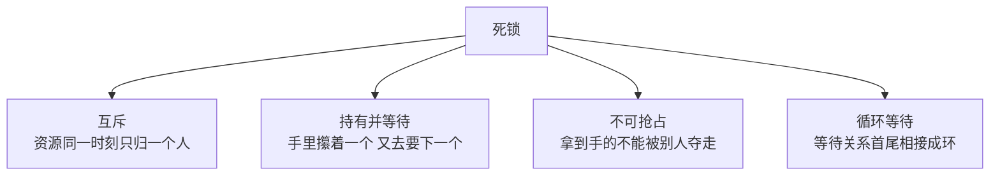
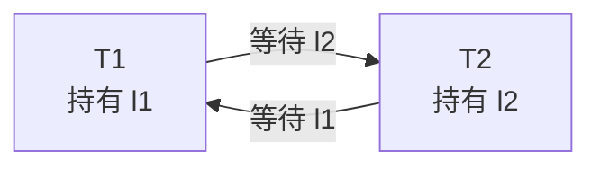
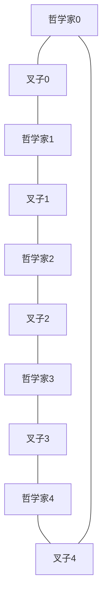
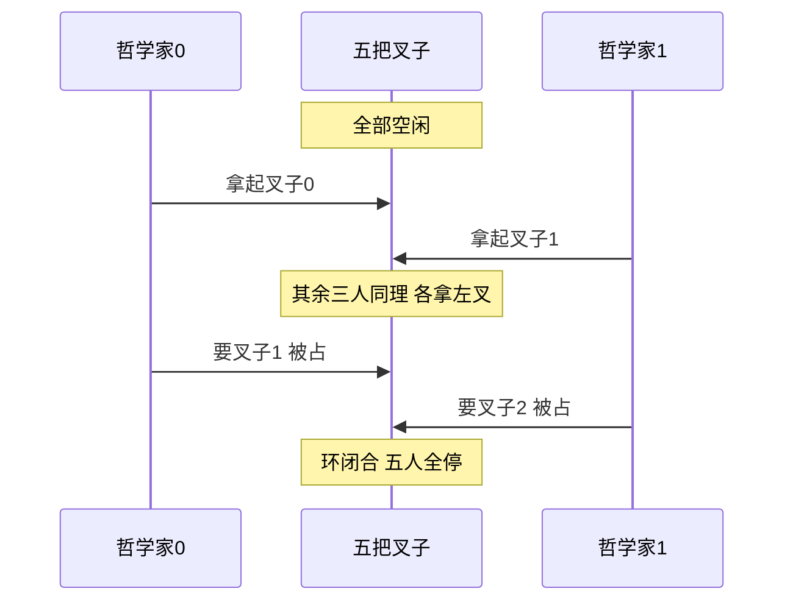

上一篇给临界区配了锁，看起来万事大吉。可锁这东西有个脾气：它让你在等别人的时候，也把别人挡在门外。挡得好是排队，挡出环来就是永久僵住——这就是本文要讲的死锁。

CSAPP 12.7 后半段把死锁拆成四句话：谁在等谁、环怎么形成、怎么防、防不住时怎么办。竞争那一半放在前面讲，因为它比死锁更常出现、更难发现。

## 一、两个病不是一回事

先用一句话切开：

- **竞争（race）**：多个执行流没同步地读写同一份数据，结果取决于调度顺序。它让程序**结果错**。
- **死锁（deadlock）**：多个执行流互相等着对方持有的资源，谁也不肯放。它让程序**永远停**。

竞争是"算错了但还在跑"，死锁是"干脆不跑了"。从观测上讲，竞争比死锁难抓得多——死锁至少能看见进程挂住，而竞争经常跑一万次都对，等上线才咬你。上一篇里那个跨进程计数器丢掉的 81 万次，就是竞争留下的证据。

## 二、死锁的四个条件

课本里叫 Coffman 条件，四条同时成立才可能死锁：



拆开看，这四条里真正由我们代码决定的只有后两条：

- **互斥**是资源本身的属性。锁就是为互斥而生，这条动不了。
- **持有并等待**在"一次只拿一把锁"的写法里天然成立，想破它就得一次把需要的锁全申请到位。
- **不可抢占**对互斥锁来说也是默认行为。
- **循环等待**是我们最容易注入、也最容易拔掉的一条。

**破坏其中任意一条，死锁就不成立。** 工程上最省事的做法是拔掉第四条——让等待关系不可能成环。

## 三、环是怎么长出来的

先看两把锁的经典剧本。两个线程要做同一件事，但代码里锁的申请顺序恰好相反：

```python
import threading

l1, l2 = threading.Lock(), threading.Lock()
ok1, ok2 = threading.Event(), threading.Event()
trace = []

def t1():
    l1.acquire()
    trace.append("T1 拿到 l1")
    e1.set()
    e2.wait()                      # 等 T2 也拿到自己那把
    trace.append("T1 请求 l2")
    if l2.acquire(timeout=1.0):
        trace.append("T1 拿到 l2，做完释放")
        l2.release()
    else:
        trace.append("T1 过了 1 秒仍拿不到 l2（被 T2 攥着）")
    ok1.set()                      # 让 T2 知道 T1 已经试过了
    l1.release()

def t2():
    l2.acquire()
    trace.append("T2 拿到 l2")
    e2.set()
    e1.wait()
    ok1.wait()                     # 等 T1 试完，再轮到 T2 试
    trace.append("T2 请求 l1")
    if l1.acquire(timeout=1.0):
        trace.append("T2 拿到 l1，做完释放")
        l1.release()
    else:
        trace.append("T2 过了 1 秒仍拿不到 l1（被 T1 攥着）")
    l2.release()

a, b = threading.Thread(target=t1), threading.Thread(target=t2)
a.start(); b.start(); a.join(); b.join()
print("\n".join(trace))
```

运行输出：

```text
T1 拿到 l1
T2 拿到 l2
T1 请求 l2
T1 过了 1 秒仍拿不到 l2（被 T2 攥着）
T2 请求 l1
T2 拿到 l1，做完释放
```

两个 `Event` 把相位强制对齐，让两人都先攥住一把再来要第二把；后面再串一道"T1 先试完、T2 才试"，是为了让输出顺序稳定下来好观察。第 4 行是死锁的直接证据：**T1 攥着 `l1` 要 `l2`，等了整 1 秒都没等到——因为 `l2` 被 T2 攥着；而 T2 要的 `l1` 也在 T1 手里。** 最后一行的 `T2 拿到 l1` 是超时之后 T1 走到 `l1.release()` 才腾出来的，不是死锁自己解的。

这里两个 `timeout` 是探针手段，把"永远"压缩成 1 秒好观察。（`e1`、`e2`、`ok1` 三个 Event 的声明我按老规矩省了，完整写法在验证脚本里。）真实代码里没有超时，两人就一直停在 `acquire` 上，那个环永远绕不出去。

等待关系画成有向图，一眼就能看清环：



T1 等 T2，T2 等 T1，箭头首尾相接。这个图有个正式名字叫**等待图（wait-for graph）**，它是有用的诊断工具，后面第六节拿它做检测器。

顺便说一个容易被误导的直觉：**"圈里人越多越危险"是错的**。环的危险程度跟人数无关，两把锁就足够锁死整个程序。

等待关系画成有向图，一眼就能看清环：


T1 等 T2，T2 等 T1，箭头首尾相接。这个图有个正式名字叫**等待图（wait-for graph）**，它是有用的诊断工具，后面第六节拿它做检测器。

顺便说一个容易被误导的直觉：**"圈里人越多越危险"是错的**。环的危险程度跟人数无关，两把锁就足够锁死整个程序。

## 四、哲学家进餐：为什么经典例子这么难复现

教科书讲死锁都摆五个人吃饭：五把叉子排一圈，每人左手一把右手一把，想吃就得同时握住两把。



写一版"先左手后右手"的天真代码，五个人同时伸手：

```python
import threading, time

N = 5
forks = [threading.Lock() for _ in range(N)]
barrier = threading.Barrier(N)
entered = [0]

def philosopher(i):
    left, right = i, (i + 1) % N
    barrier.wait()                # 五个人对齐相位，同时伸手
    forks[left].acquire()
    entered[0] += 1
    forks[right].acquire()        # 无超时，卡住就是永久
    forks[right].release()
    forks[left].release()

ts = [threading.Thread(target=philosopher, args=(i,), daemon=True) for i in range(N)]
for t in ts: t.start()
time.sleep(2.0)
print("拿到第一把叉子的人数：", entered[0])
print("2 秒后仍存活线程数：", sum(1 for t in ts if t.is_alive()), "/", N)
print("仍被持有的叉子数：", sum(1 for f in forks if f.locked()), "/", N)
```

我本机跑出来是这样：

```text
拿到第一把叉子的人数： 5
2 秒后仍存活线程数： 0 / 5
仍被持有的叉子数： 0 / 5
```

五个人全拿到了左手叉子，然后**一个都没卡住**，全跑完了。这不是我写错了——是 GIL 的检查点不落在"拿到最后一句话"和"下一句要锁"之间，第一个人拿到右叉的瞬间就把两把都放掉了，后面的人顺着就过去。跟上一篇那个"线程版计数怎么跑都不丢"是同一个原因。

要多花一点功夫才能把窗口撑开：把五把锁换成一个**每个人都先攥住、再统一去要第二个**的场景，用 barrier 强制所有人在"已持一锁"的状态上会合。这时候环才成立：



实测抓不到不是偶然，反而说明了一件更重要的事：**能被日常调度碰到的死锁是少数，大多数死锁都需要特定的时序巧合。**线上遇到的死锁之所以难修，就是因为它在测试机上根本不出现。

## 五、拔掉环：把等待关系全序化

既然环是根子，最省事的解法就是**给所有锁定一个全局顺序，所有线程都按同一顺序申请**。

拿那把经典的四把锁做对照。约定 `l1 < l2 < l3 < l4`，任何拿多把锁的地方都排好队：

```python
import threading

A, B = threading.Lock(), threading.Lock()

def safe_transfer():
    # 无论业务方向如何，先拿名字小的
    first, second = sorted([A, B], key=lambda x: x is B and 1 or 0)
    with first:
        with second:
            pass          # 临界区
```

更直观的做法是给每把锁编号，需要哪几把就按编号升序取：

```text
正确写法                          错误写法
-------                          --------
with l1:                          with l2:
    with l2:                          with l1:
        with l3:                          with l3:
            work()                            work()
```

两种写法逻辑等价，但左图的等待关系永远指向"编号更大"的方向。一条只会往一个方向走的边，**长不出环来**。

拿等待图直接验一下，我把三种场景都喂进去：

```python
def build_edges(owner, waiting):
    """owner: 锁 -> 持锁线程；waiting: 线程 -> 正等的锁"""
    return {t: owner[lk] for t, lk in waiting.items()
            if lk in owner and owner[lk] != t}

def has_cycle(e):
    for s in e:
        seen, n = set(), s
        while n in e:
            if n in seen:
                return True, sorted(seen | {n})
            seen.add(n)
            n = e[n]
    return False, []

# 场景一：单边等待
print(build_edges({"L1": "T1", "L2": None}, {"T1": "L2", "T2": None}), has_cycle(
      build_edges({"L1": "T1", "L2": None}, {"T1": "L2", "T2": None})))

# 场景二：两人互等
o2 = {"L1": "T1", "L2": "T2"}; w2 = {"T1": "L2", "T2": "L1"}
print(build_edges(o2, w2), has_cycle(build_edges(o2, w2)))

# 场景三：三人三角环
o3 = {"L1": "T1", "L2": "T2", "L3": "T3"}; w3 = {"T1": "L2", "T2": "L3", "T3": "L1"}
print(build_edges(o3, w3), has_cycle(build_edges(o3, w3)))
```

运行输出：

```text
{'T1': None} (False, [])
{'T1': 'T2', 'T2': 'T1'} (True, ['T1', 'T2'])
{'T1': 'T2', 'T2': 'T3', 'T3': 'T1'} (True, ['T1', 'T2', 'T3'])
```

场景一的图是 `{'T1': None}`，走不出环，`has_cycle` 返回 `False`——T1 等的那把锁没人持有，构不成等待关系。后两个场景都抓出了环，环上节点名也点得出来。**全序化的效果，就是把第二、三种图变成永远构造不出来的形状。**

三种破环手法的对照：

| 手法 | 怎么破 | 代价 |
| --- | --- | --- |
| 全局锁顺序 | 破"循环等待"，所有申请按编号升序 | 需要人肉维护编号，重构时容易漏 |
| 一次拿全 | 破"持有并等待"，需要的锁一次性申请 | 提前知道要哪些锁，拿不到就全放 |
| 超时退让 | 不破条件，拿不到就放开重试 | 有活锁风险，需要退避策略 |

## 六、防不住就检测：等待图看门狗

全序化要求所有申请点都守规矩。可锁可能有几十把、申请点散在几十个文件里，人总会漏。这时候另一条路更实用：**让它死，但死得被人看见。**

思路是给每把锁加一层薄包装，记录"谁持有了它、谁在等它"，再用一个后台线程定期把等待图捞出来找环：

```python
import threading

owner = {}          # 锁名 -> 持锁线程名
want  = {}          # 线程名 -> 正等待的锁名
guard = threading.Lock()

class Tracked:
    def __init__(self, name):
        self.name = name
        self._lk = threading.Lock()

    def acquire(self, timeout=-1):
        me = threading.current_thread().name
        with guard:
            want[me] = self.name
        ok = self._lk.acquire(timeout=timeout) if timeout >= 0 else self._lk.acquire()
        with guard:
            want.pop(me, None)
            if ok:
                owner[self.name] = me
        return ok

    def release(self):
        with guard:
            owner.pop(self.name, None)
        self._lk.release()

def scan():
    with guard:
        e = {t: owner[lk] for t, lk in want.items()
             if lk in owner and owner[lk] != t}
    for s in e:
        seen, n = set(), s
        while n in e:
            if n in seen:
                return e, True, sorted(seen | {n})
            seen.add(n)
            n = e[n]
    return e, False, []
```

拿两个必死的线程喂给它，看门狗在 20 毫秒一轮的扫描里立刻抓到环：

```text
看门狗发现的死锁环： [({'T2': 'T1', 'T1': 'T2'}, ['T1', 'T2'])]
此刻仍在等待： {'T1': '锁B', 'T2': '锁A'}
此刻锁归属： {'锁A': 'T1', '锁B': 'T2'}
T1/T2 是否还活着： True True
```

`T1` 攥着 `锁A` 等 `锁B`，`T2` 攥着 `锁B` 等 `锁A`，两个都活着但谁都不动——这就是死锁在运行时的准确画像。生产环境里这层包装往往顺手还能做到：打印出环上每个线程的调用栈、上报监控、甚至杀掉一个线程强行破环。

有个关键实现细节值得单独说：**扫描必须在"等待中"的那个时刻做**。我第一版检测器是在 `acquire` 超时返回之后才去扫，结果永远扫不到——那时候失败的线程已经把等待关系从表里撤了。等待图只在"卡住"的瞬间才存在，所以扫描要交给独立的看门狗线程，或者干脆用 `faulthandler` / `gdb` 这类外部工具直接抓现场。

## 七、超时兜底：最后的保险

锁顺序靠人守、检测器有覆盖不到的地方，还有一层谁都用得上的兜底：**申请锁时给个超时**。

同一段互等代码，加不加超时的结局完全不同：

```python
import threading, time

def run(use_timeout):
    l1, l2 = threading.Lock(), threading.Lock()
    bar = threading.Barrier(2)
    res = {}

    def t1():
        l1.acquire(); bar.wait()
        if use_timeout:
            ok = l2.acquire(timeout=0.5)
            res["T1"] = "拿到 l2" if ok else "0.5s 超时，放弃并释放 l1"
            if ok: l2.release()
        else:
            l2.acquire(); res["T1"] = "拿到 l2"; l2.release()
        l1.release()

    def t2():
        l2.acquire(); bar.wait()
        if use_timeout:
            ok = l1.acquire(timeout=0.5)
            res["T2"] = "拿到 l1" if ok else "0.5s 超时，放弃并释放 l2"
            if ok: l1.release()
        else:
            l1.acquire(); res["T2"] = "拿到 l1"; l1.release()
        l2.release()

    a = threading.Thread(target=t1, daemon=True)
    b = threading.Thread(target=t2, daemon=True)
    t0 = time.perf_counter()
    a.start(); b.start()
    a.join(timeout=3); b.join(timeout=3)
    return time.perf_counter() - t0, sum(1 for t in (a, b) if t.is_alive()), dict(res)

print(run(False))
print(run(True))
```

运行输出：

```text
(6.01, 2, {})
(0.51, 0, {'T1': '0.5s 超时，放弃并释放 l1', 'T2': '拿到 l1'})
```

不带超时那份等到 6 秒时两个线程还卡着（`a.join(timeout=3)` 加 `b.join(timeout=3)` 一共耗掉 6 秒），结果字典是空的。加了 0.5 秒超时那份 0.51 秒就全退了：T1 等不到就主动松手，T2 顺势拿到 `l1` 把活干完。

超时不难用，难的是**超时之后怎么办**。三个原则：

1. **失败要释放已经拿到的东西**，只放一半等于把死锁换成了资源泄漏。
2. **别立刻重试同一个顺序**，退避一下或者打乱顺序，否则两拨人反复撞在同一个点上，就变成了活锁——谁都没睡，谁都不前进。
3. **超时值不能拍脑袋**，设太短会在负载高的时候大面积误杀（本该拿到锁的被判失败），设太长等于没有。拿正常路径的 P99 持锁时长乘个 3 到 5 倍起步。

## 八、死锁之外：竞争留下的另外几笔账

死锁有声有息，至少你能看见线程停住。竞争不出声，它把账记在别处——上一节那个 4 进程 30 万次的实验，期望 120 万，实际落在 38.2 万（丢 81.8 万），近七成没了，而且每轮数都不一样：

```text
裸读改写：期望 1200000 实际 381946 丢失 818054（11.33 s）
加锁    ：期望 1200000 实际 1200000 丢失 0（7.97 s）
```

顺带注意右侧那栏：**加锁之后反而更快**（11.33 秒降到 7.97 秒）。四个核反复抢同一块缓存行，一致性协议来回剥皮，速度比老老实实排队还慢。无锁在高争用下不占便宜。

再补两个容易忽略的代价。第一个是锁粒度的错觉——很多人以为"锁越细越快"，实测在同一台机器上，一把大锁 0.095 秒、分段 8 把锁 0.102 秒，几乎一样。因为 CPython 有 GIL，锁的争用还没轮到 CPU 层面，就被解释器锁按住了。**在 Python 里调锁粒度基本是在调安慰剂**，这个结论在 C++ 里才反过来。

第二个是持锁做慢活，这个差距是数量级的：

```text
锁内 fsync：结果 800 耗时 9.574 s
锁内只加一：结果 800 耗时 0.001 s
```

同一份临界区代码，只是里面多了一次 4 KB 的落盘加读回，4 个线程跑完从 0.001 秒变成 9.574 秒，差了将近一万倍。临界区里每一次 I/O、每一次网络请求，都在逼所有竞争者一起等你的磁盘。**持锁时间应该只覆盖共享数据的读写，其余一律挪出去。**

## 九、真实场景里长什么样

上面都是玩具代码，现实里的死锁往往藏在几个固定形状里：

| 形状 | 表现 | 常见来源 |
| --- | --- | --- |
| 锁顺序不一致 | 两个模块互相调，各自按自己的顺序拿锁 | 跨模块的转账、库存扣减、容器搬迁 |
| 回调里拿锁 | A 持锁时调回调，回调回头拿 B，B 路径反向拿 A | 观察者模式、事件总线、框架钩子 |
| 锁升级 | 读锁没放就想拿写锁 | 读写锁（`pthread_rwlock` 升级即死锁） |
| 单线程资源嵌套 | 同一个线程重入非递归锁 | 忘记 `RLock` 与 `Lock` 的区别 |
| 线程池饥饿 | A 持锁等 B 的任务，而池子被占满 | 任务里同步等另一个任务 |

判断顺序也顺手给一条：**卡住先分清是死锁还是别的**。线程全停在 `acquire` 上并且互相成环，是死锁；只有一个停在 `acquire` 而其他的在跑，可能只是排队；全停在 I/O 上那就是慢，不是锁的问题。

再说个常被混淆的对比——数据库的死锁处理，跟这里不太一样。InnoDB 那一套是**主动检测 + 牺牲一个**：它维护的也是等待图，扫到环就回滚代价最小的那个事务，让另一个过去。应用层的锁没有这层监管，所以要么靠顺序预防，要么自己搭检测器，要么超时兜底。三选一或都做，但别什么都不做。

C 版本对应的接口骨架如下，本机没有 gcc，只给代码不给编译输出：

```c
/* 死锁预防：用 trylock 代替 lock，拿不到就退让 —— 不伪造输出 */
#include <pthread.h>

static pthread_mutex_t l1 = PTHREAD_MUTEX_INITIALIZER;
static pthread_mutex_t l2 = PTHREAD_MUTEX_INITIALIZER;

int transfer(void) {
    pthread_mutex_lock(&l1);
    if (pthread_mutex_trylock(&l2) != 0) {   /* 拿不到第二把，不能死等 */
        pthread_mutex_unlock(&l1);           /* 必须把已经拿到的放掉 */
        return -1;                           /* 交给上层退避重试 */
    }
    /* 临界区 */
    pthread_mutex_unlock(&l2);
    pthread_mutex_unlock(&l1);
    return 0;
}
```

想自己复现经典版本，Linux 上跑 `gcc -pthread dining.c -o dining`，把 `philosopher` 里第二把锁的 `pthread_mutex_lock` 换成 `trylock` 加退避，看它从"偶尔挂死"变成"一直跑完"。

## 🐾 小结

| 概念 | 一句话 | 怎么破 / 怎么用 |
| --- | --- | --- |
| 竞争 | 无同步读写同一份数据，结果取决于调度 | 临界区加锁，别靠 GIL 保平安 |
| 死锁 | 互相等对方持有的资源，永久停摆 | 拔掉 Coffman 四条中的任意一条 |
| 互斥 | 资源同一时刻只归一人 | 锁的本质，破不掉 |
| 持有并等待 | 攥着一个还要下一个 | 一次把需要的锁全申请到位 |
| 不可抢占 | 拿到手不能被夺走 | 用 `trylock` / `timeout` 模拟可抢占 |
| 循环等待 | 等待关系成环 | **全局锁顺序**，性价比最高 |
| 等待图 | 线程等锁的有向图，有环即死锁 | 加锁包装 + 后台看门狗扫描 |
| 超时兜底 | 拿不到就退让，别死等 | 记得释放已持有的资源，退避重试 |
| 持锁做慢活 | 临界区里 I/O，全员陪着等磁盘 | 实测差近万倍，把慢活挪出锁外 |

**死锁的本质就一句：等待关系一旦成环，体系里没有任何一个执行流能推动这个环前进，时间再久也不会自愈。** 要么从一开始就让它长不出环，要么在它成环的时候留下证据。

下一篇进入《程序性能优化》——从编译器能不能重排代码讲起，把 CSAPP 第 5 章那套"怎么让程序真的变快"的账算清楚。
