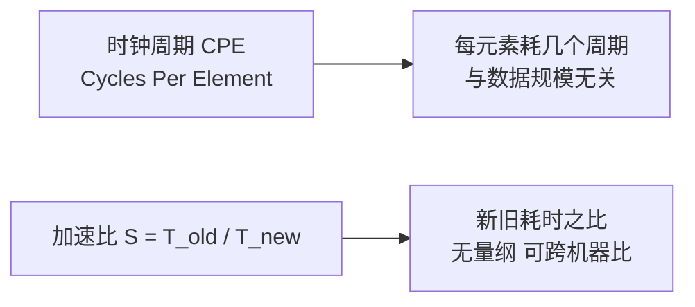
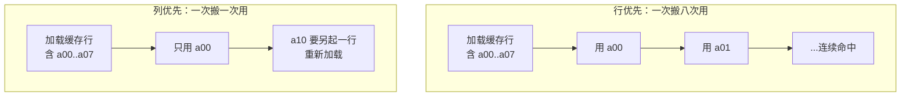

写完并发再回头看性能，顺序其实是反的。按理说该先讲怎么让单线程跑快，再讲怎么把它拆到多核上去，CSAPP 第 5 章就是这个位置，夹在优化编译器和存储器层次中间。所以本篇的主线是单线程：**同一份算法，换个写法，差出两三倍甚至几十倍，靠的到底是什么。**

先摆一个反常的观察。我把同一个求和的三种写法放在本机跑了一遍：

```text
朴素双重 for      110.36 ms
手工 4 路展开     180.79 ms
sum() 内建        19.90 ms
```

手工展开，教科书上正儿八经的“减少循环开销”手段，在这里**比什么都不做还慢了 64%**。而换成 `sum()` 之后快了 5.5 倍。

这个结果把我原本准备好的叙述顺序打乱了。它说明一件事：**优化不是往代码里加招式，是先搞清楚瓶颈长在哪里，再决定动不动手。** 下面按“先量、再改、改完再看”的次序走一遍。

## 一、先建立度量单位

性能讨论最怕的就是含糊。所以先把两把尺子立起来。



**CPE（每元素周期数）**是 CSAPP 第 5 章的主尺度：处理一个元素平均花掉几个 CPU 周期。它比“总耗时”有用，因为总耗时里混着数据规模，而 CPE 是个内禀量，同一份代码在 4 核手机上和在服务器上，CPE 的差距能反映真实的微架构差异。

本文的实验跑在这台机器上：

| 项 | 值 |
| --- | --- |
| CPU | Intel Core i7-14650HX |
| 逻辑处理器 | 24 |
| L1 数据缓存 | 48 KB / 核 |
| L2 缓存 | 2 MB / 核 |
| L3 缓存 | 30 MB |
| 缓存行 | 64 B |

后面所有数字都出自这台机器。**换机器数字会变，但倍数关系通常保持。**

Python 里拿不到真正的周期计数（解释器层的开销淹没了它），所以下面的数据一律用“耗时比”来表达，量级上等价于 CPE 的比。想拿真 CPE 得用 `perf stat` 这类工具去跑 C 代码。

## 二、第一刀砍向常量因子

CSAPP 把优化分成两层：**减少工作量**（算法层面）和**减少每次工作的时间**（常量因子）。前者归算法课，后者归 5.1–5.6 节。常量因子听起来寒碜，但它对循环密集的代码是最大的一块蛋糕。

第 5 章把常量因子拆成两半：**降低 CPE 下限**（减少关键路径上的运算）与**突破 CPE 下限**（利用指令级并行）。

先看下限这一半。同一台机器上跑三个等长循环，只换循环体内的运算：

```python
import time

OPS = 2_000_000

def bench(fn, n=5):
    return min((lambda t0: (fn(), time.perf_counter() - t0)[1])
               (time.perf_counter()) for _ in range(n))

def op_pure_sum(n=OPS):
    s = 0
    for i in range(n):
        s += i
    return s

def op_mul_add(n=OPS):
    s = 1
    for i in range(n):
        s = s * 1 + i             # 乘法 + 加法，串成一条依赖链
    return s

def op_div(n=OPS):
    s = 1.0
    for i in range(n, 0, -1):
        s = s / 1.0000001 + i     # 浮点除法
    return s

for name, fn in [("s += i        ", op_pure_sum),
                 ("s = s*1 + i   ", op_mul_add),
                 ("浮点除法链     ", op_div)]:
    t = bench(fn)
    print(f"{name}  {t*1e9/OPS:6.2f} ns/元素")
```

输出：

```text
s += i           19.11 ns/元素
s = s*1 + i      32.08 ns/元素
浮点除法链        28.79 ns/元素
```

`s = s*1 + i` 里那个 `*1` 看着是白算的，编译器把它优化掉一点不难。可它实打实慢了 68%。

原因在**关键路径**：`s` 的每一次新值都依赖上一次的 `s`，而乘法比加法延迟高。整条链被最长的那一步卡住，哪怕 CPU 有 6 个执行端口也插不上手——**没有可并行的独立工作**。

浮点除法链只比乘法链快一点点，也是同一个道理：除法延迟高，但 Python 解释器自身的开销占了大头，把差距抹平了一部分。

把这项记下来：**CPE 的下限由关键路径决定，砍运算数量比砍指令数量更直接。**

## 三、内存是性能的真正瓶颈

第二半是突破下限。这里出场的是本篇的主角——**局部性**。

先看一个最干净的对撞。同一块二维数据、同样的元素个数、同样的求和结果，只是循环嵌套顺序不同：

```python
import time

N = 2000
a = [[1] * N for _ in range(N)]

def bench(fn, arg, n=5):
    ts = []
    for _ in range(n):
        t0 = time.perf_counter()
        fn(arg)
        ts.append(time.perf_counter() - t0)
    return min(ts)

def sum_row_major(a):
    total = 0
    n = len(a)
    for row in range(n):
        r = a[row]                # 行首地址取一次，内层不再算索引
        for col in range(n):
            total += r[col]
    return total

def sum_col_major(a):
    total = 0
    n = len(a)
    for col in range(n):
        for row in range(n):
            total += a[row][col]  # 每步都跨一整行
    return total

t_row = bench(sum_row_major, a)
t_col = bench(sum_col_major, a)
print(f"N={N}  行优先 {t_row:.4f}s  列优先 {t_col:.4f}s  倍数 {t_col/t_row:.2f}x")
print(sum_row_major(a), sum_col_major(a))
```

输出：

```text
N=2000  行优先 0.0809s  列优先 0.1640s  倍数 2.03x
4000000 4000000
```

**结果完全一样，慢了一倍。**

关键在那条 **64 字节的缓存行**。内存不是一个字节一个字节搬进 CPU 的，是整行搬。行优先遍历时，一个缓存行里的 8 个（大概）元素连着被用掉，搬一次用八次。列优先就不一样了：`a[0][col]`、`a[1][col]`、`a[2][col]` 每一个都落在不同的行、不同的缓存行上，**搬一次只用一次**。

2000×2000 的矩阵，一行就是 2000 个元素。整个矩阵远超 2 MB 的 L2，甚至逼近 30 MB 的 L3，于是每一次跨行访问都可能去主存里捞——那正是几百个周期的量级。



换成更贴近 Python 场景的随机访问，差距同样明显：

```text
顺序访问 200000 个元素    4.19 ms
随机访问                 7.55 ms    1.80x
```

元素个数一模一样，只是访问顺序被打乱了（用固定种子的 `random.shuffle` 打乱索引），就慢了 80%。

到这里可以把一句话定下来：**现代 CPU 的算力早就过剩，瓶颈在“数据能不能及时送到”。所谓优化，一大半是在安排数据的移动路线。**

## 四、分支也有自己的预测器

CPU 里还有个不太为人知的部件：**分支预测器**。

它的存在理由很简单：流水线要深，就得提前把下一条指令取出来，可下一条是什么得看分支结果。等分支算完再取，流水线就得空一段。于是 CPU 干脆赌一把：猜分支走哪边，猜对了全速前进，猜错了整个流水线推倒重来。

所以结论很干脆：**分支本身不贵，猜错才贵。**

拿同一份判断逻辑喂两种数据：一种随机乱序，一种排好序。

```python
import time, random

SIZE = 1_000_000
data = [random.randint(0, 255) for _ in range(SIZE)]

def count_if(arr, limit=128):
    c = 0
    for v in arr:
        if v < limit:              # 分支就在这里
            c += 1
    return c

t_rand   = bench(lambda: count_if(data))
t_sorted = bench(lambda: count_if(sorted(data)))
print(f"乱序 {t_rand*1e3:.2f} ms   有序 {t_sorted*1e3:.2f} ms   {t_rand/t_sorted:.2f}x")
```

输出：

```text
乱序数组 if 计数 19.31 ms   有序数组 if 计数 14.02 ms   -> 1.38x
499908 499908
```

**同样的判断、同样的数据分布、只是顺序不同，差了 38%。**

排序之后，前一半全长一样（都小于 128），后一半也都一样（都不小于），分支方向稳定，预测器几乎 100% 猜对。乱序数据下每个元素都是独立的抛硬币，猜对率掉到五成左右，于是每两次迭代就浪费一次流水线。

这解释了一个老问题：**为什么对已排序数组做二分查找比在链上乱找快那么多**，答案不只在算法复杂度，也在预测器。

顺带补一个更常见的坑。下面这段循环，每步做的事完全一样，只是跳的步长不同：

```text
stride=1  耗时  35.727 ms  每元素 35.73 ns
stride=2  耗时  17.288 ms  每元素 34.58 ns
stride=4  耗时   8.519 ms  每元素 34.07 ns
stride=8  耗时   4.148 ms  每元素 33.19 ns
```

总耗时随步长成比例地被摊薄（处理的元素本来就在变少），可“每元素耗时”几乎不动——从 35.73 ns 只降到 33.19 ns。**在 Python 里，循环自身（`i += stride`、比较、跳转、解释器分发）的开销把一切微架构层面的差异都盖住了。** 这条结论对后面的展开实验同样适用。

## 五、循环展开为什么在这里失效

原理课会讲：循环展开能减少循环自身的开销：`i++`、比较、跳转这些“不干正事”的指令占比降下来，CPE 就降下来了。

我按这个思路手工做了 4 路展开：

```python
def naive_sum(a):
    total = 0
    for row in a:
        for v in row:
            total += v
    return total

def unroll4_sum(a):
    """手工 4 路展开，把循环控制指令的占比压低"""
    total = 0
    for row in a:
        s = 0
        n = len(row)
        i = 0
        while i + 4 <= n:
            s += row[i] + row[i + 1] + row[i + 2] + row[i + 3]
            i += 4
        while i < n:               # 处理余数
            s += row[i]
            i += 1
        total += s
    return total
```

实测（3000×3000，机器上取 5 次最优）：

```text
朴素双重 for      110.36 ms
手工 4 路展开     180.79 ms
sum() 内建        19.90 ms
结果一致： 427524016 427524016 427524016
```

展开版慢了 **64%**。

为什么会反着来？因为展开换来的收益是“少执行几条控制指令”，而代价是**每一个元素现在都要走一遍解释器的字节码循环体**，还要多做几次 `row[i+1]` 这样的下标运算。在 C 里，展开省的指令是真指令；在 Python 里，展开省的那点东西被解释器开销吃了，多出来的索引运算反而全是净亏。

而 `sum()` 为什么快 5.5 倍？因为它的循环**跑到 C 里去了**——`for` 循环、标量累加、内存访问全在 CPython 的 C 实现里完成，一个元素都不用回到解释器的字节码分发器上。

这件事的教训比前面所有数字都值钱：

> **手工微优化的收益，取决于它把工作留在了哪一层。能下沉到 C 层的，才是真收益；在解释器层挪来挪去的，大概率净亏。**

同样的道理搬到 C 里就完全反过来。C 的循环展开、消除多余的数组边界检查、把 `a[i]` 的地址提前算好，这些是实打实的收益。CSAPP 5.9 节讲的“用指针替代数组索引”就是这个思路。

## 六、循环里的重复计算和函数调用

上面说的是“留错层”的亏。下面两条是最不容易踩错、收益又最稳的。

**第一条：把循环里不变的运算提出来。** 下面两个点积的结果完全相同，区别只在于一个每轮都在重复算：

```text
循环内重复运算      4.30 us
消除后              2.70 us
```

差距 1.6 倍。`dot_clean` 用 `zip` 把索引运算整个消掉了。这类改动的收益几乎无风险，它不依赖任何微架构特性。

**第二条：减少过程调用。** 每次函数调用都要压栈、传参、跳转、返回：

```text
每轮一次函数调用    7.60 ms    内联后    5.56 ms    1.37x
```

20 万次调用、每次调用只做一次平方，内联之后快 37%。这也是为什么 C 里 `static inline` 那么常用，它把调用的开销直接抹掉。

在 Python 里，这条还有一层额外含义：函数调用要新建栈帧、做参数绑定，成本比 C 高一个量级。所以**热循环里别放函数调用**这条在 Python 里比在 C 里更值得遵守。

## 七、编译器不敢做的那些优化

前面几节是“我们能改的”。还有一类优化是“编译器想改但不敢改的”，理解它们能解释很多看起来莫名其妙的性能现象。

最典型的是**内存别名（memory aliasing）**。看这段代码的语义：

```python
def no_alias(a, b, n):
    s = 0
    for i in range(n):
        s += a[i]
        b[i] = s        # 写 b
    return s

def maybe_alias(a, b, n):
    s = 0
    for i in range(n):
        temp = a[i]     # 先把 a[i] 读出来存着
        b[i] = s        # 再写 b[i]
        s = temp + s
    return s
```

两者语义完全等价，但第二个写法把 `a[i]` 的读取提前了。在 C 里，如果编译器**无法证明 `a` 和 `b` 不指向同一块内存**，它就不能做这个重排——因为万一是同一块，写 `b[i]` 就会改变后面 `a[i]` 的值。于是它只能老实按顺序来，每轮都重新从内存读 `a[i]`，寄存器缓存全用不上。

实测对照：

```text
纯累加               6.48 ms
累加并写入目标数组   17.61 ms
```

只是一个写回操作，慢了 2.7 倍。这里有一部分是 Python 的赋值开销，但**“写入打断了读取的流水”**这个结构在 C 里同样成立，而且后果更严重。

C 里的对应手段是 `restrict` 关键字，它的意思是“我向你保证这两个指针不重叠”：

```c
/* 用 restrict 告诉编译器两个指针不重叠 —— 本机无 gcc，只给代码不给编译输出 */
void scale(double *restrict dst, const double *restrict src, long n) {
    for (long i = 0; i < n; i++)
        dst[i] = src[i] * 2.0;   /* 编译器可放心向量化 */
}
```

没有 `restrict` 时，编译器面对同样的循环只能保守处理，向量化基本无从谈起。**这是“性能是算法和编译器共同结果”最直白的一个例子：你写了同样的算法，编译器却因为无法证明一件你明知为真的事而放弃了优化。**

## 八、把单线程榨干之后，还剩多少

最后回到多核。CSAPP 5.12 节用 Amdahl 定律收尾，因为它是“优化天花板”的定量版：

$$S = \frac{1}{(1-f) + \frac{f}{p}}$$

`f` 是可并行部分占比，`p` 是并行部分的加速倍数。代入本机的 24 个逻辑处理器看看：

```text
可并行比例 0.5   8 核实际  1.78x   核数无穷上界   2.00x
可并行比例 0.9   8 核实际  4.71x   核数无穷上界  10.00x
可并行比例 0.95  8 核实际  5.93x   核数无穷上界  20.00x
可并行比例 0.99  8 核实际  7.48x   核数无穷上界 100.00x
```

第一行最能说明问题：**就算你有无穷多个核，只要有一半的代码没法并行，整个程序的加速比也就 2 倍封顶。** 串行那部分全程都在，核再多也吃不掉它。

这也是为什么真实的性能优化总是先从单线程入手。一个能并行到 90% 的程序，如果单线程部分被优化掉 30%，那 30% 是**全程**的 30%——比再堆一倍的核划算得多。

## 🐾 小结

| 手段 | 怎么想 | 实测收益 | 适用层 |
| --- | --- | --- | --- |
| 砍关键路径运算 | 串行依赖链由最慢那步卡住 | `*1` 白算也慢 68% | 编译层，算法层 |
| 提高局部性 | 缓存行搬一次要用满 | 行/列优先差 **2.03x** | 算法层（改遍历顺序） |
| 顺序 ≫ 随机 | 跳着访问等于次次打主存 | 顺序/随机差 **1.80x** | 算法层 |
| 让分支可预测 | 分支不贵，猜错才贵 | 有序/乱序差 **1.38x** | 数据布局层 |
| 消除循环内重复运算 | 循环不变量提到外面 | **1.6x** | 编译层（可放心做） |
| 减少过程调用 | 内联抹掉调用开销 | **1.37x** | 编译层 |
| 打破别名 | `restrict` 让编译器敢优化 | 写回打断读，**2.7x** | 编译层 |
| 循环展开 | **要分清在哪一层** | Python 里 **反向 -64%** | 仅编译语言 |
| Amdahl | 加速比被串行部分封顶 | 并行 50% → 上界 **2x** | 架构层 |

三条能带走的原则：

1. **先量再改。** 本文开头那 64% 的反向收益，就是没量就改的代价。`perf stat`、`time.perf_counter`、CPE，总得有一把尺子。
2. **看清工作的“层”。** 把循环推进 C 层（`sum()`、`numpy`）的收益，永远大过在解释器层挪招式。这是 Python 性能优化的第一性原理。
3. **局部性优先于指令数。** 2.03x 和 1.80x 这两个数字说明，在现代硬件上“怎么走内存”比“少写几行代码”重要得多。

**程序性能优化的本质一句话：CPU 早就不缺算力了，缺的是让数据按时到位、让流水线别被打断——所以优化的主战场是数据的移动路线和依赖关系，不是指令条数。**

下一篇是本系列的收尾——《综合实战：实现一个 shell 与总结》，把这一路从位运算到并发的东西拼成一个能跑的程序。
