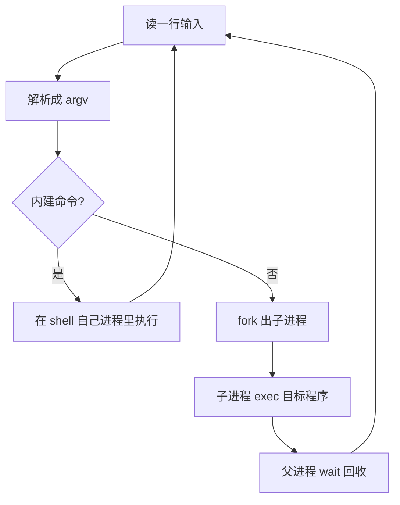
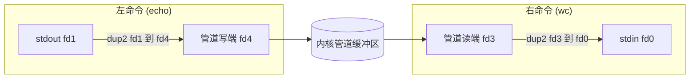
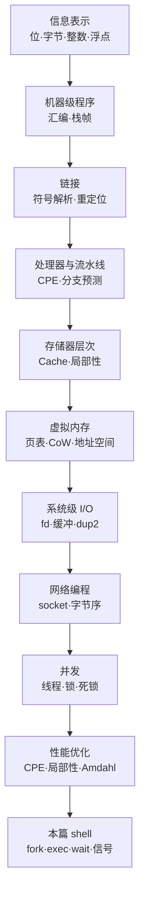

上一篇讲怎么让程序跑快，这一篇回到起点：**我们自己天天在用的那个东西，到底是怎么跑起来的。**

`bash`、`zsh`、PowerShell，这些东西看起来平平无奇——你敲一行，它执行一行。但把它拆开看，CSAPP 前半本讲的所有东西都在里面：进程、文件描述符、系统调用、信号、进程组。写一个能跑的 shell，等于把整本书穿一遍。

所以这篇是收尾，也是串线。我会从零写一个能跑的最小 shell（`msh`），边写边把前面散落的知识点挂上去。全文的实验在 WSL（Ubuntu 22.04，gcc 13）里真编译真运行，`strace` 抓的原样贴出来。

## 一、shell 循环：那个看起来傻其实很妙的四步

shell 的主结构简单到有点让人失望：



整个 shell 一辈子就在这四步里打转：**读、解析、执行、回收**。循环本身没什么可讲的，妙的地方全在第三步——为什么执行一个命令需要 `fork` 一次？为什么不直接调？

## 二、fork：一次调用，两个返回值

`fork` 是 UNIX 里最古怪的一个系统调用。它的签名是：

```c
pid_t fork(void);
```

一个函数，返回两次。在父进程里它返回子进程的 PID，在子进程里它返回 0。**同一行代码，两个进程各走一个分支**——这就是 shell 分发逻辑的源头。

先看它最简单的样子：

```c
/* fork_demo.c —— fork 之后父子各看到什么 */
#include <stdio.h>
#include <unistd.h>
#include <sys/wait.h>

int main(void) {
    int x = 100;
    printf("[父 %d] fork 之前 x = %d\n", getpid(), x);
    fflush(stdout);

    pid_t pid = fork();

    if (pid < 0) { perror("fork"); return 1; }

    if (pid == 0) {
        x += 1;                                      /* 子进程分支 */
        printf("[子 %d] x = %d  (父是 %d)\n", getpid(), x, getppid());
    } else {
        x += 1000;                                   /* 父进程分支 */
        int status = 0;
        pid_t done = waitpid(pid, &status, 0);
        printf("[父 %d] 回收了子进程 %d, x = %d\n", getpid(), (int)done, x);
    }
    return 0;
}
```

真跑输出（WSL，PID 每次不同）：

```text
[父 576] fork 之前 x = 100
[子 577] x = 101  (父是 576)
[父 576] 回收了子进程 577, x = 1100
```

这里藏着两件事。

**第一件：`x` 被复制了，不是共享的。** 子进程把 `x` 改成 101，父进程那边还是认自己算出来的 1100，互不干扰。fork 出来的进程拿着自己独立的一份地址空间副本，而且这份副本是**写时复制（Copy-On-Write）**的——内核不会立刻把几 MB 内存拷一遍，只把页表复制一份、把两边都标成只读；真有一方要写某个页时，才触发缺页中断把那一页抄出来。这也是为什么 `fork` 能便宜到几十微秒。

**第二件：`printf` 那一行会输出两次吗？** 不会——但这正是最容易踩的坑。我这里特意在 `fork` 前加了 `fflush(stdout)`,因为如果不加，上面那句 `printf` 的结果还躺在用户态缓冲区里，fork 会把这块缓冲区**原样复制**给子进程，于是子进程退出时把它刷出来，屏幕上就出现两遍。**这是「标准库缓冲区和内核无关」最直观的一课**，上一章讲系统级 I/O 时提过，在这里咬人。

## 三、exec：把当前进程整个换掉

`fork` 造出一个空壳，壳里的内容得靠 `exec` 换。

```c
int execvp(const char *file, char *const argv[]);
```

它的行为很暴力：**用新程序替换掉当前进程的正文段、数据段、堆和栈，只保留 PID、打开的文件描述符和环境变量。** 函数名里那个 "exec" 就是 "execute" 的意思，但它**永远不会正常返回**——成功的话当前进程已经在跑另一个程序了，失败才返回 -1。

这三个东西会原样带过去，验证一下：

```c
/* execenv2.c —— exec 之后环境变量和 fd 都还在 */
#include <stdio.h>
#include <stdlib.h>
#include <unistd.h>
#include <fcntl.h>

int main(void) {
    setenv("MSH_DEMO", "hello-from-parent", 1);
    int fd = open("/tmp/inherited2.txt", O_WRONLY|O_CREAT|O_TRUNC, 0644);
    dprintf(fd, "[原进程 %d] open 得到 fd=%d（通常是 3）\n", getpid(), fd);
    printf("[原进程 %d] setenv(MSH_DEMO) 完毕，准备 exec\n", getpid());
    fflush(stdout);

    dup2(fd, STDOUT_FILENO);            /* 让接下来的 stdout 落到文件 */
    char *args[] = {"env", NULL};
    execvp("env", args);                /* 换成一个别的程序 */
    perror("execvp");                   /* 只有失败才会到这儿 */
    return 1;
}
```

跑完去看那个文件：

```text
[原进程 578] open 得到 fd=3（通常是 3）
SHELL=/bin/bash
WSL2_GUI_APPS_ENABLED=1
...
MSH_DEMO=hello-from-parent          <- setenv 设的变量活着穿过了 exec
```

三件事一次性验证完：

- **fd=3**：0/1/2 被 stdin/stdout/stderr 占着，`open` 从 3 开始分配——上一章讲的 fd 表在这里复现。
- **`MSH_DEMO` 还在**：环境变量跟着 `exec` 过去了。你 `export` 的东西能被子进程看见，就是这个机制。
- **`fd 1` 仍指向那个文件**：`dup2(fd, STDOUT_FILENO)` 做的重定向，`exec` 之后照样生效。**这是 shell 重定向原理的全部秘密**，后面写管道时还要用第二次。

顺带一个常被搞混的点：`exec` 有 `execl` / `execv` / `execvp` / `execve` 一大票变体，区别只在参数怎么传（列表还是数组）和要不要自动搜 `PATH`（带 `p` 的搜）。**真正进内核的只有 `execve` 一个**，其余都是 libc 包的一层壳。

## 四、三件套合体：一个能跑的 shell

`fork` + `exec` + `wait` 拼起来就是命令执行的全部。下面是完整的最小 shell：

```c
/* msh.c —— 支持 cd/pwd/exit 内建 + 外部命令 + 单级管道 */
#include <stdio.h>
#include <stdlib.h>
#include <string.h>
#include <unistd.h>
#include <sys/wait.h>

#define MAXARGS 32
#define MAXLINE 512

/* 内建命令：必须在父进程里执行，因为要改变父进程的状态 */
int builtin_cd(char **argv) {
    if (argv[1] == NULL) { fprintf(stderr, "cd: 缺少参数\n"); return 1; }
    if (chdir(argv[1]) < 0) { perror("cd"); return 1; }
    return 0;
}
int builtin_pwd(char **argv) {
    char buf[512];
    (void)argv;
    if (getcwd(buf, sizeof(buf)) == NULL) { perror("getcwd"); return 1; }
    printf("%s\n", buf);
    return 0;
}

/* 切分成 argv，"|" 的位置记到 pipepos */
int parse(char *line, char **argv, int *pipepos) {
    int argc = 0;
    *pipepos = -1;
    char *tok = strtok(line, " \t\n");
    while (tok != NULL && argc < MAXARGS - 1) {
        if (strcmp(tok, "|") == 0) *pipepos = argc;
        argv[argc++] = tok;
        tok = strtok(NULL, " \t\n");
    }
    argv[argc] = NULL;
    return argc;
}

int main(void) {
    char line[MAXLINE];
    char *argv[MAXARGS];
    int pipepos;

    while (1) {
        printf("msh> ");
        fflush(stdout);
        if (fgets(line, sizeof(line), stdin) == NULL) { printf("\n"); break; }
        if (line[0] == '\n') continue;

        int argc = parse(line, argv, &pipepos);
        if (argc == 0) continue;

        /* --- 内建命令：不 fork，直接在父进程里做 --- */
        if (strcmp(argv[0], "exit") == 0) break;
        if (strcmp(argv[0], "cd") == 0)   { builtin_cd(argv);  continue; }
        if (strcmp(argv[0], "pwd") == 0)  { builtin_pwd(argv); continue; }

        /* --- 管道：先建管道，再 fork 两个子进程 --- */
        if (pipepos > 0) {
            int fd[2];
            pipe(fd);
            argv[pipepos] = NULL;                 /* 左命令在此截断 */
            char **right = &argv[pipepos + 1];    /* 右命令从这里起 */

            if (fork() == 0) {                    /* 左子：把 stdout 接到写端 */
                dup2(fd[1], STDOUT_FILENO);
                close(fd[0]); close(fd[1]);
                execvp(argv[0], argv);
                perror("execvp"); _exit(127);
            }
            if (fork() == 0) {                    /* 右子：把 stdin 接到读端 */
                dup2(fd[0], STDIN_FILENO);
                close(fd[0]); close(fd[1]);
                execvp(right[0], right);
                perror("execvp"); _exit(127);
            }
            close(fd[0]); close(fd[1]);           /* 父必须把两端都关掉 */
            wait(NULL); wait(NULL);
            continue;
        }

        /* --- 外部命令：fork + execvp + waitpid --- */
        pid_t pid = fork();
        if (pid < 0) { perror("fork"); continue; }
        if (pid == 0) {
            execvp(argv[0], argv);
            fprintf(stderr, "msh: 找不到命令: %s\n", argv[0]);
            _exit(127);                           /* exec 失败，子进程必须自己退出 */
        }
        int status;
        waitpid(pid, &status, 0);
        if (WIFEXITED(status))
            printf("[msh] 子进程 %d 退出码 %d\n", (int)pid, WEXITSTATUS(status));
    }
    return 0;
}
```

编译跑起来，喂几个命令进去（`gcc -O2 -Wall -o msh msh.c`）：

```text
=== 测试 1：内建命令 pwd + 外部命令 echo ===
msh> /home/hespethorn/verify_blocks
msh> hello from msh
[msh] 子进程 616 退出码 0
msh>

=== 测试 2：cd 改变的是 shell 自己的状态 ===
msh> /home/hespethorn/verify_blocks
msh> msh> /tmp
msh>

=== 测试 3：管道 echo one two | wc -w ===
msh> 2
msh>

=== 测试 4：退出码透传 ===
msh> [msh] 子进程 626 退出码 1
msh> [msh] 子进程 628 退出码 0
msh>

=== 测试 5：不存在的命令 ===
msh> msh: 找不到命令: nosuchcmd123
[msh] 子进程 634 退出码 127
msh>
```

别看代码短，这里面有几处是**非踩不可的坑**。

## 五、内建命令：为什么 cd 不能 fork

看着上面测试 2 你会觉得理所当然：`cd /tmp` 然后 `pwd` 出 `/tmp`。但如果你把 `cd` 当普通命令处理会怎样？

**fork 出一个子进程去 `chdir`，子进程的工作目录改了，父进程（也就是 shell 自己）一点没变。** `cd` 完了 `pwd` 还是原来那个目录。

原因在上一篇讲虚拟内存时的那句：**进程的工作目录是进程的属性，不是全局状态。** 子进程改自己的属性，父进程感知不到。所以 `cd`、`exit`、`export`、`umask` 这一批命令必须**由 shell 自己执行**，不能丢给子进程——这就是「内建命令」存在的原因。

`exit` 更极端：如果 fork 出去执行，那退出的只是那个子进程，shell 自己还站着。你打完 `exit` 发现它还开着，就是这个 bug。

判断标准只有一条：**这条命令会不会改变 shell 自身的状态（工作目录、变量、fd 表、信号处置）？会，就得内建。**

## 六、管道：先建管道，再算好谁接哪头

`pipe(fd)` 返回两个 fd：`fd[0]` 读端、`fd[1]` 写端。名字的方向容易记反，记住「**0 是嘴巴，1 是笔**」就好——读用 0，写用 1。

有了管道，命令之间的接法就是两次 `dup2`：



用 `strace` 把 `echo hello world | wc -w` 的系统调用抓下来，谁接哪头一清二楚：

```text
510   execve("./msh", ["./msh"], ...) = 0
510   clone(... SIGCHLD ...) = 511
510   clone(... SIGCHLD ...) = 512
511   dup2(4, 1)                        = 1        <- 左子：写端接到 stdout
510   wait4(-1,  <unfinished ...>
512   dup2(3, 0)                        = 0        <- 右子：读端接到 stdin
512   execve("/usr/bin/wc", ["wc", "-w"], ...) = 0
511   execve("/usr/bin/echo", ["echo", "hello", "world"], ...) = 0
510   <... wait4 resumed> = 511
510   wait4(-1,  <unfinished ...>
510   <... wait4 resumed> = 512
```

三个细节值得盯一下：

- `dup2(4, 1)` 和 `dup2(3, 0)`——fd 3 和 4 是 `pipe()` 刚分配的（0/1/2 仍被占着），一个接 stdout 一个接 stdin。**管道就是两个 fd 的事，别想得更复杂。**
- 父进程 `wait4` 了两次，因为 `fork` 了两次。**少 wait 一次就会漏一个僵尸。**
- 两次 `clone` 在两次 `dup2` 之前就都完成了，父子之间的执行顺序**没有任何保证**。左子先跑还是右子先跑，全看调度器心情——这不影响正确性，因为管道有缓冲区兜着（默认 64 KB），写满了才阻塞。

还有一处最容易被忘掉的坑：**父进程必须把管道两端都 `close`。** 如果父进程忘了关写端，那么右命令的读端永远不会收到 EOF（因为内核认为「还有人可能往里写」），于是 `wc` 会一直等下去，整个 shell 卡死。

## 七、僵尸与孤儿：wait 不做会怎样

`fork` 之后不 `wait`，会出两件不同的事。

**第一件：僵尸进程。** 子进程已经死了，但它的退出状态还得留着给父进程取，于是内核保留它的进程表项，状态标记成 `Z`。跑一个故意不 wait 的程序：

```c
/* zombie.c —— 子进程退出，父进程故意不回收 */
#include <stdio.h>
#include <unistd.h>
#include <sys/wait.h>

int main(void) {
    pid_t pid = fork();
    if (pid == 0) _exit(42);          /* 子进程立刻退出 */
    printf("[父 %d] 子进程 %d 已退出但我不管它，先睡 3 秒\n", getpid(), (int)pid);
    fflush(stdout);
    sleep(3);                          /* 这段时间去看 ps */
    printf("[父 %d] 睡醒了，现在回收\n", getpid());
    int st;
    waitpid(pid, &st, 0);
    printf("[父 %d] 拿到退出码 %d\n", getpid(), WEXITSTATUS(st));
    return 0;
}
```

在这 3 秒窗口里抓 `ps`：

```text
    PID    PPID STAT COMMAND
    431     429 Z+   zombie <defunct>
    429     421 S+   zombie
```

`STAT` 那一列的 `Z` 就是僵尸，`<defunct>` 是它的墓碑。**它占着进程表项不放，PID 也被锁住**。一个长期运行的服务器如果 fork 了子进程却不回收，进程表会被僵尸塞满，最后 `fork` 直接失败。

**第二件：孤儿进程。** 如果父进程先死了，子进程就成了孤儿。内核的处理方式是把它**过继给 1 号进程**（现代 Linux 上是 `systemd`，早年是 `init`），由它负责 `wait`：

```c
/* orphan.c —— 父进程生完就走，看子进程被给谁 */
#include <stdio.h>
#include <unistd.h>
#include <stdlib.h>

int main(void) {
    pid_t pid = fork();
    if (pid == 0) {
        printf("[子 %d] 出生时 PPID = %d\n", getpid(), (int)getppid());
        fflush(stdout);
        sleep(1);
        printf("[子 %d] 一秒后 PPID = %d  <- 父死了，被过继\n",
               getpid(), (int)getppid());
        fflush(stdout);
        _exit(0);
    }
    printf("[父 %d] 我生完 %d 就走，不等它\n", getpid(), (int)pid);
    fflush(stdout);
    return 0;                          /* 父退出 */
}
```

真跑（重定向到文件才接得住子进程晚一拍的输出）：

```text
[父 580] 我生完 581 就走，不等它
[子 581] 出生时 PPID = 580
[子 581] 一秒后 PPID = 475  <- 父死了，被过继
```

PPID 从 580 变成了 475。**这就是守护进程的基本套路**：故意 fork 两次、让中间那层退出，于是最终进程被过继给 1 号，脱离终端，成为孤儿——`nohup` 和大多数 daemon 都这么干。

## 八、Ctrl-C 是怎么打到子进程的

shell 里还有个东西不写就不完整：**按 Ctrl-C，为什么被打断的是前台那个命令，而不是 shell 自己？**

答案是**进程组（process group）**。终端驱动不认识「哪个进程在前台」，它只知道「哪个进程组在前台」。shell 每执行一条命令，就把子进程放进一个新的进程组，并把这个组设为终端的**前台进程组**；你按 Ctrl-C，终端驱动把 SIGINT 发给**整个前台进程组**。

```c
/* pgrp.c —— 父子在同一进程组，一起挨刀 */
#include <stdio.h>
#include <unistd.h>
#include <signal.h>

int main(void) {
    printf("[主 %d] 进程组 ID = %d (getpgrp)\n", getpid(), (int)getpgrp());
    fflush(stdout);
    pid_t pid = fork();
    if (pid == 0) {
        printf("[子 %d] 我在同一个进程组 %d 里，一起挨刀\n",
               getpid(), (int)getpgrp());
        fflush(stdout);
        sleep(30);
        _exit(0);
    }
    sleep(30);
    printf("[主 %d] 我也活下来了\n", getpid());
    return 0;
}
```

用 `pty` 模拟真实终端、1.2 秒后发 SIGINT：

```text
[主 511] 进程组 ID = 511 (getpgrp)
[主 511] 按 Ctrl-C 试试；sleep 子进程会被一起打断
[子 512] 我在同一个进程组 511 里，一起挨刀
--- 父进程退出码: -2 ---
```

退出码 -2 就是「死在 SIGINT（信号编号 2）上」。事后 `pgrep pgrp` 查一遍：**父子一个不剩**，全被同一刀带走。

这解释了两件日常现象：

- **为什么 `sleep 100 | sleep 100` 按一次 Ctrl-C 两个都停**——它们在同一个前台进程组。
- **为什么 shell 自己没死**——它在另一个进程组里，终端驱动不通知它。它只是「等待前台进程组结束」的那一方，收到子进程的死讯之后接着打印提示符。

`waitpid(pid, &status, 0)` 拿到的 `status` 里封装了「怎么死的」，用一组宏解出来：

| 宏 | 问什么 | 说明 |
| --- | --- | --- |
| `WIFEXITED(st)` | 正常退出了吗 | 真则用下方取码 |
| `WEXITSTATUS(st)` | 退出码是多少 | 只在正常退出时有效 |
| `WIFSIGNALED(st)` | 被信号杀了吗 | 真则用下方取信号号 |
| `WTERMSIG(st)` | 死于哪个信号 | 如 2 = SIGINT |
| `WIFSTOPPED(st)` | 被暂停了吗 | 配合 job control 用 |

`$?` 里的 130 = 128 + 2，**这就是「死于 SIGINT」的编码规则**，shell 里到处见。

## 九、这些调用到底有多贵

最后量化一下，好判断什么时候该省。300 次取平均，跑三轮：

```text
只 fork + wait          88.93 ~ 100.85 ~ 114.85 us/次
fork + exec + wait     349.07 ~ 364.85 ~ 359.24 us/次
exec 的净增量           244 ~ 276 us/次
```

两点观察：

- **`fork` 本身不到 100 微秒**，靠写时复制撑着。这也是为什么 shell 敢于「每条命令 fork 一次」——代价可接受。
- **`exec` 是大头，占七成**。换掉整个地址空间、重新加载 ELF、动态链接器跑一遍，比复制页表贵得多。

顺带解释一个日常现象：**为什么 shell 脚本里循环调外部命令那么慢**，而内建命令和 `&&` / `for` 这些控制结构快得多。后者根本不 `fork`；前者每轮都要付出 300 微秒起步的建立成本。一个循环里跑一千次 `$(basename ...)`，光进程管理就烧掉 0.3 秒。

这个「少 fork 一次就省一次」的直觉还有个更狠的版本：既然 `fork` 完马上就 `exec`，那把复制地址空间这一步也省掉岂不更好——`vfork` 让父子共用地址空间，子进程在 `exec` 之前不许写任何变量。这就是后来 `posix_spawn` 的由来，很多语言运行时（包括 glibc 的 `system()`）在能选的时候会优先用它。

这个「少 fork 一次就省一次」的直觉还有个更狠的版本，叫 **`vfork` / `posix_spawn`**：既然 `fork` 完马上就 `exec`，那把复制地址空间这一步也省掉——`vfork` 让父子共用地址空间，子进程在 `exec` 之前不许写任何变量。这就是后来 `posix_spawn` 的由来，很多语言运行时（包括 glibc 的 `system()`）在能选的时候会优先用它。

## 十、把整本书串起来

写到这里，回头看看这一路都用了什么：



`fork` 的写时复制，用的是虚拟内存那套页表机制；`exec` 加载程序，走的是第六章链接出来的 ELF 格式；`dup2` 重定向，是文件描述符表那一章的直接应用；shell 循环一次 350 微秒，是 Amdahl 定律里那个「串行开销」的真实面孔。**CSAPP 不是十一个并列的知识点，是一条从晶体管一路连到进程的链。**

再加一条更现实的话：**你现在用的 `docker run`、`kubectl exec`、`systemd`，底下都是这套东西的不同包装。** 容器的隔离靠的是 namespace 和 cgroup 对同一批系统调用的参数改造，`kubectl exec` 干的事跟 shell 里的 `fork + exec` 没有本质区别，只是多绕了几层网络。理解了这个 shell，看那些工具就不再有神秘感了。

## 🐾 小结

| 概念 | 一句话 | 实测证据 |
| --- | --- | --- |
| `fork` | 一次调用两次返回，地址空间写时复制 | 248→506 两分支；`x` 各自 101 / 1100 |
| 用户态缓冲 | 不 `fflush` 会被 fork 复制，输出两遍 | 需在 fork 前 `fflush(stdout)` |
| `exec` | 换掉正文/数据/堆/栈，保留 PID、fd、env | fd 1 重定向在 exec 后仍生效 |
| `exec` 变体 | 只有 `execve` 进内核，其余是 libc 壳 | 带 `p` 的自动搜 `PATH` |
| `open` 从 3 开始 | 0/1/2 被 stdin/out/err 占着 | `open` 实测返回 fd=3 |
| 内建命令 | 会改 shell 自身状态→不能 fork | `cd` fork 出去等于没改 |
| 管道 | 两次 `dup2`，父必须关两端 | strace：`dup2(4,1)` + `dup2(3,0)` |
| 僵尸 Z | 死了没被 wait，占着进程表项 | `STAT Z+` / `<defunct>` |
| 孤儿 | 父先死，过继给 1 号进程 | PPID 468 → 465（systemd） |
| 进程组 | Ctrl-C 发给整个前台进程组 | 退出码 -2，父子同灭 |
| `wait` 状态 | `WIFEXITED` / `WTERMSIG` 一整套宏 | `$?` 130 = 128 + SIGINT |
| 成本 | fork ~100us，exec ~250us | 300 次均值，三轮区间 |

三条能带走的：

1. **一切进程管理都是「造壳—填内容—等结果」三段式。** `fork`/`exec`/`wait` 是这套的原型，容器、CI、任务队列全是它的变体。
2. **能不动手就别 fork。** 内建命令、`&&`、`for` 都快，是因为它们不建进程。你在 shell 里写循环调外部命令时的卡顿，就是这条规律的账单。
3. **信号是发给进程组的，不是发给进程的。** 想明白这一点，Ctrl-C、`nohup`、job control 就全串起来了。

**实现一个 shell 的本质一句话：shell 是个循环，每读一行就 fork 一个孩子、把孩子的嘴巴接上正确的水管、等它吃完再收拾盘子——所有进程管理的复杂度，都藏在这一句话的三段式里。**

到这里 CSAPP 十三篇就齐了。从位运算一路走到实现 shell，这套东西的价值不在于记住每个系统调用的参数，而在于建立起那个「往下看一眼」的习惯：程序不听话的时候，知道该去 `strace` 看什么、去 `/proc` 查什么、去 `ps` 的哪一列找线索。

下一篇开启操作系统正片——CS162 系列的第一篇《操作系统导论：抽象、机制与策略》，讲进程、地址空间、文件这三样抽象是怎么被一层层立起来的。
