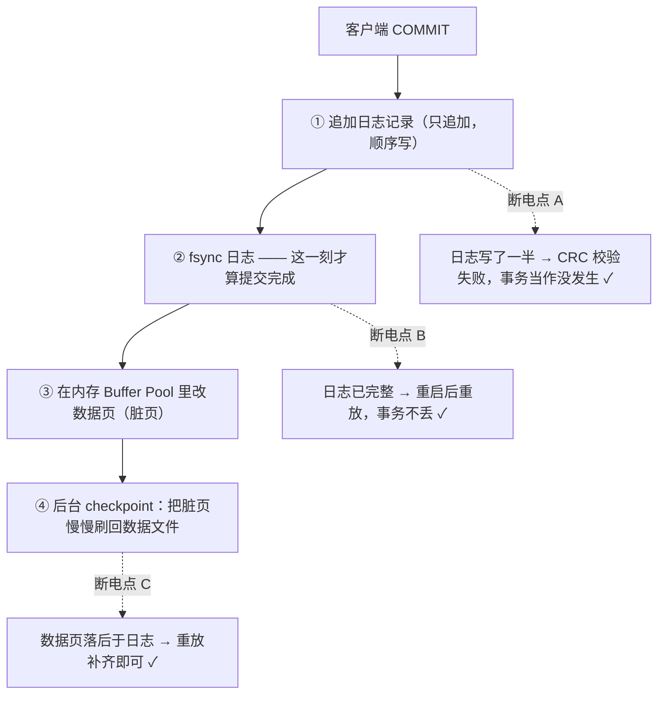
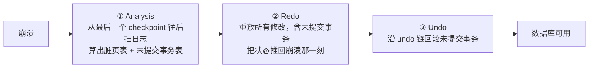

`00:00:03.412` 你点了"支付"，页面弹出"付款成功"。

`00:00:03.415` 三毫秒后，这台数据库服务器的电源被拔了。

重启之后，这笔钱还在不在？

如果答案是"看运气"，那你的系统大概率还没读懂一条被用了四十多年的原则——**写前日志（Write-Ahead Logging，WAL）**。它解释了一堆看起来互相矛盾的现象：为什么 MySQL 敢承诺"事务已提交就绝不回退"，而 Redis 回了 `OK` 却仍可能丢数据？为什么 SQLite 一开 WAL 模式，目录里就冒出 `-wal`、`-shm` 两个文件？为什么 PostgreSQL 的备份要归档一个叫 `pg_wal/` 的目录？为什么 Kafka 干脆把"日志"当成了唯一的数据结构？

先看三个真实存在的东西：MySQL 的 `ib_logfile0`、PostgreSQL 的 `pg_wal/`、etcd 的 `member/wal/`。它们是三个不同系统的命根子，却长着同一副骨架。

## 一、它从哪来

WAL 不是谁灵光一现的设计，它是从**扇区的物理性质**里被逼出来的。

磁盘的最小可寻址单位是扇区（传统 512 B，现在常见 4 KB），而数据库的页通常是 8 KB 或 16 KB——**一次页写入要跨过好几个扇区**。断电恰好发生在两次扇区写之间时，盘上就留下了一个"改了一半"的页：**撕裂页（torn page）**。这时候最尴尬的不是数据是旧的，而是**根本无从判断它改到哪一步**。

时间线大致是这样：

- **1970 年代**：IBM 的 System R 在处理崩溃恢复时定下两条秩序——修改必须先写日志、日志必须先于数据页落盘。Jim Gray 后来把这些经验写成"事务、日志"的经典论述，WAL 从工程直觉变成了可复述的规则。
- **1992 年**：C. Mohan 等人在 ACM TODS 发表 **ARIES** 论文，把 WAL 形式化成三条协议，并给出"分析 → 重放 → 回滚"的恢复算法。今天你打开 InnoDB、PostgreSQL、SQL Server 的恢复代码，看到的都是 ARIES 家族的子孙。
- **1998–2001 年**：文件系统把这套搬了过去。Stephen Tweedie 的 ext3 journal 论文、ReiserFS、NTFS 的 `$LogFile`、XFS 的 log——文件系统也怕撕裂，于是也先记账。
- **2010 年**：SQLite 3.7.0 引入真正的 WAL 模式（此前是 rollback journal 的 `delete` 模式），把"读不阻塞写"变成了一个 `PRAGMA` 就能开的事。
- **2010 年代**：Kafka 的 commit log、RocksDB 的 WAL、etcd 的 Raft 日志把 WAL 从"恢复手段"顶到了"架构本身"。

**一句话：WAL 是为了让"不可靠的原地覆盖写"变得可靠，才被发明出来的。**

## 二、为什么需要它

要同时满足两件事，WAL 几乎是必然的答案：

1. **崩溃后数据必须可判定**：要么这次事务的修改全在，要么全不在（原子性 + 持久性）。
2. **写入必须快**：不能每次提交都把整页 fsync 一遍。

直接改数据页满足不了第一条（撕裂页），每次提交都刷整页满足不了第二条。WAL 的破局点在于三个性质：

- **追加写是"原子"的**：一条日志记录要么整条落盘、要么没写完。给记录加上长度字段和 CRC 校验，恢复时扫到校验失败的那条就丢弃——**半截记录能被识别出来**，这是原地覆盖做不到的。
- **追加写是顺序写**：同样是 512 B，顺序追加和随机改写的吞吐差一个数量级。本机实测（4 次采样，Python 页缓存内测量）：顺序写快 **10.98 / 12.20 / 12.58 / 12.81 倍**。真机上叠上寻道与闪存的 GC 代价，差距只会更大。
- **日志天然是"操作序列"**：有序列就能重放。于是数据页可以**落后**——它从"唯一真相"降级成"日志的物化缓存"，什么时候刷、刷多快，都只是性能问题，不再是正确性问题。

WAL 的三条协议（ARIES 的原始表述，值得逐字读一遍）：

| 协议 | 表述 | 解决什么 |
|------|------|----------|
| **先写日志** | 任何数据页的修改，必须先写 redo 日志并持久化，之后才能把该页写回磁盘 | 崩溃后能重放，也避免撕裂页破坏真相 |
| **回滚也要先写日志** | 未提交事务的 undo 信息必须先落盘，之后才能覆盖数据页 | 崩溃恢复时能把未提交的修改撤掉 |
| **重放历史** | 恢复时从最后一个 checkpoint 开始**重放全部**修改（包括未提交事务的），然后再回滚它们 | 先把状态推回崩溃瞬间，再决定要撤销谁——而不是边扫边跳过 |

第三条最容易被忽略，却最见功力：**恢复不是"猜"，而是"重演 + 后悔"**。

**本质一句话：WAL = 把"随机、跨扇区、可能中途断电的页覆盖写"，改造成"顺序追加、可校验、可重放的记录序列"；日志是唯一的事实来源，数据页只是它的物化缓存。**

没有 WAL 的另一条路叫**影子分页（shadow paging）**：不动原页，写一份新页，再用一次原子的指针切换把"当前页"指过去。它解决了原子性（System R 时代的方案，SQLite 的 rollback journal 也沾着它的味道），代价是每次提交都要多写一份页 + 改指针，随机写翻倍，细粒度并发与部分回滚也很难支持。所以除了少数场景，工程界统一选了"先记账"。

## 三、两张图看懂

先看一次提交的时间线——**fsync 是唯一的分界线**：



三个断电点全都安全——这正是 WAL 的价值：**把"能不能恢复"从一个概率问题，变成一个确定性问题**。

再看崩溃后的恢复流程（ARIES 三阶段）：



注意 Redo 阶段**故意把未提交的修改也重放一遍**——因为崩溃时内存里的脏页已经没了，只能靠日志重建；重放完整之后，谁该回滚是 Undo 阶段的事，账要算清楚，不能一边猜一边跳过。

## 四、它有什么用

下面第 1、2 个例子是本机实跑的输出，第 3–5 个是典型输出示例（引擎行为以官方文档为准）。

**1. 六十行手搓一个 WAL：断电实验**

用一个 JSON 文件当"数据页"，对比"直接改"和"先记账"。完整脚本在 `.workbuddy/wal_demo.py`，核心就三段：直接改写、追加日志、顺序重放。

```python
# 实验一：没有 WAL —— 直接重写数据文件
old = json.dumps({"balance": 100, "version": 1})
fsync_write(DATA, old)                        # 已提交状态
new = json.dumps({"balance": 80, "version": 2})
fsync_write(DATA, new[: len(new) // 2])       # 写成一半就断电（撕裂写）

# 实验二：先写日志，再改数据
fsync_write(WAL, rec + "\n", mode="a")        # ① 追加并 fsync：提交点
# ② 数据页还没刷新就断电 —— checkpoint 之前宕机
state, n = recover(WAL)                       # ③ 重启 = 顺序重放日志
```

跑出来的输出：

```text
------------------------------------------------------------
实验一：没有 WAL，直接改数据文件
------------------------------------------------------------
[T0] 已提交状态      : {"balance": 100, "version": 1}
[T1] 写成一半就断电  : '{"balance": 80'
     (目标 29 字节，实际落盘 14 字节)
[T2] 重启后读文件    : JSONDecodeError: Expecting ',' delimiter: line 1 column 15 (char 14)
[结论] 旧值 100 和新值 80 一起没了——撕裂写把整个文件毁掉

------------------------------------------------------------
实验二：先写日志（WAL），再改数据（checkpoint 延后）
------------------------------------------------------------
[T0] 重放 1 条历史日志 → 内存状态: {'balance': 100}
[T1] 日志已 fsync    : {"op": "set", "key": "balance", "value": 80}
[T2] 数据页还没刷新就断电（模拟 checkpoint 之前宕机）
[T3] 重启后重放 2 条日志 → 恢复结果: {'balance': 80}
[结论] fsync 过的日志就是事实来源；数据页只是日志的物化缓存

------------------------------------------------------------
实验三：顺序追加 vs 在文件里随机改写（同一块盘，20000 次）
------------------------------------------------------------
顺序追加 20000 x 512B : 0.011s   (1,882,034 次/秒)
随机改写 20000 x 512B : 0.130s   (154,212 次/秒)
顺序写快 12.20 倍
```

两个细节值得注意：**直写不仅丢新数据，还会把旧数据一起毁掉**（文件根本不是合法 JSON 了）；而 WAL 路线里，第 3 行"数据页还没刷新"完全不影响恢复——这就是"数据页只是缓存"的字面意思。重放还有个天然好处：**同一条记录重放多次结果相同**，所以恢复过程本身可以安全重试（这正是幂等性在存储层的投影）。

**2. SQLite：一行 `PRAGMA` 就打开 WAL，代价是多两个文件**

本机实测（SQLite 3.53.1，Python 内置）：

```text
sqlite3 版本: 3.53.1
默认日志模式: delete
建表+插入后              目录: shop.db(8192B)
切 WAL 返回: wal
WAL 提交后               目录: shop.db(8192B), shop.db-shm(32768B), shop.db-wal(4152B)
checkpoint: (0, 0, 0)
checkpoint(TRUNCATE)     目录: shop.db(8192B), shop.db-shm(32768B), shop.db-wal(0B)
```

`-wal` 里躺着尚未合并进主库的日志记录，`-shm` 是跨进程共享的 WAL 索引（WAL-index）。读写不再互相阻塞：**读事务读的是自己那份快照，写事务只往后追加**。`wal_checkpoint(TRUNCATE)` 相当于"把账本誊抄进总账，再把流水撕掉"——业务上叫 checkpoint，财务上叫结账。

**3. MySQL InnoDB：redo log 就是 WAL，LSN 是它的时间轴**

```sql
SHOW VARIABLES LIKE 'innodb_flush_log_at_trx_commit';   -- 默认 1：每次提交都 fsync
SHOW ENGINE INNODB STATUS\G
```

```text
LOG
---
Log sequence number          25874196321
Log flushed up to            25874196321
Pages flushed up to          25638016233
Last checkpoint at           25638016233
```

三行数字的关系就是 WAL 的全部含义：**第 1、2 行相等**，说明没有"已提交但未 fsync"的日志；**第 2、3 行相差约 225 MB**，说明数据页落后日志两百多兆——这不是故障，这是设计。崩溃恢复时 InnoDB **只认 redo log，不认 `.ibd` 里"看起来已经写进去"的页**；撕裂页的问题则交给 doublewrite buffer 兜底（先写一份连续的共享表空间，再写散落的页）。

**4. PostgreSQL：WAL 从恢复工具长成了复制协议**

```bash
$ psql -c "select pg_current_wal_lsn();"
 pg_current_wal_lsn
--------------------
 0/1A2B3C48

$ pg_waldump $PGDATA/pg_wal/000000010000000000000001 | head -2
rmgr: Heap  len (rec/tot):  59/ 197, tx: 743, lsn: 0/01630028, desc: INSERT off 2 flags 0x00
```

`pg_waldump` 能把日志逐条读出来，`archive_command` 把它归档到对象存储，就得到了 **PITR（按时间点恢复）**——把数据库"倒带"到误删表的前一秒。更关键的是：**物理复制本质上就是"把 WAL 流持续发给备库"**。日志在这里已经不只是本机的恢复手段，而是**跨机一致性的载体**（这正是 Raft 日志的同一套思路）。

**5. Redis AOF 与 Kafka / etcd：日志的不同形态**

- **Redis AOF 是"逻辑日志"**：它记的是 `INCR counter` 这样的命令，而不是"第几个字节改成了什么"。`appendfsync everysec` 一秒 fsync 一次，`always` 每次写都 fsync，`no` 交给操作系统——**三档就是三份不同的持久化承诺**。命令流会重复、会膨胀，所以需要 rewrite 压缩。
- **Kafka 把日志推到极致**：partition 就是一个只追加的 commit log，消费者不过是"读到某个 offset 的读者"。没有表和索引，日志就是数据本身。
- **etcd 先写 WAL 再 apply**：Raft 提案先落盘到 `member/wal/`，之后才应用到状态机——**先让"发生了什么"变得不可推翻，状态再慢慢追**。

## 五、反例与边界

- **fsync 才是分界线，"写成功"不是。** 没有 fsync，你写进的是操作系统的页缓存——进程崩了数据还在，机器断电就没了。`innodb_flush_log_at_trx_commit=0/2`、`appendfsync no` 都是主动把承诺打折：性能表上很好看，事故报告里很难看。
- **WAL 保证单机持久化，不保证分布式一致。** 日志只在本机盘上，机器凉了就是凉了。要让"日志"跨机器可靠，必须叠复制协议（Raft / Paxos / 半同步），而复制又要面对分区与延迟的取舍——那是另一条原则的地盘。
- **写放大与 checkpoint 压力是真实成本。** 一条记录至少写两次（日志 + 数据页），IO 被放大；`innodb_log_file_size` 或 `max_wal_size` 配小了，checkpoint 会频繁触发，甚至"追不上日志生成速度"导致写入抖动；Redis 的 AOF rewrite 还要 fork 子进程。
- **日志不是备份。** WAL 治的是崩溃与掉电（逻辑错误），治不了介质损坏、误删库、被勒索加密。真正的方案是"日志归档 + 定期全量 + 异地存放"，也就是 PITR。反过来，手工删掉 / 截断 WAL 文件，等于当场放弃恢复能力——把 `pg_wal/` 清空是教科书级的灾难操作。
- **不是所有数据都值得 WAL。** 纯缓存、可重建的数据（Redis 当缓存用时）不需要；一次写入天然小于一个扇区且不跨边界时撕裂风险很低。但只要你的数据"不可重建"且会被原地覆盖，日志就是必需品。
- **顺序追加也不是免费的午餐。** 单条日志流的吞吐受顺序带宽约束；LSM-Tree 把随机写变成顺序写，代价转嫁给了 compaction 与读放大——空间换时间，账只是换了个地方记。

## 六、对比表与小结

| 维度 | 直接改数据页（无 WAL） | WAL |
|------|----------------------|-----|
| IO 模式 | 随机写，跨扇区 | 日志顺序追加 + 后台批量刷页 |
| 断电后状态 | 可能是撕裂页，新旧数据一起毁 | 确定：重放日志即恢复到提交点 |
| 恢复依据 | 无（只能靠运气和 fsck） | 日志是唯一真相，逐条重放 |
| 提交延迟 | 取决于脏页何时刷，不可控 | 一次追加 + 一次 fsync，可控 |
| 代价 | 看似简单，正确性不可证 | 写放大、checkpoint 调参、日志空间 |
| 代表实现 | 手写文件覆盖、部分简单 KV | InnoDB redo、PG WAL、SQLite WAL、etcd WAL |

| 对比 | 物理日志 | 逻辑日志 |
|------|----------|----------|
| 记录内容 | 页级字节改动（"第 N 页偏移 M 处改成 X"） | 操作本身（"balance 减 1"） |
| 重放成本 | 幂等、位置确定，但日志体积大 | 体积小，但重放依赖状态、可能不幂等 |
| 典型实现 | InnoDB redo log、PostgreSQL WAL | Redis AOF、MySQL binlog（STATEMENT） |
| 使用场景 | 崩溃恢复、物理复制 | 逻辑复制、审计、跨版本升级 |

🐾 **小结**：WAL 的普适性可以用一句话检验——**你的系统里，谁是事实来源？** 如果答案是一个"会被原地覆盖的文件"，那你迟早需要一个日志。数据库这么做，文件系统这么做，Kafka 干脆把日志当数据本身。顺序追加、可校验、可重放，这三件事一凑齐，"断电后数据还在不在"就从运气变成了定理。而它留给使用者的真正问题只有一个：**你的 fsync 到底开在哪一档？**

**相关阅读**

- CAP 定理：分布式的取舍三角（让日志跨机器可靠，就要付复制与分区的代价）：[/posts/princ-cap/](/posts/princ-cap/)
- 幂等性：让重试变得安全（日志重放为什么天然安全，靠的是同一条性质）：[/posts/princ-idempotency/](/posts/princ-idempotency/)
- 空间换时间：哈希、缓存与索引的共同母题（顺序写省下的时间，是用空间与 checkpoint 复杂度换的）：[/posts/princ-space-time/](/posts/princ-space-time/)
- Redis AOF 持久化机制（逻辑日志形态的 WAL 实例）：[/posts/8631510c/](/posts/8631510c/)
