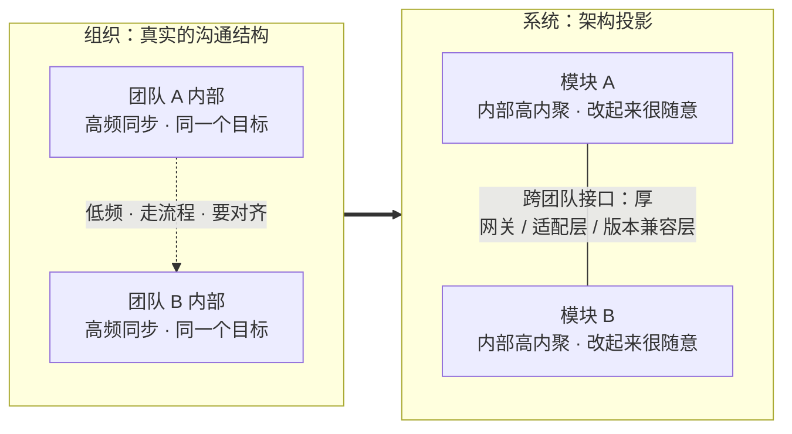

面试里有个问题特别刁：**"你们的微服务是按什么切的？"**

答"按业务能力"的人很多，但追问一句就露馅了——为什么订单服务刚好是这五个人在维护？为什么"用户中心"和"账户中心"是两个人分别负责，而不是一个人管全？

再看两个更具体的现象：两个团队共用一个数据库，加一个字段要等两周；一个模块三个人都在改，谁都不敢重构，因为它没有主人。

这些都不是技术问题。它们是同一条规律在组织层面的投影——**康威定律**。它最扎人的地方在于：你设计的架构，其实早就被你和同事的沟通方式决定了。

## 一、它从哪来

1967 年，Melvin Conway 写下一篇短文 **《How Do Committees Invent?》**，1968 年 4 月发表在 *Datamation* 杂志上。核心结论只有一句（原文）：

> Organizations which design systems … are constrained to produce designs which are copies of the communication structures of these organizations.

翻译成人话：**造系统的组织，只能造出长得像它自己沟通结构的系统。**

两个边角料很值得一记：

- 这篇稿子当年被 **Harvard Business Review 拒了**，理由大致是"结论不够普适"。七年后，Fred Brooks 在《人月神话》（1975）里把它命名为 **Conway's Law**，这个词就定下来了。
- 它**不是设计建议，而是一条被观察到的约束**。你可以利用它，也可以反向操纵它，但不能假装它不存在。

后来几十年，它被反复"印证 + 主动使用"：Amazon 2002 年贝索斯的内部 API 指令、Netflix 的 two-pizza team、以及 2010 年代流行的**反康威策略（Inverse Conway Maneuver）**——先改组织，再等架构收敛。

## 二、为什么需要它

因为任何设计活动都要在**沟通预算**内完成，而沟通是有成本的。三个具体机制：

1. **沟通成本决定接口粒度**。跨团队沟通（约会议、对齐目标、排队期、走评审）的单位成本远高于团队内部（同一张桌子、同一个群、一句话就能改）。于是系统边界会自然贴合"沟通最便宜的地方"——团队内部。**团队内随便改，跨团队必须加一层。**
2. **接口就是组织边界**。谁有权改接口，本质上等于"谁负责这块"。当两个团队共享一个模块，双方都会倾向"加一层适配"来隔离对方的不确定改动，架构上就多出一道缝。
3. **信息沿组织传播的速度有限**。架构决策需要信息，而信息在组织里走得慢的地方，就会长出"厚接口"和复制粘贴——**抄一份比对齐一次便宜**。

反面推演一下：你以为自己在"自由设计"，实际上**协调结构会逼出某种形态**。忽略组织去画架构图，得到的往往是"图纸很美、落地走样"的中间态：接口都在，但每一层都在替别人擦屁股。

**本质一句话：康威定律 = 系统架构是组织沟通结构在代码里的投影；想改架构，先改沟通路径。**

## 三、两张图看懂

先看"投影"这件事本身——左边是人的沟通结构，右边是它落进代码后的样子：



注意那条**虚线**：团队之间的沟通越贵，架构里那道接口就越厚、越正式、越多兼容层。接口的厚度不是技术品味决定的，是协调成本决定的。

所以想改架构，动作顺序要反过来——先动组织：


## 四、它有什么用

**1. 真实仓库的耦合数据：改动确实沿"归属边界"聚集（本机实测）**

拿本地的 Netty 源码（`netty-4.1.110.Final`，完整 git 历史，多作者协作）做了一次统计：把每一次提交里被同时修改的文件两两配对，看这些"同改对"落在同一个顶层模块内还是跨模块。脚本是 `.workbuddy/conway_coupling.py`。

```text
样本：最近 3996 次非合并提交（跳过 232 次发版提交，剔除 pom/文档类文件），覆盖 3326 个源码文件
同改 >= 3 次的文件对：2055 对
其中【同顶层模块】1771 对（86.2%） / 【跨模块】284 对（13.8%）
其中【共同目录层数 >= 3】（几乎同一包内）1026 对（49.9%）

同改最频繁的 8 对文件：
   44 次  [同模块/2层]  ReferenceCountedOpenSslEngine.java  ⟷  SSLEngineTest.java
   41 次  [同模块/8层]  ReferenceCountedOpenSslContext.java  ⟷  ReferenceCountedOpenSslEngine.java
   36 次  [同模块/2层]  DnsNameResolver.java  ⟷  DnsNameResolverTest.java
   35 次  [同模块/2层]  ReferenceCountedOpenSslEngine.java  ⟷  OpenSslEngineTest.java
   ...
各顶层模块的「活跃作者 / 文件数」——模块越小，人越少：
  codec-http               文件  363  作者 148
  handler                  文件  296  作者 114
  microbench               文件  159  作者  38
```

怎么读这组数字：

- **86.2% 的"一起改"发生在同一个顶层模块内**。改动沿着模块边界聚集，而模块边界正是"谁负责这块"的边界。
- **最热的一对永远是"实现 + 它自己的测试"**（`SslHandler ⟷ SslHandlerTest`、`Http2FrameCodec ⟷ Http2FrameCodecTest`）——因为它们本来就是同一个人的同一件事，天然属于同一个沟通单元。
- **模块越大、跨模块同改越多，参与的作者也越多**（`codec-http` 363 个文件有 148 位作者；`microbench` 159 个文件只有 38 位）。模块的"人味"，在数字上是看得见的。

老实说一句局限：这是**相关性证据**，不是受控实验。Netty 的顶层模块本来就是 Maven 模块，天然有"耦合被切开"的结构因素——但这恰恰也是康威定律想说的：**模块怎么切，本来就是照着人的分工切的。**

**2. Amazon 2002 年的"API 指令"：一次组织决策，换来一次架构转型**

贝索斯当年对内下过一道硬指令，大意是：所有团队必须通过服务接口对外暴露能力，不许直接读别人的数据存储，不许走后门共享后台，不遵守就走人。这不是技术选型，而是**把沟通路径从"共享数据库"改成"接口调用"**——架构此后只能长成服务化。配套的 two-pizza team（两个披萨能喂饱的团队）就是服务粒度的天然上限。

**3. 反康威策略（Inverse Conway Maneuver）：先动组织，再等架构**

操作顺序是：

- 先按**目标架构**调整团队划分（流对齐团队负责端到端价值流，平台团队提供共性能力）；
- 给每个团队清晰的**所有权**：哪个服务、哪份数据、哪个 SLO 归谁；
- 让接口和部署边界**随组织边界重划**，而不是发一份架构规范让大家照着改。

**4. 负向投影：共享数据库的"分布式单体"**

两个团队共用一张订单表，每次加字段都要跨团队排期——为了降低协调成本，各组会在自己这侧加缓存、加视图、加 ETL 同步。结果是：服务是拆开的，数据是缝合的，**"数据一致性"成了全公司都说不清的问题**。这正是康威定律的反面：沟通结构烂，架构就烂。

**5. 还有两条日常投影，随手就能验证**

- **on-call 边界 ≈ 服务边界**：谁半夜被叫醒，谁就该拥有那个服务。反过来说，如果一个服务"谁被叫醒都行"，那它通常没有主人，代码会烂得最快。
- **无主模块最容易腐化**：三个人共管的模块，重构要三方点头，于是谁都不动——**共同所有权在架构上等价于没有所有权**。

## 五、反例与边界

- **它是观察性趋势，不是自然定律**。可以被反向操纵（Inverse Conway），也可以被技术手段部分抵消：清晰的接口契约、契约测试、自动化兼容性检查，都能降低跨团队协调成本，从而"削薄"那道厚接口。
- **要看真实的沟通图，而不是汇报线**。真正决定架构的是非正式网络（谁常问谁、谁和谁在一个群里、谁 review 谁的 PR）。用组织架构图倒推架构，经常推错。
- **拿现有架构去倒推组织，会把历史固化**。"这块代码一直是他写的，那就归他"——技术债会就此变成人事债，再也拆不动。
- **有些边界不由沟通决定**：合规的数据隔离要求、网络与硬件拓扑、语言与许可证、供应商边界，都可能与康威方向相反。这时候需要人为搭"沟通桥"（接口委员会、SDK、契约仓库），而不是硬造组织。
- **拆过头会反噬**。服务粒度一旦 1:1 压到团队上，任何跨服务改动都要走跨团队流程，交付周期反而变长——这就是"分布式单体"。**粒度要与变更频率匹配，而不是与人数匹配。**
- **异步协作没有取消这条定律，只是改了"距离"的定义**。分布式团队 + 文档驱动的协作，会让"接口先行的架构"更容易长出来——因为你们的沟通本来就是异步的、契约化的。

## 六、对比表与小结

| 维度 | 单体 + 多团队共管 | 服务边界对齐团队 | 平台团队 + 流对齐团队 |
|------|------------------|-----------------|--------------------|
| 日常沟通路径 | 每天跨团队对齐 | 团队内闭环，跨团队走接口 | 平台补能力，业务团队自治 |
| 架构投影 | 分布式单体 / 共享数据库 | 服务边界清晰，跨服务改造偏慢 | 平台服务复用，业务服务轻 |
| 典型病灶 | 加字段要等两周 | 服务数量膨胀，协调成本反弹 | 平台团队沦为瓶颈 |
| 适合场景 | 早期、人少、方向未定 | 业务边界稳定、团队 5–9 人 | 多产品线、共性能力沉淀明显 |
| 反康威动作 | 先合并团队，或先切服务 | 定期按价值流重划边界 | 先建平台团队与接口规范 |

| 用法 | 做法 | 适用场合 |
|------|------|----------|
| **顺势**（正向利用） | 顺着现有沟通结构设计边界，别对着干 | 组织结构短期动不了 |
| **反向**（Inverse Conway） | 先改组织，让架构自然收敛 | 目标架构明确、有决策权 |
| **抵消** | 建跨界沟通机制：契约、SDK、接口委员会 | 合规 / 供应商边界不可改 |

🐾 **小结**：康威定律最实用的一条推论是——**架构问题很少能在架构图上解决**。当你看到一个"莫名其妙"的设计（一道没必要的适配层、一份重复的配置、一个谁都不敢动的模块），先别急着重构代码，先问一句：**这是谁跟谁必须说话、又不愿意多说，才长出来的？** 把那条沟通路径改短，代码往往会自己变干净。

**相关阅读**

- 最少惊讶原则：接口设计的隐形标准（接口长得像不像人想的那样，也是沟通成本的一部分）：[/posts/princ-least-astonishment/](/posts/princ-least-astonishment/)
- 端到端原则：TCP 为什么把可靠性放在两端（"边界画在哪"的另一条经典答案）：[/posts/princ-end-to-end/](/posts/princ-end-to-end/)
- 幂等性：让重试变得安全（跨团队接口最需要的一条硬约束）：[/posts/princ-idempotency/](/posts/princ-idempotency/)
