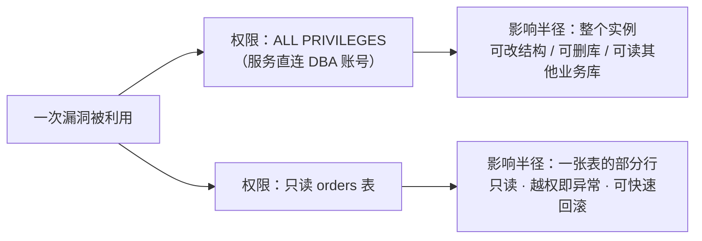
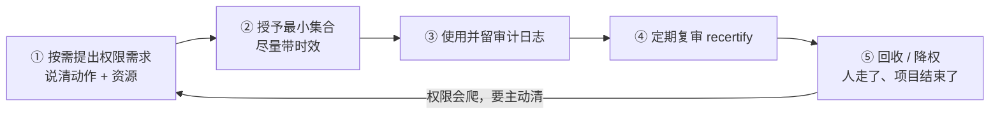

三个一眼就该报警的现象：

- 容器默认以 **root** 跑，挂载着宿主机目录，还带着 `CAP_SYS_ADMIN`；
- 一个"只负责查订单"的服务，它的数据库账号有 **`ALL PRIVILEGES ON *.*`**；
- 运维的 `sudoers` 里写着 `ops ALL=(ALL) ALL`——**看起来是配置了权限系统，实际上等于没有**。

它们背后是安全领域里少数"不用花钱、不用加机器、不用改架构"就能大幅降低损失的原则：**最小权限（Principle of Least Privilege）**。它最值钱的地方在于——它防的不只是攻击者，更是**任何单一环节的错误**。

## 一、它从哪来

1975 年，Jerome Saltzer 与 Michael Schroeder 在 *Proceedings of the IEEE* 上发表 **《The Protection of Information in Computer Systems》**——安全工程史上被引用最多的论文之一。论文提出了 8 条保护机制设计原则，第四条就是 Least privilege，大意是：

> 每个程序和每个用户，都应当使用**完成工作所必需的最小权限集合**来操作。

这句 50 年前的话，今天的形态只是换了皮肤：

- **POSIX capabilities（Linux 2.2 起）**：把 root 的"全能"切成一项项能力（`CAP_NET_BIND_SERVICE`、`CAP_SYS_TIME`…），可以让进程**只**获准绑定低位端口。
- **SELinux / AppArmor**：从"按用户授权"升级到"按程序和标签授权"（强制访问控制 MAC）。
- **RBAC / ABAC / ReBAC**：企业级权限模型（AWS IAM、Kubernetes RBAC、各类关系式授权）。
- **OAuth scope**：把令牌的权限收窄到"只能读某人的公开资料"这个级别。
- **零信任（Zero Trust）**：2010 年 Forrester 的 John Kindervag 提出 "never trust, always verify"——**授权从"一次性静态配置"变成"每次请求都验证、尽量短期"**。
- **Kubernetes 时代**：ServiceAccount + RBAC + `automountServiceAccountToken: false`，容器侧 `--cap-drop=ALL`、`readOnlyRootFilesystem: true`。

一句话：它是最早被写进论文的安全原则之一，之后几十年的工作，基本都是在**让"最小"这件事更容易做到**。

## 二、为什么需要它

因为它建立在一个不那么舒服的假设上：**每一层都会失守**。

代码有 bug、依赖有 CVE、配置会写错、人会手滑、内部也有威胁。既然"永不被攻破"无法承诺，那就退一步：**让"被攻破一次的后果"被权限边界钳住。** 这就是**影响半径（blast radius）**。

三个具体机制：

1. **限制爆炸半径**。同一个漏洞，在"只读单表"的账号下是数据泄露；在 `ALL PRIVILEGES` 的账号下是**整库被删、结构被改、顺手读走其他业务的库**。漏洞是一样的，损失差三个数量级。
2. **权限是横向移动的燃料**。攻击者拿到一台低权机器后，第一件事是找配置文件里的凭证、找宽权限的邻接服务。权限越集中，一条攻击链就能吃下整个环境；权限分散，每一步都要重新找钥匙。
3. **它让审计成为可能**。权限收紧之后，"谁有权做什么"才是一份可枚举的清单；否则所有操作都"合法"，日志里根本挑不出异常——**没有边界的系统，审计等于零**。

最容易被忽略的一点：**权限边界防的主要不是攻击者，而是错误**。运维手滑删错库、脚本里把测试环境变量连上了生产、一个迁移命令少写了 `WHERE`——这些都不是攻击，但后果和攻击一样。最小权限是唯一能替这些"非恶意错误"兜底的设计。

**本质一句话：最小权限 = 假设每一层都会失守，于是用权限边界把"失守的代价"钳死；它不信任的是"单点"，不是人。**

## 三、两张图看懂

先看同一次漏洞，在不同权限下的分叉：



再看最小权限的**闭环**——授权只是第一步，不回收的权限迟早会"爬"回来：



## 四、它有什么用

**1. 应用层的权限边界：一个真实可跑的越界实验**

下面的输出是本机实跑（脚本 `.workbuddy/least_privilege_demo.py`）：一个服务只被允许读 `public/` 目录，同级放着它本不该碰的文件，试三种输入。

```text
服务根目录 = public/    同级文件 = internal.txt

[无校验] 请求 readme.txt             → public data
[无校验] 请求 ../internal.txt        → internal-only: 这里本不该被这个服务读到
[无校验] 请求 C:/Windows/win.ini     → ; for 16-bit app support

[白名单] 请求 readme.txt             → public data
[白名单] 请求 ../internal.txt        → <PermissionError: 越界访问被拒绝：../internal.txt>
[白名单] 请求 C:/Windows/win.ini     → <PermissionError: 越界访问被拒绝：C:/Windows/win.ini>
```

怎么读：

- `../internal.txt` 是最经典的路径穿越，**一步跨出服务目录**。
- 更狠的是绝对路径：在很多语言里 `path.join(base, "C:/Windows/win.ini")` 会被"绝对路径覆盖"直接返回绝对路径，于是服务读到了系统文件——输出里那句 `; for 16-bit app support` 就是真实 `win.ini` 的开头。
- 白名单版本的做法是：先**规范化真实路径**（解掉 `..`、软链接），再断言"结果必须落在允许的根目录之内"，越界一律拒绝。

这就是最小权限在代码里的样子：**服务的权限边界由代码强制，而不是指望输入自觉。** 落地时还有个细节要记住——白名单比较必须用**规范化之后的路径**，否则 `realpath` 之前判前缀就是自欺欺人。

**2. 操作系统与进程：把 root 的权力切片**

```bash
# 只给"绑定 80 端口"这一项能力，而不是整个 root
sudo setcap cap_net_bind_service=+ep /usr/sbin/nginx
getcap /usr/sbin/nginx            # → /usr/sbin/nginx cap_net_bind_service=ep

# 容器里同理：默认丢掉全部能力，只加回需要的那一个
docker run --user 1000:1000 --read-only \
  --cap-drop=ALL --cap-add=NET_BIND_SERVICE \
  --security-opt no-new-privileges nginx
```

四个参数各管一件事：`--user 1000:1000` 避免容器内是 root；`--read-only` 让根文件系统不可写（写入只走挂载的卷）；`--cap-drop=ALL` 把 root 的"全能"收回成"按需几项"；`no-new-privileges` 阻止进程通过 setuid 之类的手段重新提权。**容器隔离 ≠ 权限最小化，两者必须一起用。**

**3. 数据库：应用账号不该是 DBA**

```sql
-- 反面：一个账号吃下整个实例，还能把权限再发出去
GRANT ALL PRIVILEGES ON *.* TO 'app'@'%' WITH GRANT OPTION;

-- 正面：只给这张表需要的动作，连列都能收
CREATE USER 'app'@'10.0.3.%' IDENTIFIED BY '***';
GRANT SELECT, INSERT, UPDATE (status) ON shop.orders TO 'app'@'10.0.3.%';
```

三个容易被漏掉的收紧点：**列级授权**（只允许改 `status`，改不了金额）、**来源 IP 收窄**（`10.0.3.%` 而不是 `%`）、**禁止 `WITH GRANT OPTION`**（否则拿到账号的人可以自己发权限，权限体系当场失效）。再加一条硬规矩：**应用账号永远不要有 DDL 权限**——建表改表走迁移工具，用另一套凭证。

**4. 云与凭证：短期、窄权、可撤销**

- 用 `AssumeRole` 拿**临时凭证**（几十分钟过期），而不是把长期密钥写进配置文件；
- policy 里 `Resource` 精确到具体资源的 ARN，而不是 `"Resource": "*"`；
- 代码平台的**细粒度令牌**只授单个仓库的读写，而不是"账号全权"；
- 数据库、缓存、消息中间件尽量**一服务一账号、一环境一套凭证**，而不是全公司共用一套。

**5. Kubernetes：默认权限比你以为的大**

```yaml
spec:
  automountServiceAccountToken: false      # 不把 SA token 自动塞进 Pod
  containers:
    - name: api
      securityContext:
        runAsNonRoot: true
        readOnlyRootFilesystem: true
        allowPrivilegeEscalation: false
        capabilities: { drop: ["ALL"] }
```

配套的 RBAC 原则是：只授具体资源名的 `get/list`，而不是拿 `ClusterRole` 一把梭；命名空间之间不要共享 ServiceAccount。

## 五、反例与边界

- **过紧的权限会把人逼出"影子权限"**。拿不到正式权限，就会出现复制凭证、共享 root、私搭跳板机——**结果比给权限更危险，因为没人在审计它**。所以必须提供合法的快通道：临时提权（JIT access）、到期自动回收、事后复盘留痕。
- **权限会"爬"**。项目结束、职责变更，权限却留在原地（privilege creep）。**没有定期复审，最小权限一年之后就不最小了**——这条对个人同样成立：翻翻你的 API key 列表，多半有一半已经没用了。
- **它需要治理成本**。一服务一账号、一环境一密钥，意味着密钥管理、轮换、注入都得有工程支撑；否则大家会用"共用一套"来省钱，安全性反而倒退。
- **权限 ≠ 隔离**。容器共享内核，权限收缩挡不住内核漏洞逃逸；最小权限必须与命名空间、沙箱、虚拟机或硬件隔离叠加使用。
- **只有权限、没有检测，等于只挡了一半**。还需要审计日志（谁在什么时候用了什么权限）+ 快速吊销（必要时一分钟内让凭证彻底失效）。
- **它治的是"影响半径"，不是"漏洞本身"**。注入漏洞、依赖 CVE 的第一下它拦不住；它保证的是**第一下之后不至于全盘皆输**。
- **别把它做成"永远拒绝"**。安全的目标是"业务能跑、且损失可控"，不是"谁都别动"。一个让所有人都绕不过去的权限系统，一定会被绕过。

## 六、对比表与小结

| 维度 | 一个账号走天下 | 最小权限 |
|------|---------------|---------|
| 一次失守的后果 | 整个实例 / 整个云账号 | 单表部分行、单目录、单资源 |
| 横向移动 | 一条链吃下全环境 | 每一步都要重新找凭证 |
| 审计能力 | 所有操作都"合法"，看不出异常 | 越权即异常，日志可用 |
| 运维成本 | 低（便宜、快、不用想） | 高（账号、密钥、复审都要工程化） |
| 典型失败模式 | 手滑删库、测试连生产、CVE 被放大 | 权限过紧 → 影子权限（需要快通道兜底） |

| 层次 | 抓手 | 一句话要点 |
|------|------|-----------|
| 应用代码 | 目录白名单 + 真实路径校验 | 边界由代码强制，不靠输入自觉 |
| OS / 进程 | 非 root 用户、capabilities、umask | 把 root 切成按需能力 |
| 容器 | `--user`、`--read-only`、`--cap-drop=ALL` | 隔离 ≠ 权限最小，要一起用 |
| 数据库 | 表/列级授权 + 来源 IP + 禁 GRANT OPTION | 应用账号不给 DDL |
| 云 / 凭证 | 临时凭证、精确 ARN、细粒度令牌 | 短期、窄权、可撤销 |
| Kubernetes | RBAC 精确到资源名、SA token 不自动挂载 | 默认权限往往比你以为的大 |
| 治理 | JIT 提权 + 定期 recertify | 权限会爬，要主动回收 |

🐾 **小结**：最小权限最像安全带——**它不阻止撞车，但它决定撞车之后你还剩多少。** 落地时只需要反复问自己一个问题：**"这个账号 / 进程 / 令牌，如果今天被完全攻破，最坏能坏到什么程度？"** 如果答案是"全公司"，那就说明这份权限还只是"方便"，不是"设计"。

**相关阅读**

- 幂等性：让重试变得安全（越权之外的另一种"安全地重复做同一件事"）：[/posts/princ-idempotency/](/posts/princ-idempotency/)
- 背压：慢消费者的保护机制（"宁可断你，也不吃光自己"是同一种自我保护思路）：[/posts/princ-backpressure/](/posts/princ-backpressure/)
- 康威定律：架构复制沟通结构（"谁拥有哪份数据"，本质是权限边界与组织边界的对齐）：[/posts/princ-conway/](/posts/princ-conway/)
